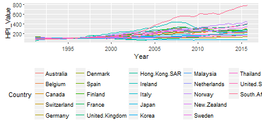
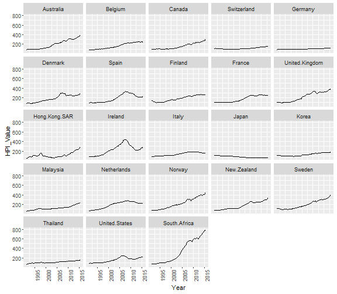
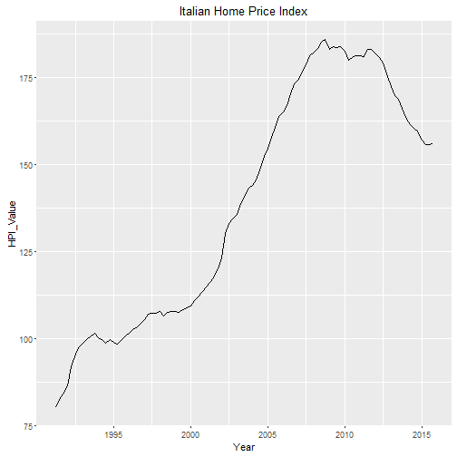

Recently I have exploring a number of alternative ways to produce data visualizations. Obviously, Excel is my bread and butter for designing simplistic graphs and it is particularly great for time-series data. Alternatively, I will use Tableau when I am trying to explore quite a bit of data, but ultimately, my preference has been R. With a growing number of packages and highly active participants, I can find 10 to 15 ways to explore data within R alone. 

We'll save the conversation of benefits and trade-offs of different tools for later. Let's first take advantage of the robust tools within R and my personal reason for using it -- quick web integration for posting to this blog!


First we will load the packages we will need: 


```r
if(!require(reshape2)){
  install.packages("reshape2")
  library(reshape2)
}
if(!require(googleVis)){
  install.packages("googleVis")
  library(googleVis)
}

if(!require(lubridate)){
  install.packages("lubridate")
  library(lubridate)
}

if(!require(ggplot2)){
  install.packages("ggplot2")
  library(ggplot2)
}

if(!require(knitr)){
  install.packages("knitr")
  library(knitr)
}
```

For our analysis we will look at international home prices. There are a number of sources of data for home prices across the world. Within the United States, there are four core indices that are referenced: CoreLogic, CoreLogic Case-Shiller S&P/Case-Shiller and FHFA index. Recently, there have been a growing number of indices, such as the Zillow Home Value Index. 

Since we are looking for international figures, we will use the [Bank of International Settlements (BIS) data](http://www.bis.org/statistics/pp_long.htm). This organization is comprised of over 60 world banks and since the housing downturn has focused on aggregating large amounts of property data for purposes of measuring systemic risk. For additional information about the country specific measures, definitions and collection techniques, please [look here](Documentation of Data: http://www.bis.org/statistics/pp_long_documentation.pdf). 

I have downloaded, saved and cleaned some of data provided on their site and now we will load it in. The data is in wide format so we will convert the class of the date and use the helpful reshape2 package to make the data long. 


```r
d <- read.csv("hpi_world.csv", header = T)
head(d)
```

```
##         Year Australia Belgium Canada Switzerland Germany Denmark  Spain
## 1 31.03.1991     89.30   78.96  97.47      112.50   88.64   84.20  92.70
## 2 30.06.1991     90.37   77.78 100.93      113.30   90.78   85.26  96.40
## 3 30.09.1991     93.12   81.18  95.25      115.94   91.48   84.91  98.65
## 4 31.12.1991     93.12   82.23  96.40      113.07   91.81   85.53 102.95
## 5 31.03.1992     92.50   83.40  98.00      111.67   92.55   84.95  98.30
## 6 30.06.1992     92.77   85.44  98.76      110.28   93.57   84.95  96.07
##   Finland France United.Kingdom Hong.Kong.SAR Ireland Italy  Japan  Korea
## 1  135.60 102.71         101.99         46.23   85.93 80.09 113.56 111.35
## 2  133.62 104.85         101.63         52.19   81.40 83.04 113.39 115.27
## 3  127.53 107.17         103.62         61.04   86.49 84.28 113.20 113.95
## 4  120.74 105.59         102.71         68.22   89.58 86.31 111.99 110.58
## 5  117.35 102.65         101.09         74.18   89.37 91.86 110.77 107.88
## 6  111.19 102.37          98.55         80.89   86.15 95.62 109.38 105.82
##   Malaysia Netherlands Norway New.Zealand Sweden Thailand United.States
## 1    61.55       71.50  86.49       77.14 118.80    67.75         94.00
## 2    66.55       73.50  86.49       76.33 118.26    75.83         94.34
## 3    68.45       73.75  85.33       76.98 118.80    77.04         94.45
## 4    69.75       75.36  83.71       76.57 117.71    81.50         94.12
## 5    72.02       78.47  81.57       76.19 112.26    83.61         94.30
## 6    74.72       76.94  82.28       77.31 110.08    84.82         94.26
##   South.Africa
## 1        72.33
## 2        75.36
## 3        78.32
## 4        80.55
## 5        80.90
## 6        79.46
```

```r
d$Year <- dmy(d$Year) #Convert date to day_month_year with lubridate package

d_long <- melt(d, id.vars = "Year", variable.name = "Country",  value.name = "HPI_Value") #Make data long 
head(d_long)
```

```
##         Year   Country HPI_Value
## 1 1991-03-31 Australia     89.30
## 2 1991-06-30 Australia     90.37
## 3 1991-09-30 Australia     93.12
## 4 1991-12-31 Australia     93.12
## 5 1992-03-31 Australia     92.50
## 6 1992-06-30 Australia     92.77
```

Now that we have our data in the proper format, we will visually explore the data in a couple of different ways to get trends by country. We will start with our favorite ggplot2 package, which has a ton of functionality. 


```r
ggplot(d_long, aes(x = Year, y = HPI_Value, color = Country))+
  geom_line()+
  theme(legend.position = "bottom")
```



This is a great first view, but the colors are all similar, but we can tell that there was a global run-up in the mid to late 2000's resulting in the financial crisis. Since this is an index, we can also observe that all of the values are indexed to 100 in 1999. We can think of prices relative to 1999. 

Let's use a face or small-multiples to see if we can find more distinct trends for our countries. 


```r
ggplot(d_long, aes(x = Year, y = HPI_Value))+
  geom_line()+
  facet_wrap(~Country, ncol = 5)+
  theme(axis.text.x = element_text(angle = 90))
```



We can certainly see some trends from the facet, particularly those that had stronger bubbles such as Spain, Ireland and the U.S. We also observe, that Canada did not experience a reset. O

Though this is better, due to the fixed y-axis, some of the figures are scaled in a way that can be deceiving. We can remedy this by using "free_y" in the facet function, but this can also make things further confusing if someone does not look closely at the axis. 

Below we see how different the slope of Italy home-prices look when viewing independent of the rest of the countries. 


```r
d_it <- subset(d_long, Country == "Italy")
ggplot(d_it, aes(x = Year, y = HPI_Value))+
  geom_line()+
  ggtitle("Italian Home Price Index")  
```

 

To resolve this issue, we will build an interactive that allows us to view a number of different views over time through the [googleVis package](https://cran.r-project.org/web/packages/googleVis/vignettes/googleVis_examples.html). 


```r
library(googleVis)
op <- options(gvis.plot.tag = 'chart')
```


```r
#first we have to convert the date since googleVis does not accept POSIX
d_long$Year <- as.Date(d_long$Year)
motion = gvisMotionChart(d_long,
                         idvar = "Country", 
                         timevar = "Year")
plot(motion)
```

<!-- MotionChart generated in R 3.2.3 by googleVis 0.5.10 package -->
<!-- Wed Apr 27 22:53:26 2016 -->


<!-- jsHeader -->
<script type="text/javascript">
 
// jsData 
function gvisDataMotionChartID2bc458e469da () {
var data = new google.visualization.DataTable();
var datajson =
[
 [
 "Australia",
new Date(1991,2,31),
89.3 
],
[
 "Australia",
new Date(1991,5,30),
90.37 
],
[
 "Australia",
new Date(1991,8,30),
93.12 
],
[
 "Australia",
new Date(1991,11,31),
93.12 
],
[
 "Australia",
new Date(1992,2,31),
92.5 
],
[
 "Australia",
new Date(1992,5,30),
92.77 
],
[
 "Australia",
new Date(1992,8,30),
92.85 
],
[
 "Australia",
new Date(1992,11,31),
93.74 
],
[
 "Australia",
new Date(1993,2,31),
94.63 
],
[
 "Australia",
new Date(1993,5,30),
95.25 
],
[
 "Australia",
new Date(1993,8,30),
95.34 
],
[
 "Australia",
new Date(1993,11,31),
96.23 
],
[
 "Australia",
new Date(1994,2,31),
97.29 
],
[
 "Australia",
new Date(1994,5,30),
98.45 
],
[
 "Australia",
new Date(1994,8,30),
99.96 
],
[
 "Australia",
new Date(1994,11,31),
99.51 
],
[
 "Australia",
new Date(1995,2,31),
100.49 
],
[
 "Australia",
new Date(1995,5,30),
99.78 
],
[
 "Australia",
new Date(1995,8,30),
99.96 
],
[
 "Australia",
new Date(1995,11,31),
99.78 
],
[
 "Australia",
new Date(1996,2,31),
99.6 
],
[
 "Australia",
new Date(1996,5,30),
100.84 
],
[
 "Australia",
new Date(1996,8,30),
101.2 
],
[
 "Australia",
new Date(1996,11,31),
101.46 
],
[
 "Australia",
new Date(1997,2,31),
102.35 
],
[
 "Australia",
new Date(1997,5,30),
103.68 
],
[
 "Australia",
new Date(1997,8,30),
105.55 
],
[
 "Australia",
new Date(1997,11,31),
107.59 
],
[
 "Australia",
new Date(1998,2,31),
110.25 
],
[
 "Australia",
new Date(1998,5,30),
112.65 
],
[
 "Australia",
new Date(1998,8,30),
112.65 
],
[
 "Australia",
new Date(1998,11,31),
114.51 
],
[
 "Australia",
new Date(1999,2,31),
116.56 
],
[
 "Australia",
new Date(1999,5,30),
119.22 
],
[
 "Australia",
new Date(1999,8,30),
121.44 
],
[
 "Australia",
new Date(1999,11,31),
125.43 
],
[
 "Australia",
new Date(2000,2,31),
127.74 
],
[
 "Australia",
new Date(2000,5,30),
130.76 
],
[
 "Australia",
new Date(2000,8,30),
130.58 
],
[
 "Australia",
new Date(2000,11,31),
133.69 
],
[
 "Australia",
new Date(2001,2,31),
136.62 
],
[
 "Australia",
new Date(2001,5,30),
141.5 
],
[
 "Australia",
new Date(2001,8,30),
148.87 
],
[
 "Australia",
new Date(2001,11,31),
154.46 
],
[
 "Australia",
new Date(2002,2,31),
160.32 
],
[
 "Australia",
new Date(2002,5,30),
169.86 
],
[
 "Australia",
new Date(2002,8,30),
176.94 
],
[
 "Australia",
new Date(2002,11,31),
183.4 
],
[
 "Australia",
new Date(2003,2,31),
188.32 
],
[
 "Australia",
new Date(2003,5,30),
198.48 
],
[
 "Australia",
new Date(2003,8,30),
210.15 
],
[
 "Australia",
new Date(2003,11,31),
218.07 
],
[
 "Australia",
new Date(2004,2,31),
217.16 
],
[
 "Australia",
new Date(2004,5,30),
215.03 
],
[
 "Australia",
new Date(2004,8,30),
215.03 
],
[
 "Australia",
new Date(2004,11,31),
218.68 
],
[
 "Australia",
new Date(2005,2,31),
218.38 
],
[
 "Australia",
new Date(2005,5,30),
219.9 
],
[
 "Australia",
new Date(2005,8,30),
219.6 
],
[
 "Australia",
new Date(2005,11,31),
223.86 
],
[
 "Australia",
new Date(2006,2,31),
226.3 
],
[
 "Australia",
new Date(2006,5,30),
234.52 
],
[
 "Australia",
new Date(2006,8,30),
238.78 
],
[
 "Australia",
new Date(2006,11,31),
243.05 
],
[
 "Australia",
new Date(2007,2,31),
245.18 
],
[
 "Australia",
new Date(2007,5,30),
256.15 
],
[
 "Australia",
new Date(2007,8,30),
265.28 
],
[
 "Australia",
new Date(2007,11,31),
275.33 
],
[
 "Australia",
new Date(2008,2,31),
276.55 
],
[
 "Australia",
new Date(2008,5,30),
274.12 
],
[
 "Australia",
new Date(2008,8,30),
268.02 
],
[
 "Australia",
new Date(2008,11,31),
264.37 
],
[
 "Australia",
new Date(2009,2,31),
263.76 
],
[
 "Australia",
new Date(2009,5,30),
274.72 
],
[
 "Australia",
new Date(2009,8,30),
286.3 
],
[
 "Australia",
new Date(2009,11,31),
302.14 
],
[
 "Australia",
new Date(2010,2,31),
311.58 
],
[
 "Australia",
new Date(2010,5,30),
317.67 
],
[
 "Australia",
new Date(2010,8,30),
313.71 
],
[
 "Australia",
new Date(2010,11,31),
315.54 
],
[
 "Australia",
new Date(2011,2,31),
312.8 
],
[
 "Australia",
new Date(2011,5,30),
310.66 
],
[
 "Australia",
new Date(2011,8,30),
305.18 
],
[
 "Australia",
new Date(2011,11,31),
302.74 
],
[
 "Australia",
new Date(2012,2,31),
304.57 
],
[
 "Australia",
new Date(2012,5,30),
305.79 
],
[
 "Australia",
new Date(2012,8,30),
305.18 
],
[
 "Australia",
new Date(2012,11,31),
311.88 
],
[
 "Australia",
new Date(2013,2,31),
314.01 
],
[
 "Australia",
new Date(2013,5,30),
321.93 
],
[
 "Australia",
new Date(2013,8,30),
329.85 
],
[
 "Australia",
new Date(2013,11,31),
342.95 
],
[
 "Australia",
new Date(2014,2,31),
347.82 
],
[
 "Australia",
new Date(2014,5,30),
354.52 
],
[
 "Australia",
new Date(2014,8,30),
358.79 
],
[
 "Australia",
new Date(2014,11,31),
366.1 
],
[
 "Australia",
new Date(2015,2,31),
371.88 
],
[
 "Australia",
new Date(2015,5,30),
389.24 
],
[
 "Australia",
new Date(2015,8,30),
397.16 
],
[
 "Belgium",
new Date(1991,2,31),
78.96 
],
[
 "Belgium",
new Date(1991,5,30),
77.78 
],
[
 "Belgium",
new Date(1991,8,30),
81.18 
],
[
 "Belgium",
new Date(1991,11,31),
82.23 
],
[
 "Belgium",
new Date(1992,2,31),
83.4 
],
[
 "Belgium",
new Date(1992,5,30),
85.44 
],
[
 "Belgium",
new Date(1992,8,30),
86.28 
],
[
 "Belgium",
new Date(1992,11,31),
86.38 
],
[
 "Belgium",
new Date(1993,2,31),
86.87 
],
[
 "Belgium",
new Date(1993,5,30),
89.33 
],
[
 "Belgium",
new Date(1993,8,30),
90.22 
],
[
 "Belgium",
new Date(1993,11,31),
93.22 
],
[
 "Belgium",
new Date(1994,2,31),
93.36 
],
[
 "Belgium",
new Date(1994,5,30),
94.8 
],
[
 "Belgium",
new Date(1994,8,30),
97.37 
],
[
 "Belgium",
new Date(1994,11,31),
97.16 
],
[
 "Belgium",
new Date(1995,2,31),
98.01 
],
[
 "Belgium",
new Date(1995,5,30),
98.62 
],
[
 "Belgium",
new Date(1995,8,30),
101.42 
],
[
 "Belgium",
new Date(1995,11,31),
101.95 
],
[
 "Belgium",
new Date(1996,2,31),
99.9 
],
[
 "Belgium",
new Date(1996,5,30),
101.24 
],
[
 "Belgium",
new Date(1996,8,30),
103.36 
],
[
 "Belgium",
new Date(1996,11,31),
104.16 
],
[
 "Belgium",
new Date(1997,2,31),
100.14 
],
[
 "Belgium",
new Date(1997,5,30),
103.83 
],
[
 "Belgium",
new Date(1997,8,30),
107.09 
],
[
 "Belgium",
new Date(1997,11,31),
107.4 
],
[
 "Belgium",
new Date(1998,2,31),
108.51 
],
[
 "Belgium",
new Date(1998,5,30),
108.99 
],
[
 "Belgium",
new Date(1998,8,30),
113.85 
],
[
 "Belgium",
new Date(1998,11,31),
113.71 
],
[
 "Belgium",
new Date(1999,2,31),
115.96 
],
[
 "Belgium",
new Date(1999,5,30),
118.15 
],
[
 "Belgium",
new Date(1999,8,30),
122.27 
],
[
 "Belgium",
new Date(1999,11,31),
120.3 
],
[
 "Belgium",
new Date(2000,2,31),
123.99 
],
[
 "Belgium",
new Date(2000,5,30),
124.5 
],
[
 "Belgium",
new Date(2000,8,30),
126.25 
],
[
 "Belgium",
new Date(2000,11,31),
127.82 
],
[
 "Belgium",
new Date(2001,2,31),
129.71 
],
[
 "Belgium",
new Date(2001,5,30),
130.89 
],
[
 "Belgium",
new Date(2001,8,30),
133.19 
],
[
 "Belgium",
new Date(2001,11,31),
133.06 
],
[
 "Belgium",
new Date(2002,2,31),
136.05 
],
[
 "Belgium",
new Date(2002,5,30),
138.56 
],
[
 "Belgium",
new Date(2002,8,30),
142.12 
],
[
 "Belgium",
new Date(2002,11,31),
143.84 
],
[
 "Belgium",
new Date(2003,2,31),
146.07 
],
[
 "Belgium",
new Date(2003,5,30),
147.49 
],
[
 "Belgium",
new Date(2003,8,30),
151.5 
],
[
 "Belgium",
new Date(2003,11,31),
154.14 
],
[
 "Belgium",
new Date(2004,2,31),
158.29 
],
[
 "Belgium",
new Date(2004,5,30),
159.09 
],
[
 "Belgium",
new Date(2004,8,30),
165.09 
],
[
 "Belgium",
new Date(2004,11,31),
168.78 
],
[
 "Belgium",
new Date(2005,2,31),
176.44 
],
[
 "Belgium",
new Date(2005,5,30),
180.4 
],
[
 "Belgium",
new Date(2005,8,30),
186.82 
],
[
 "Belgium",
new Date(2005,11,31),
190.52 
],
[
 "Belgium",
new Date(2006,2,31),
194.2 
],
[
 "Belgium",
new Date(2006,5,30),
199.5 
],
[
 "Belgium",
new Date(2006,8,30),
205.28 
],
[
 "Belgium",
new Date(2006,11,31),
206.86 
],
[
 "Belgium",
new Date(2007,2,31),
211.75 
],
[
 "Belgium",
new Date(2007,5,30),
215.94 
],
[
 "Belgium",
new Date(2007,8,30),
220.06 
],
[
 "Belgium",
new Date(2007,11,31),
220.89 
],
[
 "Belgium",
new Date(2008,2,31),
223.06 
],
[
 "Belgium",
new Date(2008,5,30),
226.22 
],
[
 "Belgium",
new Date(2008,8,30),
229.46 
],
[
 "Belgium",
new Date(2008,11,31),
228.2 
],
[
 "Belgium",
new Date(2009,2,31),
225.22 
],
[
 "Belgium",
new Date(2009,5,30),
223.06 
],
[
 "Belgium",
new Date(2009,8,30),
228.27 
],
[
 "Belgium",
new Date(2009,11,31),
226.11 
],
[
 "Belgium",
new Date(2010,2,31),
228.6 
],
[
 "Belgium",
new Date(2010,5,30),
230.71 
],
[
 "Belgium",
new Date(2010,8,30),
235.11 
],
[
 "Belgium",
new Date(2010,11,31),
236.53 
],
[
 "Belgium",
new Date(2011,2,31),
238.19 
],
[
 "Belgium",
new Date(2011,5,30),
240.37 
],
[
 "Belgium",
new Date(2011,8,30),
245.12 
],
[
 "Belgium",
new Date(2011,11,31),
244.7 
],
[
 "Belgium",
new Date(2012,2,31),
246.47 
],
[
 "Belgium",
new Date(2012,5,30),
246.68 
],
[
 "Belgium",
new Date(2012,8,30),
249.45 
],
[
 "Belgium",
new Date(2012,11,31),
247.45 
],
[
 "Belgium",
new Date(2013,2,31),
248.99 
],
[
 "Belgium",
new Date(2013,5,30),
249.66 
],
[
 "Belgium",
new Date(2013,8,30),
252.76 
],
[
 "Belgium",
new Date(2013,11,31),
250.24 
],
[
 "Belgium",
new Date(2014,2,31),
245.61 
],
[
 "Belgium",
new Date(2014,5,30),
247.31 
],
[
 "Belgium",
new Date(2014,8,30),
250.57 
],
[
 "Belgium",
new Date(2014,11,31),
253.08 
],
[
 "Belgium",
new Date(2015,2,31),
244.47 
],
[
 "Belgium",
new Date(2015,5,30),
249.71 
],
[
 "Belgium",
new Date(2015,8,30),
252.66 
],
[
 "Canada",
new Date(1991,2,31),
97.47 
],
[
 "Canada",
new Date(1991,5,30),
100.93 
],
[
 "Canada",
new Date(1991,8,30),
95.25 
],
[
 "Canada",
new Date(1991,11,31),
96.4 
],
[
 "Canada",
new Date(1992,2,31),
98 
],
[
 "Canada",
new Date(1992,5,30),
98.76 
],
[
 "Canada",
new Date(1992,8,30),
99 
],
[
 "Canada",
new Date(1992,11,31),
101.14 
],
[
 "Canada",
new Date(1993,2,31),
102.01 
],
[
 "Canada",
new Date(1993,5,30),
102.01 
],
[
 "Canada",
new Date(1993,8,30),
99.76 
],
[
 "Canada",
new Date(1993,11,31),
100.99 
],
[
 "Canada",
new Date(1994,2,31),
105.53 
],
[
 "Canada",
new Date(1994,5,30),
104.65 
],
[
 "Canada",
new Date(1994,8,30),
103 
],
[
 "Canada",
new Date(1994,11,31),
104.23 
],
[
 "Canada",
new Date(1995,2,31),
101.42 
],
[
 "Canada",
new Date(1995,5,30),
98.84 
],
[
 "Canada",
new Date(1995,8,30),
99.79 
],
[
 "Canada",
new Date(1995,11,31),
99.95 
],
[
 "Canada",
new Date(1996,2,31),
98.74 
],
[
 "Canada",
new Date(1996,5,30),
100.86 
],
[
 "Canada",
new Date(1996,8,30),
99.47 
],
[
 "Canada",
new Date(1996,11,31),
100.04 
],
[
 "Canada",
new Date(1997,2,31),
101.22 
],
[
 "Canada",
new Date(1997,5,30),
103.77 
],
[
 "Canada",
new Date(1997,8,30),
101.96 
],
[
 "Canada",
new Date(1997,11,31),
101.83 
],
[
 "Canada",
new Date(1998,2,31),
100.88 
],
[
 "Canada",
new Date(1998,5,30),
101.75 
],
[
 "Canada",
new Date(1998,8,30),
99.73 
],
[
 "Canada",
new Date(1998,11,31),
101.15 
],
[
 "Canada",
new Date(1999,2,31),
101.66 
],
[
 "Canada",
new Date(1999,5,30),
105.64 
],
[
 "Canada",
new Date(1999,8,30),
104.72 
],
[
 "Canada",
new Date(1999,11,31),
106.24 
],
[
 "Canada",
new Date(2000,2,31),
106.76 
],
[
 "Canada",
new Date(2000,5,30),
108.84 
],
[
 "Canada",
new Date(2000,8,30),
108.61 
],
[
 "Canada",
new Date(2000,11,31),
109.75 
],
[
 "Canada",
new Date(2001,2,31),
109.45 
],
[
 "Canada",
new Date(2001,5,30),
114.15 
],
[
 "Canada",
new Date(2001,8,30),
114.47 
],
[
 "Canada",
new Date(2001,11,31),
115.97 
],
[
 "Canada",
new Date(2002,2,31),
121.06 
],
[
 "Canada",
new Date(2002,5,30),
125.82 
],
[
 "Canada",
new Date(2002,8,30),
124.76 
],
[
 "Canada",
new Date(2002,11,31),
128.72 
],
[
 "Canada",
new Date(2003,2,31),
131.49 
],
[
 "Canada",
new Date(2003,5,30),
135.82 
],
[
 "Canada",
new Date(2003,8,30),
138.7 
],
[
 "Canada",
new Date(2003,11,31),
142.77 
],
[
 "Canada",
new Date(2004,2,31),
145.19 
],
[
 "Canada",
new Date(2004,5,30),
151.9 
],
[
 "Canada",
new Date(2004,8,30),
148.33 
],
[
 "Canada",
new Date(2004,11,31),
154.02 
],
[
 "Canada",
new Date(2005,2,31),
157.07 
],
[
 "Canada",
new Date(2005,5,30),
165.96 
],
[
 "Canada",
new Date(2005,8,30),
165.75 
],
[
 "Canada",
new Date(2005,11,31),
169.91 
],
[
 "Canada",
new Date(2006,2,31),
175.83 
],
[
 "Canada",
new Date(2006,5,30),
186.83 
],
[
 "Canada",
new Date(2006,8,30),
182.92 
],
[
 "Canada",
new Date(2006,11,31),
186.04 
],
[
 "Canada",
new Date(2007,2,31),
193.42 
],
[
 "Canada",
new Date(2007,5,30),
205.8 
],
[
 "Canada",
new Date(2007,8,30),
203.91 
],
[
 "Canada",
new Date(2007,11,31),
208.24 
],
[
 "Canada",
new Date(2008,2,31),
206.21 
],
[
 "Canada",
new Date(2008,5,30),
209.71 
],
[
 "Canada",
new Date(2008,8,30),
195.67 
],
[
 "Canada",
new Date(2008,11,31),
187.02 
],
[
 "Canada",
new Date(2009,2,31),
187.17 
],
[
 "Canada",
new Date(2009,5,30),
210.22 
],
[
 "Canada",
new Date(2009,8,30),
216.96 
],
[
 "Canada",
new Date(2009,11,31),
224.24 
],
[
 "Canada",
new Date(2010,2,31),
221.87 
],
[
 "Canada",
new Date(2010,5,30),
228.23 
],
[
 "Canada",
new Date(2010,8,30),
217.73 
],
[
 "Canada",
new Date(2010,11,31),
227.87 
],
[
 "Canada",
new Date(2011,2,31),
238.35 
],
[
 "Canada",
new Date(2011,5,30),
247.32 
],
[
 "Canada",
new Date(2011,8,30),
234.09 
],
[
 "Canada",
new Date(2011,11,31),
235.73 
],
[
 "Canada",
new Date(2012,2,31),
240.61 
],
[
 "Canada",
new Date(2012,5,30),
247.38 
],
[
 "Canada",
new Date(2012,8,30),
233.48 
],
[
 "Canada",
new Date(2012,11,31),
236.3 
],
[
 "Canada",
new Date(2013,2,31),
243.49 
],
[
 "Canada",
new Date(2013,5,30),
255.36 
],
[
 "Canada",
new Date(2013,8,30),
253.26 
],
[
 "Canada",
new Date(2013,11,31),
259.25 
],
[
 "Canada",
new Date(2014,2,31),
264.22 
],
[
 "Canada",
new Date(2014,5,30),
273.87 
],
[
 "Canada",
new Date(2014,8,30),
266.9 
],
[
 "Canada",
new Date(2014,11,31),
273.52 
],
[
 "Canada",
new Date(2015,2,31),
280.96 
],
[
 "Canada",
new Date(2015,5,30),
298.33 
],
[
 "Canada",
new Date(2015,8,30),
287.67 
],
[
 "Switzerland",
new Date(1991,2,31),
112.5 
],
[
 "Switzerland",
new Date(1991,5,30),
113.3 
],
[
 "Switzerland",
new Date(1991,8,30),
115.94 
],
[
 "Switzerland",
new Date(1991,11,31),
113.07 
],
[
 "Switzerland",
new Date(1992,2,31),
111.67 
],
[
 "Switzerland",
new Date(1992,5,30),
110.28 
],
[
 "Switzerland",
new Date(1992,8,30),
107.35 
],
[
 "Switzerland",
new Date(1992,11,31),
106.05 
],
[
 "Switzerland",
new Date(1993,2,31),
104.57 
],
[
 "Switzerland",
new Date(1993,5,30),
104.87 
],
[
 "Switzerland",
new Date(1993,8,30),
102.62 
],
[
 "Switzerland",
new Date(1993,11,31),
102.8 
],
[
 "Switzerland",
new Date(1994,2,31),
104.45 
],
[
 "Switzerland",
new Date(1994,5,30),
104.1 
],
[
 "Switzerland",
new Date(1994,8,30),
103.58 
],
[
 "Switzerland",
new Date(1994,11,31),
101.99 
],
[
 "Switzerland",
new Date(1995,2,31),
101.4 
],
[
 "Switzerland",
new Date(1995,5,30),
100.82 
],
[
 "Switzerland",
new Date(1995,8,30),
99.79 
],
[
 "Switzerland",
new Date(1995,11,31),
97.99 
],
[
 "Switzerland",
new Date(1996,2,31),
96.55 
],
[
 "Switzerland",
new Date(1996,5,30),
96.19 
],
[
 "Switzerland",
new Date(1996,8,30),
95.99 
],
[
 "Switzerland",
new Date(1996,11,31),
93.26 
],
[
 "Switzerland",
new Date(1997,2,31),
92.67 
],
[
 "Switzerland",
new Date(1997,5,30),
91.61 
],
[
 "Switzerland",
new Date(1997,8,30),
91.75 
],
[
 "Switzerland",
new Date(1997,11,31),
90.76 
],
[
 "Switzerland",
new Date(1998,2,31),
91.03 
],
[
 "Switzerland",
new Date(1998,5,30),
90.51 
],
[
 "Switzerland",
new Date(1998,8,30),
90.87 
],
[
 "Switzerland",
new Date(1998,11,31),
90.39 
],
[
 "Switzerland",
new Date(1999,2,31),
90.91 
],
[
 "Switzerland",
new Date(1999,5,30),
90.59 
],
[
 "Switzerland",
new Date(1999,8,30),
90.48 
],
[
 "Switzerland",
new Date(1999,11,31),
90.75 
],
[
 "Switzerland",
new Date(2000,2,31),
90.47 
],
[
 "Switzerland",
new Date(2000,5,30),
91.44 
],
[
 "Switzerland",
new Date(2000,8,30),
92.7 
],
[
 "Switzerland",
new Date(2000,11,31),
92.46 
],
[
 "Switzerland",
new Date(2001,2,31),
93.27 
],
[
 "Switzerland",
new Date(2001,5,30),
94.04 
],
[
 "Switzerland",
new Date(2001,8,30),
95.19 
],
[
 "Switzerland",
new Date(2001,11,31),
95.75 
],
[
 "Switzerland",
new Date(2002,2,31),
98.21 
],
[
 "Switzerland",
new Date(2002,5,30),
99.33 
],
[
 "Switzerland",
new Date(2002,8,30),
101.13 
],
[
 "Switzerland",
new Date(2002,11,31),
102.67 
],
[
 "Switzerland",
new Date(2003,2,31),
103.89 
],
[
 "Switzerland",
new Date(2003,5,30),
104.73 
],
[
 "Switzerland",
new Date(2003,8,30),
105.83 
],
[
 "Switzerland",
new Date(2003,11,31),
105.29 
],
[
 "Switzerland",
new Date(2004,2,31),
106.15 
],
[
 "Switzerland",
new Date(2004,5,30),
107.45 
],
[
 "Switzerland",
new Date(2004,8,30),
108.28 
],
[
 "Switzerland",
new Date(2004,11,31),
108.08 
],
[
 "Switzerland",
new Date(2005,2,31),
108.31 
],
[
 "Switzerland",
new Date(2005,5,30),
108.68 
],
[
 "Switzerland",
new Date(2005,8,30),
109.94 
],
[
 "Switzerland",
new Date(2005,11,31),
110.07 
],
[
 "Switzerland",
new Date(2006,2,31),
110.89 
],
[
 "Switzerland",
new Date(2006,5,30),
111.01 
],
[
 "Switzerland",
new Date(2006,8,30),
111.54 
],
[
 "Switzerland",
new Date(2006,11,31),
112.09 
],
[
 "Switzerland",
new Date(2007,2,31),
113.58 
],
[
 "Switzerland",
new Date(2007,5,30),
113.43 
],
[
 "Switzerland",
new Date(2007,8,30),
113.92 
],
[
 "Switzerland",
new Date(2007,11,31),
114.74 
],
[
 "Switzerland",
new Date(2008,2,31),
115.48 
],
[
 "Switzerland",
new Date(2008,5,30),
117.39 
],
[
 "Switzerland",
new Date(2008,8,30),
118.62 
],
[
 "Switzerland",
new Date(2008,11,31),
119.49 
],
[
 "Switzerland",
new Date(2009,2,31),
121.75 
],
[
 "Switzerland",
new Date(2009,5,30),
123.66 
],
[
 "Switzerland",
new Date(2009,8,30),
125.22 
],
[
 "Switzerland",
new Date(2009,11,31),
127.32 
],
[
 "Switzerland",
new Date(2010,2,31),
128.49 
],
[
 "Switzerland",
new Date(2010,5,30),
129.73 
],
[
 "Switzerland",
new Date(2010,8,30),
131.06 
],
[
 "Switzerland",
new Date(2010,11,31),
133.33 
],
[
 "Switzerland",
new Date(2011,2,31),
134.56 
],
[
 "Switzerland",
new Date(2011,5,30),
135.64 
],
[
 "Switzerland",
new Date(2011,8,30),
136.26 
],
[
 "Switzerland",
new Date(2011,11,31),
139.5 
],
[
 "Switzerland",
new Date(2012,2,31),
141.95 
],
[
 "Switzerland",
new Date(2012,5,30),
140.49 
],
[
 "Switzerland",
new Date(2012,8,30),
142.98 
],
[
 "Switzerland",
new Date(2012,11,31),
144.78 
],
[
 "Switzerland",
new Date(2013,2,31),
146.53 
],
[
 "Switzerland",
new Date(2013,5,30),
147.75 
],
[
 "Switzerland",
new Date(2013,8,30),
148.83 
],
[
 "Switzerland",
new Date(2013,11,31),
149.91 
],
[
 "Switzerland",
new Date(2014,2,31),
149.75 
],
[
 "Switzerland",
new Date(2014,5,30),
150.81 
],
[
 "Switzerland",
new Date(2014,8,30),
151.39 
],
[
 "Switzerland",
new Date(2014,11,31),
151.55 
],
[
 "Switzerland",
new Date(2015,2,31),
152.97 
],
[
 "Switzerland",
new Date(2015,5,30),
153.68 
],
[
 "Switzerland",
new Date(2015,8,30),
153.78 
],
[
 "Germany",
new Date(1991,2,31),
88.64 
],
[
 "Germany",
new Date(1991,5,30),
90.78 
],
[
 "Germany",
new Date(1991,8,30),
91.48 
],
[
 "Germany",
new Date(1991,11,31),
91.81 
],
[
 "Germany",
new Date(1992,2,31),
92.55 
],
[
 "Germany",
new Date(1992,5,30),
93.57 
],
[
 "Germany",
new Date(1992,8,30),
94.25 
],
[
 "Germany",
new Date(1992,11,31),
94.34 
],
[
 "Germany",
new Date(1993,2,31),
95.49 
],
[
 "Germany",
new Date(1993,5,30),
96.75 
],
[
 "Germany",
new Date(1993,8,30),
97.33 
],
[
 "Germany",
new Date(1993,11,31),
97.57 
],
[
 "Germany",
new Date(1994,2,31),
98.36 
],
[
 "Germany",
new Date(1994,5,30),
99.32 
],
[
 "Germany",
new Date(1994,8,30),
99.66 
],
[
 "Germany",
new Date(1994,11,31),
99.65 
],
[
 "Germany",
new Date(1995,2,31),
99.9 
],
[
 "Germany",
new Date(1995,5,30),
100.35 
],
[
 "Germany",
new Date(1995,8,30),
100.03 
],
[
 "Germany",
new Date(1995,11,31),
99.72 
],
[
 "Germany",
new Date(1996,2,31),
99.27 
],
[
 "Germany",
new Date(1996,5,30),
98.92 
],
[
 "Germany",
new Date(1996,8,30),
98.58 
],
[
 "Germany",
new Date(1996,11,31),
98.09 
],
[
 "Germany",
new Date(1997,2,31),
97.78 
],
[
 "Germany",
new Date(1997,5,30),
97.42 
],
[
 "Germany",
new Date(1997,8,30),
97.27 
],
[
 "Germany",
new Date(1997,11,31),
96.81 
],
[
 "Germany",
new Date(1998,2,31),
96.55 
],
[
 "Germany",
new Date(1998,5,30),
96.96 
],
[
 "Germany",
new Date(1998,8,30),
96.88 
],
[
 "Germany",
new Date(1998,11,31),
96.75 
],
[
 "Germany",
new Date(1999,2,31),
96.67 
],
[
 "Germany",
new Date(1999,5,30),
96.84 
],
[
 "Germany",
new Date(1999,8,30),
97.08 
],
[
 "Germany",
new Date(1999,11,31),
97.4 
],
[
 "Germany",
new Date(2000,2,31),
97.89 
],
[
 "Germany",
new Date(2000,5,30),
98.34 
],
[
 "Germany",
new Date(2000,8,30),
98.68 
],
[
 "Germany",
new Date(2000,11,31),
99.09 
],
[
 "Germany",
new Date(2001,2,31),
99.29 
],
[
 "Germany",
new Date(2001,5,30),
99.58 
],
[
 "Germany",
new Date(2001,8,30),
99.87 
],
[
 "Germany",
new Date(2001,11,31),
99.98 
],
[
 "Germany",
new Date(2002,2,31),
100.36 
],
[
 "Germany",
new Date(2002,5,30),
100.62 
],
[
 "Germany",
new Date(2002,8,30),
100.66 
],
[
 "Germany",
new Date(2002,11,31),
100.5 
],
[
 "Germany",
new Date(2003,2,31),
100.39 
],
[
 "Germany",
new Date(2003,5,30),
99.69 
],
[
 "Germany",
new Date(2003,8,30),
99.59 
],
[
 "Germany",
new Date(2003,11,31),
100.19 
],
[
 "Germany",
new Date(2004,2,31),
100.09 
],
[
 "Germany",
new Date(2004,5,30),
100.69 
],
[
 "Germany",
new Date(2004,8,30),
100.59 
],
[
 "Germany",
new Date(2004,11,31),
101.29 
],
[
 "Germany",
new Date(2005,2,31),
104.99 
],
[
 "Germany",
new Date(2005,5,30),
103.49 
],
[
 "Germany",
new Date(2005,8,30),
104.69 
],
[
 "Germany",
new Date(2005,11,31),
103.99 
],
[
 "Germany",
new Date(2006,2,31),
103.19 
],
[
 "Germany",
new Date(2006,5,30),
104.59 
],
[
 "Germany",
new Date(2006,8,30),
105.59 
],
[
 "Germany",
new Date(2006,11,31),
104.49 
],
[
 "Germany",
new Date(2007,2,31),
103.89 
],
[
 "Germany",
new Date(2007,5,30),
103.79 
],
[
 "Germany",
new Date(2007,8,30),
104.49 
],
[
 "Germany",
new Date(2007,11,31),
104.69 
],
[
 "Germany",
new Date(2008,2,31),
106.89 
],
[
 "Germany",
new Date(2008,5,30),
107.69 
],
[
 "Germany",
new Date(2008,8,30),
107.09 
],
[
 "Germany",
new Date(2008,11,31),
107.79 
],
[
 "Germany",
new Date(2009,2,31),
107.59 
],
[
 "Germany",
new Date(2009,5,30),
106.49 
],
[
 "Germany",
new Date(2009,8,30),
106.49 
],
[
 "Germany",
new Date(2009,11,31),
106.99 
],
[
 "Germany",
new Date(2010,2,31),
105.99 
],
[
 "Germany",
new Date(2010,5,30),
107.19 
],
[
 "Germany",
new Date(2010,8,30),
107.99 
],
[
 "Germany",
new Date(2010,11,31),
108.59 
],
[
 "Germany",
new Date(2011,2,31),
109.29 
],
[
 "Germany",
new Date(2011,5,30),
109.69 
],
[
 "Germany",
new Date(2011,8,30),
110.89 
],
[
 "Germany",
new Date(2011,11,31),
111.09 
],
[
 "Germany",
new Date(2012,2,31),
111.99 
],
[
 "Germany",
new Date(2012,5,30),
113.49 
],
[
 "Germany",
new Date(2012,8,30),
113.89 
],
[
 "Germany",
new Date(2012,11,31),
114.89 
],
[
 "Germany",
new Date(2013,2,31),
115.79 
],
[
 "Germany",
new Date(2013,5,30),
117.19 
],
[
 "Germany",
new Date(2013,8,30),
118.19 
],
[
 "Germany",
new Date(2013,11,31),
117.69 
],
[
 "Germany",
new Date(2014,2,31),
118.59 
],
[
 "Germany",
new Date(2014,5,30),
120.09 
],
[
 "Germany",
new Date(2014,8,30),
121.89 
],
[
 "Germany",
new Date(2014,11,31),
122.79 
],
[
 "Germany",
new Date(2015,2,31),
124.49 
],
[
 "Germany",
new Date(2015,5,30),
125.39 
],
[
 "Germany",
new Date(2015,8,30),
127.19 
],
[
 "Denmark",
new Date(1991,2,31),
84.2 
],
[
 "Denmark",
new Date(1991,5,30),
85.26 
],
[
 "Denmark",
new Date(1991,8,30),
84.91 
],
[
 "Denmark",
new Date(1991,11,31),
85.53 
],
[
 "Denmark",
new Date(1992,2,31),
84.95 
],
[
 "Denmark",
new Date(1992,5,30),
84.95 
],
[
 "Denmark",
new Date(1992,8,30),
83.33 
],
[
 "Denmark",
new Date(1992,11,31),
81.18 
],
[
 "Denmark",
new Date(1993,2,31),
80.11 
],
[
 "Denmark",
new Date(1993,5,30),
79.57 
],
[
 "Denmark",
new Date(1993,8,30),
83.33 
],
[
 "Denmark",
new Date(1993,11,31),
88.17 
],
[
 "Denmark",
new Date(1994,2,31),
93.28 
],
[
 "Denmark",
new Date(1994,5,30),
93.28 
],
[
 "Denmark",
new Date(1994,8,30),
91.94 
],
[
 "Denmark",
new Date(1994,11,31),
93.28 
],
[
 "Denmark",
new Date(1995,2,31),
95.43 
],
[
 "Denmark",
new Date(1995,5,30),
98.92 
],
[
 "Denmark",
new Date(1995,8,30),
101.34 
],
[
 "Denmark",
new Date(1995,11,31),
104.3 
],
[
 "Denmark",
new Date(1996,2,31),
105.91 
],
[
 "Denmark",
new Date(1996,5,30),
108.6 
],
[
 "Denmark",
new Date(1996,8,30),
111.83 
],
[
 "Denmark",
new Date(1996,11,31),
116.4 
],
[
 "Denmark",
new Date(1997,2,31),
119.35 
],
[
 "Denmark",
new Date(1997,5,30),
122.58 
],
[
 "Denmark",
new Date(1997,8,30),
125.27 
],
[
 "Denmark",
new Date(1997,11,31),
126.61 
],
[
 "Denmark",
new Date(1998,2,31),
129.03 
],
[
 "Denmark",
new Date(1998,5,30),
134.41 
],
[
 "Denmark",
new Date(1998,8,30),
136.29 
],
[
 "Denmark",
new Date(1998,11,31),
138.44 
],
[
 "Denmark",
new Date(1999,2,31),
140.59 
],
[
 "Denmark",
new Date(1999,5,30),
142.74 
],
[
 "Denmark",
new Date(1999,8,30),
145.43 
],
[
 "Denmark",
new Date(1999,11,31),
145.7 
],
[
 "Denmark",
new Date(2000,2,31),
147.85 
],
[
 "Denmark",
new Date(2000,5,30),
151.88 
],
[
 "Denmark",
new Date(2000,8,30),
155.38 
],
[
 "Denmark",
new Date(2000,11,31),
156.72 
],
[
 "Denmark",
new Date(2001,2,31),
159.68 
],
[
 "Denmark",
new Date(2001,5,30),
161.83 
],
[
 "Denmark",
new Date(2001,8,30),
163.71 
],
[
 "Denmark",
new Date(2001,11,31),
162.37 
],
[
 "Denmark",
new Date(2002,2,31),
164.78 
],
[
 "Denmark",
new Date(2002,5,30),
168.01 
],
[
 "Denmark",
new Date(2002,8,30),
169.09 
],
[
 "Denmark",
new Date(2002,11,31),
169.09 
],
[
 "Denmark",
new Date(2003,2,31),
168.58 
],
[
 "Denmark",
new Date(2003,5,30),
172.36 
],
[
 "Denmark",
new Date(2003,8,30),
175.38 
],
[
 "Denmark",
new Date(2003,11,31),
175.88 
],
[
 "Denmark",
new Date(2004,2,31),
181.68 
],
[
 "Denmark",
new Date(2004,5,30),
189.99 
],
[
 "Denmark",
new Date(2004,8,30),
195.79 
],
[
 "Denmark",
new Date(2004,11,31),
200.83 
],
[
 "Denmark",
new Date(2005,2,31),
209.9 
],
[
 "Denmark",
new Date(2005,5,30),
220.74 
],
[
 "Denmark",
new Date(2005,8,30),
237.87 
],
[
 "Denmark",
new Date(2005,11,31),
253.49 
],
[
 "Denmark",
new Date(2006,2,31),
271.39 
],
[
 "Denmark",
new Date(2006,5,30),
288.02 
],
[
 "Denmark",
new Date(2006,8,30),
293.81 
],
[
 "Denmark",
new Date(2006,11,31),
290.79 
],
[
 "Denmark",
new Date(2007,2,31),
291.8 
],
[
 "Denmark",
new Date(2007,5,30),
295.83 
],
[
 "Denmark",
new Date(2007,8,30),
296.33 
],
[
 "Denmark",
new Date(2007,11,31),
290.79 
],
[
 "Denmark",
new Date(2008,2,31),
287.01 
],
[
 "Denmark",
new Date(2008,5,30),
287.76 
],
[
 "Denmark",
new Date(2008,8,30),
280.46 
],
[
 "Denmark",
new Date(2008,11,31),
258.53 
],
[
 "Denmark",
new Date(2009,2,31),
242.16 
],
[
 "Denmark",
new Date(2009,5,30),
245.18 
],
[
 "Denmark",
new Date(2009,8,30),
246.94 
],
[
 "Denmark",
new Date(2009,11,31),
246.19 
],
[
 "Denmark",
new Date(2010,2,31),
247.7 
],
[
 "Denmark",
new Date(2010,5,30),
252.99 
],
[
 "Denmark",
new Date(2010,8,30),
255.01 
],
[
 "Denmark",
new Date(2010,11,31),
252.23 
],
[
 "Denmark",
new Date(2011,2,31),
249.97 
],
[
 "Denmark",
new Date(2011,5,30),
255.51 
],
[
 "Denmark",
new Date(2011,8,30),
247.19 
],
[
 "Denmark",
new Date(2011,11,31),
238.38 
],
[
 "Denmark",
new Date(2012,2,31),
238.38 
],
[
 "Denmark",
new Date(2012,5,30),
241.9 
],
[
 "Denmark",
new Date(2012,8,30),
242.66 
],
[
 "Denmark",
new Date(2012,11,31),
241.4 
],
[
 "Denmark",
new Date(2013,2,31),
244.68 
],
[
 "Denmark",
new Date(2013,5,30),
253.49 
],
[
 "Denmark",
new Date(2013,8,30),
253.49 
],
[
 "Denmark",
new Date(2013,11,31),
249.97 
],
[
 "Denmark",
new Date(2014,2,31),
253.49 
],
[
 "Denmark",
new Date(2014,5,30),
263.07 
],
[
 "Denmark",
new Date(2014,8,30),
261.81 
],
[
 "Denmark",
new Date(2014,11,31),
260.8 
],
[
 "Denmark",
new Date(2015,2,31),
271.64 
],
[
 "Denmark",
new Date(2015,5,30),
280.71 
],
[
 "Denmark",
new Date(2015,8,30),
280.71 
],
[
 "Spain",
new Date(1991,2,31),
92.7 
],
[
 "Spain",
new Date(1991,5,30),
96.4 
],
[
 "Spain",
new Date(1991,8,30),
98.65 
],
[
 "Spain",
new Date(1991,11,31),
102.95 
],
[
 "Spain",
new Date(1992,2,31),
98.3 
],
[
 "Spain",
new Date(1992,5,30),
96.07 
],
[
 "Spain",
new Date(1992,8,30),
95.78 
],
[
 "Spain",
new Date(1992,11,31),
95.31 
],
[
 "Spain",
new Date(1993,2,31),
94.52 
],
[
 "Spain",
new Date(1993,5,30),
95.94 
],
[
 "Spain",
new Date(1993,8,30),
96.67 
],
[
 "Spain",
new Date(1993,11,31),
96.81 
],
[
 "Spain",
new Date(1994,2,31),
95.92 
],
[
 "Spain",
new Date(1994,5,30),
96.23 
],
[
 "Spain",
new Date(1994,8,30),
97.38 
],
[
 "Spain",
new Date(1994,11,31),
97.11 
],
[
 "Spain",
new Date(1995,2,31),
98.67 
],
[
 "Spain",
new Date(1995,5,30),
99.9 
],
[
 "Spain",
new Date(1995,8,30),
100.56 
],
[
 "Spain",
new Date(1995,11,31),
100.87 
],
[
 "Spain",
new Date(1996,2,31),
101.25 
],
[
 "Spain",
new Date(1996,5,30),
101.97 
],
[
 "Spain",
new Date(1996,8,30),
102.03 
],
[
 "Spain",
new Date(1996,11,31),
102.22 
],
[
 "Spain",
new Date(1997,2,31),
102.42 
],
[
 "Spain",
new Date(1997,5,30),
103.22 
],
[
 "Spain",
new Date(1997,8,30),
103.76 
],
[
 "Spain",
new Date(1997,11,31),
104.54 
],
[
 "Spain",
new Date(1998,2,31),
104.93 
],
[
 "Spain",
new Date(1998,5,30),
107.24 
],
[
 "Spain",
new Date(1998,8,30),
109.4 
],
[
 "Spain",
new Date(1998,11,31),
111.61 
],
[
 "Spain",
new Date(1999,2,31),
115 
],
[
 "Spain",
new Date(1999,5,30),
118.84 
],
[
 "Spain",
new Date(1999,8,30),
122.08 
],
[
 "Spain",
new Date(1999,11,31),
122.23 
],
[
 "Spain",
new Date(2000,2,31),
126.21 
],
[
 "Spain",
new Date(2000,5,30),
129.75 
],
[
 "Spain",
new Date(2000,8,30),
131.52 
],
[
 "Spain",
new Date(2000,11,31),
131.67 
],
[
 "Spain",
new Date(2001,2,31),
137.12 
],
[
 "Spain",
new Date(2001,5,30),
141.84 
],
[
 "Spain",
new Date(2001,8,30),
144.94 
],
[
 "Spain",
new Date(2001,11,31),
146.41 
],
[
 "Spain",
new Date(2002,2,31),
155.11 
],
[
 "Spain",
new Date(2002,5,30),
164.69 
],
[
 "Spain",
new Date(2002,8,30),
168.53 
],
[
 "Spain",
new Date(2002,11,31),
171.77 
],
[
 "Spain",
new Date(2003,2,31),
181.35 
],
[
 "Spain",
new Date(2003,5,30),
193.15 
],
[
 "Spain",
new Date(2003,8,30),
198.31 
],
[
 "Spain",
new Date(2003,11,31),
203.47 
],
[
 "Spain",
new Date(2004,2,31),
214.68 
],
[
 "Spain",
new Date(2004,5,30),
226.91 
],
[
 "Spain",
new Date(2004,8,30),
231.63 
],
[
 "Spain",
new Date(2004,11,31),
238.56 
],
[
 "Spain",
new Date(2005,2,31),
248.44 
],
[
 "Spain",
new Date(2005,5,30),
258.47 
],
[
 "Spain",
new Date(2005,8,30),
262.74 
],
[
 "Spain",
new Date(2005,11,31),
268.93 
],
[
 "Spain",
new Date(2006,2,31),
278.93 
],
[
 "Spain",
new Date(2006,5,30),
290.87 
],
[
 "Spain",
new Date(2006,8,30),
300.37 
],
[
 "Spain",
new Date(2006,11,31),
308.13 
],
[
 "Spain",
new Date(2007,2,31),
315.53 
],
[
 "Spain",
new Date(2007,5,30),
324.54 
],
[
 "Spain",
new Date(2007,8,30),
328.05 
],
[
 "Spain",
new Date(2007,11,31),
325.71 
],
[
 "Spain",
new Date(2008,2,31),
324.51 
],
[
 "Spain",
new Date(2008,5,30),
323.66 
],
[
 "Spain",
new Date(2008,8,30),
318.51 
],
[
 "Spain",
new Date(2008,11,31),
308.68 
],
[
 "Spain",
new Date(2009,2,31),
300.43 
],
[
 "Spain",
new Date(2009,5,30),
299.09 
],
[
 "Spain",
new Date(2009,8,30),
296.37 
],
[
 "Spain",
new Date(2009,11,31),
295.17 
],
[
 "Spain",
new Date(2010,2,31),
291.48 
],
[
 "Spain",
new Date(2010,5,30),
296.22 
],
[
 "Spain",
new Date(2010,8,30),
291.31 
],
[
 "Spain",
new Date(2010,11,31),
291.01 
],
[
 "Spain",
new Date(2011,2,31),
281.1 
],
[
 "Spain",
new Date(2011,5,30),
277.73 
],
[
 "Spain",
new Date(2011,8,30),
267.82 
],
[
 "Spain",
new Date(2011,11,31),
253.92 
],
[
 "Spain",
new Date(2012,2,31),
241.26 
],
[
 "Spain",
new Date(2012,5,30),
233.42 
],
[
 "Spain",
new Date(2012,8,30),
224.7 
],
[
 "Spain",
new Date(2012,11,31),
221.54 
],
[
 "Spain",
new Date(2013,2,31),
210.31 
],
[
 "Spain",
new Date(2013,5,30),
208.64 
],
[
 "Spain",
new Date(2013,8,30),
210.28 
],
[
 "Spain",
new Date(2013,11,31),
207.59 
],
[
 "Spain",
new Date(2014,2,31),
206.95 
],
[
 "Spain",
new Date(2014,5,30),
210.4 
],
[
 "Spain",
new Date(2014,8,30),
210.87 
],
[
 "Spain",
new Date(2014,11,31),
211.25 
],
[
 "Spain",
new Date(2015,2,31),
210.17 
],
[
 "Spain",
new Date(2015,5,30),
218.85 
],
[
 "Spain",
new Date(2015,8,30),
220.32 
],
[
 "Finland",
new Date(1991,2,31),
135.6 
],
[
 "Finland",
new Date(1991,5,30),
133.62 
],
[
 "Finland",
new Date(1991,8,30),
127.53 
],
[
 "Finland",
new Date(1991,11,31),
120.74 
],
[
 "Finland",
new Date(1992,2,31),
117.35 
],
[
 "Finland",
new Date(1992,5,30),
111.19 
],
[
 "Finland",
new Date(1992,8,30),
103.34 
],
[
 "Finland",
new Date(1992,11,31),
97.68 
],
[
 "Finland",
new Date(1993,2,31),
96.27 
],
[
 "Finland",
new Date(1993,5,30),
96.91 
],
[
 "Finland",
new Date(1993,8,30),
97.61 
],
[
 "Finland",
new Date(1993,11,31),
100.87 
],
[
 "Finland",
new Date(1994,2,31),
103.34 
],
[
 "Finland",
new Date(1994,5,30),
105.04 
],
[
 "Finland",
new Date(1994,8,30),
103.98 
],
[
 "Finland",
new Date(1994,11,31),
102.71 
],
[
 "Finland",
new Date(1995,2,31),
101.93 
],
[
 "Finland",
new Date(1995,5,30),
100.87 
],
[
 "Finland",
new Date(1995,8,30),
98.89 
],
[
 "Finland",
new Date(1995,11,31),
98.32 
],
[
 "Finland",
new Date(1996,2,31),
100.09 
],
[
 "Finland",
new Date(1996,5,30),
103.63 
],
[
 "Finland",
new Date(1996,8,30),
107.02 
],
[
 "Finland",
new Date(1996,11,31),
111.19 
],
[
 "Finland",
new Date(1997,2,31),
119.19 
],
[
 "Finland",
new Date(1997,5,30),
123.29 
],
[
 "Finland",
new Date(1997,8,30),
125.2 
],
[
 "Finland",
new Date(1997,11,31),
128.03 
],
[
 "Finland",
new Date(1998,2,31),
131.99 
],
[
 "Finland",
new Date(1998,5,30),
135.24 
],
[
 "Finland",
new Date(1998,8,30),
138.85 
],
[
 "Finland",
new Date(1998,11,31),
140.27 
],
[
 "Finland",
new Date(1999,2,31),
142.39 
],
[
 "Finland",
new Date(1999,5,30),
146.28 
],
[
 "Finland",
new Date(1999,8,30),
151.51 
],
[
 "Finland",
new Date(1999,11,31),
154.98 
],
[
 "Finland",
new Date(2000,2,31),
157.74 
],
[
 "Finland",
new Date(2000,5,30),
160 
],
[
 "Finland",
new Date(2000,8,30),
156.89 
],
[
 "Finland",
new Date(2000,11,31),
154.62 
],
[
 "Finland",
new Date(2001,2,31),
155.05 
],
[
 "Finland",
new Date(2001,5,30),
156.6 
],
[
 "Finland",
new Date(2001,8,30),
155.9 
],
[
 "Finland",
new Date(2001,11,31),
156.6 
],
[
 "Finland",
new Date(2002,2,31),
162.55 
],
[
 "Finland",
new Date(2002,5,30),
167.92 
],
[
 "Finland",
new Date(2002,8,30),
169.9 
],
[
 "Finland",
new Date(2002,11,31),
170.26 
],
[
 "Finland",
new Date(2003,2,31),
173.3 
],
[
 "Finland",
new Date(2003,5,30),
176.83 
],
[
 "Finland",
new Date(2003,8,30),
180.44 
],
[
 "Finland",
new Date(2003,11,31),
182.85 
],
[
 "Finland",
new Date(2004,2,31),
187.73 
],
[
 "Finland",
new Date(2004,5,30),
192.11 
],
[
 "Finland",
new Date(2004,8,30),
192.33 
],
[
 "Finland",
new Date(2004,11,31),
193.39 
],
[
 "Finland",
new Date(2005,2,31),
197.73 
],
[
 "Finland",
new Date(2005,5,30),
203.41 
],
[
 "Finland",
new Date(2005,8,30),
207.47 
],
[
 "Finland",
new Date(2005,11,31),
211.53 
],
[
 "Finland",
new Date(2006,2,31),
212.95 
],
[
 "Finland",
new Date(2006,5,30),
217.01 
],
[
 "Finland",
new Date(2006,8,30),
219.65 
],
[
 "Finland",
new Date(2006,11,31),
223.1 
],
[
 "Finland",
new Date(2007,2,31),
226.35 
],
[
 "Finland",
new Date(2007,5,30),
230 
],
[
 "Finland",
new Date(2007,8,30),
232.24 
],
[
 "Finland",
new Date(2007,11,31),
232.24 
],
[
 "Finland",
new Date(2008,2,31),
233.86 
],
[
 "Finland",
new Date(2008,5,30),
236.3 
],
[
 "Finland",
new Date(2008,8,30),
233.05 
],
[
 "Finland",
new Date(2008,11,31),
223.1 
],
[
 "Finland",
new Date(2009,2,31),
221.07 
],
[
 "Finland",
new Date(2009,5,30),
227.77 
],
[
 "Finland",
new Date(2009,8,30),
234.06 
],
[
 "Finland",
new Date(2009,11,31),
240.76 
],
[
 "Finland",
new Date(2010,2,31),
246.24 
],
[
 "Finland",
new Date(2010,5,30),
248.49 
],
[
 "Finland",
new Date(2010,8,30),
251.23 
],
[
 "Finland",
new Date(2010,11,31),
251.23 
],
[
 "Finland",
new Date(2011,2,31),
254.47 
],
[
 "Finland",
new Date(2011,5,30),
258.95 
],
[
 "Finland",
new Date(2011,8,30),
258.46 
],
[
 "Finland",
new Date(2011,11,31),
256.96 
],
[
 "Finland",
new Date(2012,2,31),
261.2 
],
[
 "Finland",
new Date(2012,5,30),
263.94 
],
[
 "Finland",
new Date(2012,8,30),
263.69 
],
[
 "Finland",
new Date(2012,11,31),
264.44 
],
[
 "Finland",
new Date(2013,2,31),
266.18 
],
[
 "Finland",
new Date(2013,5,30),
267.43 
],
[
 "Finland",
new Date(2013,8,30),
266.93 
],
[
 "Finland",
new Date(2013,11,31),
265.43 
],
[
 "Finland",
new Date(2014,2,31),
265.68 
],
[
 "Finland",
new Date(2014,5,30),
266.68 
],
[
 "Finland",
new Date(2014,8,30),
265.68 
],
[
 "Finland",
new Date(2014,11,31),
263.94 
],
[
 "Finland",
new Date(2015,2,31),
264.69 
],
[
 "Finland",
new Date(2015,5,30),
266.43 
],
[
 "Finland",
new Date(2015,8,30),
265.68 
],
[
 "France",
new Date(1991,2,31),
102.71 
],
[
 "France",
new Date(1991,5,30),
104.85 
],
[
 "France",
new Date(1991,8,30),
107.17 
],
[
 "France",
new Date(1991,11,31),
105.59 
],
[
 "France",
new Date(1992,2,31),
102.65 
],
[
 "France",
new Date(1992,5,30),
102.37 
],
[
 "France",
new Date(1992,8,30),
103.46 
],
[
 "France",
new Date(1992,11,31),
101.83 
],
[
 "France",
new Date(1993,2,31),
100.19 
],
[
 "France",
new Date(1993,5,30),
100.69 
],
[
 "France",
new Date(1993,8,30),
102.4 
],
[
 "France",
new Date(1993,11,31),
101.14 
],
[
 "France",
new Date(1994,2,31),
99.62 
],
[
 "France",
new Date(1994,5,30),
100.6 
],
[
 "France",
new Date(1994,8,30),
102.39 
],
[
 "France",
new Date(1994,11,31),
101.08 
],
[
 "France",
new Date(1995,2,31),
98.83 
],
[
 "France",
new Date(1995,5,30),
99.59 
],
[
 "France",
new Date(1995,8,30),
101.42 
],
[
 "France",
new Date(1995,11,31),
100.16 
],
[
 "France",
new Date(1996,2,31),
99.11 
],
[
 "France",
new Date(1996,5,30),
100.29 
],
[
 "France",
new Date(1996,8,30),
102.41 
],
[
 "France",
new Date(1996,11,31),
101.71 
],
[
 "France",
new Date(1997,2,31),
97.69 
],
[
 "France",
new Date(1997,5,30),
100.76 
],
[
 "France",
new Date(1997,8,30),
101.71 
],
[
 "France",
new Date(1997,11,31),
101.47 
],
[
 "France",
new Date(1998,2,31),
99.58 
],
[
 "France",
new Date(1998,5,30),
101.94 
],
[
 "France",
new Date(1998,8,30),
104.54 
],
[
 "France",
new Date(1998,11,31),
104.07 
],
[
 "France",
new Date(1999,2,31),
105.25 
],
[
 "France",
new Date(1999,5,30),
107.84 
],
[
 "France",
new Date(1999,8,30),
112.32 
],
[
 "France",
new Date(1999,11,31),
112.56 
],
[
 "France",
new Date(2000,2,31),
114.45 
],
[
 "France",
new Date(2000,5,30),
117.99 
],
[
 "France",
new Date(2000,8,30),
122.47 
],
[
 "France",
new Date(2000,11,31),
121.76 
],
[
 "France",
new Date(2001,2,31),
123.42 
],
[
 "France",
new Date(2001,5,30),
127.66 
],
[
 "France",
new Date(2001,8,30),
131.67 
],
[
 "France",
new Date(2001,11,31),
131.67 
],
[
 "France",
new Date(2002,2,31),
132.85 
],
[
 "France",
new Date(2002,5,30),
137.57 
],
[
 "France",
new Date(2002,8,30),
143.71 
],
[
 "France",
new Date(2002,11,31),
145.13 
],
[
 "France",
new Date(2003,2,31),
147.72 
],
[
 "France",
new Date(2003,5,30),
153.62 
],
[
 "France",
new Date(2003,8,30),
160.46 
],
[
 "France",
new Date(2003,11,31),
163.53 
],
[
 "France",
new Date(2004,2,31),
168.96 
],
[
 "France",
new Date(2004,5,30),
176.04 
],
[
 "France",
new Date(2004,8,30),
185.24 
],
[
 "France",
new Date(2004,11,31),
189.72 
],
[
 "France",
new Date(2005,2,31),
195.15 
],
[
 "France",
new Date(2005,5,30),
203.65 
],
[
 "France",
new Date(2005,8,30),
214.03 
],
[
 "France",
new Date(2005,11,31),
218.04 
],
[
 "France",
new Date(2006,2,31),
223 
],
[
 "France",
new Date(2006,5,30),
230.08 
],
[
 "France",
new Date(2006,8,30),
237.44 
],
[
 "France",
new Date(2006,11,31),
239.41 
],
[
 "France",
new Date(2007,2,31),
241.13 
],
[
 "France",
new Date(2007,5,30),
245.3 
],
[
 "France",
new Date(2007,8,30),
250.95 
],
[
 "France",
new Date(2007,11,31),
252.67 
],
[
 "France",
new Date(2008,2,31),
250.95 
],
[
 "France",
new Date(2008,5,30),
251.68 
],
[
 "France",
new Date(2008,8,30),
252.42 
],
[
 "France",
new Date(2008,11,31),
243.83 
],
[
 "France",
new Date(2009,2,31),
234.74 
],
[
 "France",
new Date(2009,5,30),
231.3 
],
[
 "France",
new Date(2009,8,30),
235.23 
],
[
 "France",
new Date(2009,11,31),
235.97 
],
[
 "France",
new Date(2010,2,31),
237.69 
],
[
 "France",
new Date(2010,5,30),
242.6 
],
[
 "France",
new Date(2010,8,30),
249.47 
],
[
 "France",
new Date(2010,11,31),
252.42 
],
[
 "France",
new Date(2011,2,31),
253.89 
],
[
 "France",
new Date(2011,5,30),
259.05 
],
[
 "France",
new Date(2011,8,30),
264.21 
],
[
 "France",
new Date(2011,11,31),
261.75 
],
[
 "France",
new Date(2012,2,31),
258.31 
],
[
 "France",
new Date(2012,5,30),
258.56 
],
[
 "France",
new Date(2012,8,30),
260.28 
],
[
 "France",
new Date(2012,11,31),
256.35 
],
[
 "France",
new Date(2013,2,31),
253.4 
],
[
 "France",
new Date(2013,5,30),
252.91 
],
[
 "France",
new Date(2013,8,30),
255.12 
],
[
 "France",
new Date(2013,11,31),
252.42 
],
[
 "France",
new Date(2014,2,31),
249.47 
],
[
 "France",
new Date(2014,5,30),
249.97 
],
[
 "France",
new Date(2014,8,30),
251.68 
],
[
 "France",
new Date(2014,11,31),
246.53 
],
[
 "France",
new Date(2015,2,31),
244.32 
],
[
 "France",
new Date(2015,5,30),
244.56 
],
[
 "France",
new Date(2015,8,30),
248.62 
],
[
 "United.Kingdom",
new Date(1991,2,31),
101.99 
],
[
 "United.Kingdom",
new Date(1991,5,30),
101.63 
],
[
 "United.Kingdom",
new Date(1991,8,30),
103.62 
],
[
 "United.Kingdom",
new Date(1991,11,31),
102.71 
],
[
 "United.Kingdom",
new Date(1992,2,31),
101.09 
],
[
 "United.Kingdom",
new Date(1992,5,30),
98.55 
],
[
 "United.Kingdom",
new Date(1992,8,30),
98.92 
],
[
 "United.Kingdom",
new Date(1992,11,31),
95.12 
],
[
 "United.Kingdom",
new Date(1993,2,31),
95.66 
],
[
 "United.Kingdom",
new Date(1993,5,30),
96.38 
],
[
 "United.Kingdom",
new Date(1993,8,30),
98.37 
],
[
 "United.Kingdom",
new Date(1993,11,31),
96.56 
],
[
 "United.Kingdom",
new Date(1994,2,31),
97.65 
],
[
 "United.Kingdom",
new Date(1994,5,30),
98.92 
],
[
 "United.Kingdom",
new Date(1994,8,30),
100.72 
],
[
 "United.Kingdom",
new Date(1994,11,31),
100 
],
[
 "United.Kingdom",
new Date(1995,2,31),
99.1 
],
[
 "United.Kingdom",
new Date(1995,5,30),
100.18 
],
[
 "United.Kingdom",
new Date(1995,8,30),
101.09 
],
[
 "United.Kingdom",
new Date(1995,11,31),
99.64 
],
[
 "United.Kingdom",
new Date(1996,2,31),
101.09 
],
[
 "United.Kingdom",
new Date(1996,5,30),
101.27 
],
[
 "United.Kingdom",
new Date(1996,8,30),
105.24 
],
[
 "United.Kingdom",
new Date(1996,11,31),
107.05 
],
[
 "United.Kingdom",
new Date(1997,2,31),
108.5 
],
[
 "United.Kingdom",
new Date(1997,5,30),
110.67 
],
[
 "United.Kingdom",
new Date(1997,8,30),
116.27 
],
[
 "United.Kingdom",
new Date(1997,11,31),
115.55 
],
[
 "United.Kingdom",
new Date(1998,2,31),
118.44 
],
[
 "United.Kingdom",
new Date(1998,5,30),
124.77 
],
[
 "United.Kingdom",
new Date(1998,8,30),
130.2 
],
[
 "United.Kingdom",
new Date(1998,11,31),
129.48 
],
[
 "United.Kingdom",
new Date(1999,2,31),
130.38 
],
[
 "United.Kingdom",
new Date(1999,5,30),
135.8 
],
[
 "United.Kingdom",
new Date(1999,8,30),
143.76 
],
[
 "United.Kingdom",
new Date(1999,11,31),
147.56 
],
[
 "United.Kingdom",
new Date(2000,2,31),
151.18 
],
[
 "United.Kingdom",
new Date(2000,5,30),
159.49 
],
[
 "United.Kingdom",
new Date(2000,8,30),
162.57 
],
[
 "United.Kingdom",
new Date(2000,11,31),
167.27 
],
[
 "United.Kingdom",
new Date(2001,2,31),
166.55 
],
[
 "United.Kingdom",
new Date(2001,5,30),
172.51 
],
[
 "United.Kingdom",
new Date(2001,8,30),
178.66 
],
[
 "United.Kingdom",
new Date(2001,11,31),
175.05 
],
[
 "United.Kingdom",
new Date(2002,2,31),
180.83 
],
[
 "United.Kingdom",
new Date(2002,5,30),
195.66 
],
[
 "United.Kingdom",
new Date(2002,8,30),
208.86 
],
[
 "United.Kingdom",
new Date(2002,11,31),
219.17 
],
[
 "United.Kingdom",
new Date(2003,2,31),
223.15 
],
[
 "United.Kingdom",
new Date(2003,5,30),
230.02 
],
[
 "United.Kingdom",
new Date(2003,8,30),
236.35 
],
[
 "United.Kingdom",
new Date(2003,11,31),
241.23 
],
[
 "United.Kingdom",
new Date(2004,2,31),
243.4 
],
[
 "United.Kingdom",
new Date(2004,5,30),
257.69 
],
[
 "United.Kingdom",
new Date(2004,8,30),
269.08 
],
[
 "United.Kingdom",
new Date(2004,11,31),
270.89 
],
[
 "United.Kingdom",
new Date(2005,2,31),
270.16 
],
[
 "United.Kingdom",
new Date(2005,5,30),
273.06 
],
[
 "United.Kingdom",
new Date(2005,8,30),
278.12 
],
[
 "United.Kingdom",
new Date(2005,11,31),
276.85 
],
[
 "United.Kingdom",
new Date(2006,2,31),
279.93 
],
[
 "United.Kingdom",
new Date(2006,5,30),
287.52 
],
[
 "United.Kingdom",
new Date(2006,8,30),
297.83 
],
[
 "United.Kingdom",
new Date(2006,11,31),
301.99 
],
[
 "United.Kingdom",
new Date(2007,2,31),
311.21 
],
[
 "United.Kingdom",
new Date(2007,5,30),
320.07 
],
[
 "United.Kingdom",
new Date(2007,8,30),
332.01 
],
[
 "United.Kingdom",
new Date(2007,11,31),
331.65 
],
[
 "United.Kingdom",
new Date(2008,2,31),
331.46 
],
[
 "United.Kingdom",
new Date(2008,5,30),
328.57 
],
[
 "United.Kingdom",
new Date(2008,8,30),
319.71 
],
[
 "United.Kingdom",
new Date(2008,11,31),
302.71 
],
[
 "United.Kingdom",
new Date(2009,2,31),
290.24 
],
[
 "United.Kingdom",
new Date(2009,5,30),
288.25 
],
[
 "United.Kingdom",
new Date(2009,8,30),
300.18 
],
[
 "United.Kingdom",
new Date(2009,11,31),
303.8 
],
[
 "United.Kingdom",
new Date(2010,2,31),
312.48 
],
[
 "United.Kingdom",
new Date(2010,5,30),
317.36 
],
[
 "United.Kingdom",
new Date(2010,8,30),
322.6 
],
[
 "United.Kingdom",
new Date(2010,11,31),
315.55 
],
[
 "United.Kingdom",
new Date(2011,2,31),
312.66 
],
[
 "United.Kingdom",
new Date(2011,5,30),
311.57 
],
[
 "United.Kingdom",
new Date(2011,8,30),
317.54 
],
[
 "United.Kingdom",
new Date(2011,11,31),
314.1 
],
[
 "United.Kingdom",
new Date(2012,2,31),
313.92 
],
[
 "United.Kingdom",
new Date(2012,5,30),
317.9 
],
[
 "United.Kingdom",
new Date(2012,8,30),
323.51 
],
[
 "United.Kingdom",
new Date(2012,11,31),
321.34 
],
[
 "United.Kingdom",
new Date(2013,2,31),
320.98 
],
[
 "United.Kingdom",
new Date(2013,5,30),
326.94 
],
[
 "United.Kingdom",
new Date(2013,8,30),
335.08 
],
[
 "United.Kingdom",
new Date(2013,11,31),
338.88 
],
[
 "United.Kingdom",
new Date(2014,2,31),
346.47 
],
[
 "United.Kingdom",
new Date(2014,5,30),
360.22 
],
[
 "United.Kingdom",
new Date(2014,8,30),
374.5 
],
[
 "United.Kingdom",
new Date(2014,11,31),
372.69 
],
[
 "United.Kingdom",
new Date(2015,2,31),
375.95 
],
[
 "United.Kingdom",
new Date(2015,5,30),
380.47 
],
[
 "United.Kingdom",
new Date(2015,8,30),
395.48 
],
[
 "Hong.Kong.SAR",
new Date(1991,2,31),
46.23 
],
[
 "Hong.Kong.SAR",
new Date(1991,5,30),
52.19 
],
[
 "Hong.Kong.SAR",
new Date(1991,8,30),
61.04 
],
[
 "Hong.Kong.SAR",
new Date(1991,11,31),
68.22 
],
[
 "Hong.Kong.SAR",
new Date(1992,2,31),
74.18 
],
[
 "Hong.Kong.SAR",
new Date(1992,5,30),
80.89 
],
[
 "Hong.Kong.SAR",
new Date(1992,8,30),
82.67 
],
[
 "Hong.Kong.SAR",
new Date(1992,11,31),
79.87 
],
[
 "Hong.Kong.SAR",
new Date(1993,2,31),
79.31 
],
[
 "Hong.Kong.SAR",
new Date(1993,5,30),
84.84 
],
[
 "Hong.Kong.SAR",
new Date(1993,8,30),
91.24 
],
[
 "Hong.Kong.SAR",
new Date(1993,11,31),
91.36 
],
[
 "Hong.Kong.SAR",
new Date(1994,2,31),
105.22 
],
[
 "Hong.Kong.SAR",
new Date(1994,5,30),
108.82 
],
[
 "Hong.Kong.SAR",
new Date(1994,8,30),
108.05 
],
[
 "Hong.Kong.SAR",
new Date(1994,11,31),
106.28 
],
[
 "Hong.Kong.SAR",
new Date(1995,2,31),
104.29 
],
[
 "Hong.Kong.SAR",
new Date(1995,5,30),
102.83 
],
[
 "Hong.Kong.SAR",
new Date(1995,8,30),
97.24 
],
[
 "Hong.Kong.SAR",
new Date(1995,11,31),
95.65 
],
[
 "Hong.Kong.SAR",
new Date(1996,2,31),
101.43 
],
[
 "Hong.Kong.SAR",
new Date(1996,5,30),
105.81 
],
[
 "Hong.Kong.SAR",
new Date(1996,8,30),
108.79 
],
[
 "Hong.Kong.SAR",
new Date(1996,11,31),
119.79 
],
[
 "Hong.Kong.SAR",
new Date(1997,2,31),
142.65 
],
[
 "Hong.Kong.SAR",
new Date(1997,5,30),
155.73 
],
[
 "Hong.Kong.SAR",
new Date(1997,8,30),
158 
],
[
 "Hong.Kong.SAR",
new Date(1997,11,31),
151.72 
],
[
 "Hong.Kong.SAR",
new Date(1998,2,31),
130.16 
],
[
 "Hong.Kong.SAR",
new Date(1998,5,30),
116.31 
],
[
 "Hong.Kong.SAR",
new Date(1998,8,30),
96.61 
],
[
 "Hong.Kong.SAR",
new Date(1998,11,31),
93.35 
],
[
 "Hong.Kong.SAR",
new Date(1999,2,31),
95.53 
],
[
 "Hong.Kong.SAR",
new Date(1999,5,30),
95.43 
],
[
 "Hong.Kong.SAR",
new Date(1999,8,30),
92.95 
],
[
 "Hong.Kong.SAR",
new Date(1999,11,31),
88.79 
],
[
 "Hong.Kong.SAR",
new Date(2000,2,31),
90.18 
],
[
 "Hong.Kong.SAR",
new Date(2000,5,30),
83.94 
],
[
 "Hong.Kong.SAR",
new Date(2000,8,30),
81.39 
],
[
 "Hong.Kong.SAR",
new Date(2000,11,31),
78.44 
],
[
 "Hong.Kong.SAR",
new Date(2001,2,31),
75.49 
],
[
 "Hong.Kong.SAR",
new Date(2001,5,30),
75.68 
],
[
 "Hong.Kong.SAR",
new Date(2001,8,30),
73.28 
],
[
 "Hong.Kong.SAR",
new Date(2001,11,31),
68.81 
],
[
 "Hong.Kong.SAR",
new Date(2002,2,31),
68.78 
],
[
 "Hong.Kong.SAR",
new Date(2002,5,30),
67.26 
],
[
 "Hong.Kong.SAR",
new Date(2002,8,30),
63.96 
],
[
 "Hong.Kong.SAR",
new Date(2002,11,31),
60.67 
],
[
 "Hong.Kong.SAR",
new Date(2003,2,31),
58.47 
],
[
 "Hong.Kong.SAR",
new Date(2003,5,30),
55.76 
],
[
 "Hong.Kong.SAR",
new Date(2003,8,30),
55.27 
],
[
 "Hong.Kong.SAR",
new Date(2003,11,31),
59.99 
],
[
 "Hong.Kong.SAR",
new Date(2004,2,31),
68.59 
],
[
 "Hong.Kong.SAR",
new Date(2004,5,30),
71.95 
],
[
 "Hong.Kong.SAR",
new Date(2004,8,30),
72.51 
],
[
 "Hong.Kong.SAR",
new Date(2004,11,31),
77.69 
],
[
 "Hong.Kong.SAR",
new Date(2005,2,31),
83.78 
],
[
 "Hong.Kong.SAR",
new Date(2005,5,30),
88.1 
],
[
 "Hong.Kong.SAR",
new Date(2005,8,30),
87.05 
],
[
 "Hong.Kong.SAR",
new Date(2005,11,31),
84 
],
[
 "Hong.Kong.SAR",
new Date(2006,2,31),
85.27 
],
[
 "Hong.Kong.SAR",
new Date(2006,5,30),
86.89 
],
[
 "Hong.Kong.SAR",
new Date(2006,8,30),
86.42 
],
[
 "Hong.Kong.SAR",
new Date(2006,11,31),
86.95 
],
[
 "Hong.Kong.SAR",
new Date(2007,2,31),
90 
],
[
 "Hong.Kong.SAR",
new Date(2007,5,30),
93.45 
],
[
 "Hong.Kong.SAR",
new Date(2007,8,30),
96.96 
],
[
 "Hong.Kong.SAR",
new Date(2007,11,31),
105.53 
],
[
 "Hong.Kong.SAR",
new Date(2008,2,31),
116.53 
],
[
 "Hong.Kong.SAR",
new Date(2008,5,30),
117.33 
],
[
 "Hong.Kong.SAR",
new Date(2008,8,30),
114.85 
],
[
 "Hong.Kong.SAR",
new Date(2008,11,31),
100.65 
],
[
 "Hong.Kong.SAR",
new Date(2009,2,31),
100.68 
],
[
 "Hong.Kong.SAR",
new Date(2009,5,30),
109.1 
],
[
 "Hong.Kong.SAR",
new Date(2009,8,30),
118.48 
],
[
 "Hong.Kong.SAR",
new Date(2009,11,31),
123.86 
],
[
 "Hong.Kong.SAR",
new Date(2010,2,31),
131.22 
],
[
 "Hong.Kong.SAR",
new Date(2010,5,30),
136.47 
],
[
 "Hong.Kong.SAR",
new Date(2010,8,30),
143.62 
],
[
 "Hong.Kong.SAR",
new Date(2010,11,31),
151.26 
],
[
 "Hong.Kong.SAR",
new Date(2011,2,31),
163.22 
],
[
 "Hong.Kong.SAR",
new Date(2011,5,30),
173.13 
],
[
 "Hong.Kong.SAR",
new Date(2011,8,30),
172.6 
],
[
 "Hong.Kong.SAR",
new Date(2011,11,31),
169.71 
],
[
 "Hong.Kong.SAR",
new Date(2012,2,31),
172.66 
],
[
 "Hong.Kong.SAR",
new Date(2012,5,30),
188.51 
],
[
 "Hong.Kong.SAR",
new Date(2012,8,30),
197.17 
],
[
 "Hong.Kong.SAR",
new Date(2012,11,31),
210.5 
],
[
 "Hong.Kong.SAR",
new Date(2013,2,31),
221.31 
],
[
 "Hong.Kong.SAR",
new Date(2013,5,30),
224.76 
],
[
 "Hong.Kong.SAR",
new Date(2013,8,30),
228.92 
],
[
 "Hong.Kong.SAR",
new Date(2013,11,31),
228.49 
],
[
 "Hong.Kong.SAR",
new Date(2014,2,31),
227.62 
],
[
 "Hong.Kong.SAR",
new Date(2014,5,30),
230.72 
],
[
 "Hong.Kong.SAR",
new Date(2014,8,30),
243.52 
],
[
 "Hong.Kong.SAR",
new Date(2014,11,31),
255.67 
],
[
 "Hong.Kong.SAR",
new Date(2015,2,31),
269.52 
],
[
 "Hong.Kong.SAR",
new Date(2015,5,30),
278.81 
],
[
 "Hong.Kong.SAR",
new Date(2015,8,30),
284.28 
],
[
 "Ireland",
new Date(1991,2,31),
85.93 
],
[
 "Ireland",
new Date(1991,5,30),
81.4 
],
[
 "Ireland",
new Date(1991,8,30),
86.49 
],
[
 "Ireland",
new Date(1991,11,31),
89.58 
],
[
 "Ireland",
new Date(1992,2,31),
89.37 
],
[
 "Ireland",
new Date(1992,5,30),
86.15 
],
[
 "Ireland",
new Date(1992,8,30),
89.83 
],
[
 "Ireland",
new Date(1992,11,31),
89.97 
],
[
 "Ireland",
new Date(1993,2,31),
87.18 
],
[
 "Ireland",
new Date(1993,5,30),
87.65 
],
[
 "Ireland",
new Date(1993,8,30),
92.01 
],
[
 "Ireland",
new Date(1993,11,31),
90.47 
],
[
 "Ireland",
new Date(1994,2,31),
93.64 
],
[
 "Ireland",
new Date(1994,5,30),
90.31 
],
[
 "Ireland",
new Date(1994,8,30),
91.98 
],
[
 "Ireland",
new Date(1994,11,31),
97.27 
],
[
 "Ireland",
new Date(1995,2,31),
99.69 
],
[
 "Ireland",
new Date(1995,5,30),
96.04 
],
[
 "Ireland",
new Date(1995,8,30),
100.12 
],
[
 "Ireland",
new Date(1995,11,31),
104.15 
],
[
 "Ireland",
new Date(1996,2,31),
104.61 
],
[
 "Ireland",
new Date(1996,5,30),
106.12 
],
[
 "Ireland",
new Date(1996,8,30),
117.88 
],
[
 "Ireland",
new Date(1996,11,31),
119.26 
],
[
 "Ireland",
new Date(1997,2,31),
119.72 
],
[
 "Ireland",
new Date(1997,5,30),
126.04 
],
[
 "Ireland",
new Date(1997,8,30),
135.05 
],
[
 "Ireland",
new Date(1997,11,31),
145.24 
],
[
 "Ireland",
new Date(1998,2,31),
151.1 
],
[
 "Ireland",
new Date(1998,5,30),
154.45 
],
[
 "Ireland",
new Date(1998,8,30),
161.53 
],
[
 "Ireland",
new Date(1998,11,31),
176.17 
],
[
 "Ireland",
new Date(1999,2,31),
182.53 
],
[
 "Ireland",
new Date(1999,5,30),
178.96 
],
[
 "Ireland",
new Date(1999,8,30),
196.45 
],
[
 "Ireland",
new Date(1999,11,31),
205.11 
],
[
 "Ireland",
new Date(2000,2,31),
206.07 
],
[
 "Ireland",
new Date(2000,5,30),
209.7 
],
[
 "Ireland",
new Date(2000,8,30),
219.74 
],
[
 "Ireland",
new Date(2000,11,31),
233.48 
],
[
 "Ireland",
new Date(2001,2,31),
234.68 
],
[
 "Ireland",
new Date(2001,5,30),
235.27 
],
[
 "Ireland",
new Date(2001,8,30),
231.96 
],
[
 "Ireland",
new Date(2001,11,31),
234.98 
],
[
 "Ireland",
new Date(2002,2,31),
243.58 
],
[
 "Ireland",
new Date(2002,5,30),
246.7 
],
[
 "Ireland",
new Date(2002,8,30),
258.34 
],
[
 "Ireland",
new Date(2002,11,31),
268.33 
],
[
 "Ireland",
new Date(2003,2,31),
274.32 
],
[
 "Ireland",
new Date(2003,5,30),
278.81 
],
[
 "Ireland",
new Date(2003,8,30),
292.23 
],
[
 "Ireland",
new Date(2003,11,31),
305.69 
],
[
 "Ireland",
new Date(2004,2,31),
305.33 
],
[
 "Ireland",
new Date(2004,5,30),
308.58 
],
[
 "Ireland",
new Date(2004,8,30),
323.34 
],
[
 "Ireland",
new Date(2004,11,31),
340.18 
],
[
 "Ireland",
new Date(2005,2,31),
339.18 
],
[
 "Ireland",
new Date(2005,5,30),
346.93 
],
[
 "Ireland",
new Date(2005,8,30),
361.43 
],
[
 "Ireland",
new Date(2005,11,31),
375.93 
],
[
 "Ireland",
new Date(2006,2,31),
381.32 
],
[
 "Ireland",
new Date(2006,5,30),
401.22 
],
[
 "Ireland",
new Date(2006,8,30),
421.78 
],
[
 "Ireland",
new Date(2006,11,31),
429.2 
],
[
 "Ireland",
new Date(2007,2,31),
437.97 
],
[
 "Ireland",
new Date(2007,5,30),
438.98 
],
[
 "Ireland",
new Date(2007,8,30),
439.99 
],
[
 "Ireland",
new Date(2007,11,31),
436.62 
],
[
 "Ireland",
new Date(2008,2,31),
426.84 
],
[
 "Ireland",
new Date(2008,5,30),
416.05 
],
[
 "Ireland",
new Date(2008,8,30),
404.93 
],
[
 "Ireland",
new Date(2008,11,31),
382.67 
],
[
 "Ireland",
new Date(2009,2,31),
356.04 
],
[
 "Ireland",
new Date(2009,5,30),
334.46 
],
[
 "Ireland",
new Date(2009,8,30),
321.99 
],
[
 "Ireland",
new Date(2009,11,31),
311.53 
],
[
 "Ireland",
new Date(2010,2,31),
302.43 
],
[
 "Ireland",
new Date(2010,5,30),
292.99 
],
[
 "Ireland",
new Date(2010,8,30),
286.25 
],
[
 "Ireland",
new Date(2010,11,31),
278.83 
],
[
 "Ireland",
new Date(2011,2,31),
266.35 
],
[
 "Ireland",
new Date(2011,5,30),
255.23 
],
[
 "Ireland",
new Date(2011,8,30),
245.45 
],
[
 "Ireland",
new Date(2011,11,31),
232.3 
],
[
 "Ireland",
new Date(2012,2,31),
222.86 
],
[
 "Ireland",
new Date(2012,5,30),
218.48 
],
[
 "Ireland",
new Date(2012,8,30),
221.85 
],
[
 "Ireland",
new Date(2012,11,31),
221.85 
],
[
 "Ireland",
new Date(2013,2,31),
216.12 
],
[
 "Ireland",
new Date(2013,5,30),
221.17 
],
[
 "Ireland",
new Date(2013,8,30),
229.94 
],
[
 "Ireland",
new Date(2013,11,31),
236.01 
],
[
 "Ireland",
new Date(2014,2,31),
232.98 
],
[
 "Ireland",
new Date(2014,5,30),
248.82 
],
[
 "Ireland",
new Date(2014,8,30),
264.33 
],
[
 "Ireland",
new Date(2014,11,31),
274.45 
],
[
 "Ireland",
new Date(2015,2,31),
272.09 
],
[
 "Ireland",
new Date(2015,5,30),
275.46 
],
[
 "Ireland",
new Date(2015,8,30),
287.93 
],
[
 "Italy",
new Date(1991,2,31),
80.09 
],
[
 "Italy",
new Date(1991,5,30),
83.04 
],
[
 "Italy",
new Date(1991,8,30),
84.28 
],
[
 "Italy",
new Date(1991,11,31),
86.31 
],
[
 "Italy",
new Date(1992,2,31),
91.86 
],
[
 "Italy",
new Date(1992,5,30),
95.62 
],
[
 "Italy",
new Date(1992,8,30),
97.48 
],
[
 "Italy",
new Date(1992,11,31),
98.55 
],
[
 "Italy",
new Date(1993,2,31),
99.64 
],
[
 "Italy",
new Date(1993,5,30),
100.46 
],
[
 "Italy",
new Date(1993,8,30),
101.43 
],
[
 "Italy",
new Date(1993,11,31),
100.33 
],
[
 "Italy",
new Date(1994,2,31),
99.61 
],
[
 "Italy",
new Date(1994,5,30),
98.75 
],
[
 "Italy",
new Date(1994,8,30),
99.59 
],
[
 "Italy",
new Date(1994,11,31),
98.94 
],
[
 "Italy",
new Date(1995,2,31),
98.37 
],
[
 "Italy",
new Date(1995,5,30),
99.42 
],
[
 "Italy",
new Date(1995,8,30),
100.64 
],
[
 "Italy",
new Date(1995,11,31),
101.57 
],
[
 "Italy",
new Date(1996,2,31),
102.59 
],
[
 "Italy",
new Date(1996,5,30),
103.08 
],
[
 "Italy",
new Date(1996,8,30),
104.32 
],
[
 "Italy",
new Date(1996,11,31),
105.38 
],
[
 "Italy",
new Date(1997,2,31),
107.07 
],
[
 "Italy",
new Date(1997,5,30),
107.28 
],
[
 "Italy",
new Date(1997,8,30),
107.33 
],
[
 "Italy",
new Date(1997,11,31),
107.82 
],
[
 "Italy",
new Date(1998,2,31),
106.35 
],
[
 "Italy",
new Date(1998,5,30),
107.5 
],
[
 "Italy",
new Date(1998,8,30),
107.72 
],
[
 "Italy",
new Date(1998,11,31),
107.75 
],
[
 "Italy",
new Date(1999,2,31),
107.52 
],
[
 "Italy",
new Date(1999,5,30),
108.21 
],
[
 "Italy",
new Date(1999,8,30),
108.74 
],
[
 "Italy",
new Date(1999,11,31),
109.35 
],
[
 "Italy",
new Date(2000,2,31),
110.91 
],
[
 "Italy",
new Date(2000,5,30),
111.85 
],
[
 "Italy",
new Date(2000,8,30),
113.38 
],
[
 "Italy",
new Date(2000,11,31),
114.68 
],
[
 "Italy",
new Date(2001,2,31),
116.01 
],
[
 "Italy",
new Date(2001,5,30),
117.48 
],
[
 "Italy",
new Date(2001,8,30),
120 
],
[
 "Italy",
new Date(2001,11,31),
123.21 
],
[
 "Italy",
new Date(2002,2,31),
130.28 
],
[
 "Italy",
new Date(2002,5,30),
133.02 
],
[
 "Italy",
new Date(2002,8,30),
134.62 
],
[
 "Italy",
new Date(2002,11,31),
135.62 
],
[
 "Italy",
new Date(2003,2,31),
138.69 
],
[
 "Italy",
new Date(2003,5,30),
140.55 
],
[
 "Italy",
new Date(2003,8,30),
143.15 
],
[
 "Italy",
new Date(2003,11,31),
144.04 
],
[
 "Italy",
new Date(2004,2,31),
145.53 
],
[
 "Italy",
new Date(2004,5,30),
148.47 
],
[
 "Italy",
new Date(2004,8,30),
152.36 
],
[
 "Italy",
new Date(2004,11,31),
154.7 
],
[
 "Italy",
new Date(2005,2,31),
157.65 
],
[
 "Italy",
new Date(2005,5,30),
160.56 
],
[
 "Italy",
new Date(2005,8,30),
163.69 
],
[
 "Italy",
new Date(2005,11,31),
165.16 
],
[
 "Italy",
new Date(2006,2,31),
166.94 
],
[
 "Italy",
new Date(2006,5,30),
170.18 
],
[
 "Italy",
new Date(2006,8,30),
173.27 
],
[
 "Italy",
new Date(2006,11,31),
174.43 
],
[
 "Italy",
new Date(2007,2,31),
176.73 
],
[
 "Italy",
new Date(2007,5,30),
178.75 
],
[
 "Italy",
new Date(2007,8,30),
181.21 
],
[
 "Italy",
new Date(2007,11,31),
182.17 
],
[
 "Italy",
new Date(2008,2,31),
183.33 
],
[
 "Italy",
new Date(2008,5,30),
185.16 
],
[
 "Italy",
new Date(2008,8,30),
185.95 
],
[
 "Italy",
new Date(2008,11,31),
183.12 
],
[
 "Italy",
new Date(2009,2,31),
183.77 
],
[
 "Italy",
new Date(2009,5,30),
183.57 
],
[
 "Italy",
new Date(2009,8,30),
183.85 
],
[
 "Italy",
new Date(2009,11,31),
182.65 
],
[
 "Italy",
new Date(2010,2,31),
179.9 
],
[
 "Italy",
new Date(2010,5,30),
180.81 
],
[
 "Italy",
new Date(2010,8,30),
181.35 
],
[
 "Italy",
new Date(2010,11,31),
181.17 
],
[
 "Italy",
new Date(2011,2,31),
180.99 
],
[
 "Italy",
new Date(2011,5,30),
182.98 
],
[
 "Italy",
new Date(2011,8,30),
182.98 
],
[
 "Italy",
new Date(2011,11,31),
181.71 
],
[
 "Italy",
new Date(2012,2,31),
180.63 
],
[
 "Italy",
new Date(2012,5,30),
179.18 
],
[
 "Italy",
new Date(2012,8,30),
176.11 
],
[
 "Italy",
new Date(2012,11,31),
172.31 
],
[
 "Italy",
new Date(2013,2,31),
169.78 
],
[
 "Italy",
new Date(2013,5,30),
168.69 
],
[
 "Italy",
new Date(2013,8,30),
166.16 
],
[
 "Italy",
new Date(2013,11,31),
163.09 
],
[
 "Italy",
new Date(2014,2,31),
161.46 
],
[
 "Italy",
new Date(2014,5,30),
160.38 
],
[
 "Italy",
new Date(2014,8,30),
159.65 
],
[
 "Italy",
new Date(2014,11,31),
157.12 
],
[
 "Italy",
new Date(2015,2,31),
155.68 
],
[
 "Italy",
new Date(2015,5,30),
155.68 
],
[
 "Italy",
new Date(2015,8,30),
156.04 
],
[
 "Japan",
new Date(1991,2,31),
113.56 
],
[
 "Japan",
new Date(1991,5,30),
113.39 
],
[
 "Japan",
new Date(1991,8,30),
113.2 
],
[
 "Japan",
new Date(1991,11,31),
111.99 
],
[
 "Japan",
new Date(1992,2,31),
110.77 
],
[
 "Japan",
new Date(1992,5,30),
109.38 
],
[
 "Japan",
new Date(1992,8,30),
107.98 
],
[
 "Japan",
new Date(1992,11,31),
106.63 
],
[
 "Japan",
new Date(1993,2,31),
105.28 
],
[
 "Japan",
new Date(1993,5,30),
104.43 
],
[
 "Japan",
new Date(1993,8,30),
103.57 
],
[
 "Japan",
new Date(1993,11,31),
102.89 
],
[
 "Japan",
new Date(1994,2,31),
102.22 
],
[
 "Japan",
new Date(1994,5,30),
101.81 
],
[
 "Japan",
new Date(1994,8,30),
101.41 
],
[
 "Japan",
new Date(1994,11,31),
101.05 
],
[
 "Japan",
new Date(1995,2,31),
100.69 
],
[
 "Japan",
new Date(1995,5,30),
100.24 
],
[
 "Japan",
new Date(1995,8,30),
99.79 
],
[
 "Japan",
new Date(1995,11,31),
99.29 
],
[
 "Japan",
new Date(1996,2,31),
98.79 
],
[
 "Japan",
new Date(1996,5,30),
98.34 
],
[
 "Japan",
new Date(1996,8,30),
97.89 
],
[
 "Japan",
new Date(1996,11,31),
97.58 
],
[
 "Japan",
new Date(1997,2,31),
97.26 
],
[
 "Japan",
new Date(1997,5,30),
96.95 
],
[
 "Japan",
new Date(1997,8,30),
96.63 
],
[
 "Japan",
new Date(1997,11,31),
96.27 
],
[
 "Japan",
new Date(1998,2,31),
95.91 
],
[
 "Japan",
new Date(1998,5,30),
95.47 
],
[
 "Japan",
new Date(1998,8,30),
95.01 
],
[
 "Japan",
new Date(1998,11,31),
94.2 
],
[
 "Japan",
new Date(1999,2,31),
93.39 
],
[
 "Japan",
new Date(1999,5,30),
92.59 
],
[
 "Japan",
new Date(1999,8,30),
91.77 
],
[
 "Japan",
new Date(1999,11,31),
90.91 
],
[
 "Japan",
new Date(2000,2,31),
90.06 
],
[
 "Japan",
new Date(2000,5,30),
89.16 
],
[
 "Japan",
new Date(2000,8,30),
88.26 
],
[
 "Japan",
new Date(2000,11,31),
87.31 
],
[
 "Japan",
new Date(2001,2,31),
86.37 
],
[
 "Japan",
new Date(2001,5,30),
85.34 
],
[
 "Japan",
new Date(2001,8,30),
84.3 
],
[
 "Japan",
new Date(2001,11,31),
83.17 
],
[
 "Japan",
new Date(2002,2,31),
82.04 
],
[
 "Japan",
new Date(2002,5,30),
80.88 
],
[
 "Japan",
new Date(2002,8,30),
79.7 
],
[
 "Japan",
new Date(2002,11,31),
78.44 
],
[
 "Japan",
new Date(2003,2,31),
77.18 
],
[
 "Japan",
new Date(2003,5,30),
75.93 
],
[
 "Japan",
new Date(2003,8,30),
74.66 
],
[
 "Japan",
new Date(2003,11,31),
73.44 
],
[
 "Japan",
new Date(2004,2,31),
72.23 
],
[
 "Japan",
new Date(2004,5,30),
71.19 
],
[
 "Japan",
new Date(2004,8,30),
70.16 
],
[
 "Japan",
new Date(2004,11,31),
69.26 
],
[
 "Japan",
new Date(2005,2,31),
68.35 
],
[
 "Japan",
new Date(2005,5,30),
67.59 
],
[
 "Japan",
new Date(2005,8,30),
66.82 
],
[
 "Japan",
new Date(2005,11,31),
66.28 
],
[
 "Japan",
new Date(2006,2,31),
65.74 
],
[
 "Japan",
new Date(2006,5,30),
65.38 
],
[
 "Japan",
new Date(2006,8,30),
65.02 
],
[
 "Japan",
new Date(2006,11,31),
64.89 
],
[
 "Japan",
new Date(2007,2,31),
64.75 
],
[
 "Japan",
new Date(2007,5,30),
64.66 
],
[
 "Japan",
new Date(2007,8,30),
64.57 
],
[
 "Japan",
new Date(2007,11,31),
64.44 
],
[
 "Japan",
new Date(2008,2,31),
64.3 
],
[
 "Japan",
new Date(2008,5,30),
63.85 
],
[
 "Japan",
new Date(2008,8,30),
63.4 
],
[
 "Japan",
new Date(2008,11,31),
62.73 
],
[
 "Japan",
new Date(2009,2,31),
61.55 
],
[
 "Japan",
new Date(2009,5,30),
60.62 
],
[
 "Japan",
new Date(2009,8,30),
61.51 
],
[
 "Japan",
new Date(2009,11,31),
60.98 
],
[
 "Japan",
new Date(2010,2,31),
61.8 
],
[
 "Japan",
new Date(2010,5,30),
61.91 
],
[
 "Japan",
new Date(2010,8,30),
62.28 
],
[
 "Japan",
new Date(2010,11,31),
62.2 
],
[
 "Japan",
new Date(2011,2,31),
62.32 
],
[
 "Japan",
new Date(2011,5,30),
62.03 
],
[
 "Japan",
new Date(2011,8,30),
62.42 
],
[
 "Japan",
new Date(2011,11,31),
61.58 
],
[
 "Japan",
new Date(2012,2,31),
62.01 
],
[
 "Japan",
new Date(2012,5,30),
61.35 
],
[
 "Japan",
new Date(2012,8,30),
61.51 
],
[
 "Japan",
new Date(2012,11,31),
61.31 
],
[
 "Japan",
new Date(2013,2,31),
61.72 
],
[
 "Japan",
new Date(2013,5,30),
62.4 
],
[
 "Japan",
new Date(2013,8,30),
63.04 
],
[
 "Japan",
new Date(2013,11,31),
63.02 
],
[
 "Japan",
new Date(2014,2,31),
63.62 
],
[
 "Japan",
new Date(2014,5,30),
63.33 
],
[
 "Japan",
new Date(2014,8,30),
63.73 
],
[
 "Japan",
new Date(2014,11,31),
63.4 
],
[
 "Japan",
new Date(2015,2,31),
65.13 
],
[
 "Japan",
new Date(2015,5,30),
64.93 
],
[
 "Japan",
new Date(2015,8,30),
65.5 
],
[
 "Korea",
new Date(1991,2,31),
111.35 
],
[
 "Korea",
new Date(1991,5,30),
115.27 
],
[
 "Korea",
new Date(1991,8,30),
113.95 
],
[
 "Korea",
new Date(1991,11,31),
110.58 
],
[
 "Korea",
new Date(1992,2,31),
107.88 
],
[
 "Korea",
new Date(1992,5,30),
105.82 
],
[
 "Korea",
new Date(1992,8,30),
104.15 
],
[
 "Korea",
new Date(1992,11,31),
103.89 
],
[
 "Korea",
new Date(1993,2,31),
103.28 
],
[
 "Korea",
new Date(1993,5,30),
102.42 
],
[
 "Korea",
new Date(1993,8,30),
101.05 
],
[
 "Korea",
new Date(1993,11,31),
100.45 
],
[
 "Korea",
new Date(1994,2,31),
100.29 
],
[
 "Korea",
new Date(1994,5,30),
100.12 
],
[
 "Korea",
new Date(1994,8,30),
100.05 
],
[
 "Korea",
new Date(1994,11,31),
100.15 
],
[
 "Korea",
new Date(1995,2,31),
100.05 
],
[
 "Korea",
new Date(1995,5,30),
100.05 
],
[
 "Korea",
new Date(1995,8,30),
99.95 
],
[
 "Korea",
new Date(1995,11,31),
99.95 
],
[
 "Korea",
new Date(1996,2,31),
100.25 
],
[
 "Korea",
new Date(1996,5,30),
100.59 
],
[
 "Korea",
new Date(1996,8,30),
100.72 
],
[
 "Korea",
new Date(1996,11,31),
101.32 
],
[
 "Korea",
new Date(1997,2,31),
103.25 
],
[
 "Korea",
new Date(1997,5,30),
103.85 
],
[
 "Korea",
new Date(1997,8,30),
103.89 
],
[
 "Korea",
new Date(1997,11,31),
103.82 
],
[
 "Korea",
new Date(1998,2,31),
100.82 
],
[
 "Korea",
new Date(1998,5,30),
93.73 
],
[
 "Korea",
new Date(1998,8,30),
91.56 
],
[
 "Korea",
new Date(1998,11,31),
90.53 
],
[
 "Korea",
new Date(1999,2,31),
91.96 
],
[
 "Korea",
new Date(1999,5,30),
92.46 
],
[
 "Korea",
new Date(1999,8,30),
93.46 
],
[
 "Korea",
new Date(1999,11,31),
93.96 
],
[
 "Korea",
new Date(2000,2,31),
94.43 
],
[
 "Korea",
new Date(2000,5,30),
94.76 
],
[
 "Korea",
new Date(2000,8,30),
94.72 
],
[
 "Korea",
new Date(2000,11,31),
94.63 
],
[
 "Korea",
new Date(2001,2,31),
94.43 
],
[
 "Korea",
new Date(2001,5,30),
96.25 
],
[
 "Korea",
new Date(2001,8,30),
100.02 
],
[
 "Korea",
new Date(2001,11,31),
102.75 
],
[
 "Korea",
new Date(2002,2,31),
108.74 
],
[
 "Korea",
new Date(2002,5,30),
113.04 
],
[
 "Korea",
new Date(2002,8,30),
116.97 
],
[
 "Korea",
new Date(2002,11,31),
120.24 
],
[
 "Korea",
new Date(2003,2,31),
121.01 
],
[
 "Korea",
new Date(2003,5,30),
124.53 
],
[
 "Korea",
new Date(2003,8,30),
126.71 
],
[
 "Korea",
new Date(2003,11,31),
128.17 
],
[
 "Korea",
new Date(2004,2,31),
127.05 
],
[
 "Korea",
new Date(2004,5,30),
127.4 
],
[
 "Korea",
new Date(2004,8,30),
126.41 
],
[
 "Korea",
new Date(2004,11,31),
125.22 
],
[
 "Korea",
new Date(2005,2,31),
124.76 
],
[
 "Korea",
new Date(2005,5,30),
126.73 
],
[
 "Korea",
new Date(2005,8,30),
129.12 
],
[
 "Korea",
new Date(2005,11,31),
129.53 
],
[
 "Korea",
new Date(2006,2,31),
130.79 
],
[
 "Korea",
new Date(2006,5,30),
133.83 
],
[
 "Korea",
new Date(2006,8,30),
135.43 
],
[
 "Korea",
new Date(2006,11,31),
141.53 
],
[
 "Korea",
new Date(2007,2,31),
146.44 
],
[
 "Korea",
new Date(2007,5,30),
147.08 
],
[
 "Korea",
new Date(2007,8,30),
147.93 
],
[
 "Korea",
new Date(2007,11,31),
149 
],
[
 "Korea",
new Date(2008,2,31),
150.38 
],
[
 "Korea",
new Date(2008,5,30),
153.54 
],
[
 "Korea",
new Date(2008,8,30),
155.4 
],
[
 "Korea",
new Date(2008,11,31),
154.87 
],
[
 "Korea",
new Date(2009,2,31),
152.72 
],
[
 "Korea",
new Date(2009,5,30),
152.7 
],
[
 "Korea",
new Date(2009,8,30),
154.07 
],
[
 "Korea",
new Date(2009,11,31),
155.88 
],
[
 "Korea",
new Date(2010,2,31),
156.8 
],
[
 "Korea",
new Date(2010,5,30),
157.57 
],
[
 "Korea",
new Date(2010,8,30),
157.46 
],
[
 "Korea",
new Date(2010,11,31),
158.48 
],
[
 "Korea",
new Date(2011,2,31),
161.24 
],
[
 "Korea",
new Date(2011,5,30),
165.08 
],
[
 "Korea",
new Date(2011,8,30),
167.53 
],
[
 "Korea",
new Date(2011,11,31),
169.63 
],
[
 "Korea",
new Date(2012,2,31),
170.58 
],
[
 "Korea",
new Date(2012,5,30),
171.06 
],
[
 "Korea",
new Date(2012,8,30),
170.66 
],
[
 "Korea",
new Date(2012,11,31),
170.11 
],
[
 "Korea",
new Date(2013,2,31),
169.81 
],
[
 "Korea",
new Date(2013,5,30),
169.69 
],
[
 "Korea",
new Date(2013,8,30),
169.62 
],
[
 "Korea",
new Date(2013,11,31),
170.3 
],
[
 "Korea",
new Date(2014,2,31),
171.16 
],
[
 "Korea",
new Date(2014,5,30),
172.05 
],
[
 "Korea",
new Date(2014,8,30),
172.64 
],
[
 "Korea",
new Date(2014,11,31),
173.87 
],
[
 "Korea",
new Date(2015,2,31),
174.94 
],
[
 "Korea",
new Date(2015,5,30),
177.14 
],
[
 "Korea",
new Date(2015,8,30),
179.4 
],
[
 "Malaysia",
new Date(1991,2,31),
61.55 
],
[
 "Malaysia",
new Date(1991,5,30),
66.55 
],
[
 "Malaysia",
new Date(1991,8,30),
68.45 
],
[
 "Malaysia",
new Date(1991,11,31),
69.75 
],
[
 "Malaysia",
new Date(1992,2,31),
72.02 
],
[
 "Malaysia",
new Date(1992,5,30),
74.72 
],
[
 "Malaysia",
new Date(1992,8,30),
75.67 
],
[
 "Malaysia",
new Date(1992,11,31),
76.24 
],
[
 "Malaysia",
new Date(1993,2,31),
77.08 
],
[
 "Malaysia",
new Date(1993,5,30),
77.93 
],
[
 "Malaysia",
new Date(1993,8,30),
78.56 
],
[
 "Malaysia",
new Date(1993,11,31),
79.51 
],
[
 "Malaysia",
new Date(1994,2,31),
81.96 
],
[
 "Malaysia",
new Date(1994,5,30),
81.87 
],
[
 "Malaysia",
new Date(1994,8,30),
84.77 
],
[
 "Malaysia",
new Date(1994,11,31),
89.47 
],
[
 "Malaysia",
new Date(1995,2,31),
94.48 
],
[
 "Malaysia",
new Date(1995,5,30),
98.42 
],
[
 "Malaysia",
new Date(1995,8,30),
101.9 
],
[
 "Malaysia",
new Date(1995,11,31),
105.2 
],
[
 "Malaysia",
new Date(1996,2,31),
109.19 
],
[
 "Malaysia",
new Date(1996,5,30),
112.47 
],
[
 "Malaysia",
new Date(1996,8,30),
114.53 
],
[
 "Malaysia",
new Date(1996,11,31),
115.48 
],
[
 "Malaysia",
new Date(1997,2,31),
117.32 
],
[
 "Malaysia",
new Date(1997,5,30),
117.57 
],
[
 "Malaysia",
new Date(1997,8,30),
115.1 
],
[
 "Malaysia",
new Date(1997,11,31),
110.3 
],
[
 "Malaysia",
new Date(1998,2,31),
108.64 
],
[
 "Malaysia",
new Date(1998,5,30),
104.91 
],
[
 "Malaysia",
new Date(1998,8,30),
101.72 
],
[
 "Malaysia",
new Date(1998,11,31),
101.74 
],
[
 "Malaysia",
new Date(1999,2,31),
100.13 
],
[
 "Malaysia",
new Date(1999,5,30),
100.56 
],
[
 "Malaysia",
new Date(1999,8,30),
102.17 
],
[
 "Malaysia",
new Date(1999,11,31),
104.2 
],
[
 "Malaysia",
new Date(2000,2,31),
104.96 
],
[
 "Malaysia",
new Date(2000,5,30),
107.96 
],
[
 "Malaysia",
new Date(2000,8,30),
108.71 
],
[
 "Malaysia",
new Date(2000,11,31),
108.92 
],
[
 "Malaysia",
new Date(2001,2,31),
107.85 
],
[
 "Malaysia",
new Date(2001,5,30),
108.71 
],
[
 "Malaysia",
new Date(2001,8,30),
109.78 
],
[
 "Malaysia",
new Date(2001,11,31),
109.78 
],
[
 "Malaysia",
new Date(2002,2,31),
109.78 
],
[
 "Malaysia",
new Date(2002,5,30),
111.6 
],
[
 "Malaysia",
new Date(2002,8,30),
113.21 
],
[
 "Malaysia",
new Date(2002,11,31),
115.03 
],
[
 "Malaysia",
new Date(2003,2,31),
114.93 
],
[
 "Malaysia",
new Date(2003,5,30),
114.82 
],
[
 "Malaysia",
new Date(2003,8,30),
118.57 
],
[
 "Malaysia",
new Date(2003,11,31),
119.21 
],
[
 "Malaysia",
new Date(2004,2,31),
120.93 
],
[
 "Malaysia",
new Date(2004,5,30),
121.25 
],
[
 "Malaysia",
new Date(2004,8,30),
121.57 
],
[
 "Malaysia",
new Date(2004,11,31),
122.22 
],
[
 "Malaysia",
new Date(2005,2,31),
123.29 
],
[
 "Malaysia",
new Date(2005,5,30),
125.32 
],
[
 "Malaysia",
new Date(2005,8,30),
124.79 
],
[
 "Malaysia",
new Date(2005,11,31),
125.32 
],
[
 "Malaysia",
new Date(2006,2,31),
126.18 
],
[
 "Malaysia",
new Date(2006,5,30),
127.04 
],
[
 "Malaysia",
new Date(2006,8,30),
127.36 
],
[
 "Malaysia",
new Date(2006,11,31),
131.22 
],
[
 "Malaysia",
new Date(2007,2,31),
132.29 
],
[
 "Malaysia",
new Date(2007,5,30),
132.61 
],
[
 "Malaysia",
new Date(2007,8,30),
134.22 
],
[
 "Malaysia",
new Date(2007,11,31),
134.97 
],
[
 "Malaysia",
new Date(2008,2,31),
137.97 
],
[
 "Malaysia",
new Date(2008,5,30),
138.19 
],
[
 "Malaysia",
new Date(2008,8,30),
140.87 
],
[
 "Malaysia",
new Date(2008,11,31),
138.3 
],
[
 "Malaysia",
new Date(2009,2,31),
138.94 
],
[
 "Malaysia",
new Date(2009,5,30),
141.73 
],
[
 "Malaysia",
new Date(2009,8,30),
142.91 
],
[
 "Malaysia",
new Date(2009,11,31),
145.91 
],
[
 "Malaysia",
new Date(2010,2,31),
146.77 
],
[
 "Malaysia",
new Date(2010,5,30),
150.41 
],
[
 "Malaysia",
new Date(2010,8,30),
154.06 
],
[
 "Malaysia",
new Date(2010,11,31),
157.81 
],
[
 "Malaysia",
new Date(2011,2,31),
159.85 
],
[
 "Malaysia",
new Date(2011,5,30),
166.28 
],
[
 "Malaysia",
new Date(2011,8,30),
169.17 
],
[
 "Malaysia",
new Date(2011,11,31),
173.57 
],
[
 "Malaysia",
new Date(2012,2,31),
179.04 
],
[
 "Malaysia",
new Date(2012,5,30),
184.82 
],
[
 "Malaysia",
new Date(2012,8,30),
189.22 
],
[
 "Malaysia",
new Date(2012,11,31),
194.79 
],
[
 "Malaysia",
new Date(2013,2,31),
198.22 
],
[
 "Malaysia",
new Date(2013,5,30),
205.62 
],
[
 "Malaysia",
new Date(2013,8,30),
212.27 
],
[
 "Malaysia",
new Date(2013,11,31),
213.45 
],
[
 "Malaysia",
new Date(2014,2,31),
217.31 
],
[
 "Malaysia",
new Date(2014,5,30),
222.99 
],
[
 "Malaysia",
new Date(2014,8,30),
228.99 
],
[
 "Malaysia",
new Date(2014,11,31),
230.49 
],
[
 "Malaysia",
new Date(2015,2,31),
234.25 
],
[
 "Malaysia",
new Date(2015,5,30),
239.61 
],
[
 "Malaysia",
new Date(2015,8,30),
241.43 
],
[
 "Netherlands",
new Date(1991,2,31),
71.5 
],
[
 "Netherlands",
new Date(1991,5,30),
73.5 
],
[
 "Netherlands",
new Date(1991,8,30),
73.75 
],
[
 "Netherlands",
new Date(1991,11,31),
75.36 
],
[
 "Netherlands",
new Date(1992,2,31),
78.47 
],
[
 "Netherlands",
new Date(1992,5,30),
76.94 
],
[
 "Netherlands",
new Date(1992,8,30),
81.67 
],
[
 "Netherlands",
new Date(1992,11,31),
81.66 
],
[
 "Netherlands",
new Date(1993,2,31),
83.1 
],
[
 "Netherlands",
new Date(1993,5,30),
85.19 
],
[
 "Netherlands",
new Date(1993,8,30),
87.52 
],
[
 "Netherlands",
new Date(1993,11,31),
89.19 
],
[
 "Netherlands",
new Date(1994,2,31),
92.54 
],
[
 "Netherlands",
new Date(1994,5,30),
93.76 
],
[
 "Netherlands",
new Date(1994,8,30),
97.32 
],
[
 "Netherlands",
new Date(1994,11,31),
96.06 
],
[
 "Netherlands",
new Date(1995,2,31),
97.34 
],
[
 "Netherlands",
new Date(1995,5,30),
98.67 
],
[
 "Netherlands",
new Date(1995,8,30),
101.33 
],
[
 "Netherlands",
new Date(1995,11,31),
102.66 
],
[
 "Netherlands",
new Date(1996,2,31),
105.59 
],
[
 "Netherlands",
new Date(1996,5,30),
109.04 
],
[
 "Netherlands",
new Date(1996,8,30),
113.03 
],
[
 "Netherlands",
new Date(1996,11,31),
115.43 
],
[
 "Netherlands",
new Date(1997,2,31),
119.15 
],
[
 "Netherlands",
new Date(1997,5,30),
122.34 
],
[
 "Netherlands",
new Date(1997,8,30),
125.8 
],
[
 "Netherlands",
new Date(1997,11,31),
128.46 
],
[
 "Netherlands",
new Date(1998,2,31),
131.65 
],
[
 "Netherlands",
new Date(1998,5,30),
135.11 
],
[
 "Netherlands",
new Date(1998,8,30),
139.63 
],
[
 "Netherlands",
new Date(1998,11,31),
143.62 
],
[
 "Netherlands",
new Date(1999,2,31),
149.2 
],
[
 "Netherlands",
new Date(1999,5,30),
155.59 
],
[
 "Netherlands",
new Date(1999,8,30),
163.83 
],
[
 "Netherlands",
new Date(1999,11,31),
171.01 
],
[
 "Netherlands",
new Date(2000,2,31),
178.72 
],
[
 "Netherlands",
new Date(2000,5,30),
185.64 
],
[
 "Netherlands",
new Date(2000,8,30),
193.62 
],
[
 "Netherlands",
new Date(2000,11,31),
198.14 
],
[
 "Netherlands",
new Date(2001,2,31),
202.93 
],
[
 "Netherlands",
new Date(2001,5,30),
208.24 
],
[
 "Netherlands",
new Date(2001,8,30),
213.56 
],
[
 "Netherlands",
new Date(2001,11,31),
215.43 
],
[
 "Netherlands",
new Date(2002,2,31),
219.41 
],
[
 "Netherlands",
new Date(2002,5,30),
222.34 
],
[
 "Netherlands",
new Date(2002,8,30),
226.33 
],
[
 "Netherlands",
new Date(2002,11,31),
226.06 
],
[
 "Netherlands",
new Date(2003,2,31),
227.93 
],
[
 "Netherlands",
new Date(2003,5,30),
230.59 
],
[
 "Netherlands",
new Date(2003,8,30),
232.45 
],
[
 "Netherlands",
new Date(2003,11,31),
235.11 
],
[
 "Netherlands",
new Date(2004,2,31),
237.77 
],
[
 "Netherlands",
new Date(2004,5,30),
240.16 
],
[
 "Netherlands",
new Date(2004,8,30),
243.88 
],
[
 "Netherlands",
new Date(2004,11,31),
244.41 
],
[
 "Netherlands",
new Date(2005,2,31),
246.81 
],
[
 "Netherlands",
new Date(2005,5,30),
249.44 
],
[
 "Netherlands",
new Date(2005,8,30),
252.86 
],
[
 "Netherlands",
new Date(2005,11,31),
254.18 
],
[
 "Netherlands",
new Date(2006,2,31),
257.07 
],
[
 "Netherlands",
new Date(2006,5,30),
260.23 
],
[
 "Netherlands",
new Date(2006,8,30),
263.39 
],
[
 "Netherlands",
new Date(2006,11,31),
265.49 
],
[
 "Netherlands",
new Date(2007,2,31),
269.17 
],
[
 "Netherlands",
new Date(2007,5,30),
271.54 
],
[
 "Netherlands",
new Date(2007,8,30),
276.8 
],
[
 "Netherlands",
new Date(2007,11,31),
279.44 
],
[
 "Netherlands",
new Date(2008,2,31),
279.44 
],
[
 "Netherlands",
new Date(2008,5,30),
279.96 
],
[
 "Netherlands",
new Date(2008,8,30),
283.65 
],
[
 "Netherlands",
new Date(2008,11,31),
277.86 
],
[
 "Netherlands",
new Date(2009,2,31),
274.96 
],
[
 "Netherlands",
new Date(2009,5,30),
267.07 
],
[
 "Netherlands",
new Date(2009,8,30),
264.7 
],
[
 "Netherlands",
new Date(2009,11,31),
264.44 
],
[
 "Netherlands",
new Date(2010,2,31),
263.65 
],
[
 "Netherlands",
new Date(2010,5,30),
263.39 
],
[
 "Netherlands",
new Date(2010,8,30),
263.65 
],
[
 "Netherlands",
new Date(2010,11,31),
262.07 
],
[
 "Netherlands",
new Date(2011,2,31),
262.33 
],
[
 "Netherlands",
new Date(2011,5,30),
258.65 
],
[
 "Netherlands",
new Date(2011,8,30),
257.6 
],
[
 "Netherlands",
new Date(2011,11,31),
253.12 
],
[
 "Netherlands",
new Date(2012,2,31),
248.12 
],
[
 "Netherlands",
new Date(2012,5,30),
244.18 
],
[
 "Netherlands",
new Date(2012,8,30),
234.7 
],
[
 "Netherlands",
new Date(2012,11,31),
235.49 
],
[
 "Netherlands",
new Date(2013,2,31),
229.18 
],
[
 "Netherlands",
new Date(2013,5,30),
224.44 
],
[
 "Netherlands",
new Date(2013,8,30),
225.76 
],
[
 "Netherlands",
new Date(2013,11,31),
225.23 
],
[
 "Netherlands",
new Date(2014,2,31),
226.28 
],
[
 "Netherlands",
new Date(2014,5,30),
227.34 
],
[
 "Netherlands",
new Date(2014,8,30),
228.65 
],
[
 "Netherlands",
new Date(2014,11,31),
229.71 
],
[
 "Netherlands",
new Date(2015,2,31),
232.07 
],
[
 "Netherlands",
new Date(2015,5,30),
233.13 
],
[
 "Netherlands",
new Date(2015,8,30),
238.13 
],
[
 "Norway",
new Date(1991,2,31),
86.49 
],
[
 "Norway",
new Date(1991,5,30),
86.49 
],
[
 "Norway",
new Date(1991,8,30),
85.33 
],
[
 "Norway",
new Date(1991,11,31),
83.71 
],
[
 "Norway",
new Date(1992,2,31),
81.57 
],
[
 "Norway",
new Date(1992,5,30),
82.28 
],
[
 "Norway",
new Date(1992,8,30),
82.52 
],
[
 "Norway",
new Date(1992,11,31),
80.14 
],
[
 "Norway",
new Date(1993,2,31),
77.29 
],
[
 "Norway",
new Date(1993,5,30),
81.33 
],
[
 "Norway",
new Date(1993,8,30),
84.42 
],
[
 "Norway",
new Date(1993,11,31),
86.8 
],
[
 "Norway",
new Date(1994,2,31),
89.66 
],
[
 "Norway",
new Date(1994,5,30),
92.27 
],
[
 "Norway",
new Date(1994,8,30),
95.84 
],
[
 "Norway",
new Date(1994,11,31),
95.6 
],
[
 "Norway",
new Date(1995,2,31),
95.84 
],
[
 "Norway",
new Date(1995,5,30),
99.88 
],
[
 "Norway",
new Date(1995,8,30),
101.55 
],
[
 "Norway",
new Date(1995,11,31),
102.73 
],
[
 "Norway",
new Date(1996,2,31),
103.92 
],
[
 "Norway",
new Date(1996,5,30),
108.68 
],
[
 "Norway",
new Date(1996,8,30),
110.82 
],
[
 "Norway",
new Date(1996,11,31),
113.44 
],
[
 "Norway",
new Date(1997,2,31),
115.1 
],
[
 "Norway",
new Date(1997,5,30),
123.19 
],
[
 "Norway",
new Date(1997,8,30),
124.38 
],
[
 "Norway",
new Date(1997,11,31),
125.8 
],
[
 "Norway",
new Date(1998,2,31),
131.27 
],
[
 "Norway",
new Date(1998,5,30),
139.36 
],
[
 "Norway",
new Date(1998,8,30),
137.93 
],
[
 "Norway",
new Date(1998,11,31),
134.36 
],
[
 "Norway",
new Date(1999,2,31),
139.6 
],
[
 "Norway",
new Date(1999,5,30),
150.77 
],
[
 "Norway",
new Date(1999,8,30),
153.86 
],
[
 "Norway",
new Date(1999,11,31),
159.33 
],
[
 "Norway",
new Date(2000,2,31),
168.85 
],
[
 "Norway",
new Date(2000,5,30),
180.02 
],
[
 "Norway",
new Date(2000,8,30),
174.79 
],
[
 "Norway",
new Date(2000,11,31),
174.79 
],
[
 "Norway",
new Date(2001,2,31),
181.21 
],
[
 "Norway",
new Date(2001,5,30),
189.06 
],
[
 "Norway",
new Date(2001,8,30),
189.06 
],
[
 "Norway",
new Date(2001,11,31),
188.35 
],
[
 "Norway",
new Date(2002,2,31),
194.53 
],
[
 "Norway",
new Date(2002,5,30),
201.66 
],
[
 "Norway",
new Date(2002,8,30),
194.77 
],
[
 "Norway",
new Date(2002,11,31),
193.58 
],
[
 "Norway",
new Date(2003,2,31),
198.1 
],
[
 "Norway",
new Date(2003,5,30),
199.52 
],
[
 "Norway",
new Date(2003,8,30),
199.05 
],
[
 "Norway",
new Date(2003,11,31),
201.43 
],
[
 "Norway",
new Date(2004,2,31),
216.41 
],
[
 "Norway",
new Date(2004,5,30),
219.74 
],
[
 "Norway",
new Date(2004,8,30),
220.21 
],
[
 "Norway",
new Date(2004,11,31),
222.59 
],
[
 "Norway",
new Date(2005,2,31),
231.87 
],
[
 "Norway",
new Date(2005,5,30),
238.29 
],
[
 "Norway",
new Date(2005,8,30),
240.43 
],
[
 "Norway",
new Date(2005,11,31),
240.67 
],
[
 "Norway",
new Date(2006,2,31),
255.65 
],
[
 "Norway",
new Date(2006,5,30),
268.25 
],
[
 "Norway",
new Date(2006,8,30),
277.05 
],
[
 "Norway",
new Date(2006,11,31),
280.38 
],
[
 "Norway",
new Date(2007,2,31),
297.98 
],
[
 "Norway",
new Date(2007,5,30),
309.16 
],
[
 "Norway",
new Date(2007,8,30),
308.68 
],
[
 "Norway",
new Date(2007,11,31),
301.78 
],
[
 "Norway",
new Date(2008,2,31),
308.92 
],
[
 "Norway",
new Date(2008,5,30),
312.72 
],
[
 "Norway",
new Date(2008,8,30),
302.02 
],
[
 "Norway",
new Date(2008,11,31),
280.86 
],
[
 "Norway",
new Date(2009,2,31),
292.51 
],
[
 "Norway",
new Date(2009,5,30),
307.97 
],
[
 "Norway",
new Date(2009,8,30),
313.44 
],
[
 "Norway",
new Date(2009,11,31),
313.44 
],
[
 "Norway",
new Date(2010,2,31),
324.14 
],
[
 "Norway",
new Date(2010,5,30),
336.03 
],
[
 "Norway",
new Date(2010,8,30),
334.36 
],
[
 "Norway",
new Date(2010,11,31),
334.13 
],
[
 "Norway",
new Date(2011,2,31),
351.25 
],
[
 "Norway",
new Date(2011,5,30),
361 
],
[
 "Norway",
new Date(2011,8,30),
362.19 
],
[
 "Norway",
new Date(2011,11,31),
360.52 
],
[
 "Norway",
new Date(2012,2,31),
373.37 
],
[
 "Norway",
new Date(2012,5,30),
385.49 
],
[
 "Norway",
new Date(2012,8,30),
387.63 
],
[
 "Norway",
new Date(2012,11,31),
385.02 
],
[
 "Norway",
new Date(2013,2,31),
396.91 
],
[
 "Norway",
new Date(2013,5,30),
407.61 
],
[
 "Norway",
new Date(2013,8,30),
400 
],
[
 "Norway",
new Date(2013,11,31),
389.06 
],
[
 "Norway",
new Date(2014,2,31),
398.34 
],
[
 "Norway",
new Date(2014,5,30),
413.32 
],
[
 "Norway",
new Date(2014,8,30),
413.79 
],
[
 "Norway",
new Date(2014,11,31),
411.65 
],
[
 "Norway",
new Date(2015,2,31),
426.87 
],
[
 "Norway",
new Date(2015,5,30),
440.67 
],
[
 "Norway",
new Date(2015,8,30),
439 
],
[
 "New.Zealand",
new Date(1991,2,31),
77.14 
],
[
 "New.Zealand",
new Date(1991,5,30),
76.33 
],
[
 "New.Zealand",
new Date(1991,8,30),
76.98 
],
[
 "New.Zealand",
new Date(1991,11,31),
76.57 
],
[
 "New.Zealand",
new Date(1992,2,31),
76.19 
],
[
 "New.Zealand",
new Date(1992,5,30),
77.31 
],
[
 "New.Zealand",
new Date(1992,8,30),
77.8 
],
[
 "New.Zealand",
new Date(1992,11,31),
77.89 
],
[
 "New.Zealand",
new Date(1993,2,31),
78.71 
],
[
 "New.Zealand",
new Date(1993,5,30),
79.45 
],
[
 "New.Zealand",
new Date(1993,8,30),
80.97 
],
[
 "New.Zealand",
new Date(1993,11,31),
82.8 
],
[
 "New.Zealand",
new Date(1994,2,31),
87.47 
],
[
 "New.Zealand",
new Date(1994,5,30),
90.4 
],
[
 "New.Zealand",
new Date(1994,8,30),
93.12 
],
[
 "New.Zealand",
new Date(1994,11,31),
94.87 
],
[
 "New.Zealand",
new Date(1995,2,31),
96.71 
],
[
 "New.Zealand",
new Date(1995,5,30),
98.41 
],
[
 "New.Zealand",
new Date(1995,8,30),
101.16 
],
[
 "New.Zealand",
new Date(1995,11,31),
103.71 
],
[
 "New.Zealand",
new Date(1996,2,31),
108.51 
],
[
 "New.Zealand",
new Date(1996,5,30),
110.2 
],
[
 "New.Zealand",
new Date(1996,8,30),
110.32 
],
[
 "New.Zealand",
new Date(1996,11,31),
112.05 
],
[
 "New.Zealand",
new Date(1997,2,31),
115.93 
],
[
 "New.Zealand",
new Date(1997,5,30),
117.1 
],
[
 "New.Zealand",
new Date(1997,8,30),
117.46 
],
[
 "New.Zealand",
new Date(1997,11,31),
117.54 
],
[
 "New.Zealand",
new Date(1998,2,31),
116.21 
],
[
 "New.Zealand",
new Date(1998,5,30),
114.21 
],
[
 "New.Zealand",
new Date(1998,8,30),
114.39 
],
[
 "New.Zealand",
new Date(1998,11,31),
115.1 
],
[
 "New.Zealand",
new Date(1999,2,31),
116.74 
],
[
 "New.Zealand",
new Date(1999,5,30),
118.04 
],
[
 "New.Zealand",
new Date(1999,8,30),
118.06 
],
[
 "New.Zealand",
new Date(1999,11,31),
116.94 
],
[
 "New.Zealand",
new Date(2000,2,31),
117.25 
],
[
 "New.Zealand",
new Date(2000,5,30),
116.87 
],
[
 "New.Zealand",
new Date(2000,8,30),
117.11 
],
[
 "New.Zealand",
new Date(2000,11,31),
116.55 
],
[
 "New.Zealand",
new Date(2001,2,31),
117.73 
],
[
 "New.Zealand",
new Date(2001,5,30),
118.14 
],
[
 "New.Zealand",
new Date(2001,8,30),
119.29 
],
[
 "New.Zealand",
new Date(2001,11,31),
121.17 
],
[
 "New.Zealand",
new Date(2002,2,31),
125.57 
],
[
 "New.Zealand",
new Date(2002,5,30),
128.6 
],
[
 "New.Zealand",
new Date(2002,8,30),
132.62 
],
[
 "New.Zealand",
new Date(2002,11,31),
137.98 
],
[
 "New.Zealand",
new Date(2003,2,31),
145.56 
],
[
 "New.Zealand",
new Date(2003,5,30),
150.61 
],
[
 "New.Zealand",
new Date(2003,8,30),
160.29 
],
[
 "New.Zealand",
new Date(2003,11,31),
171.15 
],
[
 "New.Zealand",
new Date(2004,2,31),
177.12 
],
[
 "New.Zealand",
new Date(2004,5,30),
179.94 
],
[
 "New.Zealand",
new Date(2004,8,30),
185.81 
],
[
 "New.Zealand",
new Date(2004,11,31),
191.05 
],
[
 "New.Zealand",
new Date(2005,2,31),
201.3 
],
[
 "New.Zealand",
new Date(2005,5,30),
206.45 
],
[
 "New.Zealand",
new Date(2005,8,30),
212.22 
],
[
 "New.Zealand",
new Date(2005,11,31),
220.42 
],
[
 "New.Zealand",
new Date(2006,2,31),
225.96 
],
[
 "New.Zealand",
new Date(2006,5,30),
227.97 
],
[
 "New.Zealand",
new Date(2006,8,30),
233.27 
],
[
 "New.Zealand",
new Date(2006,11,31),
241.5 
],
[
 "New.Zealand",
new Date(2007,2,31),
251.55 
],
[
 "New.Zealand",
new Date(2007,5,30),
258.6 
],
[
 "New.Zealand",
new Date(2007,8,30),
259.75 
],
[
 "New.Zealand",
new Date(2007,11,31),
259.99 
],
[
 "New.Zealand",
new Date(2008,2,31),
258.43 
],
[
 "New.Zealand",
new Date(2008,5,30),
247.08 
],
[
 "New.Zealand",
new Date(2008,8,30),
242.31 
],
[
 "New.Zealand",
new Date(2008,11,31),
236.71 
],
[
 "New.Zealand",
new Date(2009,2,31),
234.88 
],
[
 "New.Zealand",
new Date(2009,5,30),
239.43 
],
[
 "New.Zealand",
new Date(2009,8,30),
244.86 
],
[
 "New.Zealand",
new Date(2009,11,31),
249.55 
],
[
 "New.Zealand",
new Date(2010,2,31),
249.75 
],
[
 "New.Zealand",
new Date(2010,5,30),
247 
],
[
 "New.Zealand",
new Date(2010,8,30),
245.49 
],
[
 "New.Zealand",
new Date(2010,11,31),
245.37 
],
[
 "New.Zealand",
new Date(2011,2,31),
246.86 
],
[
 "New.Zealand",
new Date(2011,5,30),
248.79 
],
[
 "New.Zealand",
new Date(2011,8,30),
251.98 
],
[
 "New.Zealand",
new Date(2011,11,31),
252.3 
],
[
 "New.Zealand",
new Date(2012,2,31),
254.72 
],
[
 "New.Zealand",
new Date(2012,5,30),
258.74 
],
[
 "New.Zealand",
new Date(2012,8,30),
264.01 
],
[
 "New.Zealand",
new Date(2012,11,31),
269.62 
],
[
 "New.Zealand",
new Date(2013,2,31),
274.31 
],
[
 "New.Zealand",
new Date(2013,5,30),
282.1 
],
[
 "New.Zealand",
new Date(2013,8,30),
291.13 
],
[
 "New.Zealand",
new Date(2013,11,31),
294.39 
],
[
 "New.Zealand",
new Date(2014,2,31),
296.01 
],
[
 "New.Zealand",
new Date(2014,5,30),
302.09 
],
[
 "New.Zealand",
new Date(2014,8,30),
304.98 
],
[
 "New.Zealand",
new Date(2014,11,31),
313.04 
],
[
 "New.Zealand",
new Date(2015,2,31),
322.95 
],
[
 "New.Zealand",
new Date(2015,5,30),
336.13 
],
[
 "New.Zealand",
new Date(2015,8,30),
350.92 
],
[
 "Sweden",
new Date(1991,2,31),
118.8 
],
[
 "Sweden",
new Date(1991,5,30),
118.26 
],
[
 "Sweden",
new Date(1991,8,30),
118.8 
],
[
 "Sweden",
new Date(1991,11,31),
117.71 
],
[
 "Sweden",
new Date(1992,2,31),
112.26 
],
[
 "Sweden",
new Date(1992,5,30),
110.08 
],
[
 "Sweden",
new Date(1992,8,30),
106.81 
],
[
 "Sweden",
new Date(1992,11,31),
99.73 
],
[
 "Sweden",
new Date(1993,2,31),
95.37 
],
[
 "Sweden",
new Date(1993,5,30),
95.37 
],
[
 "Sweden",
new Date(1993,8,30),
94.82 
],
[
 "Sweden",
new Date(1993,11,31),
95.91 
],
[
 "Sweden",
new Date(1994,2,31),
97.55 
],
[
 "Sweden",
new Date(1994,5,30),
100.27 
],
[
 "Sweden",
new Date(1994,8,30),
101.36 
],
[
 "Sweden",
new Date(1994,11,31),
99.73 
],
[
 "Sweden",
new Date(1995,2,31),
99.73 
],
[
 "Sweden",
new Date(1995,5,30),
101.36 
],
[
 "Sweden",
new Date(1995,8,30),
100.27 
],
[
 "Sweden",
new Date(1995,11,31),
98.64 
],
[
 "Sweden",
new Date(1996,2,31),
99.18 
],
[
 "Sweden",
new Date(1996,5,30),
100.27 
],
[
 "Sweden",
new Date(1996,8,30),
101.91 
],
[
 "Sweden",
new Date(1996,11,31),
101.91 
],
[
 "Sweden",
new Date(1997,2,31),
103.54 
],
[
 "Sweden",
new Date(1997,5,30),
107.36 
],
[
 "Sweden",
new Date(1997,8,30),
109.54 
],
[
 "Sweden",
new Date(1997,11,31),
109.54 
],
[
 "Sweden",
new Date(1998,2,31),
112.81 
],
[
 "Sweden",
new Date(1998,5,30),
116.62 
],
[
 "Sweden",
new Date(1998,8,30),
119.89 
],
[
 "Sweden",
new Date(1998,11,31),
121.53 
],
[
 "Sweden",
new Date(1999,2,31),
123.16 
],
[
 "Sweden",
new Date(1999,5,30),
128.07 
],
[
 "Sweden",
new Date(1999,8,30),
131.88 
],
[
 "Sweden",
new Date(1999,11,31),
131.88 
],
[
 "Sweden",
new Date(2000,2,31),
135.69 
],
[
 "Sweden",
new Date(2000,5,30),
142.23 
],
[
 "Sweden",
new Date(2000,8,30),
147.14 
],
[
 "Sweden",
new Date(2000,11,31),
147.68 
],
[
 "Sweden",
new Date(2001,2,31),
152.04 
],
[
 "Sweden",
new Date(2001,5,30),
154.22 
],
[
 "Sweden",
new Date(2001,8,30),
156.95 
],
[
 "Sweden",
new Date(2001,11,31),
154.77 
],
[
 "Sweden",
new Date(2002,2,31),
157.49 
],
[
 "Sweden",
new Date(2002,5,30),
162.4 
],
[
 "Sweden",
new Date(2002,8,30),
168.39 
],
[
 "Sweden",
new Date(2002,11,31),
168.94 
],
[
 "Sweden",
new Date(2003,2,31),
170.03 
],
[
 "Sweden",
new Date(2003,5,30),
173.84 
],
[
 "Sweden",
new Date(2003,8,30),
177.66 
],
[
 "Sweden",
new Date(2003,11,31),
179.29 
],
[
 "Sweden",
new Date(2004,2,31),
183.11 
],
[
 "Sweden",
new Date(2004,5,30),
190.74 
],
[
 "Sweden",
new Date(2004,8,30),
195.1 
],
[
 "Sweden",
new Date(2004,11,31),
197.28 
],
[
 "Sweden",
new Date(2005,2,31),
198.37 
],
[
 "Sweden",
new Date(2005,5,30),
205.08 
],
[
 "Sweden",
new Date(2005,8,30),
213.1 
],
[
 "Sweden",
new Date(2005,11,31),
218.72 
],
[
 "Sweden",
new Date(2006,2,31),
226.43 
],
[
 "Sweden",
new Date(2006,5,30),
232.97 
],
[
 "Sweden",
new Date(2006,8,30),
239.19 
],
[
 "Sweden",
new Date(2006,11,31),
240.58 
],
[
 "Sweden",
new Date(2007,2,31),
249.89 
],
[
 "Sweden",
new Date(2007,5,30),
265.21 
],
[
 "Sweden",
new Date(2007,8,30),
274.81 
],
[
 "Sweden",
new Date(2007,11,31),
266.85 
],
[
 "Sweden",
new Date(2008,2,31),
267.64 
],
[
 "Sweden",
new Date(2008,5,30),
272.86 
],
[
 "Sweden",
new Date(2008,8,30),
270.9 
],
[
 "Sweden",
new Date(2008,11,31),
256.85 
],
[
 "Sweden",
new Date(2009,2,31),
263.52 
],
[
 "Sweden",
new Date(2009,5,30),
271.41 
],
[
 "Sweden",
new Date(2009,8,30),
278.88 
],
[
 "Sweden",
new Date(2009,11,31),
286.25 
],
[
 "Sweden",
new Date(2010,2,31),
290.93 
],
[
 "Sweden",
new Date(2010,5,30),
294.47 
],
[
 "Sweden",
new Date(2010,8,30),
299.07 
],
[
 "Sweden",
new Date(2010,11,31),
303.65 
],
[
 "Sweden",
new Date(2011,2,31),
305.08 
],
[
 "Sweden",
new Date(2011,5,30),
306.89 
],
[
 "Sweden",
new Date(2011,8,30),
306.09 
],
[
 "Sweden",
new Date(2011,11,31),
299.79 
],
[
 "Sweden",
new Date(2012,2,31),
304.09 
],
[
 "Sweden",
new Date(2012,5,30),
307.34 
],
[
 "Sweden",
new Date(2012,8,30),
309.68 
],
[
 "Sweden",
new Date(2012,11,31),
311.09 
],
[
 "Sweden",
new Date(2013,2,31),
316.9 
],
[
 "Sweden",
new Date(2013,5,30),
322.05 
],
[
 "Sweden",
new Date(2013,8,30),
327.87 
],
[
 "Sweden",
new Date(2013,11,31),
332.91 
],
[
 "Sweden",
new Date(2014,2,31),
342.38 
],
[
 "Sweden",
new Date(2014,5,30),
350.1 
],
[
 "Sweden",
new Date(2014,8,30),
361.79 
],
[
 "Sweden",
new Date(2014,11,31),
367.55 
],
[
 "Sweden",
new Date(2015,2,31),
381.97 
],
[
 "Sweden",
new Date(2015,5,30),
395.66 
],
[
 "Sweden",
new Date(2015,8,30),
411.17 
],
[
 "Thailand",
new Date(1991,2,31),
67.75 
],
[
 "Thailand",
new Date(1991,5,30),
75.83 
],
[
 "Thailand",
new Date(1991,8,30),
77.04 
],
[
 "Thailand",
new Date(1991,11,31),
81.5 
],
[
 "Thailand",
new Date(1992,2,31),
83.61 
],
[
 "Thailand",
new Date(1992,5,30),
84.82 
],
[
 "Thailand",
new Date(1992,8,30),
85.57 
],
[
 "Thailand",
new Date(1992,11,31),
88.82 
],
[
 "Thailand",
new Date(1993,2,31),
90.33 
],
[
 "Thailand",
new Date(1993,5,30),
95.17 
],
[
 "Thailand",
new Date(1993,8,30),
95.47 
],
[
 "Thailand",
new Date(1993,11,31),
95.85 
],
[
 "Thailand",
new Date(1994,2,31),
90.86 
],
[
 "Thailand",
new Date(1994,5,30),
94.03 
],
[
 "Thailand",
new Date(1994,8,30),
93.81 
],
[
 "Thailand",
new Date(1994,11,31),
97.28 
],
[
 "Thailand",
new Date(1995,2,31),
96.98 
],
[
 "Thailand",
new Date(1995,5,30),
98.49 
],
[
 "Thailand",
new Date(1995,8,30),
101.74 
],
[
 "Thailand",
new Date(1995,11,31),
102.79 
],
[
 "Thailand",
new Date(1996,2,31),
101.81 
],
[
 "Thailand",
new Date(1996,5,30),
105.14 
],
[
 "Thailand",
new Date(1996,8,30),
100.3 
],
[
 "Thailand",
new Date(1996,11,31),
101.06 
],
[
 "Thailand",
new Date(1997,2,31),
104.38 
],
[
 "Thailand",
new Date(1997,5,30),
110.57 
],
[
 "Thailand",
new Date(1997,8,30),
110.65 
],
[
 "Thailand",
new Date(1997,11,31),
109.37 
],
[
 "Thailand",
new Date(1998,2,31),
112.84 
],
[
 "Thailand",
new Date(1998,5,30),
101.44 
],
[
 "Thailand",
new Date(1998,8,30),
106.5 
],
[
 "Thailand",
new Date(1998,11,31),
105.14 
],
[
 "Thailand",
new Date(1999,2,31),
104.08 
],
[
 "Thailand",
new Date(1999,5,30),
82.48 
],
[
 "Thailand",
new Date(1999,8,30),
100.68 
],
[
 "Thailand",
new Date(1999,11,31),
96.98 
],
[
 "Thailand",
new Date(2000,2,31),
97.51 
],
[
 "Thailand",
new Date(2000,5,30),
100.76 
],
[
 "Thailand",
new Date(2000,8,30),
97.96 
],
[
 "Thailand",
new Date(2000,11,31),
100.3 
],
[
 "Thailand",
new Date(2001,2,31),
101.74 
],
[
 "Thailand",
new Date(2001,5,30),
98.26 
],
[
 "Thailand",
new Date(2001,8,30),
96.45 
],
[
 "Thailand",
new Date(2001,11,31),
99.02 
],
[
 "Thailand",
new Date(2002,2,31),
98.94 
],
[
 "Thailand",
new Date(2002,5,30),
99.85 
],
[
 "Thailand",
new Date(2002,8,30),
99.7 
],
[
 "Thailand",
new Date(2002,11,31),
99.62 
],
[
 "Thailand",
new Date(2003,2,31),
100.98 
],
[
 "Thailand",
new Date(2003,5,30),
101.13 
],
[
 "Thailand",
new Date(2003,8,30),
102.72 
],
[
 "Thailand",
new Date(2003,11,31),
105.06 
],
[
 "Thailand",
new Date(2004,2,31),
105.97 
],
[
 "Thailand",
new Date(2004,5,30),
107.33 
],
[
 "Thailand",
new Date(2004,8,30),
107.93 
],
[
 "Thailand",
new Date(2004,11,31),
110.88 
],
[
 "Thailand",
new Date(2005,2,31),
114.35 
],
[
 "Thailand",
new Date(2005,5,30),
115.63 
],
[
 "Thailand",
new Date(2005,8,30),
117.67 
],
[
 "Thailand",
new Date(2005,11,31),
118.88 
],
[
 "Thailand",
new Date(2006,2,31),
120.02 
],
[
 "Thailand",
new Date(2006,5,30),
121.37 
],
[
 "Thailand",
new Date(2006,8,30),
120.62 
],
[
 "Thailand",
new Date(2006,11,31),
121.98 
],
[
 "Thailand",
new Date(2007,2,31),
120.47 
],
[
 "Thailand",
new Date(2007,5,30),
121.6 
],
[
 "Thailand",
new Date(2007,8,30),
123.72 
],
[
 "Thailand",
new Date(2007,11,31),
123.49 
],
[
 "Thailand",
new Date(2008,2,31),
119.18 
],
[
 "Thailand",
new Date(2008,5,30),
123.61 
],
[
 "Thailand",
new Date(2008,8,30),
127.64 
],
[
 "Thailand",
new Date(2008,11,31),
129.85 
],
[
 "Thailand",
new Date(2009,2,31),
128.81 
],
[
 "Thailand",
new Date(2009,5,30),
131.02 
],
[
 "Thailand",
new Date(2009,8,30),
130.89 
],
[
 "Thailand",
new Date(2009,11,31),
131.02 
],
[
 "Thailand",
new Date(2010,2,31),
132.2 
],
[
 "Thailand",
new Date(2010,5,30),
131.28 
],
[
 "Thailand",
new Date(2010,8,30),
132.07 
],
[
 "Thailand",
new Date(2010,11,31),
131.68 
],
[
 "Thailand",
new Date(2011,2,31),
133.76 
],
[
 "Thailand",
new Date(2011,5,30),
135.45 
],
[
 "Thailand",
new Date(2011,8,30),
137.27 
],
[
 "Thailand",
new Date(2011,11,31),
137.4 
],
[
 "Thailand",
new Date(2012,2,31),
134.8 
],
[
 "Thailand",
new Date(2012,5,30),
135.06 
],
[
 "Thailand",
new Date(2012,8,30),
141.43 
],
[
 "Thailand",
new Date(2012,11,31),
139.09 
],
[
 "Thailand",
new Date(2013,2,31),
141.17 
],
[
 "Thailand",
new Date(2013,5,30),
143.39 
],
[
 "Thailand",
new Date(2013,8,30),
148.98 
],
[
 "Thailand",
new Date(2013,11,31),
146.9 
],
[
 "Thailand",
new Date(2014,2,31),
149.24 
],
[
 "Thailand",
new Date(2014,5,30),
150.28 
],
[
 "Thailand",
new Date(2014,8,30),
155.23 
],
[
 "Thailand",
new Date(2014,11,31),
154.05 
],
[
 "Thailand",
new Date(2015,2,31),
155.36 
],
[
 "Thailand",
new Date(2015,5,30),
154.05 
],
[
 "Thailand",
new Date(2015,8,30),
158.74 
],
[
 "United.States",
new Date(1991,2,31),
94 
],
[
 "United.States",
new Date(1991,5,30),
94.34 
],
[
 "United.States",
new Date(1991,8,30),
94.45 
],
[
 "United.States",
new Date(1991,11,31),
94.12 
],
[
 "United.States",
new Date(1992,2,31),
94.3 
],
[
 "United.States",
new Date(1992,5,30),
94.26 
],
[
 "United.States",
new Date(1992,8,30),
94.25 
],
[
 "United.States",
new Date(1992,11,31),
94.57 
],
[
 "United.States",
new Date(1993,2,31),
94.88 
],
[
 "United.States",
new Date(1993,5,30),
95.47 
],
[
 "United.States",
new Date(1993,8,30),
96.28 
],
[
 "United.States",
new Date(1993,11,31),
97.22 
],
[
 "United.States",
new Date(1994,2,31),
97.52 
],
[
 "United.States",
new Date(1994,5,30),
97.76 
],
[
 "United.States",
new Date(1994,8,30),
98.16 
],
[
 "United.States",
new Date(1994,11,31),
98.47 
],
[
 "United.States",
new Date(1995,2,31),
98.88 
],
[
 "United.States",
new Date(1995,5,30),
99.57 
],
[
 "United.States",
new Date(1995,8,30),
100.43 
],
[
 "United.States",
new Date(1995,11,31),
101.12 
],
[
 "United.States",
new Date(1996,2,31),
101.96 
],
[
 "United.States",
new Date(1996,5,30),
102.66 
],
[
 "United.States",
new Date(1996,8,30),
103.13 
],
[
 "United.States",
new Date(1996,11,31),
103.77 
],
[
 "United.States",
new Date(1997,2,31),
104.46 
],
[
 "United.States",
new Date(1997,5,30),
105.57 
],
[
 "United.States",
new Date(1997,8,30),
107.06 
],
[
 "United.States",
new Date(1997,11,31),
108.93 
],
[
 "United.States",
new Date(1998,2,31),
111.18 
],
[
 "United.States",
new Date(1998,5,30),
112.87 
],
[
 "United.States",
new Date(1998,8,30),
114.97 
],
[
 "United.States",
new Date(1998,11,31),
117.3 
],
[
 "United.States",
new Date(1999,2,31),
118.95 
],
[
 "United.States",
new Date(1999,5,30),
121.24 
],
[
 "United.States",
new Date(1999,8,30),
123.68 
],
[
 "United.States",
new Date(1999,11,31),
126.39 
],
[
 "United.States",
new Date(2000,2,31),
129.83 
],
[
 "United.States",
new Date(2000,5,30),
133.34 
],
[
 "United.States",
new Date(2000,8,30),
136.42 
],
[
 "United.States",
new Date(2000,11,31),
139.76 
],
[
 "United.States",
new Date(2001,2,31),
143.3 
],
[
 "United.States",
new Date(2001,5,30),
145.82 
],
[
 "United.States",
new Date(2001,8,30),
148.72 
],
[
 "United.States",
new Date(2001,11,31),
151.61 
],
[
 "United.States",
new Date(2002,2,31),
154.52 
],
[
 "United.States",
new Date(2002,5,30),
158.66 
],
[
 "United.States",
new Date(2002,8,30),
162.78 
],
[
 "United.States",
new Date(2002,11,31),
166.2 
],
[
 "United.States",
new Date(2003,2,31),
169.73 
],
[
 "United.States",
new Date(2003,5,30),
173.38 
],
[
 "United.States",
new Date(2003,8,30),
178.48 
],
[
 "United.States",
new Date(2003,11,31),
184.57 
],
[
 "United.States",
new Date(2004,2,31),
191.88 
],
[
 "United.States",
new Date(2004,5,30),
199.75 
],
[
 "United.States",
new Date(2004,8,30),
206.48 
],
[
 "United.States",
new Date(2004,11,31),
214.18 
],
[
 "United.States",
new Date(2005,2,31),
224.19 
],
[
 "United.States",
new Date(2005,5,30),
233.45 
],
[
 "United.States",
new Date(2005,8,30),
240.65 
],
[
 "United.States",
new Date(2005,11,31),
246.8 
],
[
 "United.States",
new Date(2006,2,31),
250.62 
],
[
 "United.States",
new Date(2006,5,30),
249.5 
],
[
 "United.States",
new Date(2006,8,30),
247.84 
],
[
 "United.States",
new Date(2006,11,31),
247.53 
],
[
 "United.States",
new Date(2007,2,31),
244.64 
],
[
 "United.States",
new Date(2007,5,30),
238.54 
],
[
 "United.States",
new Date(2007,8,30),
231.79 
],
[
 "United.States",
new Date(2007,11,31),
224.77 
],
[
 "United.States",
new Date(2008,2,31),
216.46 
],
[
 "United.States",
new Date(2008,5,30),
207.34 
],
[
 "United.States",
new Date(2008,8,30),
199.18 
],
[
 "United.States",
new Date(2008,11,31),
188.98 
],
[
 "United.States",
new Date(2009,2,31),
181.51 
],
[
 "United.States",
new Date(2009,5,30),
181.18 
],
[
 "United.States",
new Date(2009,8,30),
182.55 
],
[
 "United.States",
new Date(2009,11,31),
183.84 
],
[
 "United.States",
new Date(2010,2,31),
184.16 
],
[
 "United.States",
new Date(2010,5,30),
182.78 
],
[
 "United.States",
new Date(2010,8,30),
179.15 
],
[
 "United.States",
new Date(2010,11,31),
177.57 
],
[
 "United.States",
new Date(2011,2,31),
175.26 
],
[
 "United.States",
new Date(2011,5,30),
174.2 
],
[
 "United.States",
new Date(2011,8,30),
174.25 
],
[
 "United.States",
new Date(2011,11,31),
174.07 
],
[
 "United.States",
new Date(2012,2,31),
176.68 
],
[
 "United.States",
new Date(2012,5,30),
180.65 
],
[
 "United.States",
new Date(2012,8,30),
184.39 
],
[
 "United.States",
new Date(2012,11,31),
188.91 
],
[
 "United.States",
new Date(2013,2,31),
194.63 
],
[
 "United.States",
new Date(2013,5,30),
201.08 
],
[
 "United.States",
new Date(2013,8,30),
206.18 
],
[
 "United.States",
new Date(2013,11,31),
210.45 
],
[
 "United.States",
new Date(2014,2,31),
214.31 
],
[
 "United.States",
new Date(2014,5,30),
216.09 
],
[
 "United.States",
new Date(2014,8,30),
218.19 
],
[
 "United.States",
new Date(2014,11,31),
220.79 
],
[
 "United.States",
new Date(2015,2,31),
224.49 
],
[
 "United.States",
new Date(2015,5,30),
227.33 
],
[
 "United.States",
new Date(2015,8,30),
231.3 
],
[
 "South.Africa",
new Date(1991,2,31),
72.33 
],
[
 "South.Africa",
new Date(1991,5,30),
75.36 
],
[
 "South.Africa",
new Date(1991,8,30),
78.32 
],
[
 "South.Africa",
new Date(1991,11,31),
80.55 
],
[
 "South.Africa",
new Date(1992,2,31),
80.9 
],
[
 "South.Africa",
new Date(1992,5,30),
79.46 
],
[
 "South.Africa",
new Date(1992,8,30),
78.82 
],
[
 "South.Africa",
new Date(1992,11,31),
80.82 
],
[
 "South.Africa",
new Date(1993,2,31),
82.1 
],
[
 "South.Africa",
new Date(1993,5,30),
82.79 
],
[
 "South.Africa",
new Date(1993,8,30),
84.66 
],
[
 "South.Africa",
new Date(1993,11,31),
86.32 
],
[
 "South.Africa",
new Date(1994,2,31),
88.66 
],
[
 "South.Africa",
new Date(1994,5,30),
92.09 
],
[
 "South.Africa",
new Date(1994,8,30),
94.72 
],
[
 "South.Africa",
new Date(1994,11,31),
96.29 
],
[
 "South.Africa",
new Date(1995,2,31),
98.37 
],
[
 "South.Africa",
new Date(1995,5,30),
100.1 
],
[
 "South.Africa",
new Date(1995,8,30),
100.49 
],
[
 "South.Africa",
new Date(1995,11,31),
101.05 
],
[
 "South.Africa",
new Date(1996,2,31),
102.4 
],
[
 "South.Africa",
new Date(1996,5,30),
103.27 
],
[
 "South.Africa",
new Date(1996,8,30),
103.87 
],
[
 "South.Africa",
new Date(1996,11,31),
104.87 
],
[
 "South.Africa",
new Date(1997,2,31),
106.15 
],
[
 "South.Africa",
new Date(1997,5,30),
109.35 
],
[
 "South.Africa",
new Date(1997,8,30),
114.95 
],
[
 "South.Africa",
new Date(1997,11,31),
121.01 
],
[
 "South.Africa",
new Date(1998,2,31),
124.85 
],
[
 "South.Africa",
new Date(1998,5,30),
127.35 
],
[
 "South.Africa",
new Date(1998,8,30),
130.73 
],
[
 "South.Africa",
new Date(1998,11,31),
130.86 
],
[
 "South.Africa",
new Date(1999,2,31),
130.53 
],
[
 "South.Africa",
new Date(1999,5,30),
133.5 
],
[
 "South.Africa",
new Date(1999,8,30),
135.36 
],
[
 "South.Africa",
new Date(1999,11,31),
139.58 
],
[
 "South.Africa",
new Date(2000,2,31),
148.65 
],
[
 "South.Africa",
new Date(2000,5,30),
155.13 
],
[
 "South.Africa",
new Date(2000,8,30),
160.34 
],
[
 "South.Africa",
new Date(2000,11,31),
167.1 
],
[
 "South.Africa",
new Date(2001,2,31),
171.69 
],
[
 "South.Africa",
new Date(2001,5,30),
176.46 
],
[
 "South.Africa",
new Date(2001,8,30),
183.26 
],
[
 "South.Africa",
new Date(2001,11,31),
189.96 
],
[
 "South.Africa",
new Date(2002,2,31),
195.25 
],
[
 "South.Africa",
new Date(2002,5,30),
202.29 
],
[
 "South.Africa",
new Date(2002,8,30),
212.34 
],
[
 "South.Africa",
new Date(2002,11,31),
221.65 
],
[
 "South.Africa",
new Date(2003,2,31),
232.25 
],
[
 "South.Africa",
new Date(2003,5,30),
244.94 
],
[
 "South.Africa",
new Date(2003,8,30),
256.89 
],
[
 "South.Africa",
new Date(2003,11,31),
273.52 
],
[
 "South.Africa",
new Date(2004,2,31),
296.96 
],
[
 "South.Africa",
new Date(2004,5,30),
321.16 
],
[
 "South.Africa",
new Date(2004,8,30),
346.09 
],
[
 "South.Africa",
new Date(2004,11,31),
368.23 
],
[
 "South.Africa",
new Date(2005,2,31),
384.88 
],
[
 "South.Africa",
new Date(2005,5,30),
400.67 
],
[
 "South.Africa",
new Date(2005,8,30),
416.83 
],
[
 "South.Africa",
new Date(2005,11,31),
432.69 
],
[
 "South.Africa",
new Date(2006,2,31),
447.93 
],
[
 "South.Africa",
new Date(2006,5,30),
463.65 
],
[
 "South.Africa",
new Date(2006,8,30),
477.63 
],
[
 "South.Africa",
new Date(2006,11,31),
496.19 
],
[
 "South.Africa",
new Date(2007,2,31),
517.79 
],
[
 "South.Africa",
new Date(2007,5,30),
536.17 
],
[
 "South.Africa",
new Date(2007,8,30),
549.12 
],
[
 "South.Africa",
new Date(2007,11,31),
556.51 
],
[
 "South.Africa",
new Date(2008,2,31),
562.04 
],
[
 "South.Africa",
new Date(2008,5,30),
565.81 
],
[
 "South.Africa",
new Date(2008,8,30),
562.51 
],
[
 "South.Africa",
new Date(2008,11,31),
557.86 
],
[
 "South.Africa",
new Date(2009,2,31),
549.04 
],
[
 "South.Africa",
new Date(2009,5,30),
543.34 
],
[
 "South.Africa",
new Date(2009,8,30),
564.03 
],
[
 "South.Africa",
new Date(2009,11,31),
583.78 
],
[
 "South.Africa",
new Date(2010,2,31),
605.51 
],
[
 "South.Africa",
new Date(2010,5,30),
610.3 
],
[
 "South.Africa",
new Date(2010,8,30),
594.4 
],
[
 "South.Africa",
new Date(2010,11,31),
596.22 
],
[
 "South.Africa",
new Date(2011,2,31),
605.01 
],
[
 "South.Africa",
new Date(2011,5,30),
615.15 
],
[
 "South.Africa",
new Date(2011,8,30),
619.59 
],
[
 "South.Africa",
new Date(2011,11,31),
608.88 
],
[
 "South.Africa",
new Date(2012,2,31),
595.72 
],
[
 "South.Africa",
new Date(2012,5,30),
603.2 
],
[
 "South.Africa",
new Date(2012,8,30),
623.86 
],
[
 "South.Africa",
new Date(2012,11,31),
641.58 
],
[
 "South.Africa",
new Date(2013,2,31),
658.51 
],
[
 "South.Africa",
new Date(2013,5,30),
671.73 
],
[
 "South.Africa",
new Date(2013,8,30),
682.53 
],
[
 "South.Africa",
new Date(2013,11,31),
697.47 
],
[
 "South.Africa",
new Date(2014,2,31),
715.57 
],
[
 "South.Africa",
new Date(2014,5,30),
733.53 
],
[
 "South.Africa",
new Date(2014,8,30),
749.88 
],
[
 "South.Africa",
new Date(2014,11,31),
764.48 
],
[
 "South.Africa",
new Date(2015,2,31),
773.46 
],
[
 "South.Africa",
new Date(2015,5,30),
780.25 
],
[
 "South.Africa",
new Date(2015,8,30),
789.36 
] 
];
data.addColumn('string','Country');
data.addColumn('date','Year');
data.addColumn('number','HPI_Value');
data.addRows(datajson);
return(data);
}
 
// jsDrawChart
function drawChartMotionChartID2bc458e469da() {
var data = gvisDataMotionChartID2bc458e469da();
var options = {};
options["width"] =    600;
options["height"] =    500;
options["state"] = "";

    var chart = new google.visualization.MotionChart(
    document.getElementById('MotionChartID2bc458e469da')
    );
    chart.draw(data,options);
    

}
  
 
// jsDisplayChart
(function() {
var pkgs = window.__gvisPackages = window.__gvisPackages || [];
var callbacks = window.__gvisCallbacks = window.__gvisCallbacks || [];
var chartid = "motionchart";
  
// Manually see if chartid is in pkgs (not all browsers support Array.indexOf)
var i, newPackage = true;
for (i = 0; newPackage && i < pkgs.length; i++) {
if (pkgs[i] === chartid)
newPackage = false;
}
if (newPackage)
  pkgs.push(chartid);
  
// Add the drawChart function to the global list of callbacks
callbacks.push(drawChartMotionChartID2bc458e469da);
})();
function displayChartMotionChartID2bc458e469da() {
  var pkgs = window.__gvisPackages = window.__gvisPackages || [];
  var callbacks = window.__gvisCallbacks = window.__gvisCallbacks || [];
  window.clearTimeout(window.__gvisLoad);
  // The timeout is set to 100 because otherwise the container div we are
  // targeting might not be part of the document yet
  window.__gvisLoad = setTimeout(function() {
  var pkgCount = pkgs.length;
  google.load("visualization", "1", { packages:pkgs, callback: function() {
  if (pkgCount != pkgs.length) {
  // Race condition where another setTimeout call snuck in after us; if
  // that call added a package, we must not shift its callback
  return;
}
while (callbacks.length > 0)
callbacks.shift()();
} });
}, 100);
}
 
// jsFooter
</script>
 
<!-- jsChart -->  
<script type="text/javascript" src="https://www.google.com/jsapi?callback=displayChartMotionChartID2bc458e469da"></script>
 
<!-- divChart -->
  
<div id="MotionChartID2bc458e469da" 
  style="width: 600; height: 500;">
</div>

There are a number of different charts that can be used with the googleVis package and these can be merged in a dashboard format to supply even more views to users. Below we creat a small world choropleth and an accompanying list for additional views of the data. 


```r
map <- gvisGeoChart(d_long, "Country", "HPI_Value",
             options = list(width = 300, height = 125))
List <- gvisTable (d_long, 
                   options = list(width = 300, height = 325))
mapList <- gvisMerge(map, List, horizontal = F)
mapListmotion <- gvisMerge(mapList, motion, horizontal = T,
                           tableOptions = "bgcolor = \"#000000\" cellspacing = 5.5")
plot(mapListmotion)
```

<!-- GeoChart generated in R 3.2.3 by googleVis 0.5.10 package -->
<!-- Wed Apr 27 22:53:27 2016 -->


<!-- jsHeader -->
<script type="text/javascript">
 
// jsData 
function gvisDataGeoChartID2bc478093f8 () {
var data = new google.visualization.DataTable();
var datajson =
[
 [
 "Australia",
89.3 
],
[
 "Australia",
90.37 
],
[
 "Australia",
93.12 
],
[
 "Australia",
93.12 
],
[
 "Australia",
92.5 
],
[
 "Australia",
92.77 
],
[
 "Australia",
92.85 
],
[
 "Australia",
93.74 
],
[
 "Australia",
94.63 
],
[
 "Australia",
95.25 
],
[
 "Australia",
95.34 
],
[
 "Australia",
96.23 
],
[
 "Australia",
97.29 
],
[
 "Australia",
98.45 
],
[
 "Australia",
99.96 
],
[
 "Australia",
99.51 
],
[
 "Australia",
100.49 
],
[
 "Australia",
99.78 
],
[
 "Australia",
99.96 
],
[
 "Australia",
99.78 
],
[
 "Australia",
99.6 
],
[
 "Australia",
100.84 
],
[
 "Australia",
101.2 
],
[
 "Australia",
101.46 
],
[
 "Australia",
102.35 
],
[
 "Australia",
103.68 
],
[
 "Australia",
105.55 
],
[
 "Australia",
107.59 
],
[
 "Australia",
110.25 
],
[
 "Australia",
112.65 
],
[
 "Australia",
112.65 
],
[
 "Australia",
114.51 
],
[
 "Australia",
116.56 
],
[
 "Australia",
119.22 
],
[
 "Australia",
121.44 
],
[
 "Australia",
125.43 
],
[
 "Australia",
127.74 
],
[
 "Australia",
130.76 
],
[
 "Australia",
130.58 
],
[
 "Australia",
133.69 
],
[
 "Australia",
136.62 
],
[
 "Australia",
141.5 
],
[
 "Australia",
148.87 
],
[
 "Australia",
154.46 
],
[
 "Australia",
160.32 
],
[
 "Australia",
169.86 
],
[
 "Australia",
176.94 
],
[
 "Australia",
183.4 
],
[
 "Australia",
188.32 
],
[
 "Australia",
198.48 
],
[
 "Australia",
210.15 
],
[
 "Australia",
218.07 
],
[
 "Australia",
217.16 
],
[
 "Australia",
215.03 
],
[
 "Australia",
215.03 
],
[
 "Australia",
218.68 
],
[
 "Australia",
218.38 
],
[
 "Australia",
219.9 
],
[
 "Australia",
219.6 
],
[
 "Australia",
223.86 
],
[
 "Australia",
226.3 
],
[
 "Australia",
234.52 
],
[
 "Australia",
238.78 
],
[
 "Australia",
243.05 
],
[
 "Australia",
245.18 
],
[
 "Australia",
256.15 
],
[
 "Australia",
265.28 
],
[
 "Australia",
275.33 
],
[
 "Australia",
276.55 
],
[
 "Australia",
274.12 
],
[
 "Australia",
268.02 
],
[
 "Australia",
264.37 
],
[
 "Australia",
263.76 
],
[
 "Australia",
274.72 
],
[
 "Australia",
286.3 
],
[
 "Australia",
302.14 
],
[
 "Australia",
311.58 
],
[
 "Australia",
317.67 
],
[
 "Australia",
313.71 
],
[
 "Australia",
315.54 
],
[
 "Australia",
312.8 
],
[
 "Australia",
310.66 
],
[
 "Australia",
305.18 
],
[
 "Australia",
302.74 
],
[
 "Australia",
304.57 
],
[
 "Australia",
305.79 
],
[
 "Australia",
305.18 
],
[
 "Australia",
311.88 
],
[
 "Australia",
314.01 
],
[
 "Australia",
321.93 
],
[
 "Australia",
329.85 
],
[
 "Australia",
342.95 
],
[
 "Australia",
347.82 
],
[
 "Australia",
354.52 
],
[
 "Australia",
358.79 
],
[
 "Australia",
366.1 
],
[
 "Australia",
371.88 
],
[
 "Australia",
389.24 
],
[
 "Australia",
397.16 
],
[
 "Belgium",
78.96 
],
[
 "Belgium",
77.78 
],
[
 "Belgium",
81.18 
],
[
 "Belgium",
82.23 
],
[
 "Belgium",
83.4 
],
[
 "Belgium",
85.44 
],
[
 "Belgium",
86.28 
],
[
 "Belgium",
86.38 
],
[
 "Belgium",
86.87 
],
[
 "Belgium",
89.33 
],
[
 "Belgium",
90.22 
],
[
 "Belgium",
93.22 
],
[
 "Belgium",
93.36 
],
[
 "Belgium",
94.8 
],
[
 "Belgium",
97.37 
],
[
 "Belgium",
97.16 
],
[
 "Belgium",
98.01 
],
[
 "Belgium",
98.62 
],
[
 "Belgium",
101.42 
],
[
 "Belgium",
101.95 
],
[
 "Belgium",
99.9 
],
[
 "Belgium",
101.24 
],
[
 "Belgium",
103.36 
],
[
 "Belgium",
104.16 
],
[
 "Belgium",
100.14 
],
[
 "Belgium",
103.83 
],
[
 "Belgium",
107.09 
],
[
 "Belgium",
107.4 
],
[
 "Belgium",
108.51 
],
[
 "Belgium",
108.99 
],
[
 "Belgium",
113.85 
],
[
 "Belgium",
113.71 
],
[
 "Belgium",
115.96 
],
[
 "Belgium",
118.15 
],
[
 "Belgium",
122.27 
],
[
 "Belgium",
120.3 
],
[
 "Belgium",
123.99 
],
[
 "Belgium",
124.5 
],
[
 "Belgium",
126.25 
],
[
 "Belgium",
127.82 
],
[
 "Belgium",
129.71 
],
[
 "Belgium",
130.89 
],
[
 "Belgium",
133.19 
],
[
 "Belgium",
133.06 
],
[
 "Belgium",
136.05 
],
[
 "Belgium",
138.56 
],
[
 "Belgium",
142.12 
],
[
 "Belgium",
143.84 
],
[
 "Belgium",
146.07 
],
[
 "Belgium",
147.49 
],
[
 "Belgium",
151.5 
],
[
 "Belgium",
154.14 
],
[
 "Belgium",
158.29 
],
[
 "Belgium",
159.09 
],
[
 "Belgium",
165.09 
],
[
 "Belgium",
168.78 
],
[
 "Belgium",
176.44 
],
[
 "Belgium",
180.4 
],
[
 "Belgium",
186.82 
],
[
 "Belgium",
190.52 
],
[
 "Belgium",
194.2 
],
[
 "Belgium",
199.5 
],
[
 "Belgium",
205.28 
],
[
 "Belgium",
206.86 
],
[
 "Belgium",
211.75 
],
[
 "Belgium",
215.94 
],
[
 "Belgium",
220.06 
],
[
 "Belgium",
220.89 
],
[
 "Belgium",
223.06 
],
[
 "Belgium",
226.22 
],
[
 "Belgium",
229.46 
],
[
 "Belgium",
228.2 
],
[
 "Belgium",
225.22 
],
[
 "Belgium",
223.06 
],
[
 "Belgium",
228.27 
],
[
 "Belgium",
226.11 
],
[
 "Belgium",
228.6 
],
[
 "Belgium",
230.71 
],
[
 "Belgium",
235.11 
],
[
 "Belgium",
236.53 
],
[
 "Belgium",
238.19 
],
[
 "Belgium",
240.37 
],
[
 "Belgium",
245.12 
],
[
 "Belgium",
244.7 
],
[
 "Belgium",
246.47 
],
[
 "Belgium",
246.68 
],
[
 "Belgium",
249.45 
],
[
 "Belgium",
247.45 
],
[
 "Belgium",
248.99 
],
[
 "Belgium",
249.66 
],
[
 "Belgium",
252.76 
],
[
 "Belgium",
250.24 
],
[
 "Belgium",
245.61 
],
[
 "Belgium",
247.31 
],
[
 "Belgium",
250.57 
],
[
 "Belgium",
253.08 
],
[
 "Belgium",
244.47 
],
[
 "Belgium",
249.71 
],
[
 "Belgium",
252.66 
],
[
 "Canada",
97.47 
],
[
 "Canada",
100.93 
],
[
 "Canada",
95.25 
],
[
 "Canada",
96.4 
],
[
 "Canada",
98 
],
[
 "Canada",
98.76 
],
[
 "Canada",
99 
],
[
 "Canada",
101.14 
],
[
 "Canada",
102.01 
],
[
 "Canada",
102.01 
],
[
 "Canada",
99.76 
],
[
 "Canada",
100.99 
],
[
 "Canada",
105.53 
],
[
 "Canada",
104.65 
],
[
 "Canada",
103 
],
[
 "Canada",
104.23 
],
[
 "Canada",
101.42 
],
[
 "Canada",
98.84 
],
[
 "Canada",
99.79 
],
[
 "Canada",
99.95 
],
[
 "Canada",
98.74 
],
[
 "Canada",
100.86 
],
[
 "Canada",
99.47 
],
[
 "Canada",
100.04 
],
[
 "Canada",
101.22 
],
[
 "Canada",
103.77 
],
[
 "Canada",
101.96 
],
[
 "Canada",
101.83 
],
[
 "Canada",
100.88 
],
[
 "Canada",
101.75 
],
[
 "Canada",
99.73 
],
[
 "Canada",
101.15 
],
[
 "Canada",
101.66 
],
[
 "Canada",
105.64 
],
[
 "Canada",
104.72 
],
[
 "Canada",
106.24 
],
[
 "Canada",
106.76 
],
[
 "Canada",
108.84 
],
[
 "Canada",
108.61 
],
[
 "Canada",
109.75 
],
[
 "Canada",
109.45 
],
[
 "Canada",
114.15 
],
[
 "Canada",
114.47 
],
[
 "Canada",
115.97 
],
[
 "Canada",
121.06 
],
[
 "Canada",
125.82 
],
[
 "Canada",
124.76 
],
[
 "Canada",
128.72 
],
[
 "Canada",
131.49 
],
[
 "Canada",
135.82 
],
[
 "Canada",
138.7 
],
[
 "Canada",
142.77 
],
[
 "Canada",
145.19 
],
[
 "Canada",
151.9 
],
[
 "Canada",
148.33 
],
[
 "Canada",
154.02 
],
[
 "Canada",
157.07 
],
[
 "Canada",
165.96 
],
[
 "Canada",
165.75 
],
[
 "Canada",
169.91 
],
[
 "Canada",
175.83 
],
[
 "Canada",
186.83 
],
[
 "Canada",
182.92 
],
[
 "Canada",
186.04 
],
[
 "Canada",
193.42 
],
[
 "Canada",
205.8 
],
[
 "Canada",
203.91 
],
[
 "Canada",
208.24 
],
[
 "Canada",
206.21 
],
[
 "Canada",
209.71 
],
[
 "Canada",
195.67 
],
[
 "Canada",
187.02 
],
[
 "Canada",
187.17 
],
[
 "Canada",
210.22 
],
[
 "Canada",
216.96 
],
[
 "Canada",
224.24 
],
[
 "Canada",
221.87 
],
[
 "Canada",
228.23 
],
[
 "Canada",
217.73 
],
[
 "Canada",
227.87 
],
[
 "Canada",
238.35 
],
[
 "Canada",
247.32 
],
[
 "Canada",
234.09 
],
[
 "Canada",
235.73 
],
[
 "Canada",
240.61 
],
[
 "Canada",
247.38 
],
[
 "Canada",
233.48 
],
[
 "Canada",
236.3 
],
[
 "Canada",
243.49 
],
[
 "Canada",
255.36 
],
[
 "Canada",
253.26 
],
[
 "Canada",
259.25 
],
[
 "Canada",
264.22 
],
[
 "Canada",
273.87 
],
[
 "Canada",
266.9 
],
[
 "Canada",
273.52 
],
[
 "Canada",
280.96 
],
[
 "Canada",
298.33 
],
[
 "Canada",
287.67 
],
[
 "Switzerland",
112.5 
],
[
 "Switzerland",
113.3 
],
[
 "Switzerland",
115.94 
],
[
 "Switzerland",
113.07 
],
[
 "Switzerland",
111.67 
],
[
 "Switzerland",
110.28 
],
[
 "Switzerland",
107.35 
],
[
 "Switzerland",
106.05 
],
[
 "Switzerland",
104.57 
],
[
 "Switzerland",
104.87 
],
[
 "Switzerland",
102.62 
],
[
 "Switzerland",
102.8 
],
[
 "Switzerland",
104.45 
],
[
 "Switzerland",
104.1 
],
[
 "Switzerland",
103.58 
],
[
 "Switzerland",
101.99 
],
[
 "Switzerland",
101.4 
],
[
 "Switzerland",
100.82 
],
[
 "Switzerland",
99.79 
],
[
 "Switzerland",
97.99 
],
[
 "Switzerland",
96.55 
],
[
 "Switzerland",
96.19 
],
[
 "Switzerland",
95.99 
],
[
 "Switzerland",
93.26 
],
[
 "Switzerland",
92.67 
],
[
 "Switzerland",
91.61 
],
[
 "Switzerland",
91.75 
],
[
 "Switzerland",
90.76 
],
[
 "Switzerland",
91.03 
],
[
 "Switzerland",
90.51 
],
[
 "Switzerland",
90.87 
],
[
 "Switzerland",
90.39 
],
[
 "Switzerland",
90.91 
],
[
 "Switzerland",
90.59 
],
[
 "Switzerland",
90.48 
],
[
 "Switzerland",
90.75 
],
[
 "Switzerland",
90.47 
],
[
 "Switzerland",
91.44 
],
[
 "Switzerland",
92.7 
],
[
 "Switzerland",
92.46 
],
[
 "Switzerland",
93.27 
],
[
 "Switzerland",
94.04 
],
[
 "Switzerland",
95.19 
],
[
 "Switzerland",
95.75 
],
[
 "Switzerland",
98.21 
],
[
 "Switzerland",
99.33 
],
[
 "Switzerland",
101.13 
],
[
 "Switzerland",
102.67 
],
[
 "Switzerland",
103.89 
],
[
 "Switzerland",
104.73 
],
[
 "Switzerland",
105.83 
],
[
 "Switzerland",
105.29 
],
[
 "Switzerland",
106.15 
],
[
 "Switzerland",
107.45 
],
[
 "Switzerland",
108.28 
],
[
 "Switzerland",
108.08 
],
[
 "Switzerland",
108.31 
],
[
 "Switzerland",
108.68 
],
[
 "Switzerland",
109.94 
],
[
 "Switzerland",
110.07 
],
[
 "Switzerland",
110.89 
],
[
 "Switzerland",
111.01 
],
[
 "Switzerland",
111.54 
],
[
 "Switzerland",
112.09 
],
[
 "Switzerland",
113.58 
],
[
 "Switzerland",
113.43 
],
[
 "Switzerland",
113.92 
],
[
 "Switzerland",
114.74 
],
[
 "Switzerland",
115.48 
],
[
 "Switzerland",
117.39 
],
[
 "Switzerland",
118.62 
],
[
 "Switzerland",
119.49 
],
[
 "Switzerland",
121.75 
],
[
 "Switzerland",
123.66 
],
[
 "Switzerland",
125.22 
],
[
 "Switzerland",
127.32 
],
[
 "Switzerland",
128.49 
],
[
 "Switzerland",
129.73 
],
[
 "Switzerland",
131.06 
],
[
 "Switzerland",
133.33 
],
[
 "Switzerland",
134.56 
],
[
 "Switzerland",
135.64 
],
[
 "Switzerland",
136.26 
],
[
 "Switzerland",
139.5 
],
[
 "Switzerland",
141.95 
],
[
 "Switzerland",
140.49 
],
[
 "Switzerland",
142.98 
],
[
 "Switzerland",
144.78 
],
[
 "Switzerland",
146.53 
],
[
 "Switzerland",
147.75 
],
[
 "Switzerland",
148.83 
],
[
 "Switzerland",
149.91 
],
[
 "Switzerland",
149.75 
],
[
 "Switzerland",
150.81 
],
[
 "Switzerland",
151.39 
],
[
 "Switzerland",
151.55 
],
[
 "Switzerland",
152.97 
],
[
 "Switzerland",
153.68 
],
[
 "Switzerland",
153.78 
],
[
 "Germany",
88.64 
],
[
 "Germany",
90.78 
],
[
 "Germany",
91.48 
],
[
 "Germany",
91.81 
],
[
 "Germany",
92.55 
],
[
 "Germany",
93.57 
],
[
 "Germany",
94.25 
],
[
 "Germany",
94.34 
],
[
 "Germany",
95.49 
],
[
 "Germany",
96.75 
],
[
 "Germany",
97.33 
],
[
 "Germany",
97.57 
],
[
 "Germany",
98.36 
],
[
 "Germany",
99.32 
],
[
 "Germany",
99.66 
],
[
 "Germany",
99.65 
],
[
 "Germany",
99.9 
],
[
 "Germany",
100.35 
],
[
 "Germany",
100.03 
],
[
 "Germany",
99.72 
],
[
 "Germany",
99.27 
],
[
 "Germany",
98.92 
],
[
 "Germany",
98.58 
],
[
 "Germany",
98.09 
],
[
 "Germany",
97.78 
],
[
 "Germany",
97.42 
],
[
 "Germany",
97.27 
],
[
 "Germany",
96.81 
],
[
 "Germany",
96.55 
],
[
 "Germany",
96.96 
],
[
 "Germany",
96.88 
],
[
 "Germany",
96.75 
],
[
 "Germany",
96.67 
],
[
 "Germany",
96.84 
],
[
 "Germany",
97.08 
],
[
 "Germany",
97.4 
],
[
 "Germany",
97.89 
],
[
 "Germany",
98.34 
],
[
 "Germany",
98.68 
],
[
 "Germany",
99.09 
],
[
 "Germany",
99.29 
],
[
 "Germany",
99.58 
],
[
 "Germany",
99.87 
],
[
 "Germany",
99.98 
],
[
 "Germany",
100.36 
],
[
 "Germany",
100.62 
],
[
 "Germany",
100.66 
],
[
 "Germany",
100.5 
],
[
 "Germany",
100.39 
],
[
 "Germany",
99.69 
],
[
 "Germany",
99.59 
],
[
 "Germany",
100.19 
],
[
 "Germany",
100.09 
],
[
 "Germany",
100.69 
],
[
 "Germany",
100.59 
],
[
 "Germany",
101.29 
],
[
 "Germany",
104.99 
],
[
 "Germany",
103.49 
],
[
 "Germany",
104.69 
],
[
 "Germany",
103.99 
],
[
 "Germany",
103.19 
],
[
 "Germany",
104.59 
],
[
 "Germany",
105.59 
],
[
 "Germany",
104.49 
],
[
 "Germany",
103.89 
],
[
 "Germany",
103.79 
],
[
 "Germany",
104.49 
],
[
 "Germany",
104.69 
],
[
 "Germany",
106.89 
],
[
 "Germany",
107.69 
],
[
 "Germany",
107.09 
],
[
 "Germany",
107.79 
],
[
 "Germany",
107.59 
],
[
 "Germany",
106.49 
],
[
 "Germany",
106.49 
],
[
 "Germany",
106.99 
],
[
 "Germany",
105.99 
],
[
 "Germany",
107.19 
],
[
 "Germany",
107.99 
],
[
 "Germany",
108.59 
],
[
 "Germany",
109.29 
],
[
 "Germany",
109.69 
],
[
 "Germany",
110.89 
],
[
 "Germany",
111.09 
],
[
 "Germany",
111.99 
],
[
 "Germany",
113.49 
],
[
 "Germany",
113.89 
],
[
 "Germany",
114.89 
],
[
 "Germany",
115.79 
],
[
 "Germany",
117.19 
],
[
 "Germany",
118.19 
],
[
 "Germany",
117.69 
],
[
 "Germany",
118.59 
],
[
 "Germany",
120.09 
],
[
 "Germany",
121.89 
],
[
 "Germany",
122.79 
],
[
 "Germany",
124.49 
],
[
 "Germany",
125.39 
],
[
 "Germany",
127.19 
],
[
 "Denmark",
84.2 
],
[
 "Denmark",
85.26 
],
[
 "Denmark",
84.91 
],
[
 "Denmark",
85.53 
],
[
 "Denmark",
84.95 
],
[
 "Denmark",
84.95 
],
[
 "Denmark",
83.33 
],
[
 "Denmark",
81.18 
],
[
 "Denmark",
80.11 
],
[
 "Denmark",
79.57 
],
[
 "Denmark",
83.33 
],
[
 "Denmark",
88.17 
],
[
 "Denmark",
93.28 
],
[
 "Denmark",
93.28 
],
[
 "Denmark",
91.94 
],
[
 "Denmark",
93.28 
],
[
 "Denmark",
95.43 
],
[
 "Denmark",
98.92 
],
[
 "Denmark",
101.34 
],
[
 "Denmark",
104.3 
],
[
 "Denmark",
105.91 
],
[
 "Denmark",
108.6 
],
[
 "Denmark",
111.83 
],
[
 "Denmark",
116.4 
],
[
 "Denmark",
119.35 
],
[
 "Denmark",
122.58 
],
[
 "Denmark",
125.27 
],
[
 "Denmark",
126.61 
],
[
 "Denmark",
129.03 
],
[
 "Denmark",
134.41 
],
[
 "Denmark",
136.29 
],
[
 "Denmark",
138.44 
],
[
 "Denmark",
140.59 
],
[
 "Denmark",
142.74 
],
[
 "Denmark",
145.43 
],
[
 "Denmark",
145.7 
],
[
 "Denmark",
147.85 
],
[
 "Denmark",
151.88 
],
[
 "Denmark",
155.38 
],
[
 "Denmark",
156.72 
],
[
 "Denmark",
159.68 
],
[
 "Denmark",
161.83 
],
[
 "Denmark",
163.71 
],
[
 "Denmark",
162.37 
],
[
 "Denmark",
164.78 
],
[
 "Denmark",
168.01 
],
[
 "Denmark",
169.09 
],
[
 "Denmark",
169.09 
],
[
 "Denmark",
168.58 
],
[
 "Denmark",
172.36 
],
[
 "Denmark",
175.38 
],
[
 "Denmark",
175.88 
],
[
 "Denmark",
181.68 
],
[
 "Denmark",
189.99 
],
[
 "Denmark",
195.79 
],
[
 "Denmark",
200.83 
],
[
 "Denmark",
209.9 
],
[
 "Denmark",
220.74 
],
[
 "Denmark",
237.87 
],
[
 "Denmark",
253.49 
],
[
 "Denmark",
271.39 
],
[
 "Denmark",
288.02 
],
[
 "Denmark",
293.81 
],
[
 "Denmark",
290.79 
],
[
 "Denmark",
291.8 
],
[
 "Denmark",
295.83 
],
[
 "Denmark",
296.33 
],
[
 "Denmark",
290.79 
],
[
 "Denmark",
287.01 
],
[
 "Denmark",
287.76 
],
[
 "Denmark",
280.46 
],
[
 "Denmark",
258.53 
],
[
 "Denmark",
242.16 
],
[
 "Denmark",
245.18 
],
[
 "Denmark",
246.94 
],
[
 "Denmark",
246.19 
],
[
 "Denmark",
247.7 
],
[
 "Denmark",
252.99 
],
[
 "Denmark",
255.01 
],
[
 "Denmark",
252.23 
],
[
 "Denmark",
249.97 
],
[
 "Denmark",
255.51 
],
[
 "Denmark",
247.19 
],
[
 "Denmark",
238.38 
],
[
 "Denmark",
238.38 
],
[
 "Denmark",
241.9 
],
[
 "Denmark",
242.66 
],
[
 "Denmark",
241.4 
],
[
 "Denmark",
244.68 
],
[
 "Denmark",
253.49 
],
[
 "Denmark",
253.49 
],
[
 "Denmark",
249.97 
],
[
 "Denmark",
253.49 
],
[
 "Denmark",
263.07 
],
[
 "Denmark",
261.81 
],
[
 "Denmark",
260.8 
],
[
 "Denmark",
271.64 
],
[
 "Denmark",
280.71 
],
[
 "Denmark",
280.71 
],
[
 "Spain",
92.7 
],
[
 "Spain",
96.4 
],
[
 "Spain",
98.65 
],
[
 "Spain",
102.95 
],
[
 "Spain",
98.3 
],
[
 "Spain",
96.07 
],
[
 "Spain",
95.78 
],
[
 "Spain",
95.31 
],
[
 "Spain",
94.52 
],
[
 "Spain",
95.94 
],
[
 "Spain",
96.67 
],
[
 "Spain",
96.81 
],
[
 "Spain",
95.92 
],
[
 "Spain",
96.23 
],
[
 "Spain",
97.38 
],
[
 "Spain",
97.11 
],
[
 "Spain",
98.67 
],
[
 "Spain",
99.9 
],
[
 "Spain",
100.56 
],
[
 "Spain",
100.87 
],
[
 "Spain",
101.25 
],
[
 "Spain",
101.97 
],
[
 "Spain",
102.03 
],
[
 "Spain",
102.22 
],
[
 "Spain",
102.42 
],
[
 "Spain",
103.22 
],
[
 "Spain",
103.76 
],
[
 "Spain",
104.54 
],
[
 "Spain",
104.93 
],
[
 "Spain",
107.24 
],
[
 "Spain",
109.4 
],
[
 "Spain",
111.61 
],
[
 "Spain",
115 
],
[
 "Spain",
118.84 
],
[
 "Spain",
122.08 
],
[
 "Spain",
122.23 
],
[
 "Spain",
126.21 
],
[
 "Spain",
129.75 
],
[
 "Spain",
131.52 
],
[
 "Spain",
131.67 
],
[
 "Spain",
137.12 
],
[
 "Spain",
141.84 
],
[
 "Spain",
144.94 
],
[
 "Spain",
146.41 
],
[
 "Spain",
155.11 
],
[
 "Spain",
164.69 
],
[
 "Spain",
168.53 
],
[
 "Spain",
171.77 
],
[
 "Spain",
181.35 
],
[
 "Spain",
193.15 
],
[
 "Spain",
198.31 
],
[
 "Spain",
203.47 
],
[
 "Spain",
214.68 
],
[
 "Spain",
226.91 
],
[
 "Spain",
231.63 
],
[
 "Spain",
238.56 
],
[
 "Spain",
248.44 
],
[
 "Spain",
258.47 
],
[
 "Spain",
262.74 
],
[
 "Spain",
268.93 
],
[
 "Spain",
278.93 
],
[
 "Spain",
290.87 
],
[
 "Spain",
300.37 
],
[
 "Spain",
308.13 
],
[
 "Spain",
315.53 
],
[
 "Spain",
324.54 
],
[
 "Spain",
328.05 
],
[
 "Spain",
325.71 
],
[
 "Spain",
324.51 
],
[
 "Spain",
323.66 
],
[
 "Spain",
318.51 
],
[
 "Spain",
308.68 
],
[
 "Spain",
300.43 
],
[
 "Spain",
299.09 
],
[
 "Spain",
296.37 
],
[
 "Spain",
295.17 
],
[
 "Spain",
291.48 
],
[
 "Spain",
296.22 
],
[
 "Spain",
291.31 
],
[
 "Spain",
291.01 
],
[
 "Spain",
281.1 
],
[
 "Spain",
277.73 
],
[
 "Spain",
267.82 
],
[
 "Spain",
253.92 
],
[
 "Spain",
241.26 
],
[
 "Spain",
233.42 
],
[
 "Spain",
224.7 
],
[
 "Spain",
221.54 
],
[
 "Spain",
210.31 
],
[
 "Spain",
208.64 
],
[
 "Spain",
210.28 
],
[
 "Spain",
207.59 
],
[
 "Spain",
206.95 
],
[
 "Spain",
210.4 
],
[
 "Spain",
210.87 
],
[
 "Spain",
211.25 
],
[
 "Spain",
210.17 
],
[
 "Spain",
218.85 
],
[
 "Spain",
220.32 
],
[
 "Finland",
135.6 
],
[
 "Finland",
133.62 
],
[
 "Finland",
127.53 
],
[
 "Finland",
120.74 
],
[
 "Finland",
117.35 
],
[
 "Finland",
111.19 
],
[
 "Finland",
103.34 
],
[
 "Finland",
97.68 
],
[
 "Finland",
96.27 
],
[
 "Finland",
96.91 
],
[
 "Finland",
97.61 
],
[
 "Finland",
100.87 
],
[
 "Finland",
103.34 
],
[
 "Finland",
105.04 
],
[
 "Finland",
103.98 
],
[
 "Finland",
102.71 
],
[
 "Finland",
101.93 
],
[
 "Finland",
100.87 
],
[
 "Finland",
98.89 
],
[
 "Finland",
98.32 
],
[
 "Finland",
100.09 
],
[
 "Finland",
103.63 
],
[
 "Finland",
107.02 
],
[
 "Finland",
111.19 
],
[
 "Finland",
119.19 
],
[
 "Finland",
123.29 
],
[
 "Finland",
125.2 
],
[
 "Finland",
128.03 
],
[
 "Finland",
131.99 
],
[
 "Finland",
135.24 
],
[
 "Finland",
138.85 
],
[
 "Finland",
140.27 
],
[
 "Finland",
142.39 
],
[
 "Finland",
146.28 
],
[
 "Finland",
151.51 
],
[
 "Finland",
154.98 
],
[
 "Finland",
157.74 
],
[
 "Finland",
160 
],
[
 "Finland",
156.89 
],
[
 "Finland",
154.62 
],
[
 "Finland",
155.05 
],
[
 "Finland",
156.6 
],
[
 "Finland",
155.9 
],
[
 "Finland",
156.6 
],
[
 "Finland",
162.55 
],
[
 "Finland",
167.92 
],
[
 "Finland",
169.9 
],
[
 "Finland",
170.26 
],
[
 "Finland",
173.3 
],
[
 "Finland",
176.83 
],
[
 "Finland",
180.44 
],
[
 "Finland",
182.85 
],
[
 "Finland",
187.73 
],
[
 "Finland",
192.11 
],
[
 "Finland",
192.33 
],
[
 "Finland",
193.39 
],
[
 "Finland",
197.73 
],
[
 "Finland",
203.41 
],
[
 "Finland",
207.47 
],
[
 "Finland",
211.53 
],
[
 "Finland",
212.95 
],
[
 "Finland",
217.01 
],
[
 "Finland",
219.65 
],
[
 "Finland",
223.1 
],
[
 "Finland",
226.35 
],
[
 "Finland",
230 
],
[
 "Finland",
232.24 
],
[
 "Finland",
232.24 
],
[
 "Finland",
233.86 
],
[
 "Finland",
236.3 
],
[
 "Finland",
233.05 
],
[
 "Finland",
223.1 
],
[
 "Finland",
221.07 
],
[
 "Finland",
227.77 
],
[
 "Finland",
234.06 
],
[
 "Finland",
240.76 
],
[
 "Finland",
246.24 
],
[
 "Finland",
248.49 
],
[
 "Finland",
251.23 
],
[
 "Finland",
251.23 
],
[
 "Finland",
254.47 
],
[
 "Finland",
258.95 
],
[
 "Finland",
258.46 
],
[
 "Finland",
256.96 
],
[
 "Finland",
261.2 
],
[
 "Finland",
263.94 
],
[
 "Finland",
263.69 
],
[
 "Finland",
264.44 
],
[
 "Finland",
266.18 
],
[
 "Finland",
267.43 
],
[
 "Finland",
266.93 
],
[
 "Finland",
265.43 
],
[
 "Finland",
265.68 
],
[
 "Finland",
266.68 
],
[
 "Finland",
265.68 
],
[
 "Finland",
263.94 
],
[
 "Finland",
264.69 
],
[
 "Finland",
266.43 
],
[
 "Finland",
265.68 
],
[
 "France",
102.71 
],
[
 "France",
104.85 
],
[
 "France",
107.17 
],
[
 "France",
105.59 
],
[
 "France",
102.65 
],
[
 "France",
102.37 
],
[
 "France",
103.46 
],
[
 "France",
101.83 
],
[
 "France",
100.19 
],
[
 "France",
100.69 
],
[
 "France",
102.4 
],
[
 "France",
101.14 
],
[
 "France",
99.62 
],
[
 "France",
100.6 
],
[
 "France",
102.39 
],
[
 "France",
101.08 
],
[
 "France",
98.83 
],
[
 "France",
99.59 
],
[
 "France",
101.42 
],
[
 "France",
100.16 
],
[
 "France",
99.11 
],
[
 "France",
100.29 
],
[
 "France",
102.41 
],
[
 "France",
101.71 
],
[
 "France",
97.69 
],
[
 "France",
100.76 
],
[
 "France",
101.71 
],
[
 "France",
101.47 
],
[
 "France",
99.58 
],
[
 "France",
101.94 
],
[
 "France",
104.54 
],
[
 "France",
104.07 
],
[
 "France",
105.25 
],
[
 "France",
107.84 
],
[
 "France",
112.32 
],
[
 "France",
112.56 
],
[
 "France",
114.45 
],
[
 "France",
117.99 
],
[
 "France",
122.47 
],
[
 "France",
121.76 
],
[
 "France",
123.42 
],
[
 "France",
127.66 
],
[
 "France",
131.67 
],
[
 "France",
131.67 
],
[
 "France",
132.85 
],
[
 "France",
137.57 
],
[
 "France",
143.71 
],
[
 "France",
145.13 
],
[
 "France",
147.72 
],
[
 "France",
153.62 
],
[
 "France",
160.46 
],
[
 "France",
163.53 
],
[
 "France",
168.96 
],
[
 "France",
176.04 
],
[
 "France",
185.24 
],
[
 "France",
189.72 
],
[
 "France",
195.15 
],
[
 "France",
203.65 
],
[
 "France",
214.03 
],
[
 "France",
218.04 
],
[
 "France",
223 
],
[
 "France",
230.08 
],
[
 "France",
237.44 
],
[
 "France",
239.41 
],
[
 "France",
241.13 
],
[
 "France",
245.3 
],
[
 "France",
250.95 
],
[
 "France",
252.67 
],
[
 "France",
250.95 
],
[
 "France",
251.68 
],
[
 "France",
252.42 
],
[
 "France",
243.83 
],
[
 "France",
234.74 
],
[
 "France",
231.3 
],
[
 "France",
235.23 
],
[
 "France",
235.97 
],
[
 "France",
237.69 
],
[
 "France",
242.6 
],
[
 "France",
249.47 
],
[
 "France",
252.42 
],
[
 "France",
253.89 
],
[
 "France",
259.05 
],
[
 "France",
264.21 
],
[
 "France",
261.75 
],
[
 "France",
258.31 
],
[
 "France",
258.56 
],
[
 "France",
260.28 
],
[
 "France",
256.35 
],
[
 "France",
253.4 
],
[
 "France",
252.91 
],
[
 "France",
255.12 
],
[
 "France",
252.42 
],
[
 "France",
249.47 
],
[
 "France",
249.97 
],
[
 "France",
251.68 
],
[
 "France",
246.53 
],
[
 "France",
244.32 
],
[
 "France",
244.56 
],
[
 "France",
248.62 
],
[
 "United.Kingdom",
101.99 
],
[
 "United.Kingdom",
101.63 
],
[
 "United.Kingdom",
103.62 
],
[
 "United.Kingdom",
102.71 
],
[
 "United.Kingdom",
101.09 
],
[
 "United.Kingdom",
98.55 
],
[
 "United.Kingdom",
98.92 
],
[
 "United.Kingdom",
95.12 
],
[
 "United.Kingdom",
95.66 
],
[
 "United.Kingdom",
96.38 
],
[
 "United.Kingdom",
98.37 
],
[
 "United.Kingdom",
96.56 
],
[
 "United.Kingdom",
97.65 
],
[
 "United.Kingdom",
98.92 
],
[
 "United.Kingdom",
100.72 
],
[
 "United.Kingdom",
100 
],
[
 "United.Kingdom",
99.1 
],
[
 "United.Kingdom",
100.18 
],
[
 "United.Kingdom",
101.09 
],
[
 "United.Kingdom",
99.64 
],
[
 "United.Kingdom",
101.09 
],
[
 "United.Kingdom",
101.27 
],
[
 "United.Kingdom",
105.24 
],
[
 "United.Kingdom",
107.05 
],
[
 "United.Kingdom",
108.5 
],
[
 "United.Kingdom",
110.67 
],
[
 "United.Kingdom",
116.27 
],
[
 "United.Kingdom",
115.55 
],
[
 "United.Kingdom",
118.44 
],
[
 "United.Kingdom",
124.77 
],
[
 "United.Kingdom",
130.2 
],
[
 "United.Kingdom",
129.48 
],
[
 "United.Kingdom",
130.38 
],
[
 "United.Kingdom",
135.8 
],
[
 "United.Kingdom",
143.76 
],
[
 "United.Kingdom",
147.56 
],
[
 "United.Kingdom",
151.18 
],
[
 "United.Kingdom",
159.49 
],
[
 "United.Kingdom",
162.57 
],
[
 "United.Kingdom",
167.27 
],
[
 "United.Kingdom",
166.55 
],
[
 "United.Kingdom",
172.51 
],
[
 "United.Kingdom",
178.66 
],
[
 "United.Kingdom",
175.05 
],
[
 "United.Kingdom",
180.83 
],
[
 "United.Kingdom",
195.66 
],
[
 "United.Kingdom",
208.86 
],
[
 "United.Kingdom",
219.17 
],
[
 "United.Kingdom",
223.15 
],
[
 "United.Kingdom",
230.02 
],
[
 "United.Kingdom",
236.35 
],
[
 "United.Kingdom",
241.23 
],
[
 "United.Kingdom",
243.4 
],
[
 "United.Kingdom",
257.69 
],
[
 "United.Kingdom",
269.08 
],
[
 "United.Kingdom",
270.89 
],
[
 "United.Kingdom",
270.16 
],
[
 "United.Kingdom",
273.06 
],
[
 "United.Kingdom",
278.12 
],
[
 "United.Kingdom",
276.85 
],
[
 "United.Kingdom",
279.93 
],
[
 "United.Kingdom",
287.52 
],
[
 "United.Kingdom",
297.83 
],
[
 "United.Kingdom",
301.99 
],
[
 "United.Kingdom",
311.21 
],
[
 "United.Kingdom",
320.07 
],
[
 "United.Kingdom",
332.01 
],
[
 "United.Kingdom",
331.65 
],
[
 "United.Kingdom",
331.46 
],
[
 "United.Kingdom",
328.57 
],
[
 "United.Kingdom",
319.71 
],
[
 "United.Kingdom",
302.71 
],
[
 "United.Kingdom",
290.24 
],
[
 "United.Kingdom",
288.25 
],
[
 "United.Kingdom",
300.18 
],
[
 "United.Kingdom",
303.8 
],
[
 "United.Kingdom",
312.48 
],
[
 "United.Kingdom",
317.36 
],
[
 "United.Kingdom",
322.6 
],
[
 "United.Kingdom",
315.55 
],
[
 "United.Kingdom",
312.66 
],
[
 "United.Kingdom",
311.57 
],
[
 "United.Kingdom",
317.54 
],
[
 "United.Kingdom",
314.1 
],
[
 "United.Kingdom",
313.92 
],
[
 "United.Kingdom",
317.9 
],
[
 "United.Kingdom",
323.51 
],
[
 "United.Kingdom",
321.34 
],
[
 "United.Kingdom",
320.98 
],
[
 "United.Kingdom",
326.94 
],
[
 "United.Kingdom",
335.08 
],
[
 "United.Kingdom",
338.88 
],
[
 "United.Kingdom",
346.47 
],
[
 "United.Kingdom",
360.22 
],
[
 "United.Kingdom",
374.5 
],
[
 "United.Kingdom",
372.69 
],
[
 "United.Kingdom",
375.95 
],
[
 "United.Kingdom",
380.47 
],
[
 "United.Kingdom",
395.48 
],
[
 "Hong.Kong.SAR",
46.23 
],
[
 "Hong.Kong.SAR",
52.19 
],
[
 "Hong.Kong.SAR",
61.04 
],
[
 "Hong.Kong.SAR",
68.22 
],
[
 "Hong.Kong.SAR",
74.18 
],
[
 "Hong.Kong.SAR",
80.89 
],
[
 "Hong.Kong.SAR",
82.67 
],
[
 "Hong.Kong.SAR",
79.87 
],
[
 "Hong.Kong.SAR",
79.31 
],
[
 "Hong.Kong.SAR",
84.84 
],
[
 "Hong.Kong.SAR",
91.24 
],
[
 "Hong.Kong.SAR",
91.36 
],
[
 "Hong.Kong.SAR",
105.22 
],
[
 "Hong.Kong.SAR",
108.82 
],
[
 "Hong.Kong.SAR",
108.05 
],
[
 "Hong.Kong.SAR",
106.28 
],
[
 "Hong.Kong.SAR",
104.29 
],
[
 "Hong.Kong.SAR",
102.83 
],
[
 "Hong.Kong.SAR",
97.24 
],
[
 "Hong.Kong.SAR",
95.65 
],
[
 "Hong.Kong.SAR",
101.43 
],
[
 "Hong.Kong.SAR",
105.81 
],
[
 "Hong.Kong.SAR",
108.79 
],
[
 "Hong.Kong.SAR",
119.79 
],
[
 "Hong.Kong.SAR",
142.65 
],
[
 "Hong.Kong.SAR",
155.73 
],
[
 "Hong.Kong.SAR",
158 
],
[
 "Hong.Kong.SAR",
151.72 
],
[
 "Hong.Kong.SAR",
130.16 
],
[
 "Hong.Kong.SAR",
116.31 
],
[
 "Hong.Kong.SAR",
96.61 
],
[
 "Hong.Kong.SAR",
93.35 
],
[
 "Hong.Kong.SAR",
95.53 
],
[
 "Hong.Kong.SAR",
95.43 
],
[
 "Hong.Kong.SAR",
92.95 
],
[
 "Hong.Kong.SAR",
88.79 
],
[
 "Hong.Kong.SAR",
90.18 
],
[
 "Hong.Kong.SAR",
83.94 
],
[
 "Hong.Kong.SAR",
81.39 
],
[
 "Hong.Kong.SAR",
78.44 
],
[
 "Hong.Kong.SAR",
75.49 
],
[
 "Hong.Kong.SAR",
75.68 
],
[
 "Hong.Kong.SAR",
73.28 
],
[
 "Hong.Kong.SAR",
68.81 
],
[
 "Hong.Kong.SAR",
68.78 
],
[
 "Hong.Kong.SAR",
67.26 
],
[
 "Hong.Kong.SAR",
63.96 
],
[
 "Hong.Kong.SAR",
60.67 
],
[
 "Hong.Kong.SAR",
58.47 
],
[
 "Hong.Kong.SAR",
55.76 
],
[
 "Hong.Kong.SAR",
55.27 
],
[
 "Hong.Kong.SAR",
59.99 
],
[
 "Hong.Kong.SAR",
68.59 
],
[
 "Hong.Kong.SAR",
71.95 
],
[
 "Hong.Kong.SAR",
72.51 
],
[
 "Hong.Kong.SAR",
77.69 
],
[
 "Hong.Kong.SAR",
83.78 
],
[
 "Hong.Kong.SAR",
88.1 
],
[
 "Hong.Kong.SAR",
87.05 
],
[
 "Hong.Kong.SAR",
84 
],
[
 "Hong.Kong.SAR",
85.27 
],
[
 "Hong.Kong.SAR",
86.89 
],
[
 "Hong.Kong.SAR",
86.42 
],
[
 "Hong.Kong.SAR",
86.95 
],
[
 "Hong.Kong.SAR",
90 
],
[
 "Hong.Kong.SAR",
93.45 
],
[
 "Hong.Kong.SAR",
96.96 
],
[
 "Hong.Kong.SAR",
105.53 
],
[
 "Hong.Kong.SAR",
116.53 
],
[
 "Hong.Kong.SAR",
117.33 
],
[
 "Hong.Kong.SAR",
114.85 
],
[
 "Hong.Kong.SAR",
100.65 
],
[
 "Hong.Kong.SAR",
100.68 
],
[
 "Hong.Kong.SAR",
109.1 
],
[
 "Hong.Kong.SAR",
118.48 
],
[
 "Hong.Kong.SAR",
123.86 
],
[
 "Hong.Kong.SAR",
131.22 
],
[
 "Hong.Kong.SAR",
136.47 
],
[
 "Hong.Kong.SAR",
143.62 
],
[
 "Hong.Kong.SAR",
151.26 
],
[
 "Hong.Kong.SAR",
163.22 
],
[
 "Hong.Kong.SAR",
173.13 
],
[
 "Hong.Kong.SAR",
172.6 
],
[
 "Hong.Kong.SAR",
169.71 
],
[
 "Hong.Kong.SAR",
172.66 
],
[
 "Hong.Kong.SAR",
188.51 
],
[
 "Hong.Kong.SAR",
197.17 
],
[
 "Hong.Kong.SAR",
210.5 
],
[
 "Hong.Kong.SAR",
221.31 
],
[
 "Hong.Kong.SAR",
224.76 
],
[
 "Hong.Kong.SAR",
228.92 
],
[
 "Hong.Kong.SAR",
228.49 
],
[
 "Hong.Kong.SAR",
227.62 
],
[
 "Hong.Kong.SAR",
230.72 
],
[
 "Hong.Kong.SAR",
243.52 
],
[
 "Hong.Kong.SAR",
255.67 
],
[
 "Hong.Kong.SAR",
269.52 
],
[
 "Hong.Kong.SAR",
278.81 
],
[
 "Hong.Kong.SAR",
284.28 
],
[
 "Ireland",
85.93 
],
[
 "Ireland",
81.4 
],
[
 "Ireland",
86.49 
],
[
 "Ireland",
89.58 
],
[
 "Ireland",
89.37 
],
[
 "Ireland",
86.15 
],
[
 "Ireland",
89.83 
],
[
 "Ireland",
89.97 
],
[
 "Ireland",
87.18 
],
[
 "Ireland",
87.65 
],
[
 "Ireland",
92.01 
],
[
 "Ireland",
90.47 
],
[
 "Ireland",
93.64 
],
[
 "Ireland",
90.31 
],
[
 "Ireland",
91.98 
],
[
 "Ireland",
97.27 
],
[
 "Ireland",
99.69 
],
[
 "Ireland",
96.04 
],
[
 "Ireland",
100.12 
],
[
 "Ireland",
104.15 
],
[
 "Ireland",
104.61 
],
[
 "Ireland",
106.12 
],
[
 "Ireland",
117.88 
],
[
 "Ireland",
119.26 
],
[
 "Ireland",
119.72 
],
[
 "Ireland",
126.04 
],
[
 "Ireland",
135.05 
],
[
 "Ireland",
145.24 
],
[
 "Ireland",
151.1 
],
[
 "Ireland",
154.45 
],
[
 "Ireland",
161.53 
],
[
 "Ireland",
176.17 
],
[
 "Ireland",
182.53 
],
[
 "Ireland",
178.96 
],
[
 "Ireland",
196.45 
],
[
 "Ireland",
205.11 
],
[
 "Ireland",
206.07 
],
[
 "Ireland",
209.7 
],
[
 "Ireland",
219.74 
],
[
 "Ireland",
233.48 
],
[
 "Ireland",
234.68 
],
[
 "Ireland",
235.27 
],
[
 "Ireland",
231.96 
],
[
 "Ireland",
234.98 
],
[
 "Ireland",
243.58 
],
[
 "Ireland",
246.7 
],
[
 "Ireland",
258.34 
],
[
 "Ireland",
268.33 
],
[
 "Ireland",
274.32 
],
[
 "Ireland",
278.81 
],
[
 "Ireland",
292.23 
],
[
 "Ireland",
305.69 
],
[
 "Ireland",
305.33 
],
[
 "Ireland",
308.58 
],
[
 "Ireland",
323.34 
],
[
 "Ireland",
340.18 
],
[
 "Ireland",
339.18 
],
[
 "Ireland",
346.93 
],
[
 "Ireland",
361.43 
],
[
 "Ireland",
375.93 
],
[
 "Ireland",
381.32 
],
[
 "Ireland",
401.22 
],
[
 "Ireland",
421.78 
],
[
 "Ireland",
429.2 
],
[
 "Ireland",
437.97 
],
[
 "Ireland",
438.98 
],
[
 "Ireland",
439.99 
],
[
 "Ireland",
436.62 
],
[
 "Ireland",
426.84 
],
[
 "Ireland",
416.05 
],
[
 "Ireland",
404.93 
],
[
 "Ireland",
382.67 
],
[
 "Ireland",
356.04 
],
[
 "Ireland",
334.46 
],
[
 "Ireland",
321.99 
],
[
 "Ireland",
311.53 
],
[
 "Ireland",
302.43 
],
[
 "Ireland",
292.99 
],
[
 "Ireland",
286.25 
],
[
 "Ireland",
278.83 
],
[
 "Ireland",
266.35 
],
[
 "Ireland",
255.23 
],
[
 "Ireland",
245.45 
],
[
 "Ireland",
232.3 
],
[
 "Ireland",
222.86 
],
[
 "Ireland",
218.48 
],
[
 "Ireland",
221.85 
],
[
 "Ireland",
221.85 
],
[
 "Ireland",
216.12 
],
[
 "Ireland",
221.17 
],
[
 "Ireland",
229.94 
],
[
 "Ireland",
236.01 
],
[
 "Ireland",
232.98 
],
[
 "Ireland",
248.82 
],
[
 "Ireland",
264.33 
],
[
 "Ireland",
274.45 
],
[
 "Ireland",
272.09 
],
[
 "Ireland",
275.46 
],
[
 "Ireland",
287.93 
],
[
 "Italy",
80.09 
],
[
 "Italy",
83.04 
],
[
 "Italy",
84.28 
],
[
 "Italy",
86.31 
],
[
 "Italy",
91.86 
],
[
 "Italy",
95.62 
],
[
 "Italy",
97.48 
],
[
 "Italy",
98.55 
],
[
 "Italy",
99.64 
],
[
 "Italy",
100.46 
],
[
 "Italy",
101.43 
],
[
 "Italy",
100.33 
],
[
 "Italy",
99.61 
],
[
 "Italy",
98.75 
],
[
 "Italy",
99.59 
],
[
 "Italy",
98.94 
],
[
 "Italy",
98.37 
],
[
 "Italy",
99.42 
],
[
 "Italy",
100.64 
],
[
 "Italy",
101.57 
],
[
 "Italy",
102.59 
],
[
 "Italy",
103.08 
],
[
 "Italy",
104.32 
],
[
 "Italy",
105.38 
],
[
 "Italy",
107.07 
],
[
 "Italy",
107.28 
],
[
 "Italy",
107.33 
],
[
 "Italy",
107.82 
],
[
 "Italy",
106.35 
],
[
 "Italy",
107.5 
],
[
 "Italy",
107.72 
],
[
 "Italy",
107.75 
],
[
 "Italy",
107.52 
],
[
 "Italy",
108.21 
],
[
 "Italy",
108.74 
],
[
 "Italy",
109.35 
],
[
 "Italy",
110.91 
],
[
 "Italy",
111.85 
],
[
 "Italy",
113.38 
],
[
 "Italy",
114.68 
],
[
 "Italy",
116.01 
],
[
 "Italy",
117.48 
],
[
 "Italy",
120 
],
[
 "Italy",
123.21 
],
[
 "Italy",
130.28 
],
[
 "Italy",
133.02 
],
[
 "Italy",
134.62 
],
[
 "Italy",
135.62 
],
[
 "Italy",
138.69 
],
[
 "Italy",
140.55 
],
[
 "Italy",
143.15 
],
[
 "Italy",
144.04 
],
[
 "Italy",
145.53 
],
[
 "Italy",
148.47 
],
[
 "Italy",
152.36 
],
[
 "Italy",
154.7 
],
[
 "Italy",
157.65 
],
[
 "Italy",
160.56 
],
[
 "Italy",
163.69 
],
[
 "Italy",
165.16 
],
[
 "Italy",
166.94 
],
[
 "Italy",
170.18 
],
[
 "Italy",
173.27 
],
[
 "Italy",
174.43 
],
[
 "Italy",
176.73 
],
[
 "Italy",
178.75 
],
[
 "Italy",
181.21 
],
[
 "Italy",
182.17 
],
[
 "Italy",
183.33 
],
[
 "Italy",
185.16 
],
[
 "Italy",
185.95 
],
[
 "Italy",
183.12 
],
[
 "Italy",
183.77 
],
[
 "Italy",
183.57 
],
[
 "Italy",
183.85 
],
[
 "Italy",
182.65 
],
[
 "Italy",
179.9 
],
[
 "Italy",
180.81 
],
[
 "Italy",
181.35 
],
[
 "Italy",
181.17 
],
[
 "Italy",
180.99 
],
[
 "Italy",
182.98 
],
[
 "Italy",
182.98 
],
[
 "Italy",
181.71 
],
[
 "Italy",
180.63 
],
[
 "Italy",
179.18 
],
[
 "Italy",
176.11 
],
[
 "Italy",
172.31 
],
[
 "Italy",
169.78 
],
[
 "Italy",
168.69 
],
[
 "Italy",
166.16 
],
[
 "Italy",
163.09 
],
[
 "Italy",
161.46 
],
[
 "Italy",
160.38 
],
[
 "Italy",
159.65 
],
[
 "Italy",
157.12 
],
[
 "Italy",
155.68 
],
[
 "Italy",
155.68 
],
[
 "Italy",
156.04 
],
[
 "Japan",
113.56 
],
[
 "Japan",
113.39 
],
[
 "Japan",
113.2 
],
[
 "Japan",
111.99 
],
[
 "Japan",
110.77 
],
[
 "Japan",
109.38 
],
[
 "Japan",
107.98 
],
[
 "Japan",
106.63 
],
[
 "Japan",
105.28 
],
[
 "Japan",
104.43 
],
[
 "Japan",
103.57 
],
[
 "Japan",
102.89 
],
[
 "Japan",
102.22 
],
[
 "Japan",
101.81 
],
[
 "Japan",
101.41 
],
[
 "Japan",
101.05 
],
[
 "Japan",
100.69 
],
[
 "Japan",
100.24 
],
[
 "Japan",
99.79 
],
[
 "Japan",
99.29 
],
[
 "Japan",
98.79 
],
[
 "Japan",
98.34 
],
[
 "Japan",
97.89 
],
[
 "Japan",
97.58 
],
[
 "Japan",
97.26 
],
[
 "Japan",
96.95 
],
[
 "Japan",
96.63 
],
[
 "Japan",
96.27 
],
[
 "Japan",
95.91 
],
[
 "Japan",
95.47 
],
[
 "Japan",
95.01 
],
[
 "Japan",
94.2 
],
[
 "Japan",
93.39 
],
[
 "Japan",
92.59 
],
[
 "Japan",
91.77 
],
[
 "Japan",
90.91 
],
[
 "Japan",
90.06 
],
[
 "Japan",
89.16 
],
[
 "Japan",
88.26 
],
[
 "Japan",
87.31 
],
[
 "Japan",
86.37 
],
[
 "Japan",
85.34 
],
[
 "Japan",
84.3 
],
[
 "Japan",
83.17 
],
[
 "Japan",
82.04 
],
[
 "Japan",
80.88 
],
[
 "Japan",
79.7 
],
[
 "Japan",
78.44 
],
[
 "Japan",
77.18 
],
[
 "Japan",
75.93 
],
[
 "Japan",
74.66 
],
[
 "Japan",
73.44 
],
[
 "Japan",
72.23 
],
[
 "Japan",
71.19 
],
[
 "Japan",
70.16 
],
[
 "Japan",
69.26 
],
[
 "Japan",
68.35 
],
[
 "Japan",
67.59 
],
[
 "Japan",
66.82 
],
[
 "Japan",
66.28 
],
[
 "Japan",
65.74 
],
[
 "Japan",
65.38 
],
[
 "Japan",
65.02 
],
[
 "Japan",
64.89 
],
[
 "Japan",
64.75 
],
[
 "Japan",
64.66 
],
[
 "Japan",
64.57 
],
[
 "Japan",
64.44 
],
[
 "Japan",
64.3 
],
[
 "Japan",
63.85 
],
[
 "Japan",
63.4 
],
[
 "Japan",
62.73 
],
[
 "Japan",
61.55 
],
[
 "Japan",
60.62 
],
[
 "Japan",
61.51 
],
[
 "Japan",
60.98 
],
[
 "Japan",
61.8 
],
[
 "Japan",
61.91 
],
[
 "Japan",
62.28 
],
[
 "Japan",
62.2 
],
[
 "Japan",
62.32 
],
[
 "Japan",
62.03 
],
[
 "Japan",
62.42 
],
[
 "Japan",
61.58 
],
[
 "Japan",
62.01 
],
[
 "Japan",
61.35 
],
[
 "Japan",
61.51 
],
[
 "Japan",
61.31 
],
[
 "Japan",
61.72 
],
[
 "Japan",
62.4 
],
[
 "Japan",
63.04 
],
[
 "Japan",
63.02 
],
[
 "Japan",
63.62 
],
[
 "Japan",
63.33 
],
[
 "Japan",
63.73 
],
[
 "Japan",
63.4 
],
[
 "Japan",
65.13 
],
[
 "Japan",
64.93 
],
[
 "Japan",
65.5 
],
[
 "Korea",
111.35 
],
[
 "Korea",
115.27 
],
[
 "Korea",
113.95 
],
[
 "Korea",
110.58 
],
[
 "Korea",
107.88 
],
[
 "Korea",
105.82 
],
[
 "Korea",
104.15 
],
[
 "Korea",
103.89 
],
[
 "Korea",
103.28 
],
[
 "Korea",
102.42 
],
[
 "Korea",
101.05 
],
[
 "Korea",
100.45 
],
[
 "Korea",
100.29 
],
[
 "Korea",
100.12 
],
[
 "Korea",
100.05 
],
[
 "Korea",
100.15 
],
[
 "Korea",
100.05 
],
[
 "Korea",
100.05 
],
[
 "Korea",
99.95 
],
[
 "Korea",
99.95 
],
[
 "Korea",
100.25 
],
[
 "Korea",
100.59 
],
[
 "Korea",
100.72 
],
[
 "Korea",
101.32 
],
[
 "Korea",
103.25 
],
[
 "Korea",
103.85 
],
[
 "Korea",
103.89 
],
[
 "Korea",
103.82 
],
[
 "Korea",
100.82 
],
[
 "Korea",
93.73 
],
[
 "Korea",
91.56 
],
[
 "Korea",
90.53 
],
[
 "Korea",
91.96 
],
[
 "Korea",
92.46 
],
[
 "Korea",
93.46 
],
[
 "Korea",
93.96 
],
[
 "Korea",
94.43 
],
[
 "Korea",
94.76 
],
[
 "Korea",
94.72 
],
[
 "Korea",
94.63 
],
[
 "Korea",
94.43 
],
[
 "Korea",
96.25 
],
[
 "Korea",
100.02 
],
[
 "Korea",
102.75 
],
[
 "Korea",
108.74 
],
[
 "Korea",
113.04 
],
[
 "Korea",
116.97 
],
[
 "Korea",
120.24 
],
[
 "Korea",
121.01 
],
[
 "Korea",
124.53 
],
[
 "Korea",
126.71 
],
[
 "Korea",
128.17 
],
[
 "Korea",
127.05 
],
[
 "Korea",
127.4 
],
[
 "Korea",
126.41 
],
[
 "Korea",
125.22 
],
[
 "Korea",
124.76 
],
[
 "Korea",
126.73 
],
[
 "Korea",
129.12 
],
[
 "Korea",
129.53 
],
[
 "Korea",
130.79 
],
[
 "Korea",
133.83 
],
[
 "Korea",
135.43 
],
[
 "Korea",
141.53 
],
[
 "Korea",
146.44 
],
[
 "Korea",
147.08 
],
[
 "Korea",
147.93 
],
[
 "Korea",
149 
],
[
 "Korea",
150.38 
],
[
 "Korea",
153.54 
],
[
 "Korea",
155.4 
],
[
 "Korea",
154.87 
],
[
 "Korea",
152.72 
],
[
 "Korea",
152.7 
],
[
 "Korea",
154.07 
],
[
 "Korea",
155.88 
],
[
 "Korea",
156.8 
],
[
 "Korea",
157.57 
],
[
 "Korea",
157.46 
],
[
 "Korea",
158.48 
],
[
 "Korea",
161.24 
],
[
 "Korea",
165.08 
],
[
 "Korea",
167.53 
],
[
 "Korea",
169.63 
],
[
 "Korea",
170.58 
],
[
 "Korea",
171.06 
],
[
 "Korea",
170.66 
],
[
 "Korea",
170.11 
],
[
 "Korea",
169.81 
],
[
 "Korea",
169.69 
],
[
 "Korea",
169.62 
],
[
 "Korea",
170.3 
],
[
 "Korea",
171.16 
],
[
 "Korea",
172.05 
],
[
 "Korea",
172.64 
],
[
 "Korea",
173.87 
],
[
 "Korea",
174.94 
],
[
 "Korea",
177.14 
],
[
 "Korea",
179.4 
],
[
 "Malaysia",
61.55 
],
[
 "Malaysia",
66.55 
],
[
 "Malaysia",
68.45 
],
[
 "Malaysia",
69.75 
],
[
 "Malaysia",
72.02 
],
[
 "Malaysia",
74.72 
],
[
 "Malaysia",
75.67 
],
[
 "Malaysia",
76.24 
],
[
 "Malaysia",
77.08 
],
[
 "Malaysia",
77.93 
],
[
 "Malaysia",
78.56 
],
[
 "Malaysia",
79.51 
],
[
 "Malaysia",
81.96 
],
[
 "Malaysia",
81.87 
],
[
 "Malaysia",
84.77 
],
[
 "Malaysia",
89.47 
],
[
 "Malaysia",
94.48 
],
[
 "Malaysia",
98.42 
],
[
 "Malaysia",
101.9 
],
[
 "Malaysia",
105.2 
],
[
 "Malaysia",
109.19 
],
[
 "Malaysia",
112.47 
],
[
 "Malaysia",
114.53 
],
[
 "Malaysia",
115.48 
],
[
 "Malaysia",
117.32 
],
[
 "Malaysia",
117.57 
],
[
 "Malaysia",
115.1 
],
[
 "Malaysia",
110.3 
],
[
 "Malaysia",
108.64 
],
[
 "Malaysia",
104.91 
],
[
 "Malaysia",
101.72 
],
[
 "Malaysia",
101.74 
],
[
 "Malaysia",
100.13 
],
[
 "Malaysia",
100.56 
],
[
 "Malaysia",
102.17 
],
[
 "Malaysia",
104.2 
],
[
 "Malaysia",
104.96 
],
[
 "Malaysia",
107.96 
],
[
 "Malaysia",
108.71 
],
[
 "Malaysia",
108.92 
],
[
 "Malaysia",
107.85 
],
[
 "Malaysia",
108.71 
],
[
 "Malaysia",
109.78 
],
[
 "Malaysia",
109.78 
],
[
 "Malaysia",
109.78 
],
[
 "Malaysia",
111.6 
],
[
 "Malaysia",
113.21 
],
[
 "Malaysia",
115.03 
],
[
 "Malaysia",
114.93 
],
[
 "Malaysia",
114.82 
],
[
 "Malaysia",
118.57 
],
[
 "Malaysia",
119.21 
],
[
 "Malaysia",
120.93 
],
[
 "Malaysia",
121.25 
],
[
 "Malaysia",
121.57 
],
[
 "Malaysia",
122.22 
],
[
 "Malaysia",
123.29 
],
[
 "Malaysia",
125.32 
],
[
 "Malaysia",
124.79 
],
[
 "Malaysia",
125.32 
],
[
 "Malaysia",
126.18 
],
[
 "Malaysia",
127.04 
],
[
 "Malaysia",
127.36 
],
[
 "Malaysia",
131.22 
],
[
 "Malaysia",
132.29 
],
[
 "Malaysia",
132.61 
],
[
 "Malaysia",
134.22 
],
[
 "Malaysia",
134.97 
],
[
 "Malaysia",
137.97 
],
[
 "Malaysia",
138.19 
],
[
 "Malaysia",
140.87 
],
[
 "Malaysia",
138.3 
],
[
 "Malaysia",
138.94 
],
[
 "Malaysia",
141.73 
],
[
 "Malaysia",
142.91 
],
[
 "Malaysia",
145.91 
],
[
 "Malaysia",
146.77 
],
[
 "Malaysia",
150.41 
],
[
 "Malaysia",
154.06 
],
[
 "Malaysia",
157.81 
],
[
 "Malaysia",
159.85 
],
[
 "Malaysia",
166.28 
],
[
 "Malaysia",
169.17 
],
[
 "Malaysia",
173.57 
],
[
 "Malaysia",
179.04 
],
[
 "Malaysia",
184.82 
],
[
 "Malaysia",
189.22 
],
[
 "Malaysia",
194.79 
],
[
 "Malaysia",
198.22 
],
[
 "Malaysia",
205.62 
],
[
 "Malaysia",
212.27 
],
[
 "Malaysia",
213.45 
],
[
 "Malaysia",
217.31 
],
[
 "Malaysia",
222.99 
],
[
 "Malaysia",
228.99 
],
[
 "Malaysia",
230.49 
],
[
 "Malaysia",
234.25 
],
[
 "Malaysia",
239.61 
],
[
 "Malaysia",
241.43 
],
[
 "Netherlands",
71.5 
],
[
 "Netherlands",
73.5 
],
[
 "Netherlands",
73.75 
],
[
 "Netherlands",
75.36 
],
[
 "Netherlands",
78.47 
],
[
 "Netherlands",
76.94 
],
[
 "Netherlands",
81.67 
],
[
 "Netherlands",
81.66 
],
[
 "Netherlands",
83.1 
],
[
 "Netherlands",
85.19 
],
[
 "Netherlands",
87.52 
],
[
 "Netherlands",
89.19 
],
[
 "Netherlands",
92.54 
],
[
 "Netherlands",
93.76 
],
[
 "Netherlands",
97.32 
],
[
 "Netherlands",
96.06 
],
[
 "Netherlands",
97.34 
],
[
 "Netherlands",
98.67 
],
[
 "Netherlands",
101.33 
],
[
 "Netherlands",
102.66 
],
[
 "Netherlands",
105.59 
],
[
 "Netherlands",
109.04 
],
[
 "Netherlands",
113.03 
],
[
 "Netherlands",
115.43 
],
[
 "Netherlands",
119.15 
],
[
 "Netherlands",
122.34 
],
[
 "Netherlands",
125.8 
],
[
 "Netherlands",
128.46 
],
[
 "Netherlands",
131.65 
],
[
 "Netherlands",
135.11 
],
[
 "Netherlands",
139.63 
],
[
 "Netherlands",
143.62 
],
[
 "Netherlands",
149.2 
],
[
 "Netherlands",
155.59 
],
[
 "Netherlands",
163.83 
],
[
 "Netherlands",
171.01 
],
[
 "Netherlands",
178.72 
],
[
 "Netherlands",
185.64 
],
[
 "Netherlands",
193.62 
],
[
 "Netherlands",
198.14 
],
[
 "Netherlands",
202.93 
],
[
 "Netherlands",
208.24 
],
[
 "Netherlands",
213.56 
],
[
 "Netherlands",
215.43 
],
[
 "Netherlands",
219.41 
],
[
 "Netherlands",
222.34 
],
[
 "Netherlands",
226.33 
],
[
 "Netherlands",
226.06 
],
[
 "Netherlands",
227.93 
],
[
 "Netherlands",
230.59 
],
[
 "Netherlands",
232.45 
],
[
 "Netherlands",
235.11 
],
[
 "Netherlands",
237.77 
],
[
 "Netherlands",
240.16 
],
[
 "Netherlands",
243.88 
],
[
 "Netherlands",
244.41 
],
[
 "Netherlands",
246.81 
],
[
 "Netherlands",
249.44 
],
[
 "Netherlands",
252.86 
],
[
 "Netherlands",
254.18 
],
[
 "Netherlands",
257.07 
],
[
 "Netherlands",
260.23 
],
[
 "Netherlands",
263.39 
],
[
 "Netherlands",
265.49 
],
[
 "Netherlands",
269.17 
],
[
 "Netherlands",
271.54 
],
[
 "Netherlands",
276.8 
],
[
 "Netherlands",
279.44 
],
[
 "Netherlands",
279.44 
],
[
 "Netherlands",
279.96 
],
[
 "Netherlands",
283.65 
],
[
 "Netherlands",
277.86 
],
[
 "Netherlands",
274.96 
],
[
 "Netherlands",
267.07 
],
[
 "Netherlands",
264.7 
],
[
 "Netherlands",
264.44 
],
[
 "Netherlands",
263.65 
],
[
 "Netherlands",
263.39 
],
[
 "Netherlands",
263.65 
],
[
 "Netherlands",
262.07 
],
[
 "Netherlands",
262.33 
],
[
 "Netherlands",
258.65 
],
[
 "Netherlands",
257.6 
],
[
 "Netherlands",
253.12 
],
[
 "Netherlands",
248.12 
],
[
 "Netherlands",
244.18 
],
[
 "Netherlands",
234.7 
],
[
 "Netherlands",
235.49 
],
[
 "Netherlands",
229.18 
],
[
 "Netherlands",
224.44 
],
[
 "Netherlands",
225.76 
],
[
 "Netherlands",
225.23 
],
[
 "Netherlands",
226.28 
],
[
 "Netherlands",
227.34 
],
[
 "Netherlands",
228.65 
],
[
 "Netherlands",
229.71 
],
[
 "Netherlands",
232.07 
],
[
 "Netherlands",
233.13 
],
[
 "Netherlands",
238.13 
],
[
 "Norway",
86.49 
],
[
 "Norway",
86.49 
],
[
 "Norway",
85.33 
],
[
 "Norway",
83.71 
],
[
 "Norway",
81.57 
],
[
 "Norway",
82.28 
],
[
 "Norway",
82.52 
],
[
 "Norway",
80.14 
],
[
 "Norway",
77.29 
],
[
 "Norway",
81.33 
],
[
 "Norway",
84.42 
],
[
 "Norway",
86.8 
],
[
 "Norway",
89.66 
],
[
 "Norway",
92.27 
],
[
 "Norway",
95.84 
],
[
 "Norway",
95.6 
],
[
 "Norway",
95.84 
],
[
 "Norway",
99.88 
],
[
 "Norway",
101.55 
],
[
 "Norway",
102.73 
],
[
 "Norway",
103.92 
],
[
 "Norway",
108.68 
],
[
 "Norway",
110.82 
],
[
 "Norway",
113.44 
],
[
 "Norway",
115.1 
],
[
 "Norway",
123.19 
],
[
 "Norway",
124.38 
],
[
 "Norway",
125.8 
],
[
 "Norway",
131.27 
],
[
 "Norway",
139.36 
],
[
 "Norway",
137.93 
],
[
 "Norway",
134.36 
],
[
 "Norway",
139.6 
],
[
 "Norway",
150.77 
],
[
 "Norway",
153.86 
],
[
 "Norway",
159.33 
],
[
 "Norway",
168.85 
],
[
 "Norway",
180.02 
],
[
 "Norway",
174.79 
],
[
 "Norway",
174.79 
],
[
 "Norway",
181.21 
],
[
 "Norway",
189.06 
],
[
 "Norway",
189.06 
],
[
 "Norway",
188.35 
],
[
 "Norway",
194.53 
],
[
 "Norway",
201.66 
],
[
 "Norway",
194.77 
],
[
 "Norway",
193.58 
],
[
 "Norway",
198.1 
],
[
 "Norway",
199.52 
],
[
 "Norway",
199.05 
],
[
 "Norway",
201.43 
],
[
 "Norway",
216.41 
],
[
 "Norway",
219.74 
],
[
 "Norway",
220.21 
],
[
 "Norway",
222.59 
],
[
 "Norway",
231.87 
],
[
 "Norway",
238.29 
],
[
 "Norway",
240.43 
],
[
 "Norway",
240.67 
],
[
 "Norway",
255.65 
],
[
 "Norway",
268.25 
],
[
 "Norway",
277.05 
],
[
 "Norway",
280.38 
],
[
 "Norway",
297.98 
],
[
 "Norway",
309.16 
],
[
 "Norway",
308.68 
],
[
 "Norway",
301.78 
],
[
 "Norway",
308.92 
],
[
 "Norway",
312.72 
],
[
 "Norway",
302.02 
],
[
 "Norway",
280.86 
],
[
 "Norway",
292.51 
],
[
 "Norway",
307.97 
],
[
 "Norway",
313.44 
],
[
 "Norway",
313.44 
],
[
 "Norway",
324.14 
],
[
 "Norway",
336.03 
],
[
 "Norway",
334.36 
],
[
 "Norway",
334.13 
],
[
 "Norway",
351.25 
],
[
 "Norway",
361 
],
[
 "Norway",
362.19 
],
[
 "Norway",
360.52 
],
[
 "Norway",
373.37 
],
[
 "Norway",
385.49 
],
[
 "Norway",
387.63 
],
[
 "Norway",
385.02 
],
[
 "Norway",
396.91 
],
[
 "Norway",
407.61 
],
[
 "Norway",
400 
],
[
 "Norway",
389.06 
],
[
 "Norway",
398.34 
],
[
 "Norway",
413.32 
],
[
 "Norway",
413.79 
],
[
 "Norway",
411.65 
],
[
 "Norway",
426.87 
],
[
 "Norway",
440.67 
],
[
 "Norway",
439 
],
[
 "New.Zealand",
77.14 
],
[
 "New.Zealand",
76.33 
],
[
 "New.Zealand",
76.98 
],
[
 "New.Zealand",
76.57 
],
[
 "New.Zealand",
76.19 
],
[
 "New.Zealand",
77.31 
],
[
 "New.Zealand",
77.8 
],
[
 "New.Zealand",
77.89 
],
[
 "New.Zealand",
78.71 
],
[
 "New.Zealand",
79.45 
],
[
 "New.Zealand",
80.97 
],
[
 "New.Zealand",
82.8 
],
[
 "New.Zealand",
87.47 
],
[
 "New.Zealand",
90.4 
],
[
 "New.Zealand",
93.12 
],
[
 "New.Zealand",
94.87 
],
[
 "New.Zealand",
96.71 
],
[
 "New.Zealand",
98.41 
],
[
 "New.Zealand",
101.16 
],
[
 "New.Zealand",
103.71 
],
[
 "New.Zealand",
108.51 
],
[
 "New.Zealand",
110.2 
],
[
 "New.Zealand",
110.32 
],
[
 "New.Zealand",
112.05 
],
[
 "New.Zealand",
115.93 
],
[
 "New.Zealand",
117.1 
],
[
 "New.Zealand",
117.46 
],
[
 "New.Zealand",
117.54 
],
[
 "New.Zealand",
116.21 
],
[
 "New.Zealand",
114.21 
],
[
 "New.Zealand",
114.39 
],
[
 "New.Zealand",
115.1 
],
[
 "New.Zealand",
116.74 
],
[
 "New.Zealand",
118.04 
],
[
 "New.Zealand",
118.06 
],
[
 "New.Zealand",
116.94 
],
[
 "New.Zealand",
117.25 
],
[
 "New.Zealand",
116.87 
],
[
 "New.Zealand",
117.11 
],
[
 "New.Zealand",
116.55 
],
[
 "New.Zealand",
117.73 
],
[
 "New.Zealand",
118.14 
],
[
 "New.Zealand",
119.29 
],
[
 "New.Zealand",
121.17 
],
[
 "New.Zealand",
125.57 
],
[
 "New.Zealand",
128.6 
],
[
 "New.Zealand",
132.62 
],
[
 "New.Zealand",
137.98 
],
[
 "New.Zealand",
145.56 
],
[
 "New.Zealand",
150.61 
],
[
 "New.Zealand",
160.29 
],
[
 "New.Zealand",
171.15 
],
[
 "New.Zealand",
177.12 
],
[
 "New.Zealand",
179.94 
],
[
 "New.Zealand",
185.81 
],
[
 "New.Zealand",
191.05 
],
[
 "New.Zealand",
201.3 
],
[
 "New.Zealand",
206.45 
],
[
 "New.Zealand",
212.22 
],
[
 "New.Zealand",
220.42 
],
[
 "New.Zealand",
225.96 
],
[
 "New.Zealand",
227.97 
],
[
 "New.Zealand",
233.27 
],
[
 "New.Zealand",
241.5 
],
[
 "New.Zealand",
251.55 
],
[
 "New.Zealand",
258.6 
],
[
 "New.Zealand",
259.75 
],
[
 "New.Zealand",
259.99 
],
[
 "New.Zealand",
258.43 
],
[
 "New.Zealand",
247.08 
],
[
 "New.Zealand",
242.31 
],
[
 "New.Zealand",
236.71 
],
[
 "New.Zealand",
234.88 
],
[
 "New.Zealand",
239.43 
],
[
 "New.Zealand",
244.86 
],
[
 "New.Zealand",
249.55 
],
[
 "New.Zealand",
249.75 
],
[
 "New.Zealand",
247 
],
[
 "New.Zealand",
245.49 
],
[
 "New.Zealand",
245.37 
],
[
 "New.Zealand",
246.86 
],
[
 "New.Zealand",
248.79 
],
[
 "New.Zealand",
251.98 
],
[
 "New.Zealand",
252.3 
],
[
 "New.Zealand",
254.72 
],
[
 "New.Zealand",
258.74 
],
[
 "New.Zealand",
264.01 
],
[
 "New.Zealand",
269.62 
],
[
 "New.Zealand",
274.31 
],
[
 "New.Zealand",
282.1 
],
[
 "New.Zealand",
291.13 
],
[
 "New.Zealand",
294.39 
],
[
 "New.Zealand",
296.01 
],
[
 "New.Zealand",
302.09 
],
[
 "New.Zealand",
304.98 
],
[
 "New.Zealand",
313.04 
],
[
 "New.Zealand",
322.95 
],
[
 "New.Zealand",
336.13 
],
[
 "New.Zealand",
350.92 
],
[
 "Sweden",
118.8 
],
[
 "Sweden",
118.26 
],
[
 "Sweden",
118.8 
],
[
 "Sweden",
117.71 
],
[
 "Sweden",
112.26 
],
[
 "Sweden",
110.08 
],
[
 "Sweden",
106.81 
],
[
 "Sweden",
99.73 
],
[
 "Sweden",
95.37 
],
[
 "Sweden",
95.37 
],
[
 "Sweden",
94.82 
],
[
 "Sweden",
95.91 
],
[
 "Sweden",
97.55 
],
[
 "Sweden",
100.27 
],
[
 "Sweden",
101.36 
],
[
 "Sweden",
99.73 
],
[
 "Sweden",
99.73 
],
[
 "Sweden",
101.36 
],
[
 "Sweden",
100.27 
],
[
 "Sweden",
98.64 
],
[
 "Sweden",
99.18 
],
[
 "Sweden",
100.27 
],
[
 "Sweden",
101.91 
],
[
 "Sweden",
101.91 
],
[
 "Sweden",
103.54 
],
[
 "Sweden",
107.36 
],
[
 "Sweden",
109.54 
],
[
 "Sweden",
109.54 
],
[
 "Sweden",
112.81 
],
[
 "Sweden",
116.62 
],
[
 "Sweden",
119.89 
],
[
 "Sweden",
121.53 
],
[
 "Sweden",
123.16 
],
[
 "Sweden",
128.07 
],
[
 "Sweden",
131.88 
],
[
 "Sweden",
131.88 
],
[
 "Sweden",
135.69 
],
[
 "Sweden",
142.23 
],
[
 "Sweden",
147.14 
],
[
 "Sweden",
147.68 
],
[
 "Sweden",
152.04 
],
[
 "Sweden",
154.22 
],
[
 "Sweden",
156.95 
],
[
 "Sweden",
154.77 
],
[
 "Sweden",
157.49 
],
[
 "Sweden",
162.4 
],
[
 "Sweden",
168.39 
],
[
 "Sweden",
168.94 
],
[
 "Sweden",
170.03 
],
[
 "Sweden",
173.84 
],
[
 "Sweden",
177.66 
],
[
 "Sweden",
179.29 
],
[
 "Sweden",
183.11 
],
[
 "Sweden",
190.74 
],
[
 "Sweden",
195.1 
],
[
 "Sweden",
197.28 
],
[
 "Sweden",
198.37 
],
[
 "Sweden",
205.08 
],
[
 "Sweden",
213.1 
],
[
 "Sweden",
218.72 
],
[
 "Sweden",
226.43 
],
[
 "Sweden",
232.97 
],
[
 "Sweden",
239.19 
],
[
 "Sweden",
240.58 
],
[
 "Sweden",
249.89 
],
[
 "Sweden",
265.21 
],
[
 "Sweden",
274.81 
],
[
 "Sweden",
266.85 
],
[
 "Sweden",
267.64 
],
[
 "Sweden",
272.86 
],
[
 "Sweden",
270.9 
],
[
 "Sweden",
256.85 
],
[
 "Sweden",
263.52 
],
[
 "Sweden",
271.41 
],
[
 "Sweden",
278.88 
],
[
 "Sweden",
286.25 
],
[
 "Sweden",
290.93 
],
[
 "Sweden",
294.47 
],
[
 "Sweden",
299.07 
],
[
 "Sweden",
303.65 
],
[
 "Sweden",
305.08 
],
[
 "Sweden",
306.89 
],
[
 "Sweden",
306.09 
],
[
 "Sweden",
299.79 
],
[
 "Sweden",
304.09 
],
[
 "Sweden",
307.34 
],
[
 "Sweden",
309.68 
],
[
 "Sweden",
311.09 
],
[
 "Sweden",
316.9 
],
[
 "Sweden",
322.05 
],
[
 "Sweden",
327.87 
],
[
 "Sweden",
332.91 
],
[
 "Sweden",
342.38 
],
[
 "Sweden",
350.1 
],
[
 "Sweden",
361.79 
],
[
 "Sweden",
367.55 
],
[
 "Sweden",
381.97 
],
[
 "Sweden",
395.66 
],
[
 "Sweden",
411.17 
],
[
 "Thailand",
67.75 
],
[
 "Thailand",
75.83 
],
[
 "Thailand",
77.04 
],
[
 "Thailand",
81.5 
],
[
 "Thailand",
83.61 
],
[
 "Thailand",
84.82 
],
[
 "Thailand",
85.57 
],
[
 "Thailand",
88.82 
],
[
 "Thailand",
90.33 
],
[
 "Thailand",
95.17 
],
[
 "Thailand",
95.47 
],
[
 "Thailand",
95.85 
],
[
 "Thailand",
90.86 
],
[
 "Thailand",
94.03 
],
[
 "Thailand",
93.81 
],
[
 "Thailand",
97.28 
],
[
 "Thailand",
96.98 
],
[
 "Thailand",
98.49 
],
[
 "Thailand",
101.74 
],
[
 "Thailand",
102.79 
],
[
 "Thailand",
101.81 
],
[
 "Thailand",
105.14 
],
[
 "Thailand",
100.3 
],
[
 "Thailand",
101.06 
],
[
 "Thailand",
104.38 
],
[
 "Thailand",
110.57 
],
[
 "Thailand",
110.65 
],
[
 "Thailand",
109.37 
],
[
 "Thailand",
112.84 
],
[
 "Thailand",
101.44 
],
[
 "Thailand",
106.5 
],
[
 "Thailand",
105.14 
],
[
 "Thailand",
104.08 
],
[
 "Thailand",
82.48 
],
[
 "Thailand",
100.68 
],
[
 "Thailand",
96.98 
],
[
 "Thailand",
97.51 
],
[
 "Thailand",
100.76 
],
[
 "Thailand",
97.96 
],
[
 "Thailand",
100.3 
],
[
 "Thailand",
101.74 
],
[
 "Thailand",
98.26 
],
[
 "Thailand",
96.45 
],
[
 "Thailand",
99.02 
],
[
 "Thailand",
98.94 
],
[
 "Thailand",
99.85 
],
[
 "Thailand",
99.7 
],
[
 "Thailand",
99.62 
],
[
 "Thailand",
100.98 
],
[
 "Thailand",
101.13 
],
[
 "Thailand",
102.72 
],
[
 "Thailand",
105.06 
],
[
 "Thailand",
105.97 
],
[
 "Thailand",
107.33 
],
[
 "Thailand",
107.93 
],
[
 "Thailand",
110.88 
],
[
 "Thailand",
114.35 
],
[
 "Thailand",
115.63 
],
[
 "Thailand",
117.67 
],
[
 "Thailand",
118.88 
],
[
 "Thailand",
120.02 
],
[
 "Thailand",
121.37 
],
[
 "Thailand",
120.62 
],
[
 "Thailand",
121.98 
],
[
 "Thailand",
120.47 
],
[
 "Thailand",
121.6 
],
[
 "Thailand",
123.72 
],
[
 "Thailand",
123.49 
],
[
 "Thailand",
119.18 
],
[
 "Thailand",
123.61 
],
[
 "Thailand",
127.64 
],
[
 "Thailand",
129.85 
],
[
 "Thailand",
128.81 
],
[
 "Thailand",
131.02 
],
[
 "Thailand",
130.89 
],
[
 "Thailand",
131.02 
],
[
 "Thailand",
132.2 
],
[
 "Thailand",
131.28 
],
[
 "Thailand",
132.07 
],
[
 "Thailand",
131.68 
],
[
 "Thailand",
133.76 
],
[
 "Thailand",
135.45 
],
[
 "Thailand",
137.27 
],
[
 "Thailand",
137.4 
],
[
 "Thailand",
134.8 
],
[
 "Thailand",
135.06 
],
[
 "Thailand",
141.43 
],
[
 "Thailand",
139.09 
],
[
 "Thailand",
141.17 
],
[
 "Thailand",
143.39 
],
[
 "Thailand",
148.98 
],
[
 "Thailand",
146.9 
],
[
 "Thailand",
149.24 
],
[
 "Thailand",
150.28 
],
[
 "Thailand",
155.23 
],
[
 "Thailand",
154.05 
],
[
 "Thailand",
155.36 
],
[
 "Thailand",
154.05 
],
[
 "Thailand",
158.74 
],
[
 "United.States",
94 
],
[
 "United.States",
94.34 
],
[
 "United.States",
94.45 
],
[
 "United.States",
94.12 
],
[
 "United.States",
94.3 
],
[
 "United.States",
94.26 
],
[
 "United.States",
94.25 
],
[
 "United.States",
94.57 
],
[
 "United.States",
94.88 
],
[
 "United.States",
95.47 
],
[
 "United.States",
96.28 
],
[
 "United.States",
97.22 
],
[
 "United.States",
97.52 
],
[
 "United.States",
97.76 
],
[
 "United.States",
98.16 
],
[
 "United.States",
98.47 
],
[
 "United.States",
98.88 
],
[
 "United.States",
99.57 
],
[
 "United.States",
100.43 
],
[
 "United.States",
101.12 
],
[
 "United.States",
101.96 
],
[
 "United.States",
102.66 
],
[
 "United.States",
103.13 
],
[
 "United.States",
103.77 
],
[
 "United.States",
104.46 
],
[
 "United.States",
105.57 
],
[
 "United.States",
107.06 
],
[
 "United.States",
108.93 
],
[
 "United.States",
111.18 
],
[
 "United.States",
112.87 
],
[
 "United.States",
114.97 
],
[
 "United.States",
117.3 
],
[
 "United.States",
118.95 
],
[
 "United.States",
121.24 
],
[
 "United.States",
123.68 
],
[
 "United.States",
126.39 
],
[
 "United.States",
129.83 
],
[
 "United.States",
133.34 
],
[
 "United.States",
136.42 
],
[
 "United.States",
139.76 
],
[
 "United.States",
143.3 
],
[
 "United.States",
145.82 
],
[
 "United.States",
148.72 
],
[
 "United.States",
151.61 
],
[
 "United.States",
154.52 
],
[
 "United.States",
158.66 
],
[
 "United.States",
162.78 
],
[
 "United.States",
166.2 
],
[
 "United.States",
169.73 
],
[
 "United.States",
173.38 
],
[
 "United.States",
178.48 
],
[
 "United.States",
184.57 
],
[
 "United.States",
191.88 
],
[
 "United.States",
199.75 
],
[
 "United.States",
206.48 
],
[
 "United.States",
214.18 
],
[
 "United.States",
224.19 
],
[
 "United.States",
233.45 
],
[
 "United.States",
240.65 
],
[
 "United.States",
246.8 
],
[
 "United.States",
250.62 
],
[
 "United.States",
249.5 
],
[
 "United.States",
247.84 
],
[
 "United.States",
247.53 
],
[
 "United.States",
244.64 
],
[
 "United.States",
238.54 
],
[
 "United.States",
231.79 
],
[
 "United.States",
224.77 
],
[
 "United.States",
216.46 
],
[
 "United.States",
207.34 
],
[
 "United.States",
199.18 
],
[
 "United.States",
188.98 
],
[
 "United.States",
181.51 
],
[
 "United.States",
181.18 
],
[
 "United.States",
182.55 
],
[
 "United.States",
183.84 
],
[
 "United.States",
184.16 
],
[
 "United.States",
182.78 
],
[
 "United.States",
179.15 
],
[
 "United.States",
177.57 
],
[
 "United.States",
175.26 
],
[
 "United.States",
174.2 
],
[
 "United.States",
174.25 
],
[
 "United.States",
174.07 
],
[
 "United.States",
176.68 
],
[
 "United.States",
180.65 
],
[
 "United.States",
184.39 
],
[
 "United.States",
188.91 
],
[
 "United.States",
194.63 
],
[
 "United.States",
201.08 
],
[
 "United.States",
206.18 
],
[
 "United.States",
210.45 
],
[
 "United.States",
214.31 
],
[
 "United.States",
216.09 
],
[
 "United.States",
218.19 
],
[
 "United.States",
220.79 
],
[
 "United.States",
224.49 
],
[
 "United.States",
227.33 
],
[
 "United.States",
231.3 
],
[
 "South.Africa",
72.33 
],
[
 "South.Africa",
75.36 
],
[
 "South.Africa",
78.32 
],
[
 "South.Africa",
80.55 
],
[
 "South.Africa",
80.9 
],
[
 "South.Africa",
79.46 
],
[
 "South.Africa",
78.82 
],
[
 "South.Africa",
80.82 
],
[
 "South.Africa",
82.1 
],
[
 "South.Africa",
82.79 
],
[
 "South.Africa",
84.66 
],
[
 "South.Africa",
86.32 
],
[
 "South.Africa",
88.66 
],
[
 "South.Africa",
92.09 
],
[
 "South.Africa",
94.72 
],
[
 "South.Africa",
96.29 
],
[
 "South.Africa",
98.37 
],
[
 "South.Africa",
100.1 
],
[
 "South.Africa",
100.49 
],
[
 "South.Africa",
101.05 
],
[
 "South.Africa",
102.4 
],
[
 "South.Africa",
103.27 
],
[
 "South.Africa",
103.87 
],
[
 "South.Africa",
104.87 
],
[
 "South.Africa",
106.15 
],
[
 "South.Africa",
109.35 
],
[
 "South.Africa",
114.95 
],
[
 "South.Africa",
121.01 
],
[
 "South.Africa",
124.85 
],
[
 "South.Africa",
127.35 
],
[
 "South.Africa",
130.73 
],
[
 "South.Africa",
130.86 
],
[
 "South.Africa",
130.53 
],
[
 "South.Africa",
133.5 
],
[
 "South.Africa",
135.36 
],
[
 "South.Africa",
139.58 
],
[
 "South.Africa",
148.65 
],
[
 "South.Africa",
155.13 
],
[
 "South.Africa",
160.34 
],
[
 "South.Africa",
167.1 
],
[
 "South.Africa",
171.69 
],
[
 "South.Africa",
176.46 
],
[
 "South.Africa",
183.26 
],
[
 "South.Africa",
189.96 
],
[
 "South.Africa",
195.25 
],
[
 "South.Africa",
202.29 
],
[
 "South.Africa",
212.34 
],
[
 "South.Africa",
221.65 
],
[
 "South.Africa",
232.25 
],
[
 "South.Africa",
244.94 
],
[
 "South.Africa",
256.89 
],
[
 "South.Africa",
273.52 
],
[
 "South.Africa",
296.96 
],
[
 "South.Africa",
321.16 
],
[
 "South.Africa",
346.09 
],
[
 "South.Africa",
368.23 
],
[
 "South.Africa",
384.88 
],
[
 "South.Africa",
400.67 
],
[
 "South.Africa",
416.83 
],
[
 "South.Africa",
432.69 
],
[
 "South.Africa",
447.93 
],
[
 "South.Africa",
463.65 
],
[
 "South.Africa",
477.63 
],
[
 "South.Africa",
496.19 
],
[
 "South.Africa",
517.79 
],
[
 "South.Africa",
536.17 
],
[
 "South.Africa",
549.12 
],
[
 "South.Africa",
556.51 
],
[
 "South.Africa",
562.04 
],
[
 "South.Africa",
565.81 
],
[
 "South.Africa",
562.51 
],
[
 "South.Africa",
557.86 
],
[
 "South.Africa",
549.04 
],
[
 "South.Africa",
543.34 
],
[
 "South.Africa",
564.03 
],
[
 "South.Africa",
583.78 
],
[
 "South.Africa",
605.51 
],
[
 "South.Africa",
610.3 
],
[
 "South.Africa",
594.4 
],
[
 "South.Africa",
596.22 
],
[
 "South.Africa",
605.01 
],
[
 "South.Africa",
615.15 
],
[
 "South.Africa",
619.59 
],
[
 "South.Africa",
608.88 
],
[
 "South.Africa",
595.72 
],
[
 "South.Africa",
603.2 
],
[
 "South.Africa",
623.86 
],
[
 "South.Africa",
641.58 
],
[
 "South.Africa",
658.51 
],
[
 "South.Africa",
671.73 
],
[
 "South.Africa",
682.53 
],
[
 "South.Africa",
697.47 
],
[
 "South.Africa",
715.57 
],
[
 "South.Africa",
733.53 
],
[
 "South.Africa",
749.88 
],
[
 "South.Africa",
764.48 
],
[
 "South.Africa",
773.46 
],
[
 "South.Africa",
780.25 
],
[
 "South.Africa",
789.36 
] 
];
data.addColumn('string','Country');
data.addColumn('number','HPI_Value');
data.addRows(datajson);
return(data);
}


// jsData 
function gvisDataTableID2bc467df367b () {
var data = new google.visualization.DataTable();
var datajson =
[
 [
 new Date(1991,2,31),
"Australia",
89.3 
],
[
 new Date(1991,5,30),
"Australia",
90.37 
],
[
 new Date(1991,8,30),
"Australia",
93.12 
],
[
 new Date(1991,11,31),
"Australia",
93.12 
],
[
 new Date(1992,2,31),
"Australia",
92.5 
],
[
 new Date(1992,5,30),
"Australia",
92.77 
],
[
 new Date(1992,8,30),
"Australia",
92.85 
],
[
 new Date(1992,11,31),
"Australia",
93.74 
],
[
 new Date(1993,2,31),
"Australia",
94.63 
],
[
 new Date(1993,5,30),
"Australia",
95.25 
],
[
 new Date(1993,8,30),
"Australia",
95.34 
],
[
 new Date(1993,11,31),
"Australia",
96.23 
],
[
 new Date(1994,2,31),
"Australia",
97.29 
],
[
 new Date(1994,5,30),
"Australia",
98.45 
],
[
 new Date(1994,8,30),
"Australia",
99.96 
],
[
 new Date(1994,11,31),
"Australia",
99.51 
],
[
 new Date(1995,2,31),
"Australia",
100.49 
],
[
 new Date(1995,5,30),
"Australia",
99.78 
],
[
 new Date(1995,8,30),
"Australia",
99.96 
],
[
 new Date(1995,11,31),
"Australia",
99.78 
],
[
 new Date(1996,2,31),
"Australia",
99.6 
],
[
 new Date(1996,5,30),
"Australia",
100.84 
],
[
 new Date(1996,8,30),
"Australia",
101.2 
],
[
 new Date(1996,11,31),
"Australia",
101.46 
],
[
 new Date(1997,2,31),
"Australia",
102.35 
],
[
 new Date(1997,5,30),
"Australia",
103.68 
],
[
 new Date(1997,8,30),
"Australia",
105.55 
],
[
 new Date(1997,11,31),
"Australia",
107.59 
],
[
 new Date(1998,2,31),
"Australia",
110.25 
],
[
 new Date(1998,5,30),
"Australia",
112.65 
],
[
 new Date(1998,8,30),
"Australia",
112.65 
],
[
 new Date(1998,11,31),
"Australia",
114.51 
],
[
 new Date(1999,2,31),
"Australia",
116.56 
],
[
 new Date(1999,5,30),
"Australia",
119.22 
],
[
 new Date(1999,8,30),
"Australia",
121.44 
],
[
 new Date(1999,11,31),
"Australia",
125.43 
],
[
 new Date(2000,2,31),
"Australia",
127.74 
],
[
 new Date(2000,5,30),
"Australia",
130.76 
],
[
 new Date(2000,8,30),
"Australia",
130.58 
],
[
 new Date(2000,11,31),
"Australia",
133.69 
],
[
 new Date(2001,2,31),
"Australia",
136.62 
],
[
 new Date(2001,5,30),
"Australia",
141.5 
],
[
 new Date(2001,8,30),
"Australia",
148.87 
],
[
 new Date(2001,11,31),
"Australia",
154.46 
],
[
 new Date(2002,2,31),
"Australia",
160.32 
],
[
 new Date(2002,5,30),
"Australia",
169.86 
],
[
 new Date(2002,8,30),
"Australia",
176.94 
],
[
 new Date(2002,11,31),
"Australia",
183.4 
],
[
 new Date(2003,2,31),
"Australia",
188.32 
],
[
 new Date(2003,5,30),
"Australia",
198.48 
],
[
 new Date(2003,8,30),
"Australia",
210.15 
],
[
 new Date(2003,11,31),
"Australia",
218.07 
],
[
 new Date(2004,2,31),
"Australia",
217.16 
],
[
 new Date(2004,5,30),
"Australia",
215.03 
],
[
 new Date(2004,8,30),
"Australia",
215.03 
],
[
 new Date(2004,11,31),
"Australia",
218.68 
],
[
 new Date(2005,2,31),
"Australia",
218.38 
],
[
 new Date(2005,5,30),
"Australia",
219.9 
],
[
 new Date(2005,8,30),
"Australia",
219.6 
],
[
 new Date(2005,11,31),
"Australia",
223.86 
],
[
 new Date(2006,2,31),
"Australia",
226.3 
],
[
 new Date(2006,5,30),
"Australia",
234.52 
],
[
 new Date(2006,8,30),
"Australia",
238.78 
],
[
 new Date(2006,11,31),
"Australia",
243.05 
],
[
 new Date(2007,2,31),
"Australia",
245.18 
],
[
 new Date(2007,5,30),
"Australia",
256.15 
],
[
 new Date(2007,8,30),
"Australia",
265.28 
],
[
 new Date(2007,11,31),
"Australia",
275.33 
],
[
 new Date(2008,2,31),
"Australia",
276.55 
],
[
 new Date(2008,5,30),
"Australia",
274.12 
],
[
 new Date(2008,8,30),
"Australia",
268.02 
],
[
 new Date(2008,11,31),
"Australia",
264.37 
],
[
 new Date(2009,2,31),
"Australia",
263.76 
],
[
 new Date(2009,5,30),
"Australia",
274.72 
],
[
 new Date(2009,8,30),
"Australia",
286.3 
],
[
 new Date(2009,11,31),
"Australia",
302.14 
],
[
 new Date(2010,2,31),
"Australia",
311.58 
],
[
 new Date(2010,5,30),
"Australia",
317.67 
],
[
 new Date(2010,8,30),
"Australia",
313.71 
],
[
 new Date(2010,11,31),
"Australia",
315.54 
],
[
 new Date(2011,2,31),
"Australia",
312.8 
],
[
 new Date(2011,5,30),
"Australia",
310.66 
],
[
 new Date(2011,8,30),
"Australia",
305.18 
],
[
 new Date(2011,11,31),
"Australia",
302.74 
],
[
 new Date(2012,2,31),
"Australia",
304.57 
],
[
 new Date(2012,5,30),
"Australia",
305.79 
],
[
 new Date(2012,8,30),
"Australia",
305.18 
],
[
 new Date(2012,11,31),
"Australia",
311.88 
],
[
 new Date(2013,2,31),
"Australia",
314.01 
],
[
 new Date(2013,5,30),
"Australia",
321.93 
],
[
 new Date(2013,8,30),
"Australia",
329.85 
],
[
 new Date(2013,11,31),
"Australia",
342.95 
],
[
 new Date(2014,2,31),
"Australia",
347.82 
],
[
 new Date(2014,5,30),
"Australia",
354.52 
],
[
 new Date(2014,8,30),
"Australia",
358.79 
],
[
 new Date(2014,11,31),
"Australia",
366.1 
],
[
 new Date(2015,2,31),
"Australia",
371.88 
],
[
 new Date(2015,5,30),
"Australia",
389.24 
],
[
 new Date(2015,8,30),
"Australia",
397.16 
],
[
 new Date(1991,2,31),
"Belgium",
78.96 
],
[
 new Date(1991,5,30),
"Belgium",
77.78 
],
[
 new Date(1991,8,30),
"Belgium",
81.18 
],
[
 new Date(1991,11,31),
"Belgium",
82.23 
],
[
 new Date(1992,2,31),
"Belgium",
83.4 
],
[
 new Date(1992,5,30),
"Belgium",
85.44 
],
[
 new Date(1992,8,30),
"Belgium",
86.28 
],
[
 new Date(1992,11,31),
"Belgium",
86.38 
],
[
 new Date(1993,2,31),
"Belgium",
86.87 
],
[
 new Date(1993,5,30),
"Belgium",
89.33 
],
[
 new Date(1993,8,30),
"Belgium",
90.22 
],
[
 new Date(1993,11,31),
"Belgium",
93.22 
],
[
 new Date(1994,2,31),
"Belgium",
93.36 
],
[
 new Date(1994,5,30),
"Belgium",
94.8 
],
[
 new Date(1994,8,30),
"Belgium",
97.37 
],
[
 new Date(1994,11,31),
"Belgium",
97.16 
],
[
 new Date(1995,2,31),
"Belgium",
98.01 
],
[
 new Date(1995,5,30),
"Belgium",
98.62 
],
[
 new Date(1995,8,30),
"Belgium",
101.42 
],
[
 new Date(1995,11,31),
"Belgium",
101.95 
],
[
 new Date(1996,2,31),
"Belgium",
99.9 
],
[
 new Date(1996,5,30),
"Belgium",
101.24 
],
[
 new Date(1996,8,30),
"Belgium",
103.36 
],
[
 new Date(1996,11,31),
"Belgium",
104.16 
],
[
 new Date(1997,2,31),
"Belgium",
100.14 
],
[
 new Date(1997,5,30),
"Belgium",
103.83 
],
[
 new Date(1997,8,30),
"Belgium",
107.09 
],
[
 new Date(1997,11,31),
"Belgium",
107.4 
],
[
 new Date(1998,2,31),
"Belgium",
108.51 
],
[
 new Date(1998,5,30),
"Belgium",
108.99 
],
[
 new Date(1998,8,30),
"Belgium",
113.85 
],
[
 new Date(1998,11,31),
"Belgium",
113.71 
],
[
 new Date(1999,2,31),
"Belgium",
115.96 
],
[
 new Date(1999,5,30),
"Belgium",
118.15 
],
[
 new Date(1999,8,30),
"Belgium",
122.27 
],
[
 new Date(1999,11,31),
"Belgium",
120.3 
],
[
 new Date(2000,2,31),
"Belgium",
123.99 
],
[
 new Date(2000,5,30),
"Belgium",
124.5 
],
[
 new Date(2000,8,30),
"Belgium",
126.25 
],
[
 new Date(2000,11,31),
"Belgium",
127.82 
],
[
 new Date(2001,2,31),
"Belgium",
129.71 
],
[
 new Date(2001,5,30),
"Belgium",
130.89 
],
[
 new Date(2001,8,30),
"Belgium",
133.19 
],
[
 new Date(2001,11,31),
"Belgium",
133.06 
],
[
 new Date(2002,2,31),
"Belgium",
136.05 
],
[
 new Date(2002,5,30),
"Belgium",
138.56 
],
[
 new Date(2002,8,30),
"Belgium",
142.12 
],
[
 new Date(2002,11,31),
"Belgium",
143.84 
],
[
 new Date(2003,2,31),
"Belgium",
146.07 
],
[
 new Date(2003,5,30),
"Belgium",
147.49 
],
[
 new Date(2003,8,30),
"Belgium",
151.5 
],
[
 new Date(2003,11,31),
"Belgium",
154.14 
],
[
 new Date(2004,2,31),
"Belgium",
158.29 
],
[
 new Date(2004,5,30),
"Belgium",
159.09 
],
[
 new Date(2004,8,30),
"Belgium",
165.09 
],
[
 new Date(2004,11,31),
"Belgium",
168.78 
],
[
 new Date(2005,2,31),
"Belgium",
176.44 
],
[
 new Date(2005,5,30),
"Belgium",
180.4 
],
[
 new Date(2005,8,30),
"Belgium",
186.82 
],
[
 new Date(2005,11,31),
"Belgium",
190.52 
],
[
 new Date(2006,2,31),
"Belgium",
194.2 
],
[
 new Date(2006,5,30),
"Belgium",
199.5 
],
[
 new Date(2006,8,30),
"Belgium",
205.28 
],
[
 new Date(2006,11,31),
"Belgium",
206.86 
],
[
 new Date(2007,2,31),
"Belgium",
211.75 
],
[
 new Date(2007,5,30),
"Belgium",
215.94 
],
[
 new Date(2007,8,30),
"Belgium",
220.06 
],
[
 new Date(2007,11,31),
"Belgium",
220.89 
],
[
 new Date(2008,2,31),
"Belgium",
223.06 
],
[
 new Date(2008,5,30),
"Belgium",
226.22 
],
[
 new Date(2008,8,30),
"Belgium",
229.46 
],
[
 new Date(2008,11,31),
"Belgium",
228.2 
],
[
 new Date(2009,2,31),
"Belgium",
225.22 
],
[
 new Date(2009,5,30),
"Belgium",
223.06 
],
[
 new Date(2009,8,30),
"Belgium",
228.27 
],
[
 new Date(2009,11,31),
"Belgium",
226.11 
],
[
 new Date(2010,2,31),
"Belgium",
228.6 
],
[
 new Date(2010,5,30),
"Belgium",
230.71 
],
[
 new Date(2010,8,30),
"Belgium",
235.11 
],
[
 new Date(2010,11,31),
"Belgium",
236.53 
],
[
 new Date(2011,2,31),
"Belgium",
238.19 
],
[
 new Date(2011,5,30),
"Belgium",
240.37 
],
[
 new Date(2011,8,30),
"Belgium",
245.12 
],
[
 new Date(2011,11,31),
"Belgium",
244.7 
],
[
 new Date(2012,2,31),
"Belgium",
246.47 
],
[
 new Date(2012,5,30),
"Belgium",
246.68 
],
[
 new Date(2012,8,30),
"Belgium",
249.45 
],
[
 new Date(2012,11,31),
"Belgium",
247.45 
],
[
 new Date(2013,2,31),
"Belgium",
248.99 
],
[
 new Date(2013,5,30),
"Belgium",
249.66 
],
[
 new Date(2013,8,30),
"Belgium",
252.76 
],
[
 new Date(2013,11,31),
"Belgium",
250.24 
],
[
 new Date(2014,2,31),
"Belgium",
245.61 
],
[
 new Date(2014,5,30),
"Belgium",
247.31 
],
[
 new Date(2014,8,30),
"Belgium",
250.57 
],
[
 new Date(2014,11,31),
"Belgium",
253.08 
],
[
 new Date(2015,2,31),
"Belgium",
244.47 
],
[
 new Date(2015,5,30),
"Belgium",
249.71 
],
[
 new Date(2015,8,30),
"Belgium",
252.66 
],
[
 new Date(1991,2,31),
"Canada",
97.47 
],
[
 new Date(1991,5,30),
"Canada",
100.93 
],
[
 new Date(1991,8,30),
"Canada",
95.25 
],
[
 new Date(1991,11,31),
"Canada",
96.4 
],
[
 new Date(1992,2,31),
"Canada",
98 
],
[
 new Date(1992,5,30),
"Canada",
98.76 
],
[
 new Date(1992,8,30),
"Canada",
99 
],
[
 new Date(1992,11,31),
"Canada",
101.14 
],
[
 new Date(1993,2,31),
"Canada",
102.01 
],
[
 new Date(1993,5,30),
"Canada",
102.01 
],
[
 new Date(1993,8,30),
"Canada",
99.76 
],
[
 new Date(1993,11,31),
"Canada",
100.99 
],
[
 new Date(1994,2,31),
"Canada",
105.53 
],
[
 new Date(1994,5,30),
"Canada",
104.65 
],
[
 new Date(1994,8,30),
"Canada",
103 
],
[
 new Date(1994,11,31),
"Canada",
104.23 
],
[
 new Date(1995,2,31),
"Canada",
101.42 
],
[
 new Date(1995,5,30),
"Canada",
98.84 
],
[
 new Date(1995,8,30),
"Canada",
99.79 
],
[
 new Date(1995,11,31),
"Canada",
99.95 
],
[
 new Date(1996,2,31),
"Canada",
98.74 
],
[
 new Date(1996,5,30),
"Canada",
100.86 
],
[
 new Date(1996,8,30),
"Canada",
99.47 
],
[
 new Date(1996,11,31),
"Canada",
100.04 
],
[
 new Date(1997,2,31),
"Canada",
101.22 
],
[
 new Date(1997,5,30),
"Canada",
103.77 
],
[
 new Date(1997,8,30),
"Canada",
101.96 
],
[
 new Date(1997,11,31),
"Canada",
101.83 
],
[
 new Date(1998,2,31),
"Canada",
100.88 
],
[
 new Date(1998,5,30),
"Canada",
101.75 
],
[
 new Date(1998,8,30),
"Canada",
99.73 
],
[
 new Date(1998,11,31),
"Canada",
101.15 
],
[
 new Date(1999,2,31),
"Canada",
101.66 
],
[
 new Date(1999,5,30),
"Canada",
105.64 
],
[
 new Date(1999,8,30),
"Canada",
104.72 
],
[
 new Date(1999,11,31),
"Canada",
106.24 
],
[
 new Date(2000,2,31),
"Canada",
106.76 
],
[
 new Date(2000,5,30),
"Canada",
108.84 
],
[
 new Date(2000,8,30),
"Canada",
108.61 
],
[
 new Date(2000,11,31),
"Canada",
109.75 
],
[
 new Date(2001,2,31),
"Canada",
109.45 
],
[
 new Date(2001,5,30),
"Canada",
114.15 
],
[
 new Date(2001,8,30),
"Canada",
114.47 
],
[
 new Date(2001,11,31),
"Canada",
115.97 
],
[
 new Date(2002,2,31),
"Canada",
121.06 
],
[
 new Date(2002,5,30),
"Canada",
125.82 
],
[
 new Date(2002,8,30),
"Canada",
124.76 
],
[
 new Date(2002,11,31),
"Canada",
128.72 
],
[
 new Date(2003,2,31),
"Canada",
131.49 
],
[
 new Date(2003,5,30),
"Canada",
135.82 
],
[
 new Date(2003,8,30),
"Canada",
138.7 
],
[
 new Date(2003,11,31),
"Canada",
142.77 
],
[
 new Date(2004,2,31),
"Canada",
145.19 
],
[
 new Date(2004,5,30),
"Canada",
151.9 
],
[
 new Date(2004,8,30),
"Canada",
148.33 
],
[
 new Date(2004,11,31),
"Canada",
154.02 
],
[
 new Date(2005,2,31),
"Canada",
157.07 
],
[
 new Date(2005,5,30),
"Canada",
165.96 
],
[
 new Date(2005,8,30),
"Canada",
165.75 
],
[
 new Date(2005,11,31),
"Canada",
169.91 
],
[
 new Date(2006,2,31),
"Canada",
175.83 
],
[
 new Date(2006,5,30),
"Canada",
186.83 
],
[
 new Date(2006,8,30),
"Canada",
182.92 
],
[
 new Date(2006,11,31),
"Canada",
186.04 
],
[
 new Date(2007,2,31),
"Canada",
193.42 
],
[
 new Date(2007,5,30),
"Canada",
205.8 
],
[
 new Date(2007,8,30),
"Canada",
203.91 
],
[
 new Date(2007,11,31),
"Canada",
208.24 
],
[
 new Date(2008,2,31),
"Canada",
206.21 
],
[
 new Date(2008,5,30),
"Canada",
209.71 
],
[
 new Date(2008,8,30),
"Canada",
195.67 
],
[
 new Date(2008,11,31),
"Canada",
187.02 
],
[
 new Date(2009,2,31),
"Canada",
187.17 
],
[
 new Date(2009,5,30),
"Canada",
210.22 
],
[
 new Date(2009,8,30),
"Canada",
216.96 
],
[
 new Date(2009,11,31),
"Canada",
224.24 
],
[
 new Date(2010,2,31),
"Canada",
221.87 
],
[
 new Date(2010,5,30),
"Canada",
228.23 
],
[
 new Date(2010,8,30),
"Canada",
217.73 
],
[
 new Date(2010,11,31),
"Canada",
227.87 
],
[
 new Date(2011,2,31),
"Canada",
238.35 
],
[
 new Date(2011,5,30),
"Canada",
247.32 
],
[
 new Date(2011,8,30),
"Canada",
234.09 
],
[
 new Date(2011,11,31),
"Canada",
235.73 
],
[
 new Date(2012,2,31),
"Canada",
240.61 
],
[
 new Date(2012,5,30),
"Canada",
247.38 
],
[
 new Date(2012,8,30),
"Canada",
233.48 
],
[
 new Date(2012,11,31),
"Canada",
236.3 
],
[
 new Date(2013,2,31),
"Canada",
243.49 
],
[
 new Date(2013,5,30),
"Canada",
255.36 
],
[
 new Date(2013,8,30),
"Canada",
253.26 
],
[
 new Date(2013,11,31),
"Canada",
259.25 
],
[
 new Date(2014,2,31),
"Canada",
264.22 
],
[
 new Date(2014,5,30),
"Canada",
273.87 
],
[
 new Date(2014,8,30),
"Canada",
266.9 
],
[
 new Date(2014,11,31),
"Canada",
273.52 
],
[
 new Date(2015,2,31),
"Canada",
280.96 
],
[
 new Date(2015,5,30),
"Canada",
298.33 
],
[
 new Date(2015,8,30),
"Canada",
287.67 
],
[
 new Date(1991,2,31),
"Switzerland",
112.5 
],
[
 new Date(1991,5,30),
"Switzerland",
113.3 
],
[
 new Date(1991,8,30),
"Switzerland",
115.94 
],
[
 new Date(1991,11,31),
"Switzerland",
113.07 
],
[
 new Date(1992,2,31),
"Switzerland",
111.67 
],
[
 new Date(1992,5,30),
"Switzerland",
110.28 
],
[
 new Date(1992,8,30),
"Switzerland",
107.35 
],
[
 new Date(1992,11,31),
"Switzerland",
106.05 
],
[
 new Date(1993,2,31),
"Switzerland",
104.57 
],
[
 new Date(1993,5,30),
"Switzerland",
104.87 
],
[
 new Date(1993,8,30),
"Switzerland",
102.62 
],
[
 new Date(1993,11,31),
"Switzerland",
102.8 
],
[
 new Date(1994,2,31),
"Switzerland",
104.45 
],
[
 new Date(1994,5,30),
"Switzerland",
104.1 
],
[
 new Date(1994,8,30),
"Switzerland",
103.58 
],
[
 new Date(1994,11,31),
"Switzerland",
101.99 
],
[
 new Date(1995,2,31),
"Switzerland",
101.4 
],
[
 new Date(1995,5,30),
"Switzerland",
100.82 
],
[
 new Date(1995,8,30),
"Switzerland",
99.79 
],
[
 new Date(1995,11,31),
"Switzerland",
97.99 
],
[
 new Date(1996,2,31),
"Switzerland",
96.55 
],
[
 new Date(1996,5,30),
"Switzerland",
96.19 
],
[
 new Date(1996,8,30),
"Switzerland",
95.99 
],
[
 new Date(1996,11,31),
"Switzerland",
93.26 
],
[
 new Date(1997,2,31),
"Switzerland",
92.67 
],
[
 new Date(1997,5,30),
"Switzerland",
91.61 
],
[
 new Date(1997,8,30),
"Switzerland",
91.75 
],
[
 new Date(1997,11,31),
"Switzerland",
90.76 
],
[
 new Date(1998,2,31),
"Switzerland",
91.03 
],
[
 new Date(1998,5,30),
"Switzerland",
90.51 
],
[
 new Date(1998,8,30),
"Switzerland",
90.87 
],
[
 new Date(1998,11,31),
"Switzerland",
90.39 
],
[
 new Date(1999,2,31),
"Switzerland",
90.91 
],
[
 new Date(1999,5,30),
"Switzerland",
90.59 
],
[
 new Date(1999,8,30),
"Switzerland",
90.48 
],
[
 new Date(1999,11,31),
"Switzerland",
90.75 
],
[
 new Date(2000,2,31),
"Switzerland",
90.47 
],
[
 new Date(2000,5,30),
"Switzerland",
91.44 
],
[
 new Date(2000,8,30),
"Switzerland",
92.7 
],
[
 new Date(2000,11,31),
"Switzerland",
92.46 
],
[
 new Date(2001,2,31),
"Switzerland",
93.27 
],
[
 new Date(2001,5,30),
"Switzerland",
94.04 
],
[
 new Date(2001,8,30),
"Switzerland",
95.19 
],
[
 new Date(2001,11,31),
"Switzerland",
95.75 
],
[
 new Date(2002,2,31),
"Switzerland",
98.21 
],
[
 new Date(2002,5,30),
"Switzerland",
99.33 
],
[
 new Date(2002,8,30),
"Switzerland",
101.13 
],
[
 new Date(2002,11,31),
"Switzerland",
102.67 
],
[
 new Date(2003,2,31),
"Switzerland",
103.89 
],
[
 new Date(2003,5,30),
"Switzerland",
104.73 
],
[
 new Date(2003,8,30),
"Switzerland",
105.83 
],
[
 new Date(2003,11,31),
"Switzerland",
105.29 
],
[
 new Date(2004,2,31),
"Switzerland",
106.15 
],
[
 new Date(2004,5,30),
"Switzerland",
107.45 
],
[
 new Date(2004,8,30),
"Switzerland",
108.28 
],
[
 new Date(2004,11,31),
"Switzerland",
108.08 
],
[
 new Date(2005,2,31),
"Switzerland",
108.31 
],
[
 new Date(2005,5,30),
"Switzerland",
108.68 
],
[
 new Date(2005,8,30),
"Switzerland",
109.94 
],
[
 new Date(2005,11,31),
"Switzerland",
110.07 
],
[
 new Date(2006,2,31),
"Switzerland",
110.89 
],
[
 new Date(2006,5,30),
"Switzerland",
111.01 
],
[
 new Date(2006,8,30),
"Switzerland",
111.54 
],
[
 new Date(2006,11,31),
"Switzerland",
112.09 
],
[
 new Date(2007,2,31),
"Switzerland",
113.58 
],
[
 new Date(2007,5,30),
"Switzerland",
113.43 
],
[
 new Date(2007,8,30),
"Switzerland",
113.92 
],
[
 new Date(2007,11,31),
"Switzerland",
114.74 
],
[
 new Date(2008,2,31),
"Switzerland",
115.48 
],
[
 new Date(2008,5,30),
"Switzerland",
117.39 
],
[
 new Date(2008,8,30),
"Switzerland",
118.62 
],
[
 new Date(2008,11,31),
"Switzerland",
119.49 
],
[
 new Date(2009,2,31),
"Switzerland",
121.75 
],
[
 new Date(2009,5,30),
"Switzerland",
123.66 
],
[
 new Date(2009,8,30),
"Switzerland",
125.22 
],
[
 new Date(2009,11,31),
"Switzerland",
127.32 
],
[
 new Date(2010,2,31),
"Switzerland",
128.49 
],
[
 new Date(2010,5,30),
"Switzerland",
129.73 
],
[
 new Date(2010,8,30),
"Switzerland",
131.06 
],
[
 new Date(2010,11,31),
"Switzerland",
133.33 
],
[
 new Date(2011,2,31),
"Switzerland",
134.56 
],
[
 new Date(2011,5,30),
"Switzerland",
135.64 
],
[
 new Date(2011,8,30),
"Switzerland",
136.26 
],
[
 new Date(2011,11,31),
"Switzerland",
139.5 
],
[
 new Date(2012,2,31),
"Switzerland",
141.95 
],
[
 new Date(2012,5,30),
"Switzerland",
140.49 
],
[
 new Date(2012,8,30),
"Switzerland",
142.98 
],
[
 new Date(2012,11,31),
"Switzerland",
144.78 
],
[
 new Date(2013,2,31),
"Switzerland",
146.53 
],
[
 new Date(2013,5,30),
"Switzerland",
147.75 
],
[
 new Date(2013,8,30),
"Switzerland",
148.83 
],
[
 new Date(2013,11,31),
"Switzerland",
149.91 
],
[
 new Date(2014,2,31),
"Switzerland",
149.75 
],
[
 new Date(2014,5,30),
"Switzerland",
150.81 
],
[
 new Date(2014,8,30),
"Switzerland",
151.39 
],
[
 new Date(2014,11,31),
"Switzerland",
151.55 
],
[
 new Date(2015,2,31),
"Switzerland",
152.97 
],
[
 new Date(2015,5,30),
"Switzerland",
153.68 
],
[
 new Date(2015,8,30),
"Switzerland",
153.78 
],
[
 new Date(1991,2,31),
"Germany",
88.64 
],
[
 new Date(1991,5,30),
"Germany",
90.78 
],
[
 new Date(1991,8,30),
"Germany",
91.48 
],
[
 new Date(1991,11,31),
"Germany",
91.81 
],
[
 new Date(1992,2,31),
"Germany",
92.55 
],
[
 new Date(1992,5,30),
"Germany",
93.57 
],
[
 new Date(1992,8,30),
"Germany",
94.25 
],
[
 new Date(1992,11,31),
"Germany",
94.34 
],
[
 new Date(1993,2,31),
"Germany",
95.49 
],
[
 new Date(1993,5,30),
"Germany",
96.75 
],
[
 new Date(1993,8,30),
"Germany",
97.33 
],
[
 new Date(1993,11,31),
"Germany",
97.57 
],
[
 new Date(1994,2,31),
"Germany",
98.36 
],
[
 new Date(1994,5,30),
"Germany",
99.32 
],
[
 new Date(1994,8,30),
"Germany",
99.66 
],
[
 new Date(1994,11,31),
"Germany",
99.65 
],
[
 new Date(1995,2,31),
"Germany",
99.9 
],
[
 new Date(1995,5,30),
"Germany",
100.35 
],
[
 new Date(1995,8,30),
"Germany",
100.03 
],
[
 new Date(1995,11,31),
"Germany",
99.72 
],
[
 new Date(1996,2,31),
"Germany",
99.27 
],
[
 new Date(1996,5,30),
"Germany",
98.92 
],
[
 new Date(1996,8,30),
"Germany",
98.58 
],
[
 new Date(1996,11,31),
"Germany",
98.09 
],
[
 new Date(1997,2,31),
"Germany",
97.78 
],
[
 new Date(1997,5,30),
"Germany",
97.42 
],
[
 new Date(1997,8,30),
"Germany",
97.27 
],
[
 new Date(1997,11,31),
"Germany",
96.81 
],
[
 new Date(1998,2,31),
"Germany",
96.55 
],
[
 new Date(1998,5,30),
"Germany",
96.96 
],
[
 new Date(1998,8,30),
"Germany",
96.88 
],
[
 new Date(1998,11,31),
"Germany",
96.75 
],
[
 new Date(1999,2,31),
"Germany",
96.67 
],
[
 new Date(1999,5,30),
"Germany",
96.84 
],
[
 new Date(1999,8,30),
"Germany",
97.08 
],
[
 new Date(1999,11,31),
"Germany",
97.4 
],
[
 new Date(2000,2,31),
"Germany",
97.89 
],
[
 new Date(2000,5,30),
"Germany",
98.34 
],
[
 new Date(2000,8,30),
"Germany",
98.68 
],
[
 new Date(2000,11,31),
"Germany",
99.09 
],
[
 new Date(2001,2,31),
"Germany",
99.29 
],
[
 new Date(2001,5,30),
"Germany",
99.58 
],
[
 new Date(2001,8,30),
"Germany",
99.87 
],
[
 new Date(2001,11,31),
"Germany",
99.98 
],
[
 new Date(2002,2,31),
"Germany",
100.36 
],
[
 new Date(2002,5,30),
"Germany",
100.62 
],
[
 new Date(2002,8,30),
"Germany",
100.66 
],
[
 new Date(2002,11,31),
"Germany",
100.5 
],
[
 new Date(2003,2,31),
"Germany",
100.39 
],
[
 new Date(2003,5,30),
"Germany",
99.69 
],
[
 new Date(2003,8,30),
"Germany",
99.59 
],
[
 new Date(2003,11,31),
"Germany",
100.19 
],
[
 new Date(2004,2,31),
"Germany",
100.09 
],
[
 new Date(2004,5,30),
"Germany",
100.69 
],
[
 new Date(2004,8,30),
"Germany",
100.59 
],
[
 new Date(2004,11,31),
"Germany",
101.29 
],
[
 new Date(2005,2,31),
"Germany",
104.99 
],
[
 new Date(2005,5,30),
"Germany",
103.49 
],
[
 new Date(2005,8,30),
"Germany",
104.69 
],
[
 new Date(2005,11,31),
"Germany",
103.99 
],
[
 new Date(2006,2,31),
"Germany",
103.19 
],
[
 new Date(2006,5,30),
"Germany",
104.59 
],
[
 new Date(2006,8,30),
"Germany",
105.59 
],
[
 new Date(2006,11,31),
"Germany",
104.49 
],
[
 new Date(2007,2,31),
"Germany",
103.89 
],
[
 new Date(2007,5,30),
"Germany",
103.79 
],
[
 new Date(2007,8,30),
"Germany",
104.49 
],
[
 new Date(2007,11,31),
"Germany",
104.69 
],
[
 new Date(2008,2,31),
"Germany",
106.89 
],
[
 new Date(2008,5,30),
"Germany",
107.69 
],
[
 new Date(2008,8,30),
"Germany",
107.09 
],
[
 new Date(2008,11,31),
"Germany",
107.79 
],
[
 new Date(2009,2,31),
"Germany",
107.59 
],
[
 new Date(2009,5,30),
"Germany",
106.49 
],
[
 new Date(2009,8,30),
"Germany",
106.49 
],
[
 new Date(2009,11,31),
"Germany",
106.99 
],
[
 new Date(2010,2,31),
"Germany",
105.99 
],
[
 new Date(2010,5,30),
"Germany",
107.19 
],
[
 new Date(2010,8,30),
"Germany",
107.99 
],
[
 new Date(2010,11,31),
"Germany",
108.59 
],
[
 new Date(2011,2,31),
"Germany",
109.29 
],
[
 new Date(2011,5,30),
"Germany",
109.69 
],
[
 new Date(2011,8,30),
"Germany",
110.89 
],
[
 new Date(2011,11,31),
"Germany",
111.09 
],
[
 new Date(2012,2,31),
"Germany",
111.99 
],
[
 new Date(2012,5,30),
"Germany",
113.49 
],
[
 new Date(2012,8,30),
"Germany",
113.89 
],
[
 new Date(2012,11,31),
"Germany",
114.89 
],
[
 new Date(2013,2,31),
"Germany",
115.79 
],
[
 new Date(2013,5,30),
"Germany",
117.19 
],
[
 new Date(2013,8,30),
"Germany",
118.19 
],
[
 new Date(2013,11,31),
"Germany",
117.69 
],
[
 new Date(2014,2,31),
"Germany",
118.59 
],
[
 new Date(2014,5,30),
"Germany",
120.09 
],
[
 new Date(2014,8,30),
"Germany",
121.89 
],
[
 new Date(2014,11,31),
"Germany",
122.79 
],
[
 new Date(2015,2,31),
"Germany",
124.49 
],
[
 new Date(2015,5,30),
"Germany",
125.39 
],
[
 new Date(2015,8,30),
"Germany",
127.19 
],
[
 new Date(1991,2,31),
"Denmark",
84.2 
],
[
 new Date(1991,5,30),
"Denmark",
85.26 
],
[
 new Date(1991,8,30),
"Denmark",
84.91 
],
[
 new Date(1991,11,31),
"Denmark",
85.53 
],
[
 new Date(1992,2,31),
"Denmark",
84.95 
],
[
 new Date(1992,5,30),
"Denmark",
84.95 
],
[
 new Date(1992,8,30),
"Denmark",
83.33 
],
[
 new Date(1992,11,31),
"Denmark",
81.18 
],
[
 new Date(1993,2,31),
"Denmark",
80.11 
],
[
 new Date(1993,5,30),
"Denmark",
79.57 
],
[
 new Date(1993,8,30),
"Denmark",
83.33 
],
[
 new Date(1993,11,31),
"Denmark",
88.17 
],
[
 new Date(1994,2,31),
"Denmark",
93.28 
],
[
 new Date(1994,5,30),
"Denmark",
93.28 
],
[
 new Date(1994,8,30),
"Denmark",
91.94 
],
[
 new Date(1994,11,31),
"Denmark",
93.28 
],
[
 new Date(1995,2,31),
"Denmark",
95.43 
],
[
 new Date(1995,5,30),
"Denmark",
98.92 
],
[
 new Date(1995,8,30),
"Denmark",
101.34 
],
[
 new Date(1995,11,31),
"Denmark",
104.3 
],
[
 new Date(1996,2,31),
"Denmark",
105.91 
],
[
 new Date(1996,5,30),
"Denmark",
108.6 
],
[
 new Date(1996,8,30),
"Denmark",
111.83 
],
[
 new Date(1996,11,31),
"Denmark",
116.4 
],
[
 new Date(1997,2,31),
"Denmark",
119.35 
],
[
 new Date(1997,5,30),
"Denmark",
122.58 
],
[
 new Date(1997,8,30),
"Denmark",
125.27 
],
[
 new Date(1997,11,31),
"Denmark",
126.61 
],
[
 new Date(1998,2,31),
"Denmark",
129.03 
],
[
 new Date(1998,5,30),
"Denmark",
134.41 
],
[
 new Date(1998,8,30),
"Denmark",
136.29 
],
[
 new Date(1998,11,31),
"Denmark",
138.44 
],
[
 new Date(1999,2,31),
"Denmark",
140.59 
],
[
 new Date(1999,5,30),
"Denmark",
142.74 
],
[
 new Date(1999,8,30),
"Denmark",
145.43 
],
[
 new Date(1999,11,31),
"Denmark",
145.7 
],
[
 new Date(2000,2,31),
"Denmark",
147.85 
],
[
 new Date(2000,5,30),
"Denmark",
151.88 
],
[
 new Date(2000,8,30),
"Denmark",
155.38 
],
[
 new Date(2000,11,31),
"Denmark",
156.72 
],
[
 new Date(2001,2,31),
"Denmark",
159.68 
],
[
 new Date(2001,5,30),
"Denmark",
161.83 
],
[
 new Date(2001,8,30),
"Denmark",
163.71 
],
[
 new Date(2001,11,31),
"Denmark",
162.37 
],
[
 new Date(2002,2,31),
"Denmark",
164.78 
],
[
 new Date(2002,5,30),
"Denmark",
168.01 
],
[
 new Date(2002,8,30),
"Denmark",
169.09 
],
[
 new Date(2002,11,31),
"Denmark",
169.09 
],
[
 new Date(2003,2,31),
"Denmark",
168.58 
],
[
 new Date(2003,5,30),
"Denmark",
172.36 
],
[
 new Date(2003,8,30),
"Denmark",
175.38 
],
[
 new Date(2003,11,31),
"Denmark",
175.88 
],
[
 new Date(2004,2,31),
"Denmark",
181.68 
],
[
 new Date(2004,5,30),
"Denmark",
189.99 
],
[
 new Date(2004,8,30),
"Denmark",
195.79 
],
[
 new Date(2004,11,31),
"Denmark",
200.83 
],
[
 new Date(2005,2,31),
"Denmark",
209.9 
],
[
 new Date(2005,5,30),
"Denmark",
220.74 
],
[
 new Date(2005,8,30),
"Denmark",
237.87 
],
[
 new Date(2005,11,31),
"Denmark",
253.49 
],
[
 new Date(2006,2,31),
"Denmark",
271.39 
],
[
 new Date(2006,5,30),
"Denmark",
288.02 
],
[
 new Date(2006,8,30),
"Denmark",
293.81 
],
[
 new Date(2006,11,31),
"Denmark",
290.79 
],
[
 new Date(2007,2,31),
"Denmark",
291.8 
],
[
 new Date(2007,5,30),
"Denmark",
295.83 
],
[
 new Date(2007,8,30),
"Denmark",
296.33 
],
[
 new Date(2007,11,31),
"Denmark",
290.79 
],
[
 new Date(2008,2,31),
"Denmark",
287.01 
],
[
 new Date(2008,5,30),
"Denmark",
287.76 
],
[
 new Date(2008,8,30),
"Denmark",
280.46 
],
[
 new Date(2008,11,31),
"Denmark",
258.53 
],
[
 new Date(2009,2,31),
"Denmark",
242.16 
],
[
 new Date(2009,5,30),
"Denmark",
245.18 
],
[
 new Date(2009,8,30),
"Denmark",
246.94 
],
[
 new Date(2009,11,31),
"Denmark",
246.19 
],
[
 new Date(2010,2,31),
"Denmark",
247.7 
],
[
 new Date(2010,5,30),
"Denmark",
252.99 
],
[
 new Date(2010,8,30),
"Denmark",
255.01 
],
[
 new Date(2010,11,31),
"Denmark",
252.23 
],
[
 new Date(2011,2,31),
"Denmark",
249.97 
],
[
 new Date(2011,5,30),
"Denmark",
255.51 
],
[
 new Date(2011,8,30),
"Denmark",
247.19 
],
[
 new Date(2011,11,31),
"Denmark",
238.38 
],
[
 new Date(2012,2,31),
"Denmark",
238.38 
],
[
 new Date(2012,5,30),
"Denmark",
241.9 
],
[
 new Date(2012,8,30),
"Denmark",
242.66 
],
[
 new Date(2012,11,31),
"Denmark",
241.4 
],
[
 new Date(2013,2,31),
"Denmark",
244.68 
],
[
 new Date(2013,5,30),
"Denmark",
253.49 
],
[
 new Date(2013,8,30),
"Denmark",
253.49 
],
[
 new Date(2013,11,31),
"Denmark",
249.97 
],
[
 new Date(2014,2,31),
"Denmark",
253.49 
],
[
 new Date(2014,5,30),
"Denmark",
263.07 
],
[
 new Date(2014,8,30),
"Denmark",
261.81 
],
[
 new Date(2014,11,31),
"Denmark",
260.8 
],
[
 new Date(2015,2,31),
"Denmark",
271.64 
],
[
 new Date(2015,5,30),
"Denmark",
280.71 
],
[
 new Date(2015,8,30),
"Denmark",
280.71 
],
[
 new Date(1991,2,31),
"Spain",
92.7 
],
[
 new Date(1991,5,30),
"Spain",
96.4 
],
[
 new Date(1991,8,30),
"Spain",
98.65 
],
[
 new Date(1991,11,31),
"Spain",
102.95 
],
[
 new Date(1992,2,31),
"Spain",
98.3 
],
[
 new Date(1992,5,30),
"Spain",
96.07 
],
[
 new Date(1992,8,30),
"Spain",
95.78 
],
[
 new Date(1992,11,31),
"Spain",
95.31 
],
[
 new Date(1993,2,31),
"Spain",
94.52 
],
[
 new Date(1993,5,30),
"Spain",
95.94 
],
[
 new Date(1993,8,30),
"Spain",
96.67 
],
[
 new Date(1993,11,31),
"Spain",
96.81 
],
[
 new Date(1994,2,31),
"Spain",
95.92 
],
[
 new Date(1994,5,30),
"Spain",
96.23 
],
[
 new Date(1994,8,30),
"Spain",
97.38 
],
[
 new Date(1994,11,31),
"Spain",
97.11 
],
[
 new Date(1995,2,31),
"Spain",
98.67 
],
[
 new Date(1995,5,30),
"Spain",
99.9 
],
[
 new Date(1995,8,30),
"Spain",
100.56 
],
[
 new Date(1995,11,31),
"Spain",
100.87 
],
[
 new Date(1996,2,31),
"Spain",
101.25 
],
[
 new Date(1996,5,30),
"Spain",
101.97 
],
[
 new Date(1996,8,30),
"Spain",
102.03 
],
[
 new Date(1996,11,31),
"Spain",
102.22 
],
[
 new Date(1997,2,31),
"Spain",
102.42 
],
[
 new Date(1997,5,30),
"Spain",
103.22 
],
[
 new Date(1997,8,30),
"Spain",
103.76 
],
[
 new Date(1997,11,31),
"Spain",
104.54 
],
[
 new Date(1998,2,31),
"Spain",
104.93 
],
[
 new Date(1998,5,30),
"Spain",
107.24 
],
[
 new Date(1998,8,30),
"Spain",
109.4 
],
[
 new Date(1998,11,31),
"Spain",
111.61 
],
[
 new Date(1999,2,31),
"Spain",
115 
],
[
 new Date(1999,5,30),
"Spain",
118.84 
],
[
 new Date(1999,8,30),
"Spain",
122.08 
],
[
 new Date(1999,11,31),
"Spain",
122.23 
],
[
 new Date(2000,2,31),
"Spain",
126.21 
],
[
 new Date(2000,5,30),
"Spain",
129.75 
],
[
 new Date(2000,8,30),
"Spain",
131.52 
],
[
 new Date(2000,11,31),
"Spain",
131.67 
],
[
 new Date(2001,2,31),
"Spain",
137.12 
],
[
 new Date(2001,5,30),
"Spain",
141.84 
],
[
 new Date(2001,8,30),
"Spain",
144.94 
],
[
 new Date(2001,11,31),
"Spain",
146.41 
],
[
 new Date(2002,2,31),
"Spain",
155.11 
],
[
 new Date(2002,5,30),
"Spain",
164.69 
],
[
 new Date(2002,8,30),
"Spain",
168.53 
],
[
 new Date(2002,11,31),
"Spain",
171.77 
],
[
 new Date(2003,2,31),
"Spain",
181.35 
],
[
 new Date(2003,5,30),
"Spain",
193.15 
],
[
 new Date(2003,8,30),
"Spain",
198.31 
],
[
 new Date(2003,11,31),
"Spain",
203.47 
],
[
 new Date(2004,2,31),
"Spain",
214.68 
],
[
 new Date(2004,5,30),
"Spain",
226.91 
],
[
 new Date(2004,8,30),
"Spain",
231.63 
],
[
 new Date(2004,11,31),
"Spain",
238.56 
],
[
 new Date(2005,2,31),
"Spain",
248.44 
],
[
 new Date(2005,5,30),
"Spain",
258.47 
],
[
 new Date(2005,8,30),
"Spain",
262.74 
],
[
 new Date(2005,11,31),
"Spain",
268.93 
],
[
 new Date(2006,2,31),
"Spain",
278.93 
],
[
 new Date(2006,5,30),
"Spain",
290.87 
],
[
 new Date(2006,8,30),
"Spain",
300.37 
],
[
 new Date(2006,11,31),
"Spain",
308.13 
],
[
 new Date(2007,2,31),
"Spain",
315.53 
],
[
 new Date(2007,5,30),
"Spain",
324.54 
],
[
 new Date(2007,8,30),
"Spain",
328.05 
],
[
 new Date(2007,11,31),
"Spain",
325.71 
],
[
 new Date(2008,2,31),
"Spain",
324.51 
],
[
 new Date(2008,5,30),
"Spain",
323.66 
],
[
 new Date(2008,8,30),
"Spain",
318.51 
],
[
 new Date(2008,11,31),
"Spain",
308.68 
],
[
 new Date(2009,2,31),
"Spain",
300.43 
],
[
 new Date(2009,5,30),
"Spain",
299.09 
],
[
 new Date(2009,8,30),
"Spain",
296.37 
],
[
 new Date(2009,11,31),
"Spain",
295.17 
],
[
 new Date(2010,2,31),
"Spain",
291.48 
],
[
 new Date(2010,5,30),
"Spain",
296.22 
],
[
 new Date(2010,8,30),
"Spain",
291.31 
],
[
 new Date(2010,11,31),
"Spain",
291.01 
],
[
 new Date(2011,2,31),
"Spain",
281.1 
],
[
 new Date(2011,5,30),
"Spain",
277.73 
],
[
 new Date(2011,8,30),
"Spain",
267.82 
],
[
 new Date(2011,11,31),
"Spain",
253.92 
],
[
 new Date(2012,2,31),
"Spain",
241.26 
],
[
 new Date(2012,5,30),
"Spain",
233.42 
],
[
 new Date(2012,8,30),
"Spain",
224.7 
],
[
 new Date(2012,11,31),
"Spain",
221.54 
],
[
 new Date(2013,2,31),
"Spain",
210.31 
],
[
 new Date(2013,5,30),
"Spain",
208.64 
],
[
 new Date(2013,8,30),
"Spain",
210.28 
],
[
 new Date(2013,11,31),
"Spain",
207.59 
],
[
 new Date(2014,2,31),
"Spain",
206.95 
],
[
 new Date(2014,5,30),
"Spain",
210.4 
],
[
 new Date(2014,8,30),
"Spain",
210.87 
],
[
 new Date(2014,11,31),
"Spain",
211.25 
],
[
 new Date(2015,2,31),
"Spain",
210.17 
],
[
 new Date(2015,5,30),
"Spain",
218.85 
],
[
 new Date(2015,8,30),
"Spain",
220.32 
],
[
 new Date(1991,2,31),
"Finland",
135.6 
],
[
 new Date(1991,5,30),
"Finland",
133.62 
],
[
 new Date(1991,8,30),
"Finland",
127.53 
],
[
 new Date(1991,11,31),
"Finland",
120.74 
],
[
 new Date(1992,2,31),
"Finland",
117.35 
],
[
 new Date(1992,5,30),
"Finland",
111.19 
],
[
 new Date(1992,8,30),
"Finland",
103.34 
],
[
 new Date(1992,11,31),
"Finland",
97.68 
],
[
 new Date(1993,2,31),
"Finland",
96.27 
],
[
 new Date(1993,5,30),
"Finland",
96.91 
],
[
 new Date(1993,8,30),
"Finland",
97.61 
],
[
 new Date(1993,11,31),
"Finland",
100.87 
],
[
 new Date(1994,2,31),
"Finland",
103.34 
],
[
 new Date(1994,5,30),
"Finland",
105.04 
],
[
 new Date(1994,8,30),
"Finland",
103.98 
],
[
 new Date(1994,11,31),
"Finland",
102.71 
],
[
 new Date(1995,2,31),
"Finland",
101.93 
],
[
 new Date(1995,5,30),
"Finland",
100.87 
],
[
 new Date(1995,8,30),
"Finland",
98.89 
],
[
 new Date(1995,11,31),
"Finland",
98.32 
],
[
 new Date(1996,2,31),
"Finland",
100.09 
],
[
 new Date(1996,5,30),
"Finland",
103.63 
],
[
 new Date(1996,8,30),
"Finland",
107.02 
],
[
 new Date(1996,11,31),
"Finland",
111.19 
],
[
 new Date(1997,2,31),
"Finland",
119.19 
],
[
 new Date(1997,5,30),
"Finland",
123.29 
],
[
 new Date(1997,8,30),
"Finland",
125.2 
],
[
 new Date(1997,11,31),
"Finland",
128.03 
],
[
 new Date(1998,2,31),
"Finland",
131.99 
],
[
 new Date(1998,5,30),
"Finland",
135.24 
],
[
 new Date(1998,8,30),
"Finland",
138.85 
],
[
 new Date(1998,11,31),
"Finland",
140.27 
],
[
 new Date(1999,2,31),
"Finland",
142.39 
],
[
 new Date(1999,5,30),
"Finland",
146.28 
],
[
 new Date(1999,8,30),
"Finland",
151.51 
],
[
 new Date(1999,11,31),
"Finland",
154.98 
],
[
 new Date(2000,2,31),
"Finland",
157.74 
],
[
 new Date(2000,5,30),
"Finland",
160 
],
[
 new Date(2000,8,30),
"Finland",
156.89 
],
[
 new Date(2000,11,31),
"Finland",
154.62 
],
[
 new Date(2001,2,31),
"Finland",
155.05 
],
[
 new Date(2001,5,30),
"Finland",
156.6 
],
[
 new Date(2001,8,30),
"Finland",
155.9 
],
[
 new Date(2001,11,31),
"Finland",
156.6 
],
[
 new Date(2002,2,31),
"Finland",
162.55 
],
[
 new Date(2002,5,30),
"Finland",
167.92 
],
[
 new Date(2002,8,30),
"Finland",
169.9 
],
[
 new Date(2002,11,31),
"Finland",
170.26 
],
[
 new Date(2003,2,31),
"Finland",
173.3 
],
[
 new Date(2003,5,30),
"Finland",
176.83 
],
[
 new Date(2003,8,30),
"Finland",
180.44 
],
[
 new Date(2003,11,31),
"Finland",
182.85 
],
[
 new Date(2004,2,31),
"Finland",
187.73 
],
[
 new Date(2004,5,30),
"Finland",
192.11 
],
[
 new Date(2004,8,30),
"Finland",
192.33 
],
[
 new Date(2004,11,31),
"Finland",
193.39 
],
[
 new Date(2005,2,31),
"Finland",
197.73 
],
[
 new Date(2005,5,30),
"Finland",
203.41 
],
[
 new Date(2005,8,30),
"Finland",
207.47 
],
[
 new Date(2005,11,31),
"Finland",
211.53 
],
[
 new Date(2006,2,31),
"Finland",
212.95 
],
[
 new Date(2006,5,30),
"Finland",
217.01 
],
[
 new Date(2006,8,30),
"Finland",
219.65 
],
[
 new Date(2006,11,31),
"Finland",
223.1 
],
[
 new Date(2007,2,31),
"Finland",
226.35 
],
[
 new Date(2007,5,30),
"Finland",
230 
],
[
 new Date(2007,8,30),
"Finland",
232.24 
],
[
 new Date(2007,11,31),
"Finland",
232.24 
],
[
 new Date(2008,2,31),
"Finland",
233.86 
],
[
 new Date(2008,5,30),
"Finland",
236.3 
],
[
 new Date(2008,8,30),
"Finland",
233.05 
],
[
 new Date(2008,11,31),
"Finland",
223.1 
],
[
 new Date(2009,2,31),
"Finland",
221.07 
],
[
 new Date(2009,5,30),
"Finland",
227.77 
],
[
 new Date(2009,8,30),
"Finland",
234.06 
],
[
 new Date(2009,11,31),
"Finland",
240.76 
],
[
 new Date(2010,2,31),
"Finland",
246.24 
],
[
 new Date(2010,5,30),
"Finland",
248.49 
],
[
 new Date(2010,8,30),
"Finland",
251.23 
],
[
 new Date(2010,11,31),
"Finland",
251.23 
],
[
 new Date(2011,2,31),
"Finland",
254.47 
],
[
 new Date(2011,5,30),
"Finland",
258.95 
],
[
 new Date(2011,8,30),
"Finland",
258.46 
],
[
 new Date(2011,11,31),
"Finland",
256.96 
],
[
 new Date(2012,2,31),
"Finland",
261.2 
],
[
 new Date(2012,5,30),
"Finland",
263.94 
],
[
 new Date(2012,8,30),
"Finland",
263.69 
],
[
 new Date(2012,11,31),
"Finland",
264.44 
],
[
 new Date(2013,2,31),
"Finland",
266.18 
],
[
 new Date(2013,5,30),
"Finland",
267.43 
],
[
 new Date(2013,8,30),
"Finland",
266.93 
],
[
 new Date(2013,11,31),
"Finland",
265.43 
],
[
 new Date(2014,2,31),
"Finland",
265.68 
],
[
 new Date(2014,5,30),
"Finland",
266.68 
],
[
 new Date(2014,8,30),
"Finland",
265.68 
],
[
 new Date(2014,11,31),
"Finland",
263.94 
],
[
 new Date(2015,2,31),
"Finland",
264.69 
],
[
 new Date(2015,5,30),
"Finland",
266.43 
],
[
 new Date(2015,8,30),
"Finland",
265.68 
],
[
 new Date(1991,2,31),
"France",
102.71 
],
[
 new Date(1991,5,30),
"France",
104.85 
],
[
 new Date(1991,8,30),
"France",
107.17 
],
[
 new Date(1991,11,31),
"France",
105.59 
],
[
 new Date(1992,2,31),
"France",
102.65 
],
[
 new Date(1992,5,30),
"France",
102.37 
],
[
 new Date(1992,8,30),
"France",
103.46 
],
[
 new Date(1992,11,31),
"France",
101.83 
],
[
 new Date(1993,2,31),
"France",
100.19 
],
[
 new Date(1993,5,30),
"France",
100.69 
],
[
 new Date(1993,8,30),
"France",
102.4 
],
[
 new Date(1993,11,31),
"France",
101.14 
],
[
 new Date(1994,2,31),
"France",
99.62 
],
[
 new Date(1994,5,30),
"France",
100.6 
],
[
 new Date(1994,8,30),
"France",
102.39 
],
[
 new Date(1994,11,31),
"France",
101.08 
],
[
 new Date(1995,2,31),
"France",
98.83 
],
[
 new Date(1995,5,30),
"France",
99.59 
],
[
 new Date(1995,8,30),
"France",
101.42 
],
[
 new Date(1995,11,31),
"France",
100.16 
],
[
 new Date(1996,2,31),
"France",
99.11 
],
[
 new Date(1996,5,30),
"France",
100.29 
],
[
 new Date(1996,8,30),
"France",
102.41 
],
[
 new Date(1996,11,31),
"France",
101.71 
],
[
 new Date(1997,2,31),
"France",
97.69 
],
[
 new Date(1997,5,30),
"France",
100.76 
],
[
 new Date(1997,8,30),
"France",
101.71 
],
[
 new Date(1997,11,31),
"France",
101.47 
],
[
 new Date(1998,2,31),
"France",
99.58 
],
[
 new Date(1998,5,30),
"France",
101.94 
],
[
 new Date(1998,8,30),
"France",
104.54 
],
[
 new Date(1998,11,31),
"France",
104.07 
],
[
 new Date(1999,2,31),
"France",
105.25 
],
[
 new Date(1999,5,30),
"France",
107.84 
],
[
 new Date(1999,8,30),
"France",
112.32 
],
[
 new Date(1999,11,31),
"France",
112.56 
],
[
 new Date(2000,2,31),
"France",
114.45 
],
[
 new Date(2000,5,30),
"France",
117.99 
],
[
 new Date(2000,8,30),
"France",
122.47 
],
[
 new Date(2000,11,31),
"France",
121.76 
],
[
 new Date(2001,2,31),
"France",
123.42 
],
[
 new Date(2001,5,30),
"France",
127.66 
],
[
 new Date(2001,8,30),
"France",
131.67 
],
[
 new Date(2001,11,31),
"France",
131.67 
],
[
 new Date(2002,2,31),
"France",
132.85 
],
[
 new Date(2002,5,30),
"France",
137.57 
],
[
 new Date(2002,8,30),
"France",
143.71 
],
[
 new Date(2002,11,31),
"France",
145.13 
],
[
 new Date(2003,2,31),
"France",
147.72 
],
[
 new Date(2003,5,30),
"France",
153.62 
],
[
 new Date(2003,8,30),
"France",
160.46 
],
[
 new Date(2003,11,31),
"France",
163.53 
],
[
 new Date(2004,2,31),
"France",
168.96 
],
[
 new Date(2004,5,30),
"France",
176.04 
],
[
 new Date(2004,8,30),
"France",
185.24 
],
[
 new Date(2004,11,31),
"France",
189.72 
],
[
 new Date(2005,2,31),
"France",
195.15 
],
[
 new Date(2005,5,30),
"France",
203.65 
],
[
 new Date(2005,8,30),
"France",
214.03 
],
[
 new Date(2005,11,31),
"France",
218.04 
],
[
 new Date(2006,2,31),
"France",
223 
],
[
 new Date(2006,5,30),
"France",
230.08 
],
[
 new Date(2006,8,30),
"France",
237.44 
],
[
 new Date(2006,11,31),
"France",
239.41 
],
[
 new Date(2007,2,31),
"France",
241.13 
],
[
 new Date(2007,5,30),
"France",
245.3 
],
[
 new Date(2007,8,30),
"France",
250.95 
],
[
 new Date(2007,11,31),
"France",
252.67 
],
[
 new Date(2008,2,31),
"France",
250.95 
],
[
 new Date(2008,5,30),
"France",
251.68 
],
[
 new Date(2008,8,30),
"France",
252.42 
],
[
 new Date(2008,11,31),
"France",
243.83 
],
[
 new Date(2009,2,31),
"France",
234.74 
],
[
 new Date(2009,5,30),
"France",
231.3 
],
[
 new Date(2009,8,30),
"France",
235.23 
],
[
 new Date(2009,11,31),
"France",
235.97 
],
[
 new Date(2010,2,31),
"France",
237.69 
],
[
 new Date(2010,5,30),
"France",
242.6 
],
[
 new Date(2010,8,30),
"France",
249.47 
],
[
 new Date(2010,11,31),
"France",
252.42 
],
[
 new Date(2011,2,31),
"France",
253.89 
],
[
 new Date(2011,5,30),
"France",
259.05 
],
[
 new Date(2011,8,30),
"France",
264.21 
],
[
 new Date(2011,11,31),
"France",
261.75 
],
[
 new Date(2012,2,31),
"France",
258.31 
],
[
 new Date(2012,5,30),
"France",
258.56 
],
[
 new Date(2012,8,30),
"France",
260.28 
],
[
 new Date(2012,11,31),
"France",
256.35 
],
[
 new Date(2013,2,31),
"France",
253.4 
],
[
 new Date(2013,5,30),
"France",
252.91 
],
[
 new Date(2013,8,30),
"France",
255.12 
],
[
 new Date(2013,11,31),
"France",
252.42 
],
[
 new Date(2014,2,31),
"France",
249.47 
],
[
 new Date(2014,5,30),
"France",
249.97 
],
[
 new Date(2014,8,30),
"France",
251.68 
],
[
 new Date(2014,11,31),
"France",
246.53 
],
[
 new Date(2015,2,31),
"France",
244.32 
],
[
 new Date(2015,5,30),
"France",
244.56 
],
[
 new Date(2015,8,30),
"France",
248.62 
],
[
 new Date(1991,2,31),
"United.Kingdom",
101.99 
],
[
 new Date(1991,5,30),
"United.Kingdom",
101.63 
],
[
 new Date(1991,8,30),
"United.Kingdom",
103.62 
],
[
 new Date(1991,11,31),
"United.Kingdom",
102.71 
],
[
 new Date(1992,2,31),
"United.Kingdom",
101.09 
],
[
 new Date(1992,5,30),
"United.Kingdom",
98.55 
],
[
 new Date(1992,8,30),
"United.Kingdom",
98.92 
],
[
 new Date(1992,11,31),
"United.Kingdom",
95.12 
],
[
 new Date(1993,2,31),
"United.Kingdom",
95.66 
],
[
 new Date(1993,5,30),
"United.Kingdom",
96.38 
],
[
 new Date(1993,8,30),
"United.Kingdom",
98.37 
],
[
 new Date(1993,11,31),
"United.Kingdom",
96.56 
],
[
 new Date(1994,2,31),
"United.Kingdom",
97.65 
],
[
 new Date(1994,5,30),
"United.Kingdom",
98.92 
],
[
 new Date(1994,8,30),
"United.Kingdom",
100.72 
],
[
 new Date(1994,11,31),
"United.Kingdom",
100 
],
[
 new Date(1995,2,31),
"United.Kingdom",
99.1 
],
[
 new Date(1995,5,30),
"United.Kingdom",
100.18 
],
[
 new Date(1995,8,30),
"United.Kingdom",
101.09 
],
[
 new Date(1995,11,31),
"United.Kingdom",
99.64 
],
[
 new Date(1996,2,31),
"United.Kingdom",
101.09 
],
[
 new Date(1996,5,30),
"United.Kingdom",
101.27 
],
[
 new Date(1996,8,30),
"United.Kingdom",
105.24 
],
[
 new Date(1996,11,31),
"United.Kingdom",
107.05 
],
[
 new Date(1997,2,31),
"United.Kingdom",
108.5 
],
[
 new Date(1997,5,30),
"United.Kingdom",
110.67 
],
[
 new Date(1997,8,30),
"United.Kingdom",
116.27 
],
[
 new Date(1997,11,31),
"United.Kingdom",
115.55 
],
[
 new Date(1998,2,31),
"United.Kingdom",
118.44 
],
[
 new Date(1998,5,30),
"United.Kingdom",
124.77 
],
[
 new Date(1998,8,30),
"United.Kingdom",
130.2 
],
[
 new Date(1998,11,31),
"United.Kingdom",
129.48 
],
[
 new Date(1999,2,31),
"United.Kingdom",
130.38 
],
[
 new Date(1999,5,30),
"United.Kingdom",
135.8 
],
[
 new Date(1999,8,30),
"United.Kingdom",
143.76 
],
[
 new Date(1999,11,31),
"United.Kingdom",
147.56 
],
[
 new Date(2000,2,31),
"United.Kingdom",
151.18 
],
[
 new Date(2000,5,30),
"United.Kingdom",
159.49 
],
[
 new Date(2000,8,30),
"United.Kingdom",
162.57 
],
[
 new Date(2000,11,31),
"United.Kingdom",
167.27 
],
[
 new Date(2001,2,31),
"United.Kingdom",
166.55 
],
[
 new Date(2001,5,30),
"United.Kingdom",
172.51 
],
[
 new Date(2001,8,30),
"United.Kingdom",
178.66 
],
[
 new Date(2001,11,31),
"United.Kingdom",
175.05 
],
[
 new Date(2002,2,31),
"United.Kingdom",
180.83 
],
[
 new Date(2002,5,30),
"United.Kingdom",
195.66 
],
[
 new Date(2002,8,30),
"United.Kingdom",
208.86 
],
[
 new Date(2002,11,31),
"United.Kingdom",
219.17 
],
[
 new Date(2003,2,31),
"United.Kingdom",
223.15 
],
[
 new Date(2003,5,30),
"United.Kingdom",
230.02 
],
[
 new Date(2003,8,30),
"United.Kingdom",
236.35 
],
[
 new Date(2003,11,31),
"United.Kingdom",
241.23 
],
[
 new Date(2004,2,31),
"United.Kingdom",
243.4 
],
[
 new Date(2004,5,30),
"United.Kingdom",
257.69 
],
[
 new Date(2004,8,30),
"United.Kingdom",
269.08 
],
[
 new Date(2004,11,31),
"United.Kingdom",
270.89 
],
[
 new Date(2005,2,31),
"United.Kingdom",
270.16 
],
[
 new Date(2005,5,30),
"United.Kingdom",
273.06 
],
[
 new Date(2005,8,30),
"United.Kingdom",
278.12 
],
[
 new Date(2005,11,31),
"United.Kingdom",
276.85 
],
[
 new Date(2006,2,31),
"United.Kingdom",
279.93 
],
[
 new Date(2006,5,30),
"United.Kingdom",
287.52 
],
[
 new Date(2006,8,30),
"United.Kingdom",
297.83 
],
[
 new Date(2006,11,31),
"United.Kingdom",
301.99 
],
[
 new Date(2007,2,31),
"United.Kingdom",
311.21 
],
[
 new Date(2007,5,30),
"United.Kingdom",
320.07 
],
[
 new Date(2007,8,30),
"United.Kingdom",
332.01 
],
[
 new Date(2007,11,31),
"United.Kingdom",
331.65 
],
[
 new Date(2008,2,31),
"United.Kingdom",
331.46 
],
[
 new Date(2008,5,30),
"United.Kingdom",
328.57 
],
[
 new Date(2008,8,30),
"United.Kingdom",
319.71 
],
[
 new Date(2008,11,31),
"United.Kingdom",
302.71 
],
[
 new Date(2009,2,31),
"United.Kingdom",
290.24 
],
[
 new Date(2009,5,30),
"United.Kingdom",
288.25 
],
[
 new Date(2009,8,30),
"United.Kingdom",
300.18 
],
[
 new Date(2009,11,31),
"United.Kingdom",
303.8 
],
[
 new Date(2010,2,31),
"United.Kingdom",
312.48 
],
[
 new Date(2010,5,30),
"United.Kingdom",
317.36 
],
[
 new Date(2010,8,30),
"United.Kingdom",
322.6 
],
[
 new Date(2010,11,31),
"United.Kingdom",
315.55 
],
[
 new Date(2011,2,31),
"United.Kingdom",
312.66 
],
[
 new Date(2011,5,30),
"United.Kingdom",
311.57 
],
[
 new Date(2011,8,30),
"United.Kingdom",
317.54 
],
[
 new Date(2011,11,31),
"United.Kingdom",
314.1 
],
[
 new Date(2012,2,31),
"United.Kingdom",
313.92 
],
[
 new Date(2012,5,30),
"United.Kingdom",
317.9 
],
[
 new Date(2012,8,30),
"United.Kingdom",
323.51 
],
[
 new Date(2012,11,31),
"United.Kingdom",
321.34 
],
[
 new Date(2013,2,31),
"United.Kingdom",
320.98 
],
[
 new Date(2013,5,30),
"United.Kingdom",
326.94 
],
[
 new Date(2013,8,30),
"United.Kingdom",
335.08 
],
[
 new Date(2013,11,31),
"United.Kingdom",
338.88 
],
[
 new Date(2014,2,31),
"United.Kingdom",
346.47 
],
[
 new Date(2014,5,30),
"United.Kingdom",
360.22 
],
[
 new Date(2014,8,30),
"United.Kingdom",
374.5 
],
[
 new Date(2014,11,31),
"United.Kingdom",
372.69 
],
[
 new Date(2015,2,31),
"United.Kingdom",
375.95 
],
[
 new Date(2015,5,30),
"United.Kingdom",
380.47 
],
[
 new Date(2015,8,30),
"United.Kingdom",
395.48 
],
[
 new Date(1991,2,31),
"Hong.Kong.SAR",
46.23 
],
[
 new Date(1991,5,30),
"Hong.Kong.SAR",
52.19 
],
[
 new Date(1991,8,30),
"Hong.Kong.SAR",
61.04 
],
[
 new Date(1991,11,31),
"Hong.Kong.SAR",
68.22 
],
[
 new Date(1992,2,31),
"Hong.Kong.SAR",
74.18 
],
[
 new Date(1992,5,30),
"Hong.Kong.SAR",
80.89 
],
[
 new Date(1992,8,30),
"Hong.Kong.SAR",
82.67 
],
[
 new Date(1992,11,31),
"Hong.Kong.SAR",
79.87 
],
[
 new Date(1993,2,31),
"Hong.Kong.SAR",
79.31 
],
[
 new Date(1993,5,30),
"Hong.Kong.SAR",
84.84 
],
[
 new Date(1993,8,30),
"Hong.Kong.SAR",
91.24 
],
[
 new Date(1993,11,31),
"Hong.Kong.SAR",
91.36 
],
[
 new Date(1994,2,31),
"Hong.Kong.SAR",
105.22 
],
[
 new Date(1994,5,30),
"Hong.Kong.SAR",
108.82 
],
[
 new Date(1994,8,30),
"Hong.Kong.SAR",
108.05 
],
[
 new Date(1994,11,31),
"Hong.Kong.SAR",
106.28 
],
[
 new Date(1995,2,31),
"Hong.Kong.SAR",
104.29 
],
[
 new Date(1995,5,30),
"Hong.Kong.SAR",
102.83 
],
[
 new Date(1995,8,30),
"Hong.Kong.SAR",
97.24 
],
[
 new Date(1995,11,31),
"Hong.Kong.SAR",
95.65 
],
[
 new Date(1996,2,31),
"Hong.Kong.SAR",
101.43 
],
[
 new Date(1996,5,30),
"Hong.Kong.SAR",
105.81 
],
[
 new Date(1996,8,30),
"Hong.Kong.SAR",
108.79 
],
[
 new Date(1996,11,31),
"Hong.Kong.SAR",
119.79 
],
[
 new Date(1997,2,31),
"Hong.Kong.SAR",
142.65 
],
[
 new Date(1997,5,30),
"Hong.Kong.SAR",
155.73 
],
[
 new Date(1997,8,30),
"Hong.Kong.SAR",
158 
],
[
 new Date(1997,11,31),
"Hong.Kong.SAR",
151.72 
],
[
 new Date(1998,2,31),
"Hong.Kong.SAR",
130.16 
],
[
 new Date(1998,5,30),
"Hong.Kong.SAR",
116.31 
],
[
 new Date(1998,8,30),
"Hong.Kong.SAR",
96.61 
],
[
 new Date(1998,11,31),
"Hong.Kong.SAR",
93.35 
],
[
 new Date(1999,2,31),
"Hong.Kong.SAR",
95.53 
],
[
 new Date(1999,5,30),
"Hong.Kong.SAR",
95.43 
],
[
 new Date(1999,8,30),
"Hong.Kong.SAR",
92.95 
],
[
 new Date(1999,11,31),
"Hong.Kong.SAR",
88.79 
],
[
 new Date(2000,2,31),
"Hong.Kong.SAR",
90.18 
],
[
 new Date(2000,5,30),
"Hong.Kong.SAR",
83.94 
],
[
 new Date(2000,8,30),
"Hong.Kong.SAR",
81.39 
],
[
 new Date(2000,11,31),
"Hong.Kong.SAR",
78.44 
],
[
 new Date(2001,2,31),
"Hong.Kong.SAR",
75.49 
],
[
 new Date(2001,5,30),
"Hong.Kong.SAR",
75.68 
],
[
 new Date(2001,8,30),
"Hong.Kong.SAR",
73.28 
],
[
 new Date(2001,11,31),
"Hong.Kong.SAR",
68.81 
],
[
 new Date(2002,2,31),
"Hong.Kong.SAR",
68.78 
],
[
 new Date(2002,5,30),
"Hong.Kong.SAR",
67.26 
],
[
 new Date(2002,8,30),
"Hong.Kong.SAR",
63.96 
],
[
 new Date(2002,11,31),
"Hong.Kong.SAR",
60.67 
],
[
 new Date(2003,2,31),
"Hong.Kong.SAR",
58.47 
],
[
 new Date(2003,5,30),
"Hong.Kong.SAR",
55.76 
],
[
 new Date(2003,8,30),
"Hong.Kong.SAR",
55.27 
],
[
 new Date(2003,11,31),
"Hong.Kong.SAR",
59.99 
],
[
 new Date(2004,2,31),
"Hong.Kong.SAR",
68.59 
],
[
 new Date(2004,5,30),
"Hong.Kong.SAR",
71.95 
],
[
 new Date(2004,8,30),
"Hong.Kong.SAR",
72.51 
],
[
 new Date(2004,11,31),
"Hong.Kong.SAR",
77.69 
],
[
 new Date(2005,2,31),
"Hong.Kong.SAR",
83.78 
],
[
 new Date(2005,5,30),
"Hong.Kong.SAR",
88.1 
],
[
 new Date(2005,8,30),
"Hong.Kong.SAR",
87.05 
],
[
 new Date(2005,11,31),
"Hong.Kong.SAR",
84 
],
[
 new Date(2006,2,31),
"Hong.Kong.SAR",
85.27 
],
[
 new Date(2006,5,30),
"Hong.Kong.SAR",
86.89 
],
[
 new Date(2006,8,30),
"Hong.Kong.SAR",
86.42 
],
[
 new Date(2006,11,31),
"Hong.Kong.SAR",
86.95 
],
[
 new Date(2007,2,31),
"Hong.Kong.SAR",
90 
],
[
 new Date(2007,5,30),
"Hong.Kong.SAR",
93.45 
],
[
 new Date(2007,8,30),
"Hong.Kong.SAR",
96.96 
],
[
 new Date(2007,11,31),
"Hong.Kong.SAR",
105.53 
],
[
 new Date(2008,2,31),
"Hong.Kong.SAR",
116.53 
],
[
 new Date(2008,5,30),
"Hong.Kong.SAR",
117.33 
],
[
 new Date(2008,8,30),
"Hong.Kong.SAR",
114.85 
],
[
 new Date(2008,11,31),
"Hong.Kong.SAR",
100.65 
],
[
 new Date(2009,2,31),
"Hong.Kong.SAR",
100.68 
],
[
 new Date(2009,5,30),
"Hong.Kong.SAR",
109.1 
],
[
 new Date(2009,8,30),
"Hong.Kong.SAR",
118.48 
],
[
 new Date(2009,11,31),
"Hong.Kong.SAR",
123.86 
],
[
 new Date(2010,2,31),
"Hong.Kong.SAR",
131.22 
],
[
 new Date(2010,5,30),
"Hong.Kong.SAR",
136.47 
],
[
 new Date(2010,8,30),
"Hong.Kong.SAR",
143.62 
],
[
 new Date(2010,11,31),
"Hong.Kong.SAR",
151.26 
],
[
 new Date(2011,2,31),
"Hong.Kong.SAR",
163.22 
],
[
 new Date(2011,5,30),
"Hong.Kong.SAR",
173.13 
],
[
 new Date(2011,8,30),
"Hong.Kong.SAR",
172.6 
],
[
 new Date(2011,11,31),
"Hong.Kong.SAR",
169.71 
],
[
 new Date(2012,2,31),
"Hong.Kong.SAR",
172.66 
],
[
 new Date(2012,5,30),
"Hong.Kong.SAR",
188.51 
],
[
 new Date(2012,8,30),
"Hong.Kong.SAR",
197.17 
],
[
 new Date(2012,11,31),
"Hong.Kong.SAR",
210.5 
],
[
 new Date(2013,2,31),
"Hong.Kong.SAR",
221.31 
],
[
 new Date(2013,5,30),
"Hong.Kong.SAR",
224.76 
],
[
 new Date(2013,8,30),
"Hong.Kong.SAR",
228.92 
],
[
 new Date(2013,11,31),
"Hong.Kong.SAR",
228.49 
],
[
 new Date(2014,2,31),
"Hong.Kong.SAR",
227.62 
],
[
 new Date(2014,5,30),
"Hong.Kong.SAR",
230.72 
],
[
 new Date(2014,8,30),
"Hong.Kong.SAR",
243.52 
],
[
 new Date(2014,11,31),
"Hong.Kong.SAR",
255.67 
],
[
 new Date(2015,2,31),
"Hong.Kong.SAR",
269.52 
],
[
 new Date(2015,5,30),
"Hong.Kong.SAR",
278.81 
],
[
 new Date(2015,8,30),
"Hong.Kong.SAR",
284.28 
],
[
 new Date(1991,2,31),
"Ireland",
85.93 
],
[
 new Date(1991,5,30),
"Ireland",
81.4 
],
[
 new Date(1991,8,30),
"Ireland",
86.49 
],
[
 new Date(1991,11,31),
"Ireland",
89.58 
],
[
 new Date(1992,2,31),
"Ireland",
89.37 
],
[
 new Date(1992,5,30),
"Ireland",
86.15 
],
[
 new Date(1992,8,30),
"Ireland",
89.83 
],
[
 new Date(1992,11,31),
"Ireland",
89.97 
],
[
 new Date(1993,2,31),
"Ireland",
87.18 
],
[
 new Date(1993,5,30),
"Ireland",
87.65 
],
[
 new Date(1993,8,30),
"Ireland",
92.01 
],
[
 new Date(1993,11,31),
"Ireland",
90.47 
],
[
 new Date(1994,2,31),
"Ireland",
93.64 
],
[
 new Date(1994,5,30),
"Ireland",
90.31 
],
[
 new Date(1994,8,30),
"Ireland",
91.98 
],
[
 new Date(1994,11,31),
"Ireland",
97.27 
],
[
 new Date(1995,2,31),
"Ireland",
99.69 
],
[
 new Date(1995,5,30),
"Ireland",
96.04 
],
[
 new Date(1995,8,30),
"Ireland",
100.12 
],
[
 new Date(1995,11,31),
"Ireland",
104.15 
],
[
 new Date(1996,2,31),
"Ireland",
104.61 
],
[
 new Date(1996,5,30),
"Ireland",
106.12 
],
[
 new Date(1996,8,30),
"Ireland",
117.88 
],
[
 new Date(1996,11,31),
"Ireland",
119.26 
],
[
 new Date(1997,2,31),
"Ireland",
119.72 
],
[
 new Date(1997,5,30),
"Ireland",
126.04 
],
[
 new Date(1997,8,30),
"Ireland",
135.05 
],
[
 new Date(1997,11,31),
"Ireland",
145.24 
],
[
 new Date(1998,2,31),
"Ireland",
151.1 
],
[
 new Date(1998,5,30),
"Ireland",
154.45 
],
[
 new Date(1998,8,30),
"Ireland",
161.53 
],
[
 new Date(1998,11,31),
"Ireland",
176.17 
],
[
 new Date(1999,2,31),
"Ireland",
182.53 
],
[
 new Date(1999,5,30),
"Ireland",
178.96 
],
[
 new Date(1999,8,30),
"Ireland",
196.45 
],
[
 new Date(1999,11,31),
"Ireland",
205.11 
],
[
 new Date(2000,2,31),
"Ireland",
206.07 
],
[
 new Date(2000,5,30),
"Ireland",
209.7 
],
[
 new Date(2000,8,30),
"Ireland",
219.74 
],
[
 new Date(2000,11,31),
"Ireland",
233.48 
],
[
 new Date(2001,2,31),
"Ireland",
234.68 
],
[
 new Date(2001,5,30),
"Ireland",
235.27 
],
[
 new Date(2001,8,30),
"Ireland",
231.96 
],
[
 new Date(2001,11,31),
"Ireland",
234.98 
],
[
 new Date(2002,2,31),
"Ireland",
243.58 
],
[
 new Date(2002,5,30),
"Ireland",
246.7 
],
[
 new Date(2002,8,30),
"Ireland",
258.34 
],
[
 new Date(2002,11,31),
"Ireland",
268.33 
],
[
 new Date(2003,2,31),
"Ireland",
274.32 
],
[
 new Date(2003,5,30),
"Ireland",
278.81 
],
[
 new Date(2003,8,30),
"Ireland",
292.23 
],
[
 new Date(2003,11,31),
"Ireland",
305.69 
],
[
 new Date(2004,2,31),
"Ireland",
305.33 
],
[
 new Date(2004,5,30),
"Ireland",
308.58 
],
[
 new Date(2004,8,30),
"Ireland",
323.34 
],
[
 new Date(2004,11,31),
"Ireland",
340.18 
],
[
 new Date(2005,2,31),
"Ireland",
339.18 
],
[
 new Date(2005,5,30),
"Ireland",
346.93 
],
[
 new Date(2005,8,30),
"Ireland",
361.43 
],
[
 new Date(2005,11,31),
"Ireland",
375.93 
],
[
 new Date(2006,2,31),
"Ireland",
381.32 
],
[
 new Date(2006,5,30),
"Ireland",
401.22 
],
[
 new Date(2006,8,30),
"Ireland",
421.78 
],
[
 new Date(2006,11,31),
"Ireland",
429.2 
],
[
 new Date(2007,2,31),
"Ireland",
437.97 
],
[
 new Date(2007,5,30),
"Ireland",
438.98 
],
[
 new Date(2007,8,30),
"Ireland",
439.99 
],
[
 new Date(2007,11,31),
"Ireland",
436.62 
],
[
 new Date(2008,2,31),
"Ireland",
426.84 
],
[
 new Date(2008,5,30),
"Ireland",
416.05 
],
[
 new Date(2008,8,30),
"Ireland",
404.93 
],
[
 new Date(2008,11,31),
"Ireland",
382.67 
],
[
 new Date(2009,2,31),
"Ireland",
356.04 
],
[
 new Date(2009,5,30),
"Ireland",
334.46 
],
[
 new Date(2009,8,30),
"Ireland",
321.99 
],
[
 new Date(2009,11,31),
"Ireland",
311.53 
],
[
 new Date(2010,2,31),
"Ireland",
302.43 
],
[
 new Date(2010,5,30),
"Ireland",
292.99 
],
[
 new Date(2010,8,30),
"Ireland",
286.25 
],
[
 new Date(2010,11,31),
"Ireland",
278.83 
],
[
 new Date(2011,2,31),
"Ireland",
266.35 
],
[
 new Date(2011,5,30),
"Ireland",
255.23 
],
[
 new Date(2011,8,30),
"Ireland",
245.45 
],
[
 new Date(2011,11,31),
"Ireland",
232.3 
],
[
 new Date(2012,2,31),
"Ireland",
222.86 
],
[
 new Date(2012,5,30),
"Ireland",
218.48 
],
[
 new Date(2012,8,30),
"Ireland",
221.85 
],
[
 new Date(2012,11,31),
"Ireland",
221.85 
],
[
 new Date(2013,2,31),
"Ireland",
216.12 
],
[
 new Date(2013,5,30),
"Ireland",
221.17 
],
[
 new Date(2013,8,30),
"Ireland",
229.94 
],
[
 new Date(2013,11,31),
"Ireland",
236.01 
],
[
 new Date(2014,2,31),
"Ireland",
232.98 
],
[
 new Date(2014,5,30),
"Ireland",
248.82 
],
[
 new Date(2014,8,30),
"Ireland",
264.33 
],
[
 new Date(2014,11,31),
"Ireland",
274.45 
],
[
 new Date(2015,2,31),
"Ireland",
272.09 
],
[
 new Date(2015,5,30),
"Ireland",
275.46 
],
[
 new Date(2015,8,30),
"Ireland",
287.93 
],
[
 new Date(1991,2,31),
"Italy",
80.09 
],
[
 new Date(1991,5,30),
"Italy",
83.04 
],
[
 new Date(1991,8,30),
"Italy",
84.28 
],
[
 new Date(1991,11,31),
"Italy",
86.31 
],
[
 new Date(1992,2,31),
"Italy",
91.86 
],
[
 new Date(1992,5,30),
"Italy",
95.62 
],
[
 new Date(1992,8,30),
"Italy",
97.48 
],
[
 new Date(1992,11,31),
"Italy",
98.55 
],
[
 new Date(1993,2,31),
"Italy",
99.64 
],
[
 new Date(1993,5,30),
"Italy",
100.46 
],
[
 new Date(1993,8,30),
"Italy",
101.43 
],
[
 new Date(1993,11,31),
"Italy",
100.33 
],
[
 new Date(1994,2,31),
"Italy",
99.61 
],
[
 new Date(1994,5,30),
"Italy",
98.75 
],
[
 new Date(1994,8,30),
"Italy",
99.59 
],
[
 new Date(1994,11,31),
"Italy",
98.94 
],
[
 new Date(1995,2,31),
"Italy",
98.37 
],
[
 new Date(1995,5,30),
"Italy",
99.42 
],
[
 new Date(1995,8,30),
"Italy",
100.64 
],
[
 new Date(1995,11,31),
"Italy",
101.57 
],
[
 new Date(1996,2,31),
"Italy",
102.59 
],
[
 new Date(1996,5,30),
"Italy",
103.08 
],
[
 new Date(1996,8,30),
"Italy",
104.32 
],
[
 new Date(1996,11,31),
"Italy",
105.38 
],
[
 new Date(1997,2,31),
"Italy",
107.07 
],
[
 new Date(1997,5,30),
"Italy",
107.28 
],
[
 new Date(1997,8,30),
"Italy",
107.33 
],
[
 new Date(1997,11,31),
"Italy",
107.82 
],
[
 new Date(1998,2,31),
"Italy",
106.35 
],
[
 new Date(1998,5,30),
"Italy",
107.5 
],
[
 new Date(1998,8,30),
"Italy",
107.72 
],
[
 new Date(1998,11,31),
"Italy",
107.75 
],
[
 new Date(1999,2,31),
"Italy",
107.52 
],
[
 new Date(1999,5,30),
"Italy",
108.21 
],
[
 new Date(1999,8,30),
"Italy",
108.74 
],
[
 new Date(1999,11,31),
"Italy",
109.35 
],
[
 new Date(2000,2,31),
"Italy",
110.91 
],
[
 new Date(2000,5,30),
"Italy",
111.85 
],
[
 new Date(2000,8,30),
"Italy",
113.38 
],
[
 new Date(2000,11,31),
"Italy",
114.68 
],
[
 new Date(2001,2,31),
"Italy",
116.01 
],
[
 new Date(2001,5,30),
"Italy",
117.48 
],
[
 new Date(2001,8,30),
"Italy",
120 
],
[
 new Date(2001,11,31),
"Italy",
123.21 
],
[
 new Date(2002,2,31),
"Italy",
130.28 
],
[
 new Date(2002,5,30),
"Italy",
133.02 
],
[
 new Date(2002,8,30),
"Italy",
134.62 
],
[
 new Date(2002,11,31),
"Italy",
135.62 
],
[
 new Date(2003,2,31),
"Italy",
138.69 
],
[
 new Date(2003,5,30),
"Italy",
140.55 
],
[
 new Date(2003,8,30),
"Italy",
143.15 
],
[
 new Date(2003,11,31),
"Italy",
144.04 
],
[
 new Date(2004,2,31),
"Italy",
145.53 
],
[
 new Date(2004,5,30),
"Italy",
148.47 
],
[
 new Date(2004,8,30),
"Italy",
152.36 
],
[
 new Date(2004,11,31),
"Italy",
154.7 
],
[
 new Date(2005,2,31),
"Italy",
157.65 
],
[
 new Date(2005,5,30),
"Italy",
160.56 
],
[
 new Date(2005,8,30),
"Italy",
163.69 
],
[
 new Date(2005,11,31),
"Italy",
165.16 
],
[
 new Date(2006,2,31),
"Italy",
166.94 
],
[
 new Date(2006,5,30),
"Italy",
170.18 
],
[
 new Date(2006,8,30),
"Italy",
173.27 
],
[
 new Date(2006,11,31),
"Italy",
174.43 
],
[
 new Date(2007,2,31),
"Italy",
176.73 
],
[
 new Date(2007,5,30),
"Italy",
178.75 
],
[
 new Date(2007,8,30),
"Italy",
181.21 
],
[
 new Date(2007,11,31),
"Italy",
182.17 
],
[
 new Date(2008,2,31),
"Italy",
183.33 
],
[
 new Date(2008,5,30),
"Italy",
185.16 
],
[
 new Date(2008,8,30),
"Italy",
185.95 
],
[
 new Date(2008,11,31),
"Italy",
183.12 
],
[
 new Date(2009,2,31),
"Italy",
183.77 
],
[
 new Date(2009,5,30),
"Italy",
183.57 
],
[
 new Date(2009,8,30),
"Italy",
183.85 
],
[
 new Date(2009,11,31),
"Italy",
182.65 
],
[
 new Date(2010,2,31),
"Italy",
179.9 
],
[
 new Date(2010,5,30),
"Italy",
180.81 
],
[
 new Date(2010,8,30),
"Italy",
181.35 
],
[
 new Date(2010,11,31),
"Italy",
181.17 
],
[
 new Date(2011,2,31),
"Italy",
180.99 
],
[
 new Date(2011,5,30),
"Italy",
182.98 
],
[
 new Date(2011,8,30),
"Italy",
182.98 
],
[
 new Date(2011,11,31),
"Italy",
181.71 
],
[
 new Date(2012,2,31),
"Italy",
180.63 
],
[
 new Date(2012,5,30),
"Italy",
179.18 
],
[
 new Date(2012,8,30),
"Italy",
176.11 
],
[
 new Date(2012,11,31),
"Italy",
172.31 
],
[
 new Date(2013,2,31),
"Italy",
169.78 
],
[
 new Date(2013,5,30),
"Italy",
168.69 
],
[
 new Date(2013,8,30),
"Italy",
166.16 
],
[
 new Date(2013,11,31),
"Italy",
163.09 
],
[
 new Date(2014,2,31),
"Italy",
161.46 
],
[
 new Date(2014,5,30),
"Italy",
160.38 
],
[
 new Date(2014,8,30),
"Italy",
159.65 
],
[
 new Date(2014,11,31),
"Italy",
157.12 
],
[
 new Date(2015,2,31),
"Italy",
155.68 
],
[
 new Date(2015,5,30),
"Italy",
155.68 
],
[
 new Date(2015,8,30),
"Italy",
156.04 
],
[
 new Date(1991,2,31),
"Japan",
113.56 
],
[
 new Date(1991,5,30),
"Japan",
113.39 
],
[
 new Date(1991,8,30),
"Japan",
113.2 
],
[
 new Date(1991,11,31),
"Japan",
111.99 
],
[
 new Date(1992,2,31),
"Japan",
110.77 
],
[
 new Date(1992,5,30),
"Japan",
109.38 
],
[
 new Date(1992,8,30),
"Japan",
107.98 
],
[
 new Date(1992,11,31),
"Japan",
106.63 
],
[
 new Date(1993,2,31),
"Japan",
105.28 
],
[
 new Date(1993,5,30),
"Japan",
104.43 
],
[
 new Date(1993,8,30),
"Japan",
103.57 
],
[
 new Date(1993,11,31),
"Japan",
102.89 
],
[
 new Date(1994,2,31),
"Japan",
102.22 
],
[
 new Date(1994,5,30),
"Japan",
101.81 
],
[
 new Date(1994,8,30),
"Japan",
101.41 
],
[
 new Date(1994,11,31),
"Japan",
101.05 
],
[
 new Date(1995,2,31),
"Japan",
100.69 
],
[
 new Date(1995,5,30),
"Japan",
100.24 
],
[
 new Date(1995,8,30),
"Japan",
99.79 
],
[
 new Date(1995,11,31),
"Japan",
99.29 
],
[
 new Date(1996,2,31),
"Japan",
98.79 
],
[
 new Date(1996,5,30),
"Japan",
98.34 
],
[
 new Date(1996,8,30),
"Japan",
97.89 
],
[
 new Date(1996,11,31),
"Japan",
97.58 
],
[
 new Date(1997,2,31),
"Japan",
97.26 
],
[
 new Date(1997,5,30),
"Japan",
96.95 
],
[
 new Date(1997,8,30),
"Japan",
96.63 
],
[
 new Date(1997,11,31),
"Japan",
96.27 
],
[
 new Date(1998,2,31),
"Japan",
95.91 
],
[
 new Date(1998,5,30),
"Japan",
95.47 
],
[
 new Date(1998,8,30),
"Japan",
95.01 
],
[
 new Date(1998,11,31),
"Japan",
94.2 
],
[
 new Date(1999,2,31),
"Japan",
93.39 
],
[
 new Date(1999,5,30),
"Japan",
92.59 
],
[
 new Date(1999,8,30),
"Japan",
91.77 
],
[
 new Date(1999,11,31),
"Japan",
90.91 
],
[
 new Date(2000,2,31),
"Japan",
90.06 
],
[
 new Date(2000,5,30),
"Japan",
89.16 
],
[
 new Date(2000,8,30),
"Japan",
88.26 
],
[
 new Date(2000,11,31),
"Japan",
87.31 
],
[
 new Date(2001,2,31),
"Japan",
86.37 
],
[
 new Date(2001,5,30),
"Japan",
85.34 
],
[
 new Date(2001,8,30),
"Japan",
84.3 
],
[
 new Date(2001,11,31),
"Japan",
83.17 
],
[
 new Date(2002,2,31),
"Japan",
82.04 
],
[
 new Date(2002,5,30),
"Japan",
80.88 
],
[
 new Date(2002,8,30),
"Japan",
79.7 
],
[
 new Date(2002,11,31),
"Japan",
78.44 
],
[
 new Date(2003,2,31),
"Japan",
77.18 
],
[
 new Date(2003,5,30),
"Japan",
75.93 
],
[
 new Date(2003,8,30),
"Japan",
74.66 
],
[
 new Date(2003,11,31),
"Japan",
73.44 
],
[
 new Date(2004,2,31),
"Japan",
72.23 
],
[
 new Date(2004,5,30),
"Japan",
71.19 
],
[
 new Date(2004,8,30),
"Japan",
70.16 
],
[
 new Date(2004,11,31),
"Japan",
69.26 
],
[
 new Date(2005,2,31),
"Japan",
68.35 
],
[
 new Date(2005,5,30),
"Japan",
67.59 
],
[
 new Date(2005,8,30),
"Japan",
66.82 
],
[
 new Date(2005,11,31),
"Japan",
66.28 
],
[
 new Date(2006,2,31),
"Japan",
65.74 
],
[
 new Date(2006,5,30),
"Japan",
65.38 
],
[
 new Date(2006,8,30),
"Japan",
65.02 
],
[
 new Date(2006,11,31),
"Japan",
64.89 
],
[
 new Date(2007,2,31),
"Japan",
64.75 
],
[
 new Date(2007,5,30),
"Japan",
64.66 
],
[
 new Date(2007,8,30),
"Japan",
64.57 
],
[
 new Date(2007,11,31),
"Japan",
64.44 
],
[
 new Date(2008,2,31),
"Japan",
64.3 
],
[
 new Date(2008,5,30),
"Japan",
63.85 
],
[
 new Date(2008,8,30),
"Japan",
63.4 
],
[
 new Date(2008,11,31),
"Japan",
62.73 
],
[
 new Date(2009,2,31),
"Japan",
61.55 
],
[
 new Date(2009,5,30),
"Japan",
60.62 
],
[
 new Date(2009,8,30),
"Japan",
61.51 
],
[
 new Date(2009,11,31),
"Japan",
60.98 
],
[
 new Date(2010,2,31),
"Japan",
61.8 
],
[
 new Date(2010,5,30),
"Japan",
61.91 
],
[
 new Date(2010,8,30),
"Japan",
62.28 
],
[
 new Date(2010,11,31),
"Japan",
62.2 
],
[
 new Date(2011,2,31),
"Japan",
62.32 
],
[
 new Date(2011,5,30),
"Japan",
62.03 
],
[
 new Date(2011,8,30),
"Japan",
62.42 
],
[
 new Date(2011,11,31),
"Japan",
61.58 
],
[
 new Date(2012,2,31),
"Japan",
62.01 
],
[
 new Date(2012,5,30),
"Japan",
61.35 
],
[
 new Date(2012,8,30),
"Japan",
61.51 
],
[
 new Date(2012,11,31),
"Japan",
61.31 
],
[
 new Date(2013,2,31),
"Japan",
61.72 
],
[
 new Date(2013,5,30),
"Japan",
62.4 
],
[
 new Date(2013,8,30),
"Japan",
63.04 
],
[
 new Date(2013,11,31),
"Japan",
63.02 
],
[
 new Date(2014,2,31),
"Japan",
63.62 
],
[
 new Date(2014,5,30),
"Japan",
63.33 
],
[
 new Date(2014,8,30),
"Japan",
63.73 
],
[
 new Date(2014,11,31),
"Japan",
63.4 
],
[
 new Date(2015,2,31),
"Japan",
65.13 
],
[
 new Date(2015,5,30),
"Japan",
64.93 
],
[
 new Date(2015,8,30),
"Japan",
65.5 
],
[
 new Date(1991,2,31),
"Korea",
111.35 
],
[
 new Date(1991,5,30),
"Korea",
115.27 
],
[
 new Date(1991,8,30),
"Korea",
113.95 
],
[
 new Date(1991,11,31),
"Korea",
110.58 
],
[
 new Date(1992,2,31),
"Korea",
107.88 
],
[
 new Date(1992,5,30),
"Korea",
105.82 
],
[
 new Date(1992,8,30),
"Korea",
104.15 
],
[
 new Date(1992,11,31),
"Korea",
103.89 
],
[
 new Date(1993,2,31),
"Korea",
103.28 
],
[
 new Date(1993,5,30),
"Korea",
102.42 
],
[
 new Date(1993,8,30),
"Korea",
101.05 
],
[
 new Date(1993,11,31),
"Korea",
100.45 
],
[
 new Date(1994,2,31),
"Korea",
100.29 
],
[
 new Date(1994,5,30),
"Korea",
100.12 
],
[
 new Date(1994,8,30),
"Korea",
100.05 
],
[
 new Date(1994,11,31),
"Korea",
100.15 
],
[
 new Date(1995,2,31),
"Korea",
100.05 
],
[
 new Date(1995,5,30),
"Korea",
100.05 
],
[
 new Date(1995,8,30),
"Korea",
99.95 
],
[
 new Date(1995,11,31),
"Korea",
99.95 
],
[
 new Date(1996,2,31),
"Korea",
100.25 
],
[
 new Date(1996,5,30),
"Korea",
100.59 
],
[
 new Date(1996,8,30),
"Korea",
100.72 
],
[
 new Date(1996,11,31),
"Korea",
101.32 
],
[
 new Date(1997,2,31),
"Korea",
103.25 
],
[
 new Date(1997,5,30),
"Korea",
103.85 
],
[
 new Date(1997,8,30),
"Korea",
103.89 
],
[
 new Date(1997,11,31),
"Korea",
103.82 
],
[
 new Date(1998,2,31),
"Korea",
100.82 
],
[
 new Date(1998,5,30),
"Korea",
93.73 
],
[
 new Date(1998,8,30),
"Korea",
91.56 
],
[
 new Date(1998,11,31),
"Korea",
90.53 
],
[
 new Date(1999,2,31),
"Korea",
91.96 
],
[
 new Date(1999,5,30),
"Korea",
92.46 
],
[
 new Date(1999,8,30),
"Korea",
93.46 
],
[
 new Date(1999,11,31),
"Korea",
93.96 
],
[
 new Date(2000,2,31),
"Korea",
94.43 
],
[
 new Date(2000,5,30),
"Korea",
94.76 
],
[
 new Date(2000,8,30),
"Korea",
94.72 
],
[
 new Date(2000,11,31),
"Korea",
94.63 
],
[
 new Date(2001,2,31),
"Korea",
94.43 
],
[
 new Date(2001,5,30),
"Korea",
96.25 
],
[
 new Date(2001,8,30),
"Korea",
100.02 
],
[
 new Date(2001,11,31),
"Korea",
102.75 
],
[
 new Date(2002,2,31),
"Korea",
108.74 
],
[
 new Date(2002,5,30),
"Korea",
113.04 
],
[
 new Date(2002,8,30),
"Korea",
116.97 
],
[
 new Date(2002,11,31),
"Korea",
120.24 
],
[
 new Date(2003,2,31),
"Korea",
121.01 
],
[
 new Date(2003,5,30),
"Korea",
124.53 
],
[
 new Date(2003,8,30),
"Korea",
126.71 
],
[
 new Date(2003,11,31),
"Korea",
128.17 
],
[
 new Date(2004,2,31),
"Korea",
127.05 
],
[
 new Date(2004,5,30),
"Korea",
127.4 
],
[
 new Date(2004,8,30),
"Korea",
126.41 
],
[
 new Date(2004,11,31),
"Korea",
125.22 
],
[
 new Date(2005,2,31),
"Korea",
124.76 
],
[
 new Date(2005,5,30),
"Korea",
126.73 
],
[
 new Date(2005,8,30),
"Korea",
129.12 
],
[
 new Date(2005,11,31),
"Korea",
129.53 
],
[
 new Date(2006,2,31),
"Korea",
130.79 
],
[
 new Date(2006,5,30),
"Korea",
133.83 
],
[
 new Date(2006,8,30),
"Korea",
135.43 
],
[
 new Date(2006,11,31),
"Korea",
141.53 
],
[
 new Date(2007,2,31),
"Korea",
146.44 
],
[
 new Date(2007,5,30),
"Korea",
147.08 
],
[
 new Date(2007,8,30),
"Korea",
147.93 
],
[
 new Date(2007,11,31),
"Korea",
149 
],
[
 new Date(2008,2,31),
"Korea",
150.38 
],
[
 new Date(2008,5,30),
"Korea",
153.54 
],
[
 new Date(2008,8,30),
"Korea",
155.4 
],
[
 new Date(2008,11,31),
"Korea",
154.87 
],
[
 new Date(2009,2,31),
"Korea",
152.72 
],
[
 new Date(2009,5,30),
"Korea",
152.7 
],
[
 new Date(2009,8,30),
"Korea",
154.07 
],
[
 new Date(2009,11,31),
"Korea",
155.88 
],
[
 new Date(2010,2,31),
"Korea",
156.8 
],
[
 new Date(2010,5,30),
"Korea",
157.57 
],
[
 new Date(2010,8,30),
"Korea",
157.46 
],
[
 new Date(2010,11,31),
"Korea",
158.48 
],
[
 new Date(2011,2,31),
"Korea",
161.24 
],
[
 new Date(2011,5,30),
"Korea",
165.08 
],
[
 new Date(2011,8,30),
"Korea",
167.53 
],
[
 new Date(2011,11,31),
"Korea",
169.63 
],
[
 new Date(2012,2,31),
"Korea",
170.58 
],
[
 new Date(2012,5,30),
"Korea",
171.06 
],
[
 new Date(2012,8,30),
"Korea",
170.66 
],
[
 new Date(2012,11,31),
"Korea",
170.11 
],
[
 new Date(2013,2,31),
"Korea",
169.81 
],
[
 new Date(2013,5,30),
"Korea",
169.69 
],
[
 new Date(2013,8,30),
"Korea",
169.62 
],
[
 new Date(2013,11,31),
"Korea",
170.3 
],
[
 new Date(2014,2,31),
"Korea",
171.16 
],
[
 new Date(2014,5,30),
"Korea",
172.05 
],
[
 new Date(2014,8,30),
"Korea",
172.64 
],
[
 new Date(2014,11,31),
"Korea",
173.87 
],
[
 new Date(2015,2,31),
"Korea",
174.94 
],
[
 new Date(2015,5,30),
"Korea",
177.14 
],
[
 new Date(2015,8,30),
"Korea",
179.4 
],
[
 new Date(1991,2,31),
"Malaysia",
61.55 
],
[
 new Date(1991,5,30),
"Malaysia",
66.55 
],
[
 new Date(1991,8,30),
"Malaysia",
68.45 
],
[
 new Date(1991,11,31),
"Malaysia",
69.75 
],
[
 new Date(1992,2,31),
"Malaysia",
72.02 
],
[
 new Date(1992,5,30),
"Malaysia",
74.72 
],
[
 new Date(1992,8,30),
"Malaysia",
75.67 
],
[
 new Date(1992,11,31),
"Malaysia",
76.24 
],
[
 new Date(1993,2,31),
"Malaysia",
77.08 
],
[
 new Date(1993,5,30),
"Malaysia",
77.93 
],
[
 new Date(1993,8,30),
"Malaysia",
78.56 
],
[
 new Date(1993,11,31),
"Malaysia",
79.51 
],
[
 new Date(1994,2,31),
"Malaysia",
81.96 
],
[
 new Date(1994,5,30),
"Malaysia",
81.87 
],
[
 new Date(1994,8,30),
"Malaysia",
84.77 
],
[
 new Date(1994,11,31),
"Malaysia",
89.47 
],
[
 new Date(1995,2,31),
"Malaysia",
94.48 
],
[
 new Date(1995,5,30),
"Malaysia",
98.42 
],
[
 new Date(1995,8,30),
"Malaysia",
101.9 
],
[
 new Date(1995,11,31),
"Malaysia",
105.2 
],
[
 new Date(1996,2,31),
"Malaysia",
109.19 
],
[
 new Date(1996,5,30),
"Malaysia",
112.47 
],
[
 new Date(1996,8,30),
"Malaysia",
114.53 
],
[
 new Date(1996,11,31),
"Malaysia",
115.48 
],
[
 new Date(1997,2,31),
"Malaysia",
117.32 
],
[
 new Date(1997,5,30),
"Malaysia",
117.57 
],
[
 new Date(1997,8,30),
"Malaysia",
115.1 
],
[
 new Date(1997,11,31),
"Malaysia",
110.3 
],
[
 new Date(1998,2,31),
"Malaysia",
108.64 
],
[
 new Date(1998,5,30),
"Malaysia",
104.91 
],
[
 new Date(1998,8,30),
"Malaysia",
101.72 
],
[
 new Date(1998,11,31),
"Malaysia",
101.74 
],
[
 new Date(1999,2,31),
"Malaysia",
100.13 
],
[
 new Date(1999,5,30),
"Malaysia",
100.56 
],
[
 new Date(1999,8,30),
"Malaysia",
102.17 
],
[
 new Date(1999,11,31),
"Malaysia",
104.2 
],
[
 new Date(2000,2,31),
"Malaysia",
104.96 
],
[
 new Date(2000,5,30),
"Malaysia",
107.96 
],
[
 new Date(2000,8,30),
"Malaysia",
108.71 
],
[
 new Date(2000,11,31),
"Malaysia",
108.92 
],
[
 new Date(2001,2,31),
"Malaysia",
107.85 
],
[
 new Date(2001,5,30),
"Malaysia",
108.71 
],
[
 new Date(2001,8,30),
"Malaysia",
109.78 
],
[
 new Date(2001,11,31),
"Malaysia",
109.78 
],
[
 new Date(2002,2,31),
"Malaysia",
109.78 
],
[
 new Date(2002,5,30),
"Malaysia",
111.6 
],
[
 new Date(2002,8,30),
"Malaysia",
113.21 
],
[
 new Date(2002,11,31),
"Malaysia",
115.03 
],
[
 new Date(2003,2,31),
"Malaysia",
114.93 
],
[
 new Date(2003,5,30),
"Malaysia",
114.82 
],
[
 new Date(2003,8,30),
"Malaysia",
118.57 
],
[
 new Date(2003,11,31),
"Malaysia",
119.21 
],
[
 new Date(2004,2,31),
"Malaysia",
120.93 
],
[
 new Date(2004,5,30),
"Malaysia",
121.25 
],
[
 new Date(2004,8,30),
"Malaysia",
121.57 
],
[
 new Date(2004,11,31),
"Malaysia",
122.22 
],
[
 new Date(2005,2,31),
"Malaysia",
123.29 
],
[
 new Date(2005,5,30),
"Malaysia",
125.32 
],
[
 new Date(2005,8,30),
"Malaysia",
124.79 
],
[
 new Date(2005,11,31),
"Malaysia",
125.32 
],
[
 new Date(2006,2,31),
"Malaysia",
126.18 
],
[
 new Date(2006,5,30),
"Malaysia",
127.04 
],
[
 new Date(2006,8,30),
"Malaysia",
127.36 
],
[
 new Date(2006,11,31),
"Malaysia",
131.22 
],
[
 new Date(2007,2,31),
"Malaysia",
132.29 
],
[
 new Date(2007,5,30),
"Malaysia",
132.61 
],
[
 new Date(2007,8,30),
"Malaysia",
134.22 
],
[
 new Date(2007,11,31),
"Malaysia",
134.97 
],
[
 new Date(2008,2,31),
"Malaysia",
137.97 
],
[
 new Date(2008,5,30),
"Malaysia",
138.19 
],
[
 new Date(2008,8,30),
"Malaysia",
140.87 
],
[
 new Date(2008,11,31),
"Malaysia",
138.3 
],
[
 new Date(2009,2,31),
"Malaysia",
138.94 
],
[
 new Date(2009,5,30),
"Malaysia",
141.73 
],
[
 new Date(2009,8,30),
"Malaysia",
142.91 
],
[
 new Date(2009,11,31),
"Malaysia",
145.91 
],
[
 new Date(2010,2,31),
"Malaysia",
146.77 
],
[
 new Date(2010,5,30),
"Malaysia",
150.41 
],
[
 new Date(2010,8,30),
"Malaysia",
154.06 
],
[
 new Date(2010,11,31),
"Malaysia",
157.81 
],
[
 new Date(2011,2,31),
"Malaysia",
159.85 
],
[
 new Date(2011,5,30),
"Malaysia",
166.28 
],
[
 new Date(2011,8,30),
"Malaysia",
169.17 
],
[
 new Date(2011,11,31),
"Malaysia",
173.57 
],
[
 new Date(2012,2,31),
"Malaysia",
179.04 
],
[
 new Date(2012,5,30),
"Malaysia",
184.82 
],
[
 new Date(2012,8,30),
"Malaysia",
189.22 
],
[
 new Date(2012,11,31),
"Malaysia",
194.79 
],
[
 new Date(2013,2,31),
"Malaysia",
198.22 
],
[
 new Date(2013,5,30),
"Malaysia",
205.62 
],
[
 new Date(2013,8,30),
"Malaysia",
212.27 
],
[
 new Date(2013,11,31),
"Malaysia",
213.45 
],
[
 new Date(2014,2,31),
"Malaysia",
217.31 
],
[
 new Date(2014,5,30),
"Malaysia",
222.99 
],
[
 new Date(2014,8,30),
"Malaysia",
228.99 
],
[
 new Date(2014,11,31),
"Malaysia",
230.49 
],
[
 new Date(2015,2,31),
"Malaysia",
234.25 
],
[
 new Date(2015,5,30),
"Malaysia",
239.61 
],
[
 new Date(2015,8,30),
"Malaysia",
241.43 
],
[
 new Date(1991,2,31),
"Netherlands",
71.5 
],
[
 new Date(1991,5,30),
"Netherlands",
73.5 
],
[
 new Date(1991,8,30),
"Netherlands",
73.75 
],
[
 new Date(1991,11,31),
"Netherlands",
75.36 
],
[
 new Date(1992,2,31),
"Netherlands",
78.47 
],
[
 new Date(1992,5,30),
"Netherlands",
76.94 
],
[
 new Date(1992,8,30),
"Netherlands",
81.67 
],
[
 new Date(1992,11,31),
"Netherlands",
81.66 
],
[
 new Date(1993,2,31),
"Netherlands",
83.1 
],
[
 new Date(1993,5,30),
"Netherlands",
85.19 
],
[
 new Date(1993,8,30),
"Netherlands",
87.52 
],
[
 new Date(1993,11,31),
"Netherlands",
89.19 
],
[
 new Date(1994,2,31),
"Netherlands",
92.54 
],
[
 new Date(1994,5,30),
"Netherlands",
93.76 
],
[
 new Date(1994,8,30),
"Netherlands",
97.32 
],
[
 new Date(1994,11,31),
"Netherlands",
96.06 
],
[
 new Date(1995,2,31),
"Netherlands",
97.34 
],
[
 new Date(1995,5,30),
"Netherlands",
98.67 
],
[
 new Date(1995,8,30),
"Netherlands",
101.33 
],
[
 new Date(1995,11,31),
"Netherlands",
102.66 
],
[
 new Date(1996,2,31),
"Netherlands",
105.59 
],
[
 new Date(1996,5,30),
"Netherlands",
109.04 
],
[
 new Date(1996,8,30),
"Netherlands",
113.03 
],
[
 new Date(1996,11,31),
"Netherlands",
115.43 
],
[
 new Date(1997,2,31),
"Netherlands",
119.15 
],
[
 new Date(1997,5,30),
"Netherlands",
122.34 
],
[
 new Date(1997,8,30),
"Netherlands",
125.8 
],
[
 new Date(1997,11,31),
"Netherlands",
128.46 
],
[
 new Date(1998,2,31),
"Netherlands",
131.65 
],
[
 new Date(1998,5,30),
"Netherlands",
135.11 
],
[
 new Date(1998,8,30),
"Netherlands",
139.63 
],
[
 new Date(1998,11,31),
"Netherlands",
143.62 
],
[
 new Date(1999,2,31),
"Netherlands",
149.2 
],
[
 new Date(1999,5,30),
"Netherlands",
155.59 
],
[
 new Date(1999,8,30),
"Netherlands",
163.83 
],
[
 new Date(1999,11,31),
"Netherlands",
171.01 
],
[
 new Date(2000,2,31),
"Netherlands",
178.72 
],
[
 new Date(2000,5,30),
"Netherlands",
185.64 
],
[
 new Date(2000,8,30),
"Netherlands",
193.62 
],
[
 new Date(2000,11,31),
"Netherlands",
198.14 
],
[
 new Date(2001,2,31),
"Netherlands",
202.93 
],
[
 new Date(2001,5,30),
"Netherlands",
208.24 
],
[
 new Date(2001,8,30),
"Netherlands",
213.56 
],
[
 new Date(2001,11,31),
"Netherlands",
215.43 
],
[
 new Date(2002,2,31),
"Netherlands",
219.41 
],
[
 new Date(2002,5,30),
"Netherlands",
222.34 
],
[
 new Date(2002,8,30),
"Netherlands",
226.33 
],
[
 new Date(2002,11,31),
"Netherlands",
226.06 
],
[
 new Date(2003,2,31),
"Netherlands",
227.93 
],
[
 new Date(2003,5,30),
"Netherlands",
230.59 
],
[
 new Date(2003,8,30),
"Netherlands",
232.45 
],
[
 new Date(2003,11,31),
"Netherlands",
235.11 
],
[
 new Date(2004,2,31),
"Netherlands",
237.77 
],
[
 new Date(2004,5,30),
"Netherlands",
240.16 
],
[
 new Date(2004,8,30),
"Netherlands",
243.88 
],
[
 new Date(2004,11,31),
"Netherlands",
244.41 
],
[
 new Date(2005,2,31),
"Netherlands",
246.81 
],
[
 new Date(2005,5,30),
"Netherlands",
249.44 
],
[
 new Date(2005,8,30),
"Netherlands",
252.86 
],
[
 new Date(2005,11,31),
"Netherlands",
254.18 
],
[
 new Date(2006,2,31),
"Netherlands",
257.07 
],
[
 new Date(2006,5,30),
"Netherlands",
260.23 
],
[
 new Date(2006,8,30),
"Netherlands",
263.39 
],
[
 new Date(2006,11,31),
"Netherlands",
265.49 
],
[
 new Date(2007,2,31),
"Netherlands",
269.17 
],
[
 new Date(2007,5,30),
"Netherlands",
271.54 
],
[
 new Date(2007,8,30),
"Netherlands",
276.8 
],
[
 new Date(2007,11,31),
"Netherlands",
279.44 
],
[
 new Date(2008,2,31),
"Netherlands",
279.44 
],
[
 new Date(2008,5,30),
"Netherlands",
279.96 
],
[
 new Date(2008,8,30),
"Netherlands",
283.65 
],
[
 new Date(2008,11,31),
"Netherlands",
277.86 
],
[
 new Date(2009,2,31),
"Netherlands",
274.96 
],
[
 new Date(2009,5,30),
"Netherlands",
267.07 
],
[
 new Date(2009,8,30),
"Netherlands",
264.7 
],
[
 new Date(2009,11,31),
"Netherlands",
264.44 
],
[
 new Date(2010,2,31),
"Netherlands",
263.65 
],
[
 new Date(2010,5,30),
"Netherlands",
263.39 
],
[
 new Date(2010,8,30),
"Netherlands",
263.65 
],
[
 new Date(2010,11,31),
"Netherlands",
262.07 
],
[
 new Date(2011,2,31),
"Netherlands",
262.33 
],
[
 new Date(2011,5,30),
"Netherlands",
258.65 
],
[
 new Date(2011,8,30),
"Netherlands",
257.6 
],
[
 new Date(2011,11,31),
"Netherlands",
253.12 
],
[
 new Date(2012,2,31),
"Netherlands",
248.12 
],
[
 new Date(2012,5,30),
"Netherlands",
244.18 
],
[
 new Date(2012,8,30),
"Netherlands",
234.7 
],
[
 new Date(2012,11,31),
"Netherlands",
235.49 
],
[
 new Date(2013,2,31),
"Netherlands",
229.18 
],
[
 new Date(2013,5,30),
"Netherlands",
224.44 
],
[
 new Date(2013,8,30),
"Netherlands",
225.76 
],
[
 new Date(2013,11,31),
"Netherlands",
225.23 
],
[
 new Date(2014,2,31),
"Netherlands",
226.28 
],
[
 new Date(2014,5,30),
"Netherlands",
227.34 
],
[
 new Date(2014,8,30),
"Netherlands",
228.65 
],
[
 new Date(2014,11,31),
"Netherlands",
229.71 
],
[
 new Date(2015,2,31),
"Netherlands",
232.07 
],
[
 new Date(2015,5,30),
"Netherlands",
233.13 
],
[
 new Date(2015,8,30),
"Netherlands",
238.13 
],
[
 new Date(1991,2,31),
"Norway",
86.49 
],
[
 new Date(1991,5,30),
"Norway",
86.49 
],
[
 new Date(1991,8,30),
"Norway",
85.33 
],
[
 new Date(1991,11,31),
"Norway",
83.71 
],
[
 new Date(1992,2,31),
"Norway",
81.57 
],
[
 new Date(1992,5,30),
"Norway",
82.28 
],
[
 new Date(1992,8,30),
"Norway",
82.52 
],
[
 new Date(1992,11,31),
"Norway",
80.14 
],
[
 new Date(1993,2,31),
"Norway",
77.29 
],
[
 new Date(1993,5,30),
"Norway",
81.33 
],
[
 new Date(1993,8,30),
"Norway",
84.42 
],
[
 new Date(1993,11,31),
"Norway",
86.8 
],
[
 new Date(1994,2,31),
"Norway",
89.66 
],
[
 new Date(1994,5,30),
"Norway",
92.27 
],
[
 new Date(1994,8,30),
"Norway",
95.84 
],
[
 new Date(1994,11,31),
"Norway",
95.6 
],
[
 new Date(1995,2,31),
"Norway",
95.84 
],
[
 new Date(1995,5,30),
"Norway",
99.88 
],
[
 new Date(1995,8,30),
"Norway",
101.55 
],
[
 new Date(1995,11,31),
"Norway",
102.73 
],
[
 new Date(1996,2,31),
"Norway",
103.92 
],
[
 new Date(1996,5,30),
"Norway",
108.68 
],
[
 new Date(1996,8,30),
"Norway",
110.82 
],
[
 new Date(1996,11,31),
"Norway",
113.44 
],
[
 new Date(1997,2,31),
"Norway",
115.1 
],
[
 new Date(1997,5,30),
"Norway",
123.19 
],
[
 new Date(1997,8,30),
"Norway",
124.38 
],
[
 new Date(1997,11,31),
"Norway",
125.8 
],
[
 new Date(1998,2,31),
"Norway",
131.27 
],
[
 new Date(1998,5,30),
"Norway",
139.36 
],
[
 new Date(1998,8,30),
"Norway",
137.93 
],
[
 new Date(1998,11,31),
"Norway",
134.36 
],
[
 new Date(1999,2,31),
"Norway",
139.6 
],
[
 new Date(1999,5,30),
"Norway",
150.77 
],
[
 new Date(1999,8,30),
"Norway",
153.86 
],
[
 new Date(1999,11,31),
"Norway",
159.33 
],
[
 new Date(2000,2,31),
"Norway",
168.85 
],
[
 new Date(2000,5,30),
"Norway",
180.02 
],
[
 new Date(2000,8,30),
"Norway",
174.79 
],
[
 new Date(2000,11,31),
"Norway",
174.79 
],
[
 new Date(2001,2,31),
"Norway",
181.21 
],
[
 new Date(2001,5,30),
"Norway",
189.06 
],
[
 new Date(2001,8,30),
"Norway",
189.06 
],
[
 new Date(2001,11,31),
"Norway",
188.35 
],
[
 new Date(2002,2,31),
"Norway",
194.53 
],
[
 new Date(2002,5,30),
"Norway",
201.66 
],
[
 new Date(2002,8,30),
"Norway",
194.77 
],
[
 new Date(2002,11,31),
"Norway",
193.58 
],
[
 new Date(2003,2,31),
"Norway",
198.1 
],
[
 new Date(2003,5,30),
"Norway",
199.52 
],
[
 new Date(2003,8,30),
"Norway",
199.05 
],
[
 new Date(2003,11,31),
"Norway",
201.43 
],
[
 new Date(2004,2,31),
"Norway",
216.41 
],
[
 new Date(2004,5,30),
"Norway",
219.74 
],
[
 new Date(2004,8,30),
"Norway",
220.21 
],
[
 new Date(2004,11,31),
"Norway",
222.59 
],
[
 new Date(2005,2,31),
"Norway",
231.87 
],
[
 new Date(2005,5,30),
"Norway",
238.29 
],
[
 new Date(2005,8,30),
"Norway",
240.43 
],
[
 new Date(2005,11,31),
"Norway",
240.67 
],
[
 new Date(2006,2,31),
"Norway",
255.65 
],
[
 new Date(2006,5,30),
"Norway",
268.25 
],
[
 new Date(2006,8,30),
"Norway",
277.05 
],
[
 new Date(2006,11,31),
"Norway",
280.38 
],
[
 new Date(2007,2,31),
"Norway",
297.98 
],
[
 new Date(2007,5,30),
"Norway",
309.16 
],
[
 new Date(2007,8,30),
"Norway",
308.68 
],
[
 new Date(2007,11,31),
"Norway",
301.78 
],
[
 new Date(2008,2,31),
"Norway",
308.92 
],
[
 new Date(2008,5,30),
"Norway",
312.72 
],
[
 new Date(2008,8,30),
"Norway",
302.02 
],
[
 new Date(2008,11,31),
"Norway",
280.86 
],
[
 new Date(2009,2,31),
"Norway",
292.51 
],
[
 new Date(2009,5,30),
"Norway",
307.97 
],
[
 new Date(2009,8,30),
"Norway",
313.44 
],
[
 new Date(2009,11,31),
"Norway",
313.44 
],
[
 new Date(2010,2,31),
"Norway",
324.14 
],
[
 new Date(2010,5,30),
"Norway",
336.03 
],
[
 new Date(2010,8,30),
"Norway",
334.36 
],
[
 new Date(2010,11,31),
"Norway",
334.13 
],
[
 new Date(2011,2,31),
"Norway",
351.25 
],
[
 new Date(2011,5,30),
"Norway",
361 
],
[
 new Date(2011,8,30),
"Norway",
362.19 
],
[
 new Date(2011,11,31),
"Norway",
360.52 
],
[
 new Date(2012,2,31),
"Norway",
373.37 
],
[
 new Date(2012,5,30),
"Norway",
385.49 
],
[
 new Date(2012,8,30),
"Norway",
387.63 
],
[
 new Date(2012,11,31),
"Norway",
385.02 
],
[
 new Date(2013,2,31),
"Norway",
396.91 
],
[
 new Date(2013,5,30),
"Norway",
407.61 
],
[
 new Date(2013,8,30),
"Norway",
400 
],
[
 new Date(2013,11,31),
"Norway",
389.06 
],
[
 new Date(2014,2,31),
"Norway",
398.34 
],
[
 new Date(2014,5,30),
"Norway",
413.32 
],
[
 new Date(2014,8,30),
"Norway",
413.79 
],
[
 new Date(2014,11,31),
"Norway",
411.65 
],
[
 new Date(2015,2,31),
"Norway",
426.87 
],
[
 new Date(2015,5,30),
"Norway",
440.67 
],
[
 new Date(2015,8,30),
"Norway",
439 
],
[
 new Date(1991,2,31),
"New.Zealand",
77.14 
],
[
 new Date(1991,5,30),
"New.Zealand",
76.33 
],
[
 new Date(1991,8,30),
"New.Zealand",
76.98 
],
[
 new Date(1991,11,31),
"New.Zealand",
76.57 
],
[
 new Date(1992,2,31),
"New.Zealand",
76.19 
],
[
 new Date(1992,5,30),
"New.Zealand",
77.31 
],
[
 new Date(1992,8,30),
"New.Zealand",
77.8 
],
[
 new Date(1992,11,31),
"New.Zealand",
77.89 
],
[
 new Date(1993,2,31),
"New.Zealand",
78.71 
],
[
 new Date(1993,5,30),
"New.Zealand",
79.45 
],
[
 new Date(1993,8,30),
"New.Zealand",
80.97 
],
[
 new Date(1993,11,31),
"New.Zealand",
82.8 
],
[
 new Date(1994,2,31),
"New.Zealand",
87.47 
],
[
 new Date(1994,5,30),
"New.Zealand",
90.4 
],
[
 new Date(1994,8,30),
"New.Zealand",
93.12 
],
[
 new Date(1994,11,31),
"New.Zealand",
94.87 
],
[
 new Date(1995,2,31),
"New.Zealand",
96.71 
],
[
 new Date(1995,5,30),
"New.Zealand",
98.41 
],
[
 new Date(1995,8,30),
"New.Zealand",
101.16 
],
[
 new Date(1995,11,31),
"New.Zealand",
103.71 
],
[
 new Date(1996,2,31),
"New.Zealand",
108.51 
],
[
 new Date(1996,5,30),
"New.Zealand",
110.2 
],
[
 new Date(1996,8,30),
"New.Zealand",
110.32 
],
[
 new Date(1996,11,31),
"New.Zealand",
112.05 
],
[
 new Date(1997,2,31),
"New.Zealand",
115.93 
],
[
 new Date(1997,5,30),
"New.Zealand",
117.1 
],
[
 new Date(1997,8,30),
"New.Zealand",
117.46 
],
[
 new Date(1997,11,31),
"New.Zealand",
117.54 
],
[
 new Date(1998,2,31),
"New.Zealand",
116.21 
],
[
 new Date(1998,5,30),
"New.Zealand",
114.21 
],
[
 new Date(1998,8,30),
"New.Zealand",
114.39 
],
[
 new Date(1998,11,31),
"New.Zealand",
115.1 
],
[
 new Date(1999,2,31),
"New.Zealand",
116.74 
],
[
 new Date(1999,5,30),
"New.Zealand",
118.04 
],
[
 new Date(1999,8,30),
"New.Zealand",
118.06 
],
[
 new Date(1999,11,31),
"New.Zealand",
116.94 
],
[
 new Date(2000,2,31),
"New.Zealand",
117.25 
],
[
 new Date(2000,5,30),
"New.Zealand",
116.87 
],
[
 new Date(2000,8,30),
"New.Zealand",
117.11 
],
[
 new Date(2000,11,31),
"New.Zealand",
116.55 
],
[
 new Date(2001,2,31),
"New.Zealand",
117.73 
],
[
 new Date(2001,5,30),
"New.Zealand",
118.14 
],
[
 new Date(2001,8,30),
"New.Zealand",
119.29 
],
[
 new Date(2001,11,31),
"New.Zealand",
121.17 
],
[
 new Date(2002,2,31),
"New.Zealand",
125.57 
],
[
 new Date(2002,5,30),
"New.Zealand",
128.6 
],
[
 new Date(2002,8,30),
"New.Zealand",
132.62 
],
[
 new Date(2002,11,31),
"New.Zealand",
137.98 
],
[
 new Date(2003,2,31),
"New.Zealand",
145.56 
],
[
 new Date(2003,5,30),
"New.Zealand",
150.61 
],
[
 new Date(2003,8,30),
"New.Zealand",
160.29 
],
[
 new Date(2003,11,31),
"New.Zealand",
171.15 
],
[
 new Date(2004,2,31),
"New.Zealand",
177.12 
],
[
 new Date(2004,5,30),
"New.Zealand",
179.94 
],
[
 new Date(2004,8,30),
"New.Zealand",
185.81 
],
[
 new Date(2004,11,31),
"New.Zealand",
191.05 
],
[
 new Date(2005,2,31),
"New.Zealand",
201.3 
],
[
 new Date(2005,5,30),
"New.Zealand",
206.45 
],
[
 new Date(2005,8,30),
"New.Zealand",
212.22 
],
[
 new Date(2005,11,31),
"New.Zealand",
220.42 
],
[
 new Date(2006,2,31),
"New.Zealand",
225.96 
],
[
 new Date(2006,5,30),
"New.Zealand",
227.97 
],
[
 new Date(2006,8,30),
"New.Zealand",
233.27 
],
[
 new Date(2006,11,31),
"New.Zealand",
241.5 
],
[
 new Date(2007,2,31),
"New.Zealand",
251.55 
],
[
 new Date(2007,5,30),
"New.Zealand",
258.6 
],
[
 new Date(2007,8,30),
"New.Zealand",
259.75 
],
[
 new Date(2007,11,31),
"New.Zealand",
259.99 
],
[
 new Date(2008,2,31),
"New.Zealand",
258.43 
],
[
 new Date(2008,5,30),
"New.Zealand",
247.08 
],
[
 new Date(2008,8,30),
"New.Zealand",
242.31 
],
[
 new Date(2008,11,31),
"New.Zealand",
236.71 
],
[
 new Date(2009,2,31),
"New.Zealand",
234.88 
],
[
 new Date(2009,5,30),
"New.Zealand",
239.43 
],
[
 new Date(2009,8,30),
"New.Zealand",
244.86 
],
[
 new Date(2009,11,31),
"New.Zealand",
249.55 
],
[
 new Date(2010,2,31),
"New.Zealand",
249.75 
],
[
 new Date(2010,5,30),
"New.Zealand",
247 
],
[
 new Date(2010,8,30),
"New.Zealand",
245.49 
],
[
 new Date(2010,11,31),
"New.Zealand",
245.37 
],
[
 new Date(2011,2,31),
"New.Zealand",
246.86 
],
[
 new Date(2011,5,30),
"New.Zealand",
248.79 
],
[
 new Date(2011,8,30),
"New.Zealand",
251.98 
],
[
 new Date(2011,11,31),
"New.Zealand",
252.3 
],
[
 new Date(2012,2,31),
"New.Zealand",
254.72 
],
[
 new Date(2012,5,30),
"New.Zealand",
258.74 
],
[
 new Date(2012,8,30),
"New.Zealand",
264.01 
],
[
 new Date(2012,11,31),
"New.Zealand",
269.62 
],
[
 new Date(2013,2,31),
"New.Zealand",
274.31 
],
[
 new Date(2013,5,30),
"New.Zealand",
282.1 
],
[
 new Date(2013,8,30),
"New.Zealand",
291.13 
],
[
 new Date(2013,11,31),
"New.Zealand",
294.39 
],
[
 new Date(2014,2,31),
"New.Zealand",
296.01 
],
[
 new Date(2014,5,30),
"New.Zealand",
302.09 
],
[
 new Date(2014,8,30),
"New.Zealand",
304.98 
],
[
 new Date(2014,11,31),
"New.Zealand",
313.04 
],
[
 new Date(2015,2,31),
"New.Zealand",
322.95 
],
[
 new Date(2015,5,30),
"New.Zealand",
336.13 
],
[
 new Date(2015,8,30),
"New.Zealand",
350.92 
],
[
 new Date(1991,2,31),
"Sweden",
118.8 
],
[
 new Date(1991,5,30),
"Sweden",
118.26 
],
[
 new Date(1991,8,30),
"Sweden",
118.8 
],
[
 new Date(1991,11,31),
"Sweden",
117.71 
],
[
 new Date(1992,2,31),
"Sweden",
112.26 
],
[
 new Date(1992,5,30),
"Sweden",
110.08 
],
[
 new Date(1992,8,30),
"Sweden",
106.81 
],
[
 new Date(1992,11,31),
"Sweden",
99.73 
],
[
 new Date(1993,2,31),
"Sweden",
95.37 
],
[
 new Date(1993,5,30),
"Sweden",
95.37 
],
[
 new Date(1993,8,30),
"Sweden",
94.82 
],
[
 new Date(1993,11,31),
"Sweden",
95.91 
],
[
 new Date(1994,2,31),
"Sweden",
97.55 
],
[
 new Date(1994,5,30),
"Sweden",
100.27 
],
[
 new Date(1994,8,30),
"Sweden",
101.36 
],
[
 new Date(1994,11,31),
"Sweden",
99.73 
],
[
 new Date(1995,2,31),
"Sweden",
99.73 
],
[
 new Date(1995,5,30),
"Sweden",
101.36 
],
[
 new Date(1995,8,30),
"Sweden",
100.27 
],
[
 new Date(1995,11,31),
"Sweden",
98.64 
],
[
 new Date(1996,2,31),
"Sweden",
99.18 
],
[
 new Date(1996,5,30),
"Sweden",
100.27 
],
[
 new Date(1996,8,30),
"Sweden",
101.91 
],
[
 new Date(1996,11,31),
"Sweden",
101.91 
],
[
 new Date(1997,2,31),
"Sweden",
103.54 
],
[
 new Date(1997,5,30),
"Sweden",
107.36 
],
[
 new Date(1997,8,30),
"Sweden",
109.54 
],
[
 new Date(1997,11,31),
"Sweden",
109.54 
],
[
 new Date(1998,2,31),
"Sweden",
112.81 
],
[
 new Date(1998,5,30),
"Sweden",
116.62 
],
[
 new Date(1998,8,30),
"Sweden",
119.89 
],
[
 new Date(1998,11,31),
"Sweden",
121.53 
],
[
 new Date(1999,2,31),
"Sweden",
123.16 
],
[
 new Date(1999,5,30),
"Sweden",
128.07 
],
[
 new Date(1999,8,30),
"Sweden",
131.88 
],
[
 new Date(1999,11,31),
"Sweden",
131.88 
],
[
 new Date(2000,2,31),
"Sweden",
135.69 
],
[
 new Date(2000,5,30),
"Sweden",
142.23 
],
[
 new Date(2000,8,30),
"Sweden",
147.14 
],
[
 new Date(2000,11,31),
"Sweden",
147.68 
],
[
 new Date(2001,2,31),
"Sweden",
152.04 
],
[
 new Date(2001,5,30),
"Sweden",
154.22 
],
[
 new Date(2001,8,30),
"Sweden",
156.95 
],
[
 new Date(2001,11,31),
"Sweden",
154.77 
],
[
 new Date(2002,2,31),
"Sweden",
157.49 
],
[
 new Date(2002,5,30),
"Sweden",
162.4 
],
[
 new Date(2002,8,30),
"Sweden",
168.39 
],
[
 new Date(2002,11,31),
"Sweden",
168.94 
],
[
 new Date(2003,2,31),
"Sweden",
170.03 
],
[
 new Date(2003,5,30),
"Sweden",
173.84 
],
[
 new Date(2003,8,30),
"Sweden",
177.66 
],
[
 new Date(2003,11,31),
"Sweden",
179.29 
],
[
 new Date(2004,2,31),
"Sweden",
183.11 
],
[
 new Date(2004,5,30),
"Sweden",
190.74 
],
[
 new Date(2004,8,30),
"Sweden",
195.1 
],
[
 new Date(2004,11,31),
"Sweden",
197.28 
],
[
 new Date(2005,2,31),
"Sweden",
198.37 
],
[
 new Date(2005,5,30),
"Sweden",
205.08 
],
[
 new Date(2005,8,30),
"Sweden",
213.1 
],
[
 new Date(2005,11,31),
"Sweden",
218.72 
],
[
 new Date(2006,2,31),
"Sweden",
226.43 
],
[
 new Date(2006,5,30),
"Sweden",
232.97 
],
[
 new Date(2006,8,30),
"Sweden",
239.19 
],
[
 new Date(2006,11,31),
"Sweden",
240.58 
],
[
 new Date(2007,2,31),
"Sweden",
249.89 
],
[
 new Date(2007,5,30),
"Sweden",
265.21 
],
[
 new Date(2007,8,30),
"Sweden",
274.81 
],
[
 new Date(2007,11,31),
"Sweden",
266.85 
],
[
 new Date(2008,2,31),
"Sweden",
267.64 
],
[
 new Date(2008,5,30),
"Sweden",
272.86 
],
[
 new Date(2008,8,30),
"Sweden",
270.9 
],
[
 new Date(2008,11,31),
"Sweden",
256.85 
],
[
 new Date(2009,2,31),
"Sweden",
263.52 
],
[
 new Date(2009,5,30),
"Sweden",
271.41 
],
[
 new Date(2009,8,30),
"Sweden",
278.88 
],
[
 new Date(2009,11,31),
"Sweden",
286.25 
],
[
 new Date(2010,2,31),
"Sweden",
290.93 
],
[
 new Date(2010,5,30),
"Sweden",
294.47 
],
[
 new Date(2010,8,30),
"Sweden",
299.07 
],
[
 new Date(2010,11,31),
"Sweden",
303.65 
],
[
 new Date(2011,2,31),
"Sweden",
305.08 
],
[
 new Date(2011,5,30),
"Sweden",
306.89 
],
[
 new Date(2011,8,30),
"Sweden",
306.09 
],
[
 new Date(2011,11,31),
"Sweden",
299.79 
],
[
 new Date(2012,2,31),
"Sweden",
304.09 
],
[
 new Date(2012,5,30),
"Sweden",
307.34 
],
[
 new Date(2012,8,30),
"Sweden",
309.68 
],
[
 new Date(2012,11,31),
"Sweden",
311.09 
],
[
 new Date(2013,2,31),
"Sweden",
316.9 
],
[
 new Date(2013,5,30),
"Sweden",
322.05 
],
[
 new Date(2013,8,30),
"Sweden",
327.87 
],
[
 new Date(2013,11,31),
"Sweden",
332.91 
],
[
 new Date(2014,2,31),
"Sweden",
342.38 
],
[
 new Date(2014,5,30),
"Sweden",
350.1 
],
[
 new Date(2014,8,30),
"Sweden",
361.79 
],
[
 new Date(2014,11,31),
"Sweden",
367.55 
],
[
 new Date(2015,2,31),
"Sweden",
381.97 
],
[
 new Date(2015,5,30),
"Sweden",
395.66 
],
[
 new Date(2015,8,30),
"Sweden",
411.17 
],
[
 new Date(1991,2,31),
"Thailand",
67.75 
],
[
 new Date(1991,5,30),
"Thailand",
75.83 
],
[
 new Date(1991,8,30),
"Thailand",
77.04 
],
[
 new Date(1991,11,31),
"Thailand",
81.5 
],
[
 new Date(1992,2,31),
"Thailand",
83.61 
],
[
 new Date(1992,5,30),
"Thailand",
84.82 
],
[
 new Date(1992,8,30),
"Thailand",
85.57 
],
[
 new Date(1992,11,31),
"Thailand",
88.82 
],
[
 new Date(1993,2,31),
"Thailand",
90.33 
],
[
 new Date(1993,5,30),
"Thailand",
95.17 
],
[
 new Date(1993,8,30),
"Thailand",
95.47 
],
[
 new Date(1993,11,31),
"Thailand",
95.85 
],
[
 new Date(1994,2,31),
"Thailand",
90.86 
],
[
 new Date(1994,5,30),
"Thailand",
94.03 
],
[
 new Date(1994,8,30),
"Thailand",
93.81 
],
[
 new Date(1994,11,31),
"Thailand",
97.28 
],
[
 new Date(1995,2,31),
"Thailand",
96.98 
],
[
 new Date(1995,5,30),
"Thailand",
98.49 
],
[
 new Date(1995,8,30),
"Thailand",
101.74 
],
[
 new Date(1995,11,31),
"Thailand",
102.79 
],
[
 new Date(1996,2,31),
"Thailand",
101.81 
],
[
 new Date(1996,5,30),
"Thailand",
105.14 
],
[
 new Date(1996,8,30),
"Thailand",
100.3 
],
[
 new Date(1996,11,31),
"Thailand",
101.06 
],
[
 new Date(1997,2,31),
"Thailand",
104.38 
],
[
 new Date(1997,5,30),
"Thailand",
110.57 
],
[
 new Date(1997,8,30),
"Thailand",
110.65 
],
[
 new Date(1997,11,31),
"Thailand",
109.37 
],
[
 new Date(1998,2,31),
"Thailand",
112.84 
],
[
 new Date(1998,5,30),
"Thailand",
101.44 
],
[
 new Date(1998,8,30),
"Thailand",
106.5 
],
[
 new Date(1998,11,31),
"Thailand",
105.14 
],
[
 new Date(1999,2,31),
"Thailand",
104.08 
],
[
 new Date(1999,5,30),
"Thailand",
82.48 
],
[
 new Date(1999,8,30),
"Thailand",
100.68 
],
[
 new Date(1999,11,31),
"Thailand",
96.98 
],
[
 new Date(2000,2,31),
"Thailand",
97.51 
],
[
 new Date(2000,5,30),
"Thailand",
100.76 
],
[
 new Date(2000,8,30),
"Thailand",
97.96 
],
[
 new Date(2000,11,31),
"Thailand",
100.3 
],
[
 new Date(2001,2,31),
"Thailand",
101.74 
],
[
 new Date(2001,5,30),
"Thailand",
98.26 
],
[
 new Date(2001,8,30),
"Thailand",
96.45 
],
[
 new Date(2001,11,31),
"Thailand",
99.02 
],
[
 new Date(2002,2,31),
"Thailand",
98.94 
],
[
 new Date(2002,5,30),
"Thailand",
99.85 
],
[
 new Date(2002,8,30),
"Thailand",
99.7 
],
[
 new Date(2002,11,31),
"Thailand",
99.62 
],
[
 new Date(2003,2,31),
"Thailand",
100.98 
],
[
 new Date(2003,5,30),
"Thailand",
101.13 
],
[
 new Date(2003,8,30),
"Thailand",
102.72 
],
[
 new Date(2003,11,31),
"Thailand",
105.06 
],
[
 new Date(2004,2,31),
"Thailand",
105.97 
],
[
 new Date(2004,5,30),
"Thailand",
107.33 
],
[
 new Date(2004,8,30),
"Thailand",
107.93 
],
[
 new Date(2004,11,31),
"Thailand",
110.88 
],
[
 new Date(2005,2,31),
"Thailand",
114.35 
],
[
 new Date(2005,5,30),
"Thailand",
115.63 
],
[
 new Date(2005,8,30),
"Thailand",
117.67 
],
[
 new Date(2005,11,31),
"Thailand",
118.88 
],
[
 new Date(2006,2,31),
"Thailand",
120.02 
],
[
 new Date(2006,5,30),
"Thailand",
121.37 
],
[
 new Date(2006,8,30),
"Thailand",
120.62 
],
[
 new Date(2006,11,31),
"Thailand",
121.98 
],
[
 new Date(2007,2,31),
"Thailand",
120.47 
],
[
 new Date(2007,5,30),
"Thailand",
121.6 
],
[
 new Date(2007,8,30),
"Thailand",
123.72 
],
[
 new Date(2007,11,31),
"Thailand",
123.49 
],
[
 new Date(2008,2,31),
"Thailand",
119.18 
],
[
 new Date(2008,5,30),
"Thailand",
123.61 
],
[
 new Date(2008,8,30),
"Thailand",
127.64 
],
[
 new Date(2008,11,31),
"Thailand",
129.85 
],
[
 new Date(2009,2,31),
"Thailand",
128.81 
],
[
 new Date(2009,5,30),
"Thailand",
131.02 
],
[
 new Date(2009,8,30),
"Thailand",
130.89 
],
[
 new Date(2009,11,31),
"Thailand",
131.02 
],
[
 new Date(2010,2,31),
"Thailand",
132.2 
],
[
 new Date(2010,5,30),
"Thailand",
131.28 
],
[
 new Date(2010,8,30),
"Thailand",
132.07 
],
[
 new Date(2010,11,31),
"Thailand",
131.68 
],
[
 new Date(2011,2,31),
"Thailand",
133.76 
],
[
 new Date(2011,5,30),
"Thailand",
135.45 
],
[
 new Date(2011,8,30),
"Thailand",
137.27 
],
[
 new Date(2011,11,31),
"Thailand",
137.4 
],
[
 new Date(2012,2,31),
"Thailand",
134.8 
],
[
 new Date(2012,5,30),
"Thailand",
135.06 
],
[
 new Date(2012,8,30),
"Thailand",
141.43 
],
[
 new Date(2012,11,31),
"Thailand",
139.09 
],
[
 new Date(2013,2,31),
"Thailand",
141.17 
],
[
 new Date(2013,5,30),
"Thailand",
143.39 
],
[
 new Date(2013,8,30),
"Thailand",
148.98 
],
[
 new Date(2013,11,31),
"Thailand",
146.9 
],
[
 new Date(2014,2,31),
"Thailand",
149.24 
],
[
 new Date(2014,5,30),
"Thailand",
150.28 
],
[
 new Date(2014,8,30),
"Thailand",
155.23 
],
[
 new Date(2014,11,31),
"Thailand",
154.05 
],
[
 new Date(2015,2,31),
"Thailand",
155.36 
],
[
 new Date(2015,5,30),
"Thailand",
154.05 
],
[
 new Date(2015,8,30),
"Thailand",
158.74 
],
[
 new Date(1991,2,31),
"United.States",
94 
],
[
 new Date(1991,5,30),
"United.States",
94.34 
],
[
 new Date(1991,8,30),
"United.States",
94.45 
],
[
 new Date(1991,11,31),
"United.States",
94.12 
],
[
 new Date(1992,2,31),
"United.States",
94.3 
],
[
 new Date(1992,5,30),
"United.States",
94.26 
],
[
 new Date(1992,8,30),
"United.States",
94.25 
],
[
 new Date(1992,11,31),
"United.States",
94.57 
],
[
 new Date(1993,2,31),
"United.States",
94.88 
],
[
 new Date(1993,5,30),
"United.States",
95.47 
],
[
 new Date(1993,8,30),
"United.States",
96.28 
],
[
 new Date(1993,11,31),
"United.States",
97.22 
],
[
 new Date(1994,2,31),
"United.States",
97.52 
],
[
 new Date(1994,5,30),
"United.States",
97.76 
],
[
 new Date(1994,8,30),
"United.States",
98.16 
],
[
 new Date(1994,11,31),
"United.States",
98.47 
],
[
 new Date(1995,2,31),
"United.States",
98.88 
],
[
 new Date(1995,5,30),
"United.States",
99.57 
],
[
 new Date(1995,8,30),
"United.States",
100.43 
],
[
 new Date(1995,11,31),
"United.States",
101.12 
],
[
 new Date(1996,2,31),
"United.States",
101.96 
],
[
 new Date(1996,5,30),
"United.States",
102.66 
],
[
 new Date(1996,8,30),
"United.States",
103.13 
],
[
 new Date(1996,11,31),
"United.States",
103.77 
],
[
 new Date(1997,2,31),
"United.States",
104.46 
],
[
 new Date(1997,5,30),
"United.States",
105.57 
],
[
 new Date(1997,8,30),
"United.States",
107.06 
],
[
 new Date(1997,11,31),
"United.States",
108.93 
],
[
 new Date(1998,2,31),
"United.States",
111.18 
],
[
 new Date(1998,5,30),
"United.States",
112.87 
],
[
 new Date(1998,8,30),
"United.States",
114.97 
],
[
 new Date(1998,11,31),
"United.States",
117.3 
],
[
 new Date(1999,2,31),
"United.States",
118.95 
],
[
 new Date(1999,5,30),
"United.States",
121.24 
],
[
 new Date(1999,8,30),
"United.States",
123.68 
],
[
 new Date(1999,11,31),
"United.States",
126.39 
],
[
 new Date(2000,2,31),
"United.States",
129.83 
],
[
 new Date(2000,5,30),
"United.States",
133.34 
],
[
 new Date(2000,8,30),
"United.States",
136.42 
],
[
 new Date(2000,11,31),
"United.States",
139.76 
],
[
 new Date(2001,2,31),
"United.States",
143.3 
],
[
 new Date(2001,5,30),
"United.States",
145.82 
],
[
 new Date(2001,8,30),
"United.States",
148.72 
],
[
 new Date(2001,11,31),
"United.States",
151.61 
],
[
 new Date(2002,2,31),
"United.States",
154.52 
],
[
 new Date(2002,5,30),
"United.States",
158.66 
],
[
 new Date(2002,8,30),
"United.States",
162.78 
],
[
 new Date(2002,11,31),
"United.States",
166.2 
],
[
 new Date(2003,2,31),
"United.States",
169.73 
],
[
 new Date(2003,5,30),
"United.States",
173.38 
],
[
 new Date(2003,8,30),
"United.States",
178.48 
],
[
 new Date(2003,11,31),
"United.States",
184.57 
],
[
 new Date(2004,2,31),
"United.States",
191.88 
],
[
 new Date(2004,5,30),
"United.States",
199.75 
],
[
 new Date(2004,8,30),
"United.States",
206.48 
],
[
 new Date(2004,11,31),
"United.States",
214.18 
],
[
 new Date(2005,2,31),
"United.States",
224.19 
],
[
 new Date(2005,5,30),
"United.States",
233.45 
],
[
 new Date(2005,8,30),
"United.States",
240.65 
],
[
 new Date(2005,11,31),
"United.States",
246.8 
],
[
 new Date(2006,2,31),
"United.States",
250.62 
],
[
 new Date(2006,5,30),
"United.States",
249.5 
],
[
 new Date(2006,8,30),
"United.States",
247.84 
],
[
 new Date(2006,11,31),
"United.States",
247.53 
],
[
 new Date(2007,2,31),
"United.States",
244.64 
],
[
 new Date(2007,5,30),
"United.States",
238.54 
],
[
 new Date(2007,8,30),
"United.States",
231.79 
],
[
 new Date(2007,11,31),
"United.States",
224.77 
],
[
 new Date(2008,2,31),
"United.States",
216.46 
],
[
 new Date(2008,5,30),
"United.States",
207.34 
],
[
 new Date(2008,8,30),
"United.States",
199.18 
],
[
 new Date(2008,11,31),
"United.States",
188.98 
],
[
 new Date(2009,2,31),
"United.States",
181.51 
],
[
 new Date(2009,5,30),
"United.States",
181.18 
],
[
 new Date(2009,8,30),
"United.States",
182.55 
],
[
 new Date(2009,11,31),
"United.States",
183.84 
],
[
 new Date(2010,2,31),
"United.States",
184.16 
],
[
 new Date(2010,5,30),
"United.States",
182.78 
],
[
 new Date(2010,8,30),
"United.States",
179.15 
],
[
 new Date(2010,11,31),
"United.States",
177.57 
],
[
 new Date(2011,2,31),
"United.States",
175.26 
],
[
 new Date(2011,5,30),
"United.States",
174.2 
],
[
 new Date(2011,8,30),
"United.States",
174.25 
],
[
 new Date(2011,11,31),
"United.States",
174.07 
],
[
 new Date(2012,2,31),
"United.States",
176.68 
],
[
 new Date(2012,5,30),
"United.States",
180.65 
],
[
 new Date(2012,8,30),
"United.States",
184.39 
],
[
 new Date(2012,11,31),
"United.States",
188.91 
],
[
 new Date(2013,2,31),
"United.States",
194.63 
],
[
 new Date(2013,5,30),
"United.States",
201.08 
],
[
 new Date(2013,8,30),
"United.States",
206.18 
],
[
 new Date(2013,11,31),
"United.States",
210.45 
],
[
 new Date(2014,2,31),
"United.States",
214.31 
],
[
 new Date(2014,5,30),
"United.States",
216.09 
],
[
 new Date(2014,8,30),
"United.States",
218.19 
],
[
 new Date(2014,11,31),
"United.States",
220.79 
],
[
 new Date(2015,2,31),
"United.States",
224.49 
],
[
 new Date(2015,5,30),
"United.States",
227.33 
],
[
 new Date(2015,8,30),
"United.States",
231.3 
],
[
 new Date(1991,2,31),
"South.Africa",
72.33 
],
[
 new Date(1991,5,30),
"South.Africa",
75.36 
],
[
 new Date(1991,8,30),
"South.Africa",
78.32 
],
[
 new Date(1991,11,31),
"South.Africa",
80.55 
],
[
 new Date(1992,2,31),
"South.Africa",
80.9 
],
[
 new Date(1992,5,30),
"South.Africa",
79.46 
],
[
 new Date(1992,8,30),
"South.Africa",
78.82 
],
[
 new Date(1992,11,31),
"South.Africa",
80.82 
],
[
 new Date(1993,2,31),
"South.Africa",
82.1 
],
[
 new Date(1993,5,30),
"South.Africa",
82.79 
],
[
 new Date(1993,8,30),
"South.Africa",
84.66 
],
[
 new Date(1993,11,31),
"South.Africa",
86.32 
],
[
 new Date(1994,2,31),
"South.Africa",
88.66 
],
[
 new Date(1994,5,30),
"South.Africa",
92.09 
],
[
 new Date(1994,8,30),
"South.Africa",
94.72 
],
[
 new Date(1994,11,31),
"South.Africa",
96.29 
],
[
 new Date(1995,2,31),
"South.Africa",
98.37 
],
[
 new Date(1995,5,30),
"South.Africa",
100.1 
],
[
 new Date(1995,8,30),
"South.Africa",
100.49 
],
[
 new Date(1995,11,31),
"South.Africa",
101.05 
],
[
 new Date(1996,2,31),
"South.Africa",
102.4 
],
[
 new Date(1996,5,30),
"South.Africa",
103.27 
],
[
 new Date(1996,8,30),
"South.Africa",
103.87 
],
[
 new Date(1996,11,31),
"South.Africa",
104.87 
],
[
 new Date(1997,2,31),
"South.Africa",
106.15 
],
[
 new Date(1997,5,30),
"South.Africa",
109.35 
],
[
 new Date(1997,8,30),
"South.Africa",
114.95 
],
[
 new Date(1997,11,31),
"South.Africa",
121.01 
],
[
 new Date(1998,2,31),
"South.Africa",
124.85 
],
[
 new Date(1998,5,30),
"South.Africa",
127.35 
],
[
 new Date(1998,8,30),
"South.Africa",
130.73 
],
[
 new Date(1998,11,31),
"South.Africa",
130.86 
],
[
 new Date(1999,2,31),
"South.Africa",
130.53 
],
[
 new Date(1999,5,30),
"South.Africa",
133.5 
],
[
 new Date(1999,8,30),
"South.Africa",
135.36 
],
[
 new Date(1999,11,31),
"South.Africa",
139.58 
],
[
 new Date(2000,2,31),
"South.Africa",
148.65 
],
[
 new Date(2000,5,30),
"South.Africa",
155.13 
],
[
 new Date(2000,8,30),
"South.Africa",
160.34 
],
[
 new Date(2000,11,31),
"South.Africa",
167.1 
],
[
 new Date(2001,2,31),
"South.Africa",
171.69 
],
[
 new Date(2001,5,30),
"South.Africa",
176.46 
],
[
 new Date(2001,8,30),
"South.Africa",
183.26 
],
[
 new Date(2001,11,31),
"South.Africa",
189.96 
],
[
 new Date(2002,2,31),
"South.Africa",
195.25 
],
[
 new Date(2002,5,30),
"South.Africa",
202.29 
],
[
 new Date(2002,8,30),
"South.Africa",
212.34 
],
[
 new Date(2002,11,31),
"South.Africa",
221.65 
],
[
 new Date(2003,2,31),
"South.Africa",
232.25 
],
[
 new Date(2003,5,30),
"South.Africa",
244.94 
],
[
 new Date(2003,8,30),
"South.Africa",
256.89 
],
[
 new Date(2003,11,31),
"South.Africa",
273.52 
],
[
 new Date(2004,2,31),
"South.Africa",
296.96 
],
[
 new Date(2004,5,30),
"South.Africa",
321.16 
],
[
 new Date(2004,8,30),
"South.Africa",
346.09 
],
[
 new Date(2004,11,31),
"South.Africa",
368.23 
],
[
 new Date(2005,2,31),
"South.Africa",
384.88 
],
[
 new Date(2005,5,30),
"South.Africa",
400.67 
],
[
 new Date(2005,8,30),
"South.Africa",
416.83 
],
[
 new Date(2005,11,31),
"South.Africa",
432.69 
],
[
 new Date(2006,2,31),
"South.Africa",
447.93 
],
[
 new Date(2006,5,30),
"South.Africa",
463.65 
],
[
 new Date(2006,8,30),
"South.Africa",
477.63 
],
[
 new Date(2006,11,31),
"South.Africa",
496.19 
],
[
 new Date(2007,2,31),
"South.Africa",
517.79 
],
[
 new Date(2007,5,30),
"South.Africa",
536.17 
],
[
 new Date(2007,8,30),
"South.Africa",
549.12 
],
[
 new Date(2007,11,31),
"South.Africa",
556.51 
],
[
 new Date(2008,2,31),
"South.Africa",
562.04 
],
[
 new Date(2008,5,30),
"South.Africa",
565.81 
],
[
 new Date(2008,8,30),
"South.Africa",
562.51 
],
[
 new Date(2008,11,31),
"South.Africa",
557.86 
],
[
 new Date(2009,2,31),
"South.Africa",
549.04 
],
[
 new Date(2009,5,30),
"South.Africa",
543.34 
],
[
 new Date(2009,8,30),
"South.Africa",
564.03 
],
[
 new Date(2009,11,31),
"South.Africa",
583.78 
],
[
 new Date(2010,2,31),
"South.Africa",
605.51 
],
[
 new Date(2010,5,30),
"South.Africa",
610.3 
],
[
 new Date(2010,8,30),
"South.Africa",
594.4 
],
[
 new Date(2010,11,31),
"South.Africa",
596.22 
],
[
 new Date(2011,2,31),
"South.Africa",
605.01 
],
[
 new Date(2011,5,30),
"South.Africa",
615.15 
],
[
 new Date(2011,8,30),
"South.Africa",
619.59 
],
[
 new Date(2011,11,31),
"South.Africa",
608.88 
],
[
 new Date(2012,2,31),
"South.Africa",
595.72 
],
[
 new Date(2012,5,30),
"South.Africa",
603.2 
],
[
 new Date(2012,8,30),
"South.Africa",
623.86 
],
[
 new Date(2012,11,31),
"South.Africa",
641.58 
],
[
 new Date(2013,2,31),
"South.Africa",
658.51 
],
[
 new Date(2013,5,30),
"South.Africa",
671.73 
],
[
 new Date(2013,8,30),
"South.Africa",
682.53 
],
[
 new Date(2013,11,31),
"South.Africa",
697.47 
],
[
 new Date(2014,2,31),
"South.Africa",
715.57 
],
[
 new Date(2014,5,30),
"South.Africa",
733.53 
],
[
 new Date(2014,8,30),
"South.Africa",
749.88 
],
[
 new Date(2014,11,31),
"South.Africa",
764.48 
],
[
 new Date(2015,2,31),
"South.Africa",
773.46 
],
[
 new Date(2015,5,30),
"South.Africa",
780.25 
],
[
 new Date(2015,8,30),
"South.Africa",
789.36 
] 
];
data.addColumn('date','Year');
data.addColumn('string','Country');
data.addColumn('number','HPI_Value');
data.addRows(datajson);
return(data);
}


// jsData 
function gvisDataMotionChartID2bc458e469da () {
var data = new google.visualization.DataTable();
var datajson =
[
 [
 "Australia",
new Date(1991,2,31),
89.3 
],
[
 "Australia",
new Date(1991,5,30),
90.37 
],
[
 "Australia",
new Date(1991,8,30),
93.12 
],
[
 "Australia",
new Date(1991,11,31),
93.12 
],
[
 "Australia",
new Date(1992,2,31),
92.5 
],
[
 "Australia",
new Date(1992,5,30),
92.77 
],
[
 "Australia",
new Date(1992,8,30),
92.85 
],
[
 "Australia",
new Date(1992,11,31),
93.74 
],
[
 "Australia",
new Date(1993,2,31),
94.63 
],
[
 "Australia",
new Date(1993,5,30),
95.25 
],
[
 "Australia",
new Date(1993,8,30),
95.34 
],
[
 "Australia",
new Date(1993,11,31),
96.23 
],
[
 "Australia",
new Date(1994,2,31),
97.29 
],
[
 "Australia",
new Date(1994,5,30),
98.45 
],
[
 "Australia",
new Date(1994,8,30),
99.96 
],
[
 "Australia",
new Date(1994,11,31),
99.51 
],
[
 "Australia",
new Date(1995,2,31),
100.49 
],
[
 "Australia",
new Date(1995,5,30),
99.78 
],
[
 "Australia",
new Date(1995,8,30),
99.96 
],
[
 "Australia",
new Date(1995,11,31),
99.78 
],
[
 "Australia",
new Date(1996,2,31),
99.6 
],
[
 "Australia",
new Date(1996,5,30),
100.84 
],
[
 "Australia",
new Date(1996,8,30),
101.2 
],
[
 "Australia",
new Date(1996,11,31),
101.46 
],
[
 "Australia",
new Date(1997,2,31),
102.35 
],
[
 "Australia",
new Date(1997,5,30),
103.68 
],
[
 "Australia",
new Date(1997,8,30),
105.55 
],
[
 "Australia",
new Date(1997,11,31),
107.59 
],
[
 "Australia",
new Date(1998,2,31),
110.25 
],
[
 "Australia",
new Date(1998,5,30),
112.65 
],
[
 "Australia",
new Date(1998,8,30),
112.65 
],
[
 "Australia",
new Date(1998,11,31),
114.51 
],
[
 "Australia",
new Date(1999,2,31),
116.56 
],
[
 "Australia",
new Date(1999,5,30),
119.22 
],
[
 "Australia",
new Date(1999,8,30),
121.44 
],
[
 "Australia",
new Date(1999,11,31),
125.43 
],
[
 "Australia",
new Date(2000,2,31),
127.74 
],
[
 "Australia",
new Date(2000,5,30),
130.76 
],
[
 "Australia",
new Date(2000,8,30),
130.58 
],
[
 "Australia",
new Date(2000,11,31),
133.69 
],
[
 "Australia",
new Date(2001,2,31),
136.62 
],
[
 "Australia",
new Date(2001,5,30),
141.5 
],
[
 "Australia",
new Date(2001,8,30),
148.87 
],
[
 "Australia",
new Date(2001,11,31),
154.46 
],
[
 "Australia",
new Date(2002,2,31),
160.32 
],
[
 "Australia",
new Date(2002,5,30),
169.86 
],
[
 "Australia",
new Date(2002,8,30),
176.94 
],
[
 "Australia",
new Date(2002,11,31),
183.4 
],
[
 "Australia",
new Date(2003,2,31),
188.32 
],
[
 "Australia",
new Date(2003,5,30),
198.48 
],
[
 "Australia",
new Date(2003,8,30),
210.15 
],
[
 "Australia",
new Date(2003,11,31),
218.07 
],
[
 "Australia",
new Date(2004,2,31),
217.16 
],
[
 "Australia",
new Date(2004,5,30),
215.03 
],
[
 "Australia",
new Date(2004,8,30),
215.03 
],
[
 "Australia",
new Date(2004,11,31),
218.68 
],
[
 "Australia",
new Date(2005,2,31),
218.38 
],
[
 "Australia",
new Date(2005,5,30),
219.9 
],
[
 "Australia",
new Date(2005,8,30),
219.6 
],
[
 "Australia",
new Date(2005,11,31),
223.86 
],
[
 "Australia",
new Date(2006,2,31),
226.3 
],
[
 "Australia",
new Date(2006,5,30),
234.52 
],
[
 "Australia",
new Date(2006,8,30),
238.78 
],
[
 "Australia",
new Date(2006,11,31),
243.05 
],
[
 "Australia",
new Date(2007,2,31),
245.18 
],
[
 "Australia",
new Date(2007,5,30),
256.15 
],
[
 "Australia",
new Date(2007,8,30),
265.28 
],
[
 "Australia",
new Date(2007,11,31),
275.33 
],
[
 "Australia",
new Date(2008,2,31),
276.55 
],
[
 "Australia",
new Date(2008,5,30),
274.12 
],
[
 "Australia",
new Date(2008,8,30),
268.02 
],
[
 "Australia",
new Date(2008,11,31),
264.37 
],
[
 "Australia",
new Date(2009,2,31),
263.76 
],
[
 "Australia",
new Date(2009,5,30),
274.72 
],
[
 "Australia",
new Date(2009,8,30),
286.3 
],
[
 "Australia",
new Date(2009,11,31),
302.14 
],
[
 "Australia",
new Date(2010,2,31),
311.58 
],
[
 "Australia",
new Date(2010,5,30),
317.67 
],
[
 "Australia",
new Date(2010,8,30),
313.71 
],
[
 "Australia",
new Date(2010,11,31),
315.54 
],
[
 "Australia",
new Date(2011,2,31),
312.8 
],
[
 "Australia",
new Date(2011,5,30),
310.66 
],
[
 "Australia",
new Date(2011,8,30),
305.18 
],
[
 "Australia",
new Date(2011,11,31),
302.74 
],
[
 "Australia",
new Date(2012,2,31),
304.57 
],
[
 "Australia",
new Date(2012,5,30),
305.79 
],
[
 "Australia",
new Date(2012,8,30),
305.18 
],
[
 "Australia",
new Date(2012,11,31),
311.88 
],
[
 "Australia",
new Date(2013,2,31),
314.01 
],
[
 "Australia",
new Date(2013,5,30),
321.93 
],
[
 "Australia",
new Date(2013,8,30),
329.85 
],
[
 "Australia",
new Date(2013,11,31),
342.95 
],
[
 "Australia",
new Date(2014,2,31),
347.82 
],
[
 "Australia",
new Date(2014,5,30),
354.52 
],
[
 "Australia",
new Date(2014,8,30),
358.79 
],
[
 "Australia",
new Date(2014,11,31),
366.1 
],
[
 "Australia",
new Date(2015,2,31),
371.88 
],
[
 "Australia",
new Date(2015,5,30),
389.24 
],
[
 "Australia",
new Date(2015,8,30),
397.16 
],
[
 "Belgium",
new Date(1991,2,31),
78.96 
],
[
 "Belgium",
new Date(1991,5,30),
77.78 
],
[
 "Belgium",
new Date(1991,8,30),
81.18 
],
[
 "Belgium",
new Date(1991,11,31),
82.23 
],
[
 "Belgium",
new Date(1992,2,31),
83.4 
],
[
 "Belgium",
new Date(1992,5,30),
85.44 
],
[
 "Belgium",
new Date(1992,8,30),
86.28 
],
[
 "Belgium",
new Date(1992,11,31),
86.38 
],
[
 "Belgium",
new Date(1993,2,31),
86.87 
],
[
 "Belgium",
new Date(1993,5,30),
89.33 
],
[
 "Belgium",
new Date(1993,8,30),
90.22 
],
[
 "Belgium",
new Date(1993,11,31),
93.22 
],
[
 "Belgium",
new Date(1994,2,31),
93.36 
],
[
 "Belgium",
new Date(1994,5,30),
94.8 
],
[
 "Belgium",
new Date(1994,8,30),
97.37 
],
[
 "Belgium",
new Date(1994,11,31),
97.16 
],
[
 "Belgium",
new Date(1995,2,31),
98.01 
],
[
 "Belgium",
new Date(1995,5,30),
98.62 
],
[
 "Belgium",
new Date(1995,8,30),
101.42 
],
[
 "Belgium",
new Date(1995,11,31),
101.95 
],
[
 "Belgium",
new Date(1996,2,31),
99.9 
],
[
 "Belgium",
new Date(1996,5,30),
101.24 
],
[
 "Belgium",
new Date(1996,8,30),
103.36 
],
[
 "Belgium",
new Date(1996,11,31),
104.16 
],
[
 "Belgium",
new Date(1997,2,31),
100.14 
],
[
 "Belgium",
new Date(1997,5,30),
103.83 
],
[
 "Belgium",
new Date(1997,8,30),
107.09 
],
[
 "Belgium",
new Date(1997,11,31),
107.4 
],
[
 "Belgium",
new Date(1998,2,31),
108.51 
],
[
 "Belgium",
new Date(1998,5,30),
108.99 
],
[
 "Belgium",
new Date(1998,8,30),
113.85 
],
[
 "Belgium",
new Date(1998,11,31),
113.71 
],
[
 "Belgium",
new Date(1999,2,31),
115.96 
],
[
 "Belgium",
new Date(1999,5,30),
118.15 
],
[
 "Belgium",
new Date(1999,8,30),
122.27 
],
[
 "Belgium",
new Date(1999,11,31),
120.3 
],
[
 "Belgium",
new Date(2000,2,31),
123.99 
],
[
 "Belgium",
new Date(2000,5,30),
124.5 
],
[
 "Belgium",
new Date(2000,8,30),
126.25 
],
[
 "Belgium",
new Date(2000,11,31),
127.82 
],
[
 "Belgium",
new Date(2001,2,31),
129.71 
],
[
 "Belgium",
new Date(2001,5,30),
130.89 
],
[
 "Belgium",
new Date(2001,8,30),
133.19 
],
[
 "Belgium",
new Date(2001,11,31),
133.06 
],
[
 "Belgium",
new Date(2002,2,31),
136.05 
],
[
 "Belgium",
new Date(2002,5,30),
138.56 
],
[
 "Belgium",
new Date(2002,8,30),
142.12 
],
[
 "Belgium",
new Date(2002,11,31),
143.84 
],
[
 "Belgium",
new Date(2003,2,31),
146.07 
],
[
 "Belgium",
new Date(2003,5,30),
147.49 
],
[
 "Belgium",
new Date(2003,8,30),
151.5 
],
[
 "Belgium",
new Date(2003,11,31),
154.14 
],
[
 "Belgium",
new Date(2004,2,31),
158.29 
],
[
 "Belgium",
new Date(2004,5,30),
159.09 
],
[
 "Belgium",
new Date(2004,8,30),
165.09 
],
[
 "Belgium",
new Date(2004,11,31),
168.78 
],
[
 "Belgium",
new Date(2005,2,31),
176.44 
],
[
 "Belgium",
new Date(2005,5,30),
180.4 
],
[
 "Belgium",
new Date(2005,8,30),
186.82 
],
[
 "Belgium",
new Date(2005,11,31),
190.52 
],
[
 "Belgium",
new Date(2006,2,31),
194.2 
],
[
 "Belgium",
new Date(2006,5,30),
199.5 
],
[
 "Belgium",
new Date(2006,8,30),
205.28 
],
[
 "Belgium",
new Date(2006,11,31),
206.86 
],
[
 "Belgium",
new Date(2007,2,31),
211.75 
],
[
 "Belgium",
new Date(2007,5,30),
215.94 
],
[
 "Belgium",
new Date(2007,8,30),
220.06 
],
[
 "Belgium",
new Date(2007,11,31),
220.89 
],
[
 "Belgium",
new Date(2008,2,31),
223.06 
],
[
 "Belgium",
new Date(2008,5,30),
226.22 
],
[
 "Belgium",
new Date(2008,8,30),
229.46 
],
[
 "Belgium",
new Date(2008,11,31),
228.2 
],
[
 "Belgium",
new Date(2009,2,31),
225.22 
],
[
 "Belgium",
new Date(2009,5,30),
223.06 
],
[
 "Belgium",
new Date(2009,8,30),
228.27 
],
[
 "Belgium",
new Date(2009,11,31),
226.11 
],
[
 "Belgium",
new Date(2010,2,31),
228.6 
],
[
 "Belgium",
new Date(2010,5,30),
230.71 
],
[
 "Belgium",
new Date(2010,8,30),
235.11 
],
[
 "Belgium",
new Date(2010,11,31),
236.53 
],
[
 "Belgium",
new Date(2011,2,31),
238.19 
],
[
 "Belgium",
new Date(2011,5,30),
240.37 
],
[
 "Belgium",
new Date(2011,8,30),
245.12 
],
[
 "Belgium",
new Date(2011,11,31),
244.7 
],
[
 "Belgium",
new Date(2012,2,31),
246.47 
],
[
 "Belgium",
new Date(2012,5,30),
246.68 
],
[
 "Belgium",
new Date(2012,8,30),
249.45 
],
[
 "Belgium",
new Date(2012,11,31),
247.45 
],
[
 "Belgium",
new Date(2013,2,31),
248.99 
],
[
 "Belgium",
new Date(2013,5,30),
249.66 
],
[
 "Belgium",
new Date(2013,8,30),
252.76 
],
[
 "Belgium",
new Date(2013,11,31),
250.24 
],
[
 "Belgium",
new Date(2014,2,31),
245.61 
],
[
 "Belgium",
new Date(2014,5,30),
247.31 
],
[
 "Belgium",
new Date(2014,8,30),
250.57 
],
[
 "Belgium",
new Date(2014,11,31),
253.08 
],
[
 "Belgium",
new Date(2015,2,31),
244.47 
],
[
 "Belgium",
new Date(2015,5,30),
249.71 
],
[
 "Belgium",
new Date(2015,8,30),
252.66 
],
[
 "Canada",
new Date(1991,2,31),
97.47 
],
[
 "Canada",
new Date(1991,5,30),
100.93 
],
[
 "Canada",
new Date(1991,8,30),
95.25 
],
[
 "Canada",
new Date(1991,11,31),
96.4 
],
[
 "Canada",
new Date(1992,2,31),
98 
],
[
 "Canada",
new Date(1992,5,30),
98.76 
],
[
 "Canada",
new Date(1992,8,30),
99 
],
[
 "Canada",
new Date(1992,11,31),
101.14 
],
[
 "Canada",
new Date(1993,2,31),
102.01 
],
[
 "Canada",
new Date(1993,5,30),
102.01 
],
[
 "Canada",
new Date(1993,8,30),
99.76 
],
[
 "Canada",
new Date(1993,11,31),
100.99 
],
[
 "Canada",
new Date(1994,2,31),
105.53 
],
[
 "Canada",
new Date(1994,5,30),
104.65 
],
[
 "Canada",
new Date(1994,8,30),
103 
],
[
 "Canada",
new Date(1994,11,31),
104.23 
],
[
 "Canada",
new Date(1995,2,31),
101.42 
],
[
 "Canada",
new Date(1995,5,30),
98.84 
],
[
 "Canada",
new Date(1995,8,30),
99.79 
],
[
 "Canada",
new Date(1995,11,31),
99.95 
],
[
 "Canada",
new Date(1996,2,31),
98.74 
],
[
 "Canada",
new Date(1996,5,30),
100.86 
],
[
 "Canada",
new Date(1996,8,30),
99.47 
],
[
 "Canada",
new Date(1996,11,31),
100.04 
],
[
 "Canada",
new Date(1997,2,31),
101.22 
],
[
 "Canada",
new Date(1997,5,30),
103.77 
],
[
 "Canada",
new Date(1997,8,30),
101.96 
],
[
 "Canada",
new Date(1997,11,31),
101.83 
],
[
 "Canada",
new Date(1998,2,31),
100.88 
],
[
 "Canada",
new Date(1998,5,30),
101.75 
],
[
 "Canada",
new Date(1998,8,30),
99.73 
],
[
 "Canada",
new Date(1998,11,31),
101.15 
],
[
 "Canada",
new Date(1999,2,31),
101.66 
],
[
 "Canada",
new Date(1999,5,30),
105.64 
],
[
 "Canada",
new Date(1999,8,30),
104.72 
],
[
 "Canada",
new Date(1999,11,31),
106.24 
],
[
 "Canada",
new Date(2000,2,31),
106.76 
],
[
 "Canada",
new Date(2000,5,30),
108.84 
],
[
 "Canada",
new Date(2000,8,30),
108.61 
],
[
 "Canada",
new Date(2000,11,31),
109.75 
],
[
 "Canada",
new Date(2001,2,31),
109.45 
],
[
 "Canada",
new Date(2001,5,30),
114.15 
],
[
 "Canada",
new Date(2001,8,30),
114.47 
],
[
 "Canada",
new Date(2001,11,31),
115.97 
],
[
 "Canada",
new Date(2002,2,31),
121.06 
],
[
 "Canada",
new Date(2002,5,30),
125.82 
],
[
 "Canada",
new Date(2002,8,30),
124.76 
],
[
 "Canada",
new Date(2002,11,31),
128.72 
],
[
 "Canada",
new Date(2003,2,31),
131.49 
],
[
 "Canada",
new Date(2003,5,30),
135.82 
],
[
 "Canada",
new Date(2003,8,30),
138.7 
],
[
 "Canada",
new Date(2003,11,31),
142.77 
],
[
 "Canada",
new Date(2004,2,31),
145.19 
],
[
 "Canada",
new Date(2004,5,30),
151.9 
],
[
 "Canada",
new Date(2004,8,30),
148.33 
],
[
 "Canada",
new Date(2004,11,31),
154.02 
],
[
 "Canada",
new Date(2005,2,31),
157.07 
],
[
 "Canada",
new Date(2005,5,30),
165.96 
],
[
 "Canada",
new Date(2005,8,30),
165.75 
],
[
 "Canada",
new Date(2005,11,31),
169.91 
],
[
 "Canada",
new Date(2006,2,31),
175.83 
],
[
 "Canada",
new Date(2006,5,30),
186.83 
],
[
 "Canada",
new Date(2006,8,30),
182.92 
],
[
 "Canada",
new Date(2006,11,31),
186.04 
],
[
 "Canada",
new Date(2007,2,31),
193.42 
],
[
 "Canada",
new Date(2007,5,30),
205.8 
],
[
 "Canada",
new Date(2007,8,30),
203.91 
],
[
 "Canada",
new Date(2007,11,31),
208.24 
],
[
 "Canada",
new Date(2008,2,31),
206.21 
],
[
 "Canada",
new Date(2008,5,30),
209.71 
],
[
 "Canada",
new Date(2008,8,30),
195.67 
],
[
 "Canada",
new Date(2008,11,31),
187.02 
],
[
 "Canada",
new Date(2009,2,31),
187.17 
],
[
 "Canada",
new Date(2009,5,30),
210.22 
],
[
 "Canada",
new Date(2009,8,30),
216.96 
],
[
 "Canada",
new Date(2009,11,31),
224.24 
],
[
 "Canada",
new Date(2010,2,31),
221.87 
],
[
 "Canada",
new Date(2010,5,30),
228.23 
],
[
 "Canada",
new Date(2010,8,30),
217.73 
],
[
 "Canada",
new Date(2010,11,31),
227.87 
],
[
 "Canada",
new Date(2011,2,31),
238.35 
],
[
 "Canada",
new Date(2011,5,30),
247.32 
],
[
 "Canada",
new Date(2011,8,30),
234.09 
],
[
 "Canada",
new Date(2011,11,31),
235.73 
],
[
 "Canada",
new Date(2012,2,31),
240.61 
],
[
 "Canada",
new Date(2012,5,30),
247.38 
],
[
 "Canada",
new Date(2012,8,30),
233.48 
],
[
 "Canada",
new Date(2012,11,31),
236.3 
],
[
 "Canada",
new Date(2013,2,31),
243.49 
],
[
 "Canada",
new Date(2013,5,30),
255.36 
],
[
 "Canada",
new Date(2013,8,30),
253.26 
],
[
 "Canada",
new Date(2013,11,31),
259.25 
],
[
 "Canada",
new Date(2014,2,31),
264.22 
],
[
 "Canada",
new Date(2014,5,30),
273.87 
],
[
 "Canada",
new Date(2014,8,30),
266.9 
],
[
 "Canada",
new Date(2014,11,31),
273.52 
],
[
 "Canada",
new Date(2015,2,31),
280.96 
],
[
 "Canada",
new Date(2015,5,30),
298.33 
],
[
 "Canada",
new Date(2015,8,30),
287.67 
],
[
 "Switzerland",
new Date(1991,2,31),
112.5 
],
[
 "Switzerland",
new Date(1991,5,30),
113.3 
],
[
 "Switzerland",
new Date(1991,8,30),
115.94 
],
[
 "Switzerland",
new Date(1991,11,31),
113.07 
],
[
 "Switzerland",
new Date(1992,2,31),
111.67 
],
[
 "Switzerland",
new Date(1992,5,30),
110.28 
],
[
 "Switzerland",
new Date(1992,8,30),
107.35 
],
[
 "Switzerland",
new Date(1992,11,31),
106.05 
],
[
 "Switzerland",
new Date(1993,2,31),
104.57 
],
[
 "Switzerland",
new Date(1993,5,30),
104.87 
],
[
 "Switzerland",
new Date(1993,8,30),
102.62 
],
[
 "Switzerland",
new Date(1993,11,31),
102.8 
],
[
 "Switzerland",
new Date(1994,2,31),
104.45 
],
[
 "Switzerland",
new Date(1994,5,30),
104.1 
],
[
 "Switzerland",
new Date(1994,8,30),
103.58 
],
[
 "Switzerland",
new Date(1994,11,31),
101.99 
],
[
 "Switzerland",
new Date(1995,2,31),
101.4 
],
[
 "Switzerland",
new Date(1995,5,30),
100.82 
],
[
 "Switzerland",
new Date(1995,8,30),
99.79 
],
[
 "Switzerland",
new Date(1995,11,31),
97.99 
],
[
 "Switzerland",
new Date(1996,2,31),
96.55 
],
[
 "Switzerland",
new Date(1996,5,30),
96.19 
],
[
 "Switzerland",
new Date(1996,8,30),
95.99 
],
[
 "Switzerland",
new Date(1996,11,31),
93.26 
],
[
 "Switzerland",
new Date(1997,2,31),
92.67 
],
[
 "Switzerland",
new Date(1997,5,30),
91.61 
],
[
 "Switzerland",
new Date(1997,8,30),
91.75 
],
[
 "Switzerland",
new Date(1997,11,31),
90.76 
],
[
 "Switzerland",
new Date(1998,2,31),
91.03 
],
[
 "Switzerland",
new Date(1998,5,30),
90.51 
],
[
 "Switzerland",
new Date(1998,8,30),
90.87 
],
[
 "Switzerland",
new Date(1998,11,31),
90.39 
],
[
 "Switzerland",
new Date(1999,2,31),
90.91 
],
[
 "Switzerland",
new Date(1999,5,30),
90.59 
],
[
 "Switzerland",
new Date(1999,8,30),
90.48 
],
[
 "Switzerland",
new Date(1999,11,31),
90.75 
],
[
 "Switzerland",
new Date(2000,2,31),
90.47 
],
[
 "Switzerland",
new Date(2000,5,30),
91.44 
],
[
 "Switzerland",
new Date(2000,8,30),
92.7 
],
[
 "Switzerland",
new Date(2000,11,31),
92.46 
],
[
 "Switzerland",
new Date(2001,2,31),
93.27 
],
[
 "Switzerland",
new Date(2001,5,30),
94.04 
],
[
 "Switzerland",
new Date(2001,8,30),
95.19 
],
[
 "Switzerland",
new Date(2001,11,31),
95.75 
],
[
 "Switzerland",
new Date(2002,2,31),
98.21 
],
[
 "Switzerland",
new Date(2002,5,30),
99.33 
],
[
 "Switzerland",
new Date(2002,8,30),
101.13 
],
[
 "Switzerland",
new Date(2002,11,31),
102.67 
],
[
 "Switzerland",
new Date(2003,2,31),
103.89 
],
[
 "Switzerland",
new Date(2003,5,30),
104.73 
],
[
 "Switzerland",
new Date(2003,8,30),
105.83 
],
[
 "Switzerland",
new Date(2003,11,31),
105.29 
],
[
 "Switzerland",
new Date(2004,2,31),
106.15 
],
[
 "Switzerland",
new Date(2004,5,30),
107.45 
],
[
 "Switzerland",
new Date(2004,8,30),
108.28 
],
[
 "Switzerland",
new Date(2004,11,31),
108.08 
],
[
 "Switzerland",
new Date(2005,2,31),
108.31 
],
[
 "Switzerland",
new Date(2005,5,30),
108.68 
],
[
 "Switzerland",
new Date(2005,8,30),
109.94 
],
[
 "Switzerland",
new Date(2005,11,31),
110.07 
],
[
 "Switzerland",
new Date(2006,2,31),
110.89 
],
[
 "Switzerland",
new Date(2006,5,30),
111.01 
],
[
 "Switzerland",
new Date(2006,8,30),
111.54 
],
[
 "Switzerland",
new Date(2006,11,31),
112.09 
],
[
 "Switzerland",
new Date(2007,2,31),
113.58 
],
[
 "Switzerland",
new Date(2007,5,30),
113.43 
],
[
 "Switzerland",
new Date(2007,8,30),
113.92 
],
[
 "Switzerland",
new Date(2007,11,31),
114.74 
],
[
 "Switzerland",
new Date(2008,2,31),
115.48 
],
[
 "Switzerland",
new Date(2008,5,30),
117.39 
],
[
 "Switzerland",
new Date(2008,8,30),
118.62 
],
[
 "Switzerland",
new Date(2008,11,31),
119.49 
],
[
 "Switzerland",
new Date(2009,2,31),
121.75 
],
[
 "Switzerland",
new Date(2009,5,30),
123.66 
],
[
 "Switzerland",
new Date(2009,8,30),
125.22 
],
[
 "Switzerland",
new Date(2009,11,31),
127.32 
],
[
 "Switzerland",
new Date(2010,2,31),
128.49 
],
[
 "Switzerland",
new Date(2010,5,30),
129.73 
],
[
 "Switzerland",
new Date(2010,8,30),
131.06 
],
[
 "Switzerland",
new Date(2010,11,31),
133.33 
],
[
 "Switzerland",
new Date(2011,2,31),
134.56 
],
[
 "Switzerland",
new Date(2011,5,30),
135.64 
],
[
 "Switzerland",
new Date(2011,8,30),
136.26 
],
[
 "Switzerland",
new Date(2011,11,31),
139.5 
],
[
 "Switzerland",
new Date(2012,2,31),
141.95 
],
[
 "Switzerland",
new Date(2012,5,30),
140.49 
],
[
 "Switzerland",
new Date(2012,8,30),
142.98 
],
[
 "Switzerland",
new Date(2012,11,31),
144.78 
],
[
 "Switzerland",
new Date(2013,2,31),
146.53 
],
[
 "Switzerland",
new Date(2013,5,30),
147.75 
],
[
 "Switzerland",
new Date(2013,8,30),
148.83 
],
[
 "Switzerland",
new Date(2013,11,31),
149.91 
],
[
 "Switzerland",
new Date(2014,2,31),
149.75 
],
[
 "Switzerland",
new Date(2014,5,30),
150.81 
],
[
 "Switzerland",
new Date(2014,8,30),
151.39 
],
[
 "Switzerland",
new Date(2014,11,31),
151.55 
],
[
 "Switzerland",
new Date(2015,2,31),
152.97 
],
[
 "Switzerland",
new Date(2015,5,30),
153.68 
],
[
 "Switzerland",
new Date(2015,8,30),
153.78 
],
[
 "Germany",
new Date(1991,2,31),
88.64 
],
[
 "Germany",
new Date(1991,5,30),
90.78 
],
[
 "Germany",
new Date(1991,8,30),
91.48 
],
[
 "Germany",
new Date(1991,11,31),
91.81 
],
[
 "Germany",
new Date(1992,2,31),
92.55 
],
[
 "Germany",
new Date(1992,5,30),
93.57 
],
[
 "Germany",
new Date(1992,8,30),
94.25 
],
[
 "Germany",
new Date(1992,11,31),
94.34 
],
[
 "Germany",
new Date(1993,2,31),
95.49 
],
[
 "Germany",
new Date(1993,5,30),
96.75 
],
[
 "Germany",
new Date(1993,8,30),
97.33 
],
[
 "Germany",
new Date(1993,11,31),
97.57 
],
[
 "Germany",
new Date(1994,2,31),
98.36 
],
[
 "Germany",
new Date(1994,5,30),
99.32 
],
[
 "Germany",
new Date(1994,8,30),
99.66 
],
[
 "Germany",
new Date(1994,11,31),
99.65 
],
[
 "Germany",
new Date(1995,2,31),
99.9 
],
[
 "Germany",
new Date(1995,5,30),
100.35 
],
[
 "Germany",
new Date(1995,8,30),
100.03 
],
[
 "Germany",
new Date(1995,11,31),
99.72 
],
[
 "Germany",
new Date(1996,2,31),
99.27 
],
[
 "Germany",
new Date(1996,5,30),
98.92 
],
[
 "Germany",
new Date(1996,8,30),
98.58 
],
[
 "Germany",
new Date(1996,11,31),
98.09 
],
[
 "Germany",
new Date(1997,2,31),
97.78 
],
[
 "Germany",
new Date(1997,5,30),
97.42 
],
[
 "Germany",
new Date(1997,8,30),
97.27 
],
[
 "Germany",
new Date(1997,11,31),
96.81 
],
[
 "Germany",
new Date(1998,2,31),
96.55 
],
[
 "Germany",
new Date(1998,5,30),
96.96 
],
[
 "Germany",
new Date(1998,8,30),
96.88 
],
[
 "Germany",
new Date(1998,11,31),
96.75 
],
[
 "Germany",
new Date(1999,2,31),
96.67 
],
[
 "Germany",
new Date(1999,5,30),
96.84 
],
[
 "Germany",
new Date(1999,8,30),
97.08 
],
[
 "Germany",
new Date(1999,11,31),
97.4 
],
[
 "Germany",
new Date(2000,2,31),
97.89 
],
[
 "Germany",
new Date(2000,5,30),
98.34 
],
[
 "Germany",
new Date(2000,8,30),
98.68 
],
[
 "Germany",
new Date(2000,11,31),
99.09 
],
[
 "Germany",
new Date(2001,2,31),
99.29 
],
[
 "Germany",
new Date(2001,5,30),
99.58 
],
[
 "Germany",
new Date(2001,8,30),
99.87 
],
[
 "Germany",
new Date(2001,11,31),
99.98 
],
[
 "Germany",
new Date(2002,2,31),
100.36 
],
[
 "Germany",
new Date(2002,5,30),
100.62 
],
[
 "Germany",
new Date(2002,8,30),
100.66 
],
[
 "Germany",
new Date(2002,11,31),
100.5 
],
[
 "Germany",
new Date(2003,2,31),
100.39 
],
[
 "Germany",
new Date(2003,5,30),
99.69 
],
[
 "Germany",
new Date(2003,8,30),
99.59 
],
[
 "Germany",
new Date(2003,11,31),
100.19 
],
[
 "Germany",
new Date(2004,2,31),
100.09 
],
[
 "Germany",
new Date(2004,5,30),
100.69 
],
[
 "Germany",
new Date(2004,8,30),
100.59 
],
[
 "Germany",
new Date(2004,11,31),
101.29 
],
[
 "Germany",
new Date(2005,2,31),
104.99 
],
[
 "Germany",
new Date(2005,5,30),
103.49 
],
[
 "Germany",
new Date(2005,8,30),
104.69 
],
[
 "Germany",
new Date(2005,11,31),
103.99 
],
[
 "Germany",
new Date(2006,2,31),
103.19 
],
[
 "Germany",
new Date(2006,5,30),
104.59 
],
[
 "Germany",
new Date(2006,8,30),
105.59 
],
[
 "Germany",
new Date(2006,11,31),
104.49 
],
[
 "Germany",
new Date(2007,2,31),
103.89 
],
[
 "Germany",
new Date(2007,5,30),
103.79 
],
[
 "Germany",
new Date(2007,8,30),
104.49 
],
[
 "Germany",
new Date(2007,11,31),
104.69 
],
[
 "Germany",
new Date(2008,2,31),
106.89 
],
[
 "Germany",
new Date(2008,5,30),
107.69 
],
[
 "Germany",
new Date(2008,8,30),
107.09 
],
[
 "Germany",
new Date(2008,11,31),
107.79 
],
[
 "Germany",
new Date(2009,2,31),
107.59 
],
[
 "Germany",
new Date(2009,5,30),
106.49 
],
[
 "Germany",
new Date(2009,8,30),
106.49 
],
[
 "Germany",
new Date(2009,11,31),
106.99 
],
[
 "Germany",
new Date(2010,2,31),
105.99 
],
[
 "Germany",
new Date(2010,5,30),
107.19 
],
[
 "Germany",
new Date(2010,8,30),
107.99 
],
[
 "Germany",
new Date(2010,11,31),
108.59 
],
[
 "Germany",
new Date(2011,2,31),
109.29 
],
[
 "Germany",
new Date(2011,5,30),
109.69 
],
[
 "Germany",
new Date(2011,8,30),
110.89 
],
[
 "Germany",
new Date(2011,11,31),
111.09 
],
[
 "Germany",
new Date(2012,2,31),
111.99 
],
[
 "Germany",
new Date(2012,5,30),
113.49 
],
[
 "Germany",
new Date(2012,8,30),
113.89 
],
[
 "Germany",
new Date(2012,11,31),
114.89 
],
[
 "Germany",
new Date(2013,2,31),
115.79 
],
[
 "Germany",
new Date(2013,5,30),
117.19 
],
[
 "Germany",
new Date(2013,8,30),
118.19 
],
[
 "Germany",
new Date(2013,11,31),
117.69 
],
[
 "Germany",
new Date(2014,2,31),
118.59 
],
[
 "Germany",
new Date(2014,5,30),
120.09 
],
[
 "Germany",
new Date(2014,8,30),
121.89 
],
[
 "Germany",
new Date(2014,11,31),
122.79 
],
[
 "Germany",
new Date(2015,2,31),
124.49 
],
[
 "Germany",
new Date(2015,5,30),
125.39 
],
[
 "Germany",
new Date(2015,8,30),
127.19 
],
[
 "Denmark",
new Date(1991,2,31),
84.2 
],
[
 "Denmark",
new Date(1991,5,30),
85.26 
],
[
 "Denmark",
new Date(1991,8,30),
84.91 
],
[
 "Denmark",
new Date(1991,11,31),
85.53 
],
[
 "Denmark",
new Date(1992,2,31),
84.95 
],
[
 "Denmark",
new Date(1992,5,30),
84.95 
],
[
 "Denmark",
new Date(1992,8,30),
83.33 
],
[
 "Denmark",
new Date(1992,11,31),
81.18 
],
[
 "Denmark",
new Date(1993,2,31),
80.11 
],
[
 "Denmark",
new Date(1993,5,30),
79.57 
],
[
 "Denmark",
new Date(1993,8,30),
83.33 
],
[
 "Denmark",
new Date(1993,11,31),
88.17 
],
[
 "Denmark",
new Date(1994,2,31),
93.28 
],
[
 "Denmark",
new Date(1994,5,30),
93.28 
],
[
 "Denmark",
new Date(1994,8,30),
91.94 
],
[
 "Denmark",
new Date(1994,11,31),
93.28 
],
[
 "Denmark",
new Date(1995,2,31),
95.43 
],
[
 "Denmark",
new Date(1995,5,30),
98.92 
],
[
 "Denmark",
new Date(1995,8,30),
101.34 
],
[
 "Denmark",
new Date(1995,11,31),
104.3 
],
[
 "Denmark",
new Date(1996,2,31),
105.91 
],
[
 "Denmark",
new Date(1996,5,30),
108.6 
],
[
 "Denmark",
new Date(1996,8,30),
111.83 
],
[
 "Denmark",
new Date(1996,11,31),
116.4 
],
[
 "Denmark",
new Date(1997,2,31),
119.35 
],
[
 "Denmark",
new Date(1997,5,30),
122.58 
],
[
 "Denmark",
new Date(1997,8,30),
125.27 
],
[
 "Denmark",
new Date(1997,11,31),
126.61 
],
[
 "Denmark",
new Date(1998,2,31),
129.03 
],
[
 "Denmark",
new Date(1998,5,30),
134.41 
],
[
 "Denmark",
new Date(1998,8,30),
136.29 
],
[
 "Denmark",
new Date(1998,11,31),
138.44 
],
[
 "Denmark",
new Date(1999,2,31),
140.59 
],
[
 "Denmark",
new Date(1999,5,30),
142.74 
],
[
 "Denmark",
new Date(1999,8,30),
145.43 
],
[
 "Denmark",
new Date(1999,11,31),
145.7 
],
[
 "Denmark",
new Date(2000,2,31),
147.85 
],
[
 "Denmark",
new Date(2000,5,30),
151.88 
],
[
 "Denmark",
new Date(2000,8,30),
155.38 
],
[
 "Denmark",
new Date(2000,11,31),
156.72 
],
[
 "Denmark",
new Date(2001,2,31),
159.68 
],
[
 "Denmark",
new Date(2001,5,30),
161.83 
],
[
 "Denmark",
new Date(2001,8,30),
163.71 
],
[
 "Denmark",
new Date(2001,11,31),
162.37 
],
[
 "Denmark",
new Date(2002,2,31),
164.78 
],
[
 "Denmark",
new Date(2002,5,30),
168.01 
],
[
 "Denmark",
new Date(2002,8,30),
169.09 
],
[
 "Denmark",
new Date(2002,11,31),
169.09 
],
[
 "Denmark",
new Date(2003,2,31),
168.58 
],
[
 "Denmark",
new Date(2003,5,30),
172.36 
],
[
 "Denmark",
new Date(2003,8,30),
175.38 
],
[
 "Denmark",
new Date(2003,11,31),
175.88 
],
[
 "Denmark",
new Date(2004,2,31),
181.68 
],
[
 "Denmark",
new Date(2004,5,30),
189.99 
],
[
 "Denmark",
new Date(2004,8,30),
195.79 
],
[
 "Denmark",
new Date(2004,11,31),
200.83 
],
[
 "Denmark",
new Date(2005,2,31),
209.9 
],
[
 "Denmark",
new Date(2005,5,30),
220.74 
],
[
 "Denmark",
new Date(2005,8,30),
237.87 
],
[
 "Denmark",
new Date(2005,11,31),
253.49 
],
[
 "Denmark",
new Date(2006,2,31),
271.39 
],
[
 "Denmark",
new Date(2006,5,30),
288.02 
],
[
 "Denmark",
new Date(2006,8,30),
293.81 
],
[
 "Denmark",
new Date(2006,11,31),
290.79 
],
[
 "Denmark",
new Date(2007,2,31),
291.8 
],
[
 "Denmark",
new Date(2007,5,30),
295.83 
],
[
 "Denmark",
new Date(2007,8,30),
296.33 
],
[
 "Denmark",
new Date(2007,11,31),
290.79 
],
[
 "Denmark",
new Date(2008,2,31),
287.01 
],
[
 "Denmark",
new Date(2008,5,30),
287.76 
],
[
 "Denmark",
new Date(2008,8,30),
280.46 
],
[
 "Denmark",
new Date(2008,11,31),
258.53 
],
[
 "Denmark",
new Date(2009,2,31),
242.16 
],
[
 "Denmark",
new Date(2009,5,30),
245.18 
],
[
 "Denmark",
new Date(2009,8,30),
246.94 
],
[
 "Denmark",
new Date(2009,11,31),
246.19 
],
[
 "Denmark",
new Date(2010,2,31),
247.7 
],
[
 "Denmark",
new Date(2010,5,30),
252.99 
],
[
 "Denmark",
new Date(2010,8,30),
255.01 
],
[
 "Denmark",
new Date(2010,11,31),
252.23 
],
[
 "Denmark",
new Date(2011,2,31),
249.97 
],
[
 "Denmark",
new Date(2011,5,30),
255.51 
],
[
 "Denmark",
new Date(2011,8,30),
247.19 
],
[
 "Denmark",
new Date(2011,11,31),
238.38 
],
[
 "Denmark",
new Date(2012,2,31),
238.38 
],
[
 "Denmark",
new Date(2012,5,30),
241.9 
],
[
 "Denmark",
new Date(2012,8,30),
242.66 
],
[
 "Denmark",
new Date(2012,11,31),
241.4 
],
[
 "Denmark",
new Date(2013,2,31),
244.68 
],
[
 "Denmark",
new Date(2013,5,30),
253.49 
],
[
 "Denmark",
new Date(2013,8,30),
253.49 
],
[
 "Denmark",
new Date(2013,11,31),
249.97 
],
[
 "Denmark",
new Date(2014,2,31),
253.49 
],
[
 "Denmark",
new Date(2014,5,30),
263.07 
],
[
 "Denmark",
new Date(2014,8,30),
261.81 
],
[
 "Denmark",
new Date(2014,11,31),
260.8 
],
[
 "Denmark",
new Date(2015,2,31),
271.64 
],
[
 "Denmark",
new Date(2015,5,30),
280.71 
],
[
 "Denmark",
new Date(2015,8,30),
280.71 
],
[
 "Spain",
new Date(1991,2,31),
92.7 
],
[
 "Spain",
new Date(1991,5,30),
96.4 
],
[
 "Spain",
new Date(1991,8,30),
98.65 
],
[
 "Spain",
new Date(1991,11,31),
102.95 
],
[
 "Spain",
new Date(1992,2,31),
98.3 
],
[
 "Spain",
new Date(1992,5,30),
96.07 
],
[
 "Spain",
new Date(1992,8,30),
95.78 
],
[
 "Spain",
new Date(1992,11,31),
95.31 
],
[
 "Spain",
new Date(1993,2,31),
94.52 
],
[
 "Spain",
new Date(1993,5,30),
95.94 
],
[
 "Spain",
new Date(1993,8,30),
96.67 
],
[
 "Spain",
new Date(1993,11,31),
96.81 
],
[
 "Spain",
new Date(1994,2,31),
95.92 
],
[
 "Spain",
new Date(1994,5,30),
96.23 
],
[
 "Spain",
new Date(1994,8,30),
97.38 
],
[
 "Spain",
new Date(1994,11,31),
97.11 
],
[
 "Spain",
new Date(1995,2,31),
98.67 
],
[
 "Spain",
new Date(1995,5,30),
99.9 
],
[
 "Spain",
new Date(1995,8,30),
100.56 
],
[
 "Spain",
new Date(1995,11,31),
100.87 
],
[
 "Spain",
new Date(1996,2,31),
101.25 
],
[
 "Spain",
new Date(1996,5,30),
101.97 
],
[
 "Spain",
new Date(1996,8,30),
102.03 
],
[
 "Spain",
new Date(1996,11,31),
102.22 
],
[
 "Spain",
new Date(1997,2,31),
102.42 
],
[
 "Spain",
new Date(1997,5,30),
103.22 
],
[
 "Spain",
new Date(1997,8,30),
103.76 
],
[
 "Spain",
new Date(1997,11,31),
104.54 
],
[
 "Spain",
new Date(1998,2,31),
104.93 
],
[
 "Spain",
new Date(1998,5,30),
107.24 
],
[
 "Spain",
new Date(1998,8,30),
109.4 
],
[
 "Spain",
new Date(1998,11,31),
111.61 
],
[
 "Spain",
new Date(1999,2,31),
115 
],
[
 "Spain",
new Date(1999,5,30),
118.84 
],
[
 "Spain",
new Date(1999,8,30),
122.08 
],
[
 "Spain",
new Date(1999,11,31),
122.23 
],
[
 "Spain",
new Date(2000,2,31),
126.21 
],
[
 "Spain",
new Date(2000,5,30),
129.75 
],
[
 "Spain",
new Date(2000,8,30),
131.52 
],
[
 "Spain",
new Date(2000,11,31),
131.67 
],
[
 "Spain",
new Date(2001,2,31),
137.12 
],
[
 "Spain",
new Date(2001,5,30),
141.84 
],
[
 "Spain",
new Date(2001,8,30),
144.94 
],
[
 "Spain",
new Date(2001,11,31),
146.41 
],
[
 "Spain",
new Date(2002,2,31),
155.11 
],
[
 "Spain",
new Date(2002,5,30),
164.69 
],
[
 "Spain",
new Date(2002,8,30),
168.53 
],
[
 "Spain",
new Date(2002,11,31),
171.77 
],
[
 "Spain",
new Date(2003,2,31),
181.35 
],
[
 "Spain",
new Date(2003,5,30),
193.15 
],
[
 "Spain",
new Date(2003,8,30),
198.31 
],
[
 "Spain",
new Date(2003,11,31),
203.47 
],
[
 "Spain",
new Date(2004,2,31),
214.68 
],
[
 "Spain",
new Date(2004,5,30),
226.91 
],
[
 "Spain",
new Date(2004,8,30),
231.63 
],
[
 "Spain",
new Date(2004,11,31),
238.56 
],
[
 "Spain",
new Date(2005,2,31),
248.44 
],
[
 "Spain",
new Date(2005,5,30),
258.47 
],
[
 "Spain",
new Date(2005,8,30),
262.74 
],
[
 "Spain",
new Date(2005,11,31),
268.93 
],
[
 "Spain",
new Date(2006,2,31),
278.93 
],
[
 "Spain",
new Date(2006,5,30),
290.87 
],
[
 "Spain",
new Date(2006,8,30),
300.37 
],
[
 "Spain",
new Date(2006,11,31),
308.13 
],
[
 "Spain",
new Date(2007,2,31),
315.53 
],
[
 "Spain",
new Date(2007,5,30),
324.54 
],
[
 "Spain",
new Date(2007,8,30),
328.05 
],
[
 "Spain",
new Date(2007,11,31),
325.71 
],
[
 "Spain",
new Date(2008,2,31),
324.51 
],
[
 "Spain",
new Date(2008,5,30),
323.66 
],
[
 "Spain",
new Date(2008,8,30),
318.51 
],
[
 "Spain",
new Date(2008,11,31),
308.68 
],
[
 "Spain",
new Date(2009,2,31),
300.43 
],
[
 "Spain",
new Date(2009,5,30),
299.09 
],
[
 "Spain",
new Date(2009,8,30),
296.37 
],
[
 "Spain",
new Date(2009,11,31),
295.17 
],
[
 "Spain",
new Date(2010,2,31),
291.48 
],
[
 "Spain",
new Date(2010,5,30),
296.22 
],
[
 "Spain",
new Date(2010,8,30),
291.31 
],
[
 "Spain",
new Date(2010,11,31),
291.01 
],
[
 "Spain",
new Date(2011,2,31),
281.1 
],
[
 "Spain",
new Date(2011,5,30),
277.73 
],
[
 "Spain",
new Date(2011,8,30),
267.82 
],
[
 "Spain",
new Date(2011,11,31),
253.92 
],
[
 "Spain",
new Date(2012,2,31),
241.26 
],
[
 "Spain",
new Date(2012,5,30),
233.42 
],
[
 "Spain",
new Date(2012,8,30),
224.7 
],
[
 "Spain",
new Date(2012,11,31),
221.54 
],
[
 "Spain",
new Date(2013,2,31),
210.31 
],
[
 "Spain",
new Date(2013,5,30),
208.64 
],
[
 "Spain",
new Date(2013,8,30),
210.28 
],
[
 "Spain",
new Date(2013,11,31),
207.59 
],
[
 "Spain",
new Date(2014,2,31),
206.95 
],
[
 "Spain",
new Date(2014,5,30),
210.4 
],
[
 "Spain",
new Date(2014,8,30),
210.87 
],
[
 "Spain",
new Date(2014,11,31),
211.25 
],
[
 "Spain",
new Date(2015,2,31),
210.17 
],
[
 "Spain",
new Date(2015,5,30),
218.85 
],
[
 "Spain",
new Date(2015,8,30),
220.32 
],
[
 "Finland",
new Date(1991,2,31),
135.6 
],
[
 "Finland",
new Date(1991,5,30),
133.62 
],
[
 "Finland",
new Date(1991,8,30),
127.53 
],
[
 "Finland",
new Date(1991,11,31),
120.74 
],
[
 "Finland",
new Date(1992,2,31),
117.35 
],
[
 "Finland",
new Date(1992,5,30),
111.19 
],
[
 "Finland",
new Date(1992,8,30),
103.34 
],
[
 "Finland",
new Date(1992,11,31),
97.68 
],
[
 "Finland",
new Date(1993,2,31),
96.27 
],
[
 "Finland",
new Date(1993,5,30),
96.91 
],
[
 "Finland",
new Date(1993,8,30),
97.61 
],
[
 "Finland",
new Date(1993,11,31),
100.87 
],
[
 "Finland",
new Date(1994,2,31),
103.34 
],
[
 "Finland",
new Date(1994,5,30),
105.04 
],
[
 "Finland",
new Date(1994,8,30),
103.98 
],
[
 "Finland",
new Date(1994,11,31),
102.71 
],
[
 "Finland",
new Date(1995,2,31),
101.93 
],
[
 "Finland",
new Date(1995,5,30),
100.87 
],
[
 "Finland",
new Date(1995,8,30),
98.89 
],
[
 "Finland",
new Date(1995,11,31),
98.32 
],
[
 "Finland",
new Date(1996,2,31),
100.09 
],
[
 "Finland",
new Date(1996,5,30),
103.63 
],
[
 "Finland",
new Date(1996,8,30),
107.02 
],
[
 "Finland",
new Date(1996,11,31),
111.19 
],
[
 "Finland",
new Date(1997,2,31),
119.19 
],
[
 "Finland",
new Date(1997,5,30),
123.29 
],
[
 "Finland",
new Date(1997,8,30),
125.2 
],
[
 "Finland",
new Date(1997,11,31),
128.03 
],
[
 "Finland",
new Date(1998,2,31),
131.99 
],
[
 "Finland",
new Date(1998,5,30),
135.24 
],
[
 "Finland",
new Date(1998,8,30),
138.85 
],
[
 "Finland",
new Date(1998,11,31),
140.27 
],
[
 "Finland",
new Date(1999,2,31),
142.39 
],
[
 "Finland",
new Date(1999,5,30),
146.28 
],
[
 "Finland",
new Date(1999,8,30),
151.51 
],
[
 "Finland",
new Date(1999,11,31),
154.98 
],
[
 "Finland",
new Date(2000,2,31),
157.74 
],
[
 "Finland",
new Date(2000,5,30),
160 
],
[
 "Finland",
new Date(2000,8,30),
156.89 
],
[
 "Finland",
new Date(2000,11,31),
154.62 
],
[
 "Finland",
new Date(2001,2,31),
155.05 
],
[
 "Finland",
new Date(2001,5,30),
156.6 
],
[
 "Finland",
new Date(2001,8,30),
155.9 
],
[
 "Finland",
new Date(2001,11,31),
156.6 
],
[
 "Finland",
new Date(2002,2,31),
162.55 
],
[
 "Finland",
new Date(2002,5,30),
167.92 
],
[
 "Finland",
new Date(2002,8,30),
169.9 
],
[
 "Finland",
new Date(2002,11,31),
170.26 
],
[
 "Finland",
new Date(2003,2,31),
173.3 
],
[
 "Finland",
new Date(2003,5,30),
176.83 
],
[
 "Finland",
new Date(2003,8,30),
180.44 
],
[
 "Finland",
new Date(2003,11,31),
182.85 
],
[
 "Finland",
new Date(2004,2,31),
187.73 
],
[
 "Finland",
new Date(2004,5,30),
192.11 
],
[
 "Finland",
new Date(2004,8,30),
192.33 
],
[
 "Finland",
new Date(2004,11,31),
193.39 
],
[
 "Finland",
new Date(2005,2,31),
197.73 
],
[
 "Finland",
new Date(2005,5,30),
203.41 
],
[
 "Finland",
new Date(2005,8,30),
207.47 
],
[
 "Finland",
new Date(2005,11,31),
211.53 
],
[
 "Finland",
new Date(2006,2,31),
212.95 
],
[
 "Finland",
new Date(2006,5,30),
217.01 
],
[
 "Finland",
new Date(2006,8,30),
219.65 
],
[
 "Finland",
new Date(2006,11,31),
223.1 
],
[
 "Finland",
new Date(2007,2,31),
226.35 
],
[
 "Finland",
new Date(2007,5,30),
230 
],
[
 "Finland",
new Date(2007,8,30),
232.24 
],
[
 "Finland",
new Date(2007,11,31),
232.24 
],
[
 "Finland",
new Date(2008,2,31),
233.86 
],
[
 "Finland",
new Date(2008,5,30),
236.3 
],
[
 "Finland",
new Date(2008,8,30),
233.05 
],
[
 "Finland",
new Date(2008,11,31),
223.1 
],
[
 "Finland",
new Date(2009,2,31),
221.07 
],
[
 "Finland",
new Date(2009,5,30),
227.77 
],
[
 "Finland",
new Date(2009,8,30),
234.06 
],
[
 "Finland",
new Date(2009,11,31),
240.76 
],
[
 "Finland",
new Date(2010,2,31),
246.24 
],
[
 "Finland",
new Date(2010,5,30),
248.49 
],
[
 "Finland",
new Date(2010,8,30),
251.23 
],
[
 "Finland",
new Date(2010,11,31),
251.23 
],
[
 "Finland",
new Date(2011,2,31),
254.47 
],
[
 "Finland",
new Date(2011,5,30),
258.95 
],
[
 "Finland",
new Date(2011,8,30),
258.46 
],
[
 "Finland",
new Date(2011,11,31),
256.96 
],
[
 "Finland",
new Date(2012,2,31),
261.2 
],
[
 "Finland",
new Date(2012,5,30),
263.94 
],
[
 "Finland",
new Date(2012,8,30),
263.69 
],
[
 "Finland",
new Date(2012,11,31),
264.44 
],
[
 "Finland",
new Date(2013,2,31),
266.18 
],
[
 "Finland",
new Date(2013,5,30),
267.43 
],
[
 "Finland",
new Date(2013,8,30),
266.93 
],
[
 "Finland",
new Date(2013,11,31),
265.43 
],
[
 "Finland",
new Date(2014,2,31),
265.68 
],
[
 "Finland",
new Date(2014,5,30),
266.68 
],
[
 "Finland",
new Date(2014,8,30),
265.68 
],
[
 "Finland",
new Date(2014,11,31),
263.94 
],
[
 "Finland",
new Date(2015,2,31),
264.69 
],
[
 "Finland",
new Date(2015,5,30),
266.43 
],
[
 "Finland",
new Date(2015,8,30),
265.68 
],
[
 "France",
new Date(1991,2,31),
102.71 
],
[
 "France",
new Date(1991,5,30),
104.85 
],
[
 "France",
new Date(1991,8,30),
107.17 
],
[
 "France",
new Date(1991,11,31),
105.59 
],
[
 "France",
new Date(1992,2,31),
102.65 
],
[
 "France",
new Date(1992,5,30),
102.37 
],
[
 "France",
new Date(1992,8,30),
103.46 
],
[
 "France",
new Date(1992,11,31),
101.83 
],
[
 "France",
new Date(1993,2,31),
100.19 
],
[
 "France",
new Date(1993,5,30),
100.69 
],
[
 "France",
new Date(1993,8,30),
102.4 
],
[
 "France",
new Date(1993,11,31),
101.14 
],
[
 "France",
new Date(1994,2,31),
99.62 
],
[
 "France",
new Date(1994,5,30),
100.6 
],
[
 "France",
new Date(1994,8,30),
102.39 
],
[
 "France",
new Date(1994,11,31),
101.08 
],
[
 "France",
new Date(1995,2,31),
98.83 
],
[
 "France",
new Date(1995,5,30),
99.59 
],
[
 "France",
new Date(1995,8,30),
101.42 
],
[
 "France",
new Date(1995,11,31),
100.16 
],
[
 "France",
new Date(1996,2,31),
99.11 
],
[
 "France",
new Date(1996,5,30),
100.29 
],
[
 "France",
new Date(1996,8,30),
102.41 
],
[
 "France",
new Date(1996,11,31),
101.71 
],
[
 "France",
new Date(1997,2,31),
97.69 
],
[
 "France",
new Date(1997,5,30),
100.76 
],
[
 "France",
new Date(1997,8,30),
101.71 
],
[
 "France",
new Date(1997,11,31),
101.47 
],
[
 "France",
new Date(1998,2,31),
99.58 
],
[
 "France",
new Date(1998,5,30),
101.94 
],
[
 "France",
new Date(1998,8,30),
104.54 
],
[
 "France",
new Date(1998,11,31),
104.07 
],
[
 "France",
new Date(1999,2,31),
105.25 
],
[
 "France",
new Date(1999,5,30),
107.84 
],
[
 "France",
new Date(1999,8,30),
112.32 
],
[
 "France",
new Date(1999,11,31),
112.56 
],
[
 "France",
new Date(2000,2,31),
114.45 
],
[
 "France",
new Date(2000,5,30),
117.99 
],
[
 "France",
new Date(2000,8,30),
122.47 
],
[
 "France",
new Date(2000,11,31),
121.76 
],
[
 "France",
new Date(2001,2,31),
123.42 
],
[
 "France",
new Date(2001,5,30),
127.66 
],
[
 "France",
new Date(2001,8,30),
131.67 
],
[
 "France",
new Date(2001,11,31),
131.67 
],
[
 "France",
new Date(2002,2,31),
132.85 
],
[
 "France",
new Date(2002,5,30),
137.57 
],
[
 "France",
new Date(2002,8,30),
143.71 
],
[
 "France",
new Date(2002,11,31),
145.13 
],
[
 "France",
new Date(2003,2,31),
147.72 
],
[
 "France",
new Date(2003,5,30),
153.62 
],
[
 "France",
new Date(2003,8,30),
160.46 
],
[
 "France",
new Date(2003,11,31),
163.53 
],
[
 "France",
new Date(2004,2,31),
168.96 
],
[
 "France",
new Date(2004,5,30),
176.04 
],
[
 "France",
new Date(2004,8,30),
185.24 
],
[
 "France",
new Date(2004,11,31),
189.72 
],
[
 "France",
new Date(2005,2,31),
195.15 
],
[
 "France",
new Date(2005,5,30),
203.65 
],
[
 "France",
new Date(2005,8,30),
214.03 
],
[
 "France",
new Date(2005,11,31),
218.04 
],
[
 "France",
new Date(2006,2,31),
223 
],
[
 "France",
new Date(2006,5,30),
230.08 
],
[
 "France",
new Date(2006,8,30),
237.44 
],
[
 "France",
new Date(2006,11,31),
239.41 
],
[
 "France",
new Date(2007,2,31),
241.13 
],
[
 "France",
new Date(2007,5,30),
245.3 
],
[
 "France",
new Date(2007,8,30),
250.95 
],
[
 "France",
new Date(2007,11,31),
252.67 
],
[
 "France",
new Date(2008,2,31),
250.95 
],
[
 "France",
new Date(2008,5,30),
251.68 
],
[
 "France",
new Date(2008,8,30),
252.42 
],
[
 "France",
new Date(2008,11,31),
243.83 
],
[
 "France",
new Date(2009,2,31),
234.74 
],
[
 "France",
new Date(2009,5,30),
231.3 
],
[
 "France",
new Date(2009,8,30),
235.23 
],
[
 "France",
new Date(2009,11,31),
235.97 
],
[
 "France",
new Date(2010,2,31),
237.69 
],
[
 "France",
new Date(2010,5,30),
242.6 
],
[
 "France",
new Date(2010,8,30),
249.47 
],
[
 "France",
new Date(2010,11,31),
252.42 
],
[
 "France",
new Date(2011,2,31),
253.89 
],
[
 "France",
new Date(2011,5,30),
259.05 
],
[
 "France",
new Date(2011,8,30),
264.21 
],
[
 "France",
new Date(2011,11,31),
261.75 
],
[
 "France",
new Date(2012,2,31),
258.31 
],
[
 "France",
new Date(2012,5,30),
258.56 
],
[
 "France",
new Date(2012,8,30),
260.28 
],
[
 "France",
new Date(2012,11,31),
256.35 
],
[
 "France",
new Date(2013,2,31),
253.4 
],
[
 "France",
new Date(2013,5,30),
252.91 
],
[
 "France",
new Date(2013,8,30),
255.12 
],
[
 "France",
new Date(2013,11,31),
252.42 
],
[
 "France",
new Date(2014,2,31),
249.47 
],
[
 "France",
new Date(2014,5,30),
249.97 
],
[
 "France",
new Date(2014,8,30),
251.68 
],
[
 "France",
new Date(2014,11,31),
246.53 
],
[
 "France",
new Date(2015,2,31),
244.32 
],
[
 "France",
new Date(2015,5,30),
244.56 
],
[
 "France",
new Date(2015,8,30),
248.62 
],
[
 "United.Kingdom",
new Date(1991,2,31),
101.99 
],
[
 "United.Kingdom",
new Date(1991,5,30),
101.63 
],
[
 "United.Kingdom",
new Date(1991,8,30),
103.62 
],
[
 "United.Kingdom",
new Date(1991,11,31),
102.71 
],
[
 "United.Kingdom",
new Date(1992,2,31),
101.09 
],
[
 "United.Kingdom",
new Date(1992,5,30),
98.55 
],
[
 "United.Kingdom",
new Date(1992,8,30),
98.92 
],
[
 "United.Kingdom",
new Date(1992,11,31),
95.12 
],
[
 "United.Kingdom",
new Date(1993,2,31),
95.66 
],
[
 "United.Kingdom",
new Date(1993,5,30),
96.38 
],
[
 "United.Kingdom",
new Date(1993,8,30),
98.37 
],
[
 "United.Kingdom",
new Date(1993,11,31),
96.56 
],
[
 "United.Kingdom",
new Date(1994,2,31),
97.65 
],
[
 "United.Kingdom",
new Date(1994,5,30),
98.92 
],
[
 "United.Kingdom",
new Date(1994,8,30),
100.72 
],
[
 "United.Kingdom",
new Date(1994,11,31),
100 
],
[
 "United.Kingdom",
new Date(1995,2,31),
99.1 
],
[
 "United.Kingdom",
new Date(1995,5,30),
100.18 
],
[
 "United.Kingdom",
new Date(1995,8,30),
101.09 
],
[
 "United.Kingdom",
new Date(1995,11,31),
99.64 
],
[
 "United.Kingdom",
new Date(1996,2,31),
101.09 
],
[
 "United.Kingdom",
new Date(1996,5,30),
101.27 
],
[
 "United.Kingdom",
new Date(1996,8,30),
105.24 
],
[
 "United.Kingdom",
new Date(1996,11,31),
107.05 
],
[
 "United.Kingdom",
new Date(1997,2,31),
108.5 
],
[
 "United.Kingdom",
new Date(1997,5,30),
110.67 
],
[
 "United.Kingdom",
new Date(1997,8,30),
116.27 
],
[
 "United.Kingdom",
new Date(1997,11,31),
115.55 
],
[
 "United.Kingdom",
new Date(1998,2,31),
118.44 
],
[
 "United.Kingdom",
new Date(1998,5,30),
124.77 
],
[
 "United.Kingdom",
new Date(1998,8,30),
130.2 
],
[
 "United.Kingdom",
new Date(1998,11,31),
129.48 
],
[
 "United.Kingdom",
new Date(1999,2,31),
130.38 
],
[
 "United.Kingdom",
new Date(1999,5,30),
135.8 
],
[
 "United.Kingdom",
new Date(1999,8,30),
143.76 
],
[
 "United.Kingdom",
new Date(1999,11,31),
147.56 
],
[
 "United.Kingdom",
new Date(2000,2,31),
151.18 
],
[
 "United.Kingdom",
new Date(2000,5,30),
159.49 
],
[
 "United.Kingdom",
new Date(2000,8,30),
162.57 
],
[
 "United.Kingdom",
new Date(2000,11,31),
167.27 
],
[
 "United.Kingdom",
new Date(2001,2,31),
166.55 
],
[
 "United.Kingdom",
new Date(2001,5,30),
172.51 
],
[
 "United.Kingdom",
new Date(2001,8,30),
178.66 
],
[
 "United.Kingdom",
new Date(2001,11,31),
175.05 
],
[
 "United.Kingdom",
new Date(2002,2,31),
180.83 
],
[
 "United.Kingdom",
new Date(2002,5,30),
195.66 
],
[
 "United.Kingdom",
new Date(2002,8,30),
208.86 
],
[
 "United.Kingdom",
new Date(2002,11,31),
219.17 
],
[
 "United.Kingdom",
new Date(2003,2,31),
223.15 
],
[
 "United.Kingdom",
new Date(2003,5,30),
230.02 
],
[
 "United.Kingdom",
new Date(2003,8,30),
236.35 
],
[
 "United.Kingdom",
new Date(2003,11,31),
241.23 
],
[
 "United.Kingdom",
new Date(2004,2,31),
243.4 
],
[
 "United.Kingdom",
new Date(2004,5,30),
257.69 
],
[
 "United.Kingdom",
new Date(2004,8,30),
269.08 
],
[
 "United.Kingdom",
new Date(2004,11,31),
270.89 
],
[
 "United.Kingdom",
new Date(2005,2,31),
270.16 
],
[
 "United.Kingdom",
new Date(2005,5,30),
273.06 
],
[
 "United.Kingdom",
new Date(2005,8,30),
278.12 
],
[
 "United.Kingdom",
new Date(2005,11,31),
276.85 
],
[
 "United.Kingdom",
new Date(2006,2,31),
279.93 
],
[
 "United.Kingdom",
new Date(2006,5,30),
287.52 
],
[
 "United.Kingdom",
new Date(2006,8,30),
297.83 
],
[
 "United.Kingdom",
new Date(2006,11,31),
301.99 
],
[
 "United.Kingdom",
new Date(2007,2,31),
311.21 
],
[
 "United.Kingdom",
new Date(2007,5,30),
320.07 
],
[
 "United.Kingdom",
new Date(2007,8,30),
332.01 
],
[
 "United.Kingdom",
new Date(2007,11,31),
331.65 
],
[
 "United.Kingdom",
new Date(2008,2,31),
331.46 
],
[
 "United.Kingdom",
new Date(2008,5,30),
328.57 
],
[
 "United.Kingdom",
new Date(2008,8,30),
319.71 
],
[
 "United.Kingdom",
new Date(2008,11,31),
302.71 
],
[
 "United.Kingdom",
new Date(2009,2,31),
290.24 
],
[
 "United.Kingdom",
new Date(2009,5,30),
288.25 
],
[
 "United.Kingdom",
new Date(2009,8,30),
300.18 
],
[
 "United.Kingdom",
new Date(2009,11,31),
303.8 
],
[
 "United.Kingdom",
new Date(2010,2,31),
312.48 
],
[
 "United.Kingdom",
new Date(2010,5,30),
317.36 
],
[
 "United.Kingdom",
new Date(2010,8,30),
322.6 
],
[
 "United.Kingdom",
new Date(2010,11,31),
315.55 
],
[
 "United.Kingdom",
new Date(2011,2,31),
312.66 
],
[
 "United.Kingdom",
new Date(2011,5,30),
311.57 
],
[
 "United.Kingdom",
new Date(2011,8,30),
317.54 
],
[
 "United.Kingdom",
new Date(2011,11,31),
314.1 
],
[
 "United.Kingdom",
new Date(2012,2,31),
313.92 
],
[
 "United.Kingdom",
new Date(2012,5,30),
317.9 
],
[
 "United.Kingdom",
new Date(2012,8,30),
323.51 
],
[
 "United.Kingdom",
new Date(2012,11,31),
321.34 
],
[
 "United.Kingdom",
new Date(2013,2,31),
320.98 
],
[
 "United.Kingdom",
new Date(2013,5,30),
326.94 
],
[
 "United.Kingdom",
new Date(2013,8,30),
335.08 
],
[
 "United.Kingdom",
new Date(2013,11,31),
338.88 
],
[
 "United.Kingdom",
new Date(2014,2,31),
346.47 
],
[
 "United.Kingdom",
new Date(2014,5,30),
360.22 
],
[
 "United.Kingdom",
new Date(2014,8,30),
374.5 
],
[
 "United.Kingdom",
new Date(2014,11,31),
372.69 
],
[
 "United.Kingdom",
new Date(2015,2,31),
375.95 
],
[
 "United.Kingdom",
new Date(2015,5,30),
380.47 
],
[
 "United.Kingdom",
new Date(2015,8,30),
395.48 
],
[
 "Hong.Kong.SAR",
new Date(1991,2,31),
46.23 
],
[
 "Hong.Kong.SAR",
new Date(1991,5,30),
52.19 
],
[
 "Hong.Kong.SAR",
new Date(1991,8,30),
61.04 
],
[
 "Hong.Kong.SAR",
new Date(1991,11,31),
68.22 
],
[
 "Hong.Kong.SAR",
new Date(1992,2,31),
74.18 
],
[
 "Hong.Kong.SAR",
new Date(1992,5,30),
80.89 
],
[
 "Hong.Kong.SAR",
new Date(1992,8,30),
82.67 
],
[
 "Hong.Kong.SAR",
new Date(1992,11,31),
79.87 
],
[
 "Hong.Kong.SAR",
new Date(1993,2,31),
79.31 
],
[
 "Hong.Kong.SAR",
new Date(1993,5,30),
84.84 
],
[
 "Hong.Kong.SAR",
new Date(1993,8,30),
91.24 
],
[
 "Hong.Kong.SAR",
new Date(1993,11,31),
91.36 
],
[
 "Hong.Kong.SAR",
new Date(1994,2,31),
105.22 
],
[
 "Hong.Kong.SAR",
new Date(1994,5,30),
108.82 
],
[
 "Hong.Kong.SAR",
new Date(1994,8,30),
108.05 
],
[
 "Hong.Kong.SAR",
new Date(1994,11,31),
106.28 
],
[
 "Hong.Kong.SAR",
new Date(1995,2,31),
104.29 
],
[
 "Hong.Kong.SAR",
new Date(1995,5,30),
102.83 
],
[
 "Hong.Kong.SAR",
new Date(1995,8,30),
97.24 
],
[
 "Hong.Kong.SAR",
new Date(1995,11,31),
95.65 
],
[
 "Hong.Kong.SAR",
new Date(1996,2,31),
101.43 
],
[
 "Hong.Kong.SAR",
new Date(1996,5,30),
105.81 
],
[
 "Hong.Kong.SAR",
new Date(1996,8,30),
108.79 
],
[
 "Hong.Kong.SAR",
new Date(1996,11,31),
119.79 
],
[
 "Hong.Kong.SAR",
new Date(1997,2,31),
142.65 
],
[
 "Hong.Kong.SAR",
new Date(1997,5,30),
155.73 
],
[
 "Hong.Kong.SAR",
new Date(1997,8,30),
158 
],
[
 "Hong.Kong.SAR",
new Date(1997,11,31),
151.72 
],
[
 "Hong.Kong.SAR",
new Date(1998,2,31),
130.16 
],
[
 "Hong.Kong.SAR",
new Date(1998,5,30),
116.31 
],
[
 "Hong.Kong.SAR",
new Date(1998,8,30),
96.61 
],
[
 "Hong.Kong.SAR",
new Date(1998,11,31),
93.35 
],
[
 "Hong.Kong.SAR",
new Date(1999,2,31),
95.53 
],
[
 "Hong.Kong.SAR",
new Date(1999,5,30),
95.43 
],
[
 "Hong.Kong.SAR",
new Date(1999,8,30),
92.95 
],
[
 "Hong.Kong.SAR",
new Date(1999,11,31),
88.79 
],
[
 "Hong.Kong.SAR",
new Date(2000,2,31),
90.18 
],
[
 "Hong.Kong.SAR",
new Date(2000,5,30),
83.94 
],
[
 "Hong.Kong.SAR",
new Date(2000,8,30),
81.39 
],
[
 "Hong.Kong.SAR",
new Date(2000,11,31),
78.44 
],
[
 "Hong.Kong.SAR",
new Date(2001,2,31),
75.49 
],
[
 "Hong.Kong.SAR",
new Date(2001,5,30),
75.68 
],
[
 "Hong.Kong.SAR",
new Date(2001,8,30),
73.28 
],
[
 "Hong.Kong.SAR",
new Date(2001,11,31),
68.81 
],
[
 "Hong.Kong.SAR",
new Date(2002,2,31),
68.78 
],
[
 "Hong.Kong.SAR",
new Date(2002,5,30),
67.26 
],
[
 "Hong.Kong.SAR",
new Date(2002,8,30),
63.96 
],
[
 "Hong.Kong.SAR",
new Date(2002,11,31),
60.67 
],
[
 "Hong.Kong.SAR",
new Date(2003,2,31),
58.47 
],
[
 "Hong.Kong.SAR",
new Date(2003,5,30),
55.76 
],
[
 "Hong.Kong.SAR",
new Date(2003,8,30),
55.27 
],
[
 "Hong.Kong.SAR",
new Date(2003,11,31),
59.99 
],
[
 "Hong.Kong.SAR",
new Date(2004,2,31),
68.59 
],
[
 "Hong.Kong.SAR",
new Date(2004,5,30),
71.95 
],
[
 "Hong.Kong.SAR",
new Date(2004,8,30),
72.51 
],
[
 "Hong.Kong.SAR",
new Date(2004,11,31),
77.69 
],
[
 "Hong.Kong.SAR",
new Date(2005,2,31),
83.78 
],
[
 "Hong.Kong.SAR",
new Date(2005,5,30),
88.1 
],
[
 "Hong.Kong.SAR",
new Date(2005,8,30),
87.05 
],
[
 "Hong.Kong.SAR",
new Date(2005,11,31),
84 
],
[
 "Hong.Kong.SAR",
new Date(2006,2,31),
85.27 
],
[
 "Hong.Kong.SAR",
new Date(2006,5,30),
86.89 
],
[
 "Hong.Kong.SAR",
new Date(2006,8,30),
86.42 
],
[
 "Hong.Kong.SAR",
new Date(2006,11,31),
86.95 
],
[
 "Hong.Kong.SAR",
new Date(2007,2,31),
90 
],
[
 "Hong.Kong.SAR",
new Date(2007,5,30),
93.45 
],
[
 "Hong.Kong.SAR",
new Date(2007,8,30),
96.96 
],
[
 "Hong.Kong.SAR",
new Date(2007,11,31),
105.53 
],
[
 "Hong.Kong.SAR",
new Date(2008,2,31),
116.53 
],
[
 "Hong.Kong.SAR",
new Date(2008,5,30),
117.33 
],
[
 "Hong.Kong.SAR",
new Date(2008,8,30),
114.85 
],
[
 "Hong.Kong.SAR",
new Date(2008,11,31),
100.65 
],
[
 "Hong.Kong.SAR",
new Date(2009,2,31),
100.68 
],
[
 "Hong.Kong.SAR",
new Date(2009,5,30),
109.1 
],
[
 "Hong.Kong.SAR",
new Date(2009,8,30),
118.48 
],
[
 "Hong.Kong.SAR",
new Date(2009,11,31),
123.86 
],
[
 "Hong.Kong.SAR",
new Date(2010,2,31),
131.22 
],
[
 "Hong.Kong.SAR",
new Date(2010,5,30),
136.47 
],
[
 "Hong.Kong.SAR",
new Date(2010,8,30),
143.62 
],
[
 "Hong.Kong.SAR",
new Date(2010,11,31),
151.26 
],
[
 "Hong.Kong.SAR",
new Date(2011,2,31),
163.22 
],
[
 "Hong.Kong.SAR",
new Date(2011,5,30),
173.13 
],
[
 "Hong.Kong.SAR",
new Date(2011,8,30),
172.6 
],
[
 "Hong.Kong.SAR",
new Date(2011,11,31),
169.71 
],
[
 "Hong.Kong.SAR",
new Date(2012,2,31),
172.66 
],
[
 "Hong.Kong.SAR",
new Date(2012,5,30),
188.51 
],
[
 "Hong.Kong.SAR",
new Date(2012,8,30),
197.17 
],
[
 "Hong.Kong.SAR",
new Date(2012,11,31),
210.5 
],
[
 "Hong.Kong.SAR",
new Date(2013,2,31),
221.31 
],
[
 "Hong.Kong.SAR",
new Date(2013,5,30),
224.76 
],
[
 "Hong.Kong.SAR",
new Date(2013,8,30),
228.92 
],
[
 "Hong.Kong.SAR",
new Date(2013,11,31),
228.49 
],
[
 "Hong.Kong.SAR",
new Date(2014,2,31),
227.62 
],
[
 "Hong.Kong.SAR",
new Date(2014,5,30),
230.72 
],
[
 "Hong.Kong.SAR",
new Date(2014,8,30),
243.52 
],
[
 "Hong.Kong.SAR",
new Date(2014,11,31),
255.67 
],
[
 "Hong.Kong.SAR",
new Date(2015,2,31),
269.52 
],
[
 "Hong.Kong.SAR",
new Date(2015,5,30),
278.81 
],
[
 "Hong.Kong.SAR",
new Date(2015,8,30),
284.28 
],
[
 "Ireland",
new Date(1991,2,31),
85.93 
],
[
 "Ireland",
new Date(1991,5,30),
81.4 
],
[
 "Ireland",
new Date(1991,8,30),
86.49 
],
[
 "Ireland",
new Date(1991,11,31),
89.58 
],
[
 "Ireland",
new Date(1992,2,31),
89.37 
],
[
 "Ireland",
new Date(1992,5,30),
86.15 
],
[
 "Ireland",
new Date(1992,8,30),
89.83 
],
[
 "Ireland",
new Date(1992,11,31),
89.97 
],
[
 "Ireland",
new Date(1993,2,31),
87.18 
],
[
 "Ireland",
new Date(1993,5,30),
87.65 
],
[
 "Ireland",
new Date(1993,8,30),
92.01 
],
[
 "Ireland",
new Date(1993,11,31),
90.47 
],
[
 "Ireland",
new Date(1994,2,31),
93.64 
],
[
 "Ireland",
new Date(1994,5,30),
90.31 
],
[
 "Ireland",
new Date(1994,8,30),
91.98 
],
[
 "Ireland",
new Date(1994,11,31),
97.27 
],
[
 "Ireland",
new Date(1995,2,31),
99.69 
],
[
 "Ireland",
new Date(1995,5,30),
96.04 
],
[
 "Ireland",
new Date(1995,8,30),
100.12 
],
[
 "Ireland",
new Date(1995,11,31),
104.15 
],
[
 "Ireland",
new Date(1996,2,31),
104.61 
],
[
 "Ireland",
new Date(1996,5,30),
106.12 
],
[
 "Ireland",
new Date(1996,8,30),
117.88 
],
[
 "Ireland",
new Date(1996,11,31),
119.26 
],
[
 "Ireland",
new Date(1997,2,31),
119.72 
],
[
 "Ireland",
new Date(1997,5,30),
126.04 
],
[
 "Ireland",
new Date(1997,8,30),
135.05 
],
[
 "Ireland",
new Date(1997,11,31),
145.24 
],
[
 "Ireland",
new Date(1998,2,31),
151.1 
],
[
 "Ireland",
new Date(1998,5,30),
154.45 
],
[
 "Ireland",
new Date(1998,8,30),
161.53 
],
[
 "Ireland",
new Date(1998,11,31),
176.17 
],
[
 "Ireland",
new Date(1999,2,31),
182.53 
],
[
 "Ireland",
new Date(1999,5,30),
178.96 
],
[
 "Ireland",
new Date(1999,8,30),
196.45 
],
[
 "Ireland",
new Date(1999,11,31),
205.11 
],
[
 "Ireland",
new Date(2000,2,31),
206.07 
],
[
 "Ireland",
new Date(2000,5,30),
209.7 
],
[
 "Ireland",
new Date(2000,8,30),
219.74 
],
[
 "Ireland",
new Date(2000,11,31),
233.48 
],
[
 "Ireland",
new Date(2001,2,31),
234.68 
],
[
 "Ireland",
new Date(2001,5,30),
235.27 
],
[
 "Ireland",
new Date(2001,8,30),
231.96 
],
[
 "Ireland",
new Date(2001,11,31),
234.98 
],
[
 "Ireland",
new Date(2002,2,31),
243.58 
],
[
 "Ireland",
new Date(2002,5,30),
246.7 
],
[
 "Ireland",
new Date(2002,8,30),
258.34 
],
[
 "Ireland",
new Date(2002,11,31),
268.33 
],
[
 "Ireland",
new Date(2003,2,31),
274.32 
],
[
 "Ireland",
new Date(2003,5,30),
278.81 
],
[
 "Ireland",
new Date(2003,8,30),
292.23 
],
[
 "Ireland",
new Date(2003,11,31),
305.69 
],
[
 "Ireland",
new Date(2004,2,31),
305.33 
],
[
 "Ireland",
new Date(2004,5,30),
308.58 
],
[
 "Ireland",
new Date(2004,8,30),
323.34 
],
[
 "Ireland",
new Date(2004,11,31),
340.18 
],
[
 "Ireland",
new Date(2005,2,31),
339.18 
],
[
 "Ireland",
new Date(2005,5,30),
346.93 
],
[
 "Ireland",
new Date(2005,8,30),
361.43 
],
[
 "Ireland",
new Date(2005,11,31),
375.93 
],
[
 "Ireland",
new Date(2006,2,31),
381.32 
],
[
 "Ireland",
new Date(2006,5,30),
401.22 
],
[
 "Ireland",
new Date(2006,8,30),
421.78 
],
[
 "Ireland",
new Date(2006,11,31),
429.2 
],
[
 "Ireland",
new Date(2007,2,31),
437.97 
],
[
 "Ireland",
new Date(2007,5,30),
438.98 
],
[
 "Ireland",
new Date(2007,8,30),
439.99 
],
[
 "Ireland",
new Date(2007,11,31),
436.62 
],
[
 "Ireland",
new Date(2008,2,31),
426.84 
],
[
 "Ireland",
new Date(2008,5,30),
416.05 
],
[
 "Ireland",
new Date(2008,8,30),
404.93 
],
[
 "Ireland",
new Date(2008,11,31),
382.67 
],
[
 "Ireland",
new Date(2009,2,31),
356.04 
],
[
 "Ireland",
new Date(2009,5,30),
334.46 
],
[
 "Ireland",
new Date(2009,8,30),
321.99 
],
[
 "Ireland",
new Date(2009,11,31),
311.53 
],
[
 "Ireland",
new Date(2010,2,31),
302.43 
],
[
 "Ireland",
new Date(2010,5,30),
292.99 
],
[
 "Ireland",
new Date(2010,8,30),
286.25 
],
[
 "Ireland",
new Date(2010,11,31),
278.83 
],
[
 "Ireland",
new Date(2011,2,31),
266.35 
],
[
 "Ireland",
new Date(2011,5,30),
255.23 
],
[
 "Ireland",
new Date(2011,8,30),
245.45 
],
[
 "Ireland",
new Date(2011,11,31),
232.3 
],
[
 "Ireland",
new Date(2012,2,31),
222.86 
],
[
 "Ireland",
new Date(2012,5,30),
218.48 
],
[
 "Ireland",
new Date(2012,8,30),
221.85 
],
[
 "Ireland",
new Date(2012,11,31),
221.85 
],
[
 "Ireland",
new Date(2013,2,31),
216.12 
],
[
 "Ireland",
new Date(2013,5,30),
221.17 
],
[
 "Ireland",
new Date(2013,8,30),
229.94 
],
[
 "Ireland",
new Date(2013,11,31),
236.01 
],
[
 "Ireland",
new Date(2014,2,31),
232.98 
],
[
 "Ireland",
new Date(2014,5,30),
248.82 
],
[
 "Ireland",
new Date(2014,8,30),
264.33 
],
[
 "Ireland",
new Date(2014,11,31),
274.45 
],
[
 "Ireland",
new Date(2015,2,31),
272.09 
],
[
 "Ireland",
new Date(2015,5,30),
275.46 
],
[
 "Ireland",
new Date(2015,8,30),
287.93 
],
[
 "Italy",
new Date(1991,2,31),
80.09 
],
[
 "Italy",
new Date(1991,5,30),
83.04 
],
[
 "Italy",
new Date(1991,8,30),
84.28 
],
[
 "Italy",
new Date(1991,11,31),
86.31 
],
[
 "Italy",
new Date(1992,2,31),
91.86 
],
[
 "Italy",
new Date(1992,5,30),
95.62 
],
[
 "Italy",
new Date(1992,8,30),
97.48 
],
[
 "Italy",
new Date(1992,11,31),
98.55 
],
[
 "Italy",
new Date(1993,2,31),
99.64 
],
[
 "Italy",
new Date(1993,5,30),
100.46 
],
[
 "Italy",
new Date(1993,8,30),
101.43 
],
[
 "Italy",
new Date(1993,11,31),
100.33 
],
[
 "Italy",
new Date(1994,2,31),
99.61 
],
[
 "Italy",
new Date(1994,5,30),
98.75 
],
[
 "Italy",
new Date(1994,8,30),
99.59 
],
[
 "Italy",
new Date(1994,11,31),
98.94 
],
[
 "Italy",
new Date(1995,2,31),
98.37 
],
[
 "Italy",
new Date(1995,5,30),
99.42 
],
[
 "Italy",
new Date(1995,8,30),
100.64 
],
[
 "Italy",
new Date(1995,11,31),
101.57 
],
[
 "Italy",
new Date(1996,2,31),
102.59 
],
[
 "Italy",
new Date(1996,5,30),
103.08 
],
[
 "Italy",
new Date(1996,8,30),
104.32 
],
[
 "Italy",
new Date(1996,11,31),
105.38 
],
[
 "Italy",
new Date(1997,2,31),
107.07 
],
[
 "Italy",
new Date(1997,5,30),
107.28 
],
[
 "Italy",
new Date(1997,8,30),
107.33 
],
[
 "Italy",
new Date(1997,11,31),
107.82 
],
[
 "Italy",
new Date(1998,2,31),
106.35 
],
[
 "Italy",
new Date(1998,5,30),
107.5 
],
[
 "Italy",
new Date(1998,8,30),
107.72 
],
[
 "Italy",
new Date(1998,11,31),
107.75 
],
[
 "Italy",
new Date(1999,2,31),
107.52 
],
[
 "Italy",
new Date(1999,5,30),
108.21 
],
[
 "Italy",
new Date(1999,8,30),
108.74 
],
[
 "Italy",
new Date(1999,11,31),
109.35 
],
[
 "Italy",
new Date(2000,2,31),
110.91 
],
[
 "Italy",
new Date(2000,5,30),
111.85 
],
[
 "Italy",
new Date(2000,8,30),
113.38 
],
[
 "Italy",
new Date(2000,11,31),
114.68 
],
[
 "Italy",
new Date(2001,2,31),
116.01 
],
[
 "Italy",
new Date(2001,5,30),
117.48 
],
[
 "Italy",
new Date(2001,8,30),
120 
],
[
 "Italy",
new Date(2001,11,31),
123.21 
],
[
 "Italy",
new Date(2002,2,31),
130.28 
],
[
 "Italy",
new Date(2002,5,30),
133.02 
],
[
 "Italy",
new Date(2002,8,30),
134.62 
],
[
 "Italy",
new Date(2002,11,31),
135.62 
],
[
 "Italy",
new Date(2003,2,31),
138.69 
],
[
 "Italy",
new Date(2003,5,30),
140.55 
],
[
 "Italy",
new Date(2003,8,30),
143.15 
],
[
 "Italy",
new Date(2003,11,31),
144.04 
],
[
 "Italy",
new Date(2004,2,31),
145.53 
],
[
 "Italy",
new Date(2004,5,30),
148.47 
],
[
 "Italy",
new Date(2004,8,30),
152.36 
],
[
 "Italy",
new Date(2004,11,31),
154.7 
],
[
 "Italy",
new Date(2005,2,31),
157.65 
],
[
 "Italy",
new Date(2005,5,30),
160.56 
],
[
 "Italy",
new Date(2005,8,30),
163.69 
],
[
 "Italy",
new Date(2005,11,31),
165.16 
],
[
 "Italy",
new Date(2006,2,31),
166.94 
],
[
 "Italy",
new Date(2006,5,30),
170.18 
],
[
 "Italy",
new Date(2006,8,30),
173.27 
],
[
 "Italy",
new Date(2006,11,31),
174.43 
],
[
 "Italy",
new Date(2007,2,31),
176.73 
],
[
 "Italy",
new Date(2007,5,30),
178.75 
],
[
 "Italy",
new Date(2007,8,30),
181.21 
],
[
 "Italy",
new Date(2007,11,31),
182.17 
],
[
 "Italy",
new Date(2008,2,31),
183.33 
],
[
 "Italy",
new Date(2008,5,30),
185.16 
],
[
 "Italy",
new Date(2008,8,30),
185.95 
],
[
 "Italy",
new Date(2008,11,31),
183.12 
],
[
 "Italy",
new Date(2009,2,31),
183.77 
],
[
 "Italy",
new Date(2009,5,30),
183.57 
],
[
 "Italy",
new Date(2009,8,30),
183.85 
],
[
 "Italy",
new Date(2009,11,31),
182.65 
],
[
 "Italy",
new Date(2010,2,31),
179.9 
],
[
 "Italy",
new Date(2010,5,30),
180.81 
],
[
 "Italy",
new Date(2010,8,30),
181.35 
],
[
 "Italy",
new Date(2010,11,31),
181.17 
],
[
 "Italy",
new Date(2011,2,31),
180.99 
],
[
 "Italy",
new Date(2011,5,30),
182.98 
],
[
 "Italy",
new Date(2011,8,30),
182.98 
],
[
 "Italy",
new Date(2011,11,31),
181.71 
],
[
 "Italy",
new Date(2012,2,31),
180.63 
],
[
 "Italy",
new Date(2012,5,30),
179.18 
],
[
 "Italy",
new Date(2012,8,30),
176.11 
],
[
 "Italy",
new Date(2012,11,31),
172.31 
],
[
 "Italy",
new Date(2013,2,31),
169.78 
],
[
 "Italy",
new Date(2013,5,30),
168.69 
],
[
 "Italy",
new Date(2013,8,30),
166.16 
],
[
 "Italy",
new Date(2013,11,31),
163.09 
],
[
 "Italy",
new Date(2014,2,31),
161.46 
],
[
 "Italy",
new Date(2014,5,30),
160.38 
],
[
 "Italy",
new Date(2014,8,30),
159.65 
],
[
 "Italy",
new Date(2014,11,31),
157.12 
],
[
 "Italy",
new Date(2015,2,31),
155.68 
],
[
 "Italy",
new Date(2015,5,30),
155.68 
],
[
 "Italy",
new Date(2015,8,30),
156.04 
],
[
 "Japan",
new Date(1991,2,31),
113.56 
],
[
 "Japan",
new Date(1991,5,30),
113.39 
],
[
 "Japan",
new Date(1991,8,30),
113.2 
],
[
 "Japan",
new Date(1991,11,31),
111.99 
],
[
 "Japan",
new Date(1992,2,31),
110.77 
],
[
 "Japan",
new Date(1992,5,30),
109.38 
],
[
 "Japan",
new Date(1992,8,30),
107.98 
],
[
 "Japan",
new Date(1992,11,31),
106.63 
],
[
 "Japan",
new Date(1993,2,31),
105.28 
],
[
 "Japan",
new Date(1993,5,30),
104.43 
],
[
 "Japan",
new Date(1993,8,30),
103.57 
],
[
 "Japan",
new Date(1993,11,31),
102.89 
],
[
 "Japan",
new Date(1994,2,31),
102.22 
],
[
 "Japan",
new Date(1994,5,30),
101.81 
],
[
 "Japan",
new Date(1994,8,30),
101.41 
],
[
 "Japan",
new Date(1994,11,31),
101.05 
],
[
 "Japan",
new Date(1995,2,31),
100.69 
],
[
 "Japan",
new Date(1995,5,30),
100.24 
],
[
 "Japan",
new Date(1995,8,30),
99.79 
],
[
 "Japan",
new Date(1995,11,31),
99.29 
],
[
 "Japan",
new Date(1996,2,31),
98.79 
],
[
 "Japan",
new Date(1996,5,30),
98.34 
],
[
 "Japan",
new Date(1996,8,30),
97.89 
],
[
 "Japan",
new Date(1996,11,31),
97.58 
],
[
 "Japan",
new Date(1997,2,31),
97.26 
],
[
 "Japan",
new Date(1997,5,30),
96.95 
],
[
 "Japan",
new Date(1997,8,30),
96.63 
],
[
 "Japan",
new Date(1997,11,31),
96.27 
],
[
 "Japan",
new Date(1998,2,31),
95.91 
],
[
 "Japan",
new Date(1998,5,30),
95.47 
],
[
 "Japan",
new Date(1998,8,30),
95.01 
],
[
 "Japan",
new Date(1998,11,31),
94.2 
],
[
 "Japan",
new Date(1999,2,31),
93.39 
],
[
 "Japan",
new Date(1999,5,30),
92.59 
],
[
 "Japan",
new Date(1999,8,30),
91.77 
],
[
 "Japan",
new Date(1999,11,31),
90.91 
],
[
 "Japan",
new Date(2000,2,31),
90.06 
],
[
 "Japan",
new Date(2000,5,30),
89.16 
],
[
 "Japan",
new Date(2000,8,30),
88.26 
],
[
 "Japan",
new Date(2000,11,31),
87.31 
],
[
 "Japan",
new Date(2001,2,31),
86.37 
],
[
 "Japan",
new Date(2001,5,30),
85.34 
],
[
 "Japan",
new Date(2001,8,30),
84.3 
],
[
 "Japan",
new Date(2001,11,31),
83.17 
],
[
 "Japan",
new Date(2002,2,31),
82.04 
],
[
 "Japan",
new Date(2002,5,30),
80.88 
],
[
 "Japan",
new Date(2002,8,30),
79.7 
],
[
 "Japan",
new Date(2002,11,31),
78.44 
],
[
 "Japan",
new Date(2003,2,31),
77.18 
],
[
 "Japan",
new Date(2003,5,30),
75.93 
],
[
 "Japan",
new Date(2003,8,30),
74.66 
],
[
 "Japan",
new Date(2003,11,31),
73.44 
],
[
 "Japan",
new Date(2004,2,31),
72.23 
],
[
 "Japan",
new Date(2004,5,30),
71.19 
],
[
 "Japan",
new Date(2004,8,30),
70.16 
],
[
 "Japan",
new Date(2004,11,31),
69.26 
],
[
 "Japan",
new Date(2005,2,31),
68.35 
],
[
 "Japan",
new Date(2005,5,30),
67.59 
],
[
 "Japan",
new Date(2005,8,30),
66.82 
],
[
 "Japan",
new Date(2005,11,31),
66.28 
],
[
 "Japan",
new Date(2006,2,31),
65.74 
],
[
 "Japan",
new Date(2006,5,30),
65.38 
],
[
 "Japan",
new Date(2006,8,30),
65.02 
],
[
 "Japan",
new Date(2006,11,31),
64.89 
],
[
 "Japan",
new Date(2007,2,31),
64.75 
],
[
 "Japan",
new Date(2007,5,30),
64.66 
],
[
 "Japan",
new Date(2007,8,30),
64.57 
],
[
 "Japan",
new Date(2007,11,31),
64.44 
],
[
 "Japan",
new Date(2008,2,31),
64.3 
],
[
 "Japan",
new Date(2008,5,30),
63.85 
],
[
 "Japan",
new Date(2008,8,30),
63.4 
],
[
 "Japan",
new Date(2008,11,31),
62.73 
],
[
 "Japan",
new Date(2009,2,31),
61.55 
],
[
 "Japan",
new Date(2009,5,30),
60.62 
],
[
 "Japan",
new Date(2009,8,30),
61.51 
],
[
 "Japan",
new Date(2009,11,31),
60.98 
],
[
 "Japan",
new Date(2010,2,31),
61.8 
],
[
 "Japan",
new Date(2010,5,30),
61.91 
],
[
 "Japan",
new Date(2010,8,30),
62.28 
],
[
 "Japan",
new Date(2010,11,31),
62.2 
],
[
 "Japan",
new Date(2011,2,31),
62.32 
],
[
 "Japan",
new Date(2011,5,30),
62.03 
],
[
 "Japan",
new Date(2011,8,30),
62.42 
],
[
 "Japan",
new Date(2011,11,31),
61.58 
],
[
 "Japan",
new Date(2012,2,31),
62.01 
],
[
 "Japan",
new Date(2012,5,30),
61.35 
],
[
 "Japan",
new Date(2012,8,30),
61.51 
],
[
 "Japan",
new Date(2012,11,31),
61.31 
],
[
 "Japan",
new Date(2013,2,31),
61.72 
],
[
 "Japan",
new Date(2013,5,30),
62.4 
],
[
 "Japan",
new Date(2013,8,30),
63.04 
],
[
 "Japan",
new Date(2013,11,31),
63.02 
],
[
 "Japan",
new Date(2014,2,31),
63.62 
],
[
 "Japan",
new Date(2014,5,30),
63.33 
],
[
 "Japan",
new Date(2014,8,30),
63.73 
],
[
 "Japan",
new Date(2014,11,31),
63.4 
],
[
 "Japan",
new Date(2015,2,31),
65.13 
],
[
 "Japan",
new Date(2015,5,30),
64.93 
],
[
 "Japan",
new Date(2015,8,30),
65.5 
],
[
 "Korea",
new Date(1991,2,31),
111.35 
],
[
 "Korea",
new Date(1991,5,30),
115.27 
],
[
 "Korea",
new Date(1991,8,30),
113.95 
],
[
 "Korea",
new Date(1991,11,31),
110.58 
],
[
 "Korea",
new Date(1992,2,31),
107.88 
],
[
 "Korea",
new Date(1992,5,30),
105.82 
],
[
 "Korea",
new Date(1992,8,30),
104.15 
],
[
 "Korea",
new Date(1992,11,31),
103.89 
],
[
 "Korea",
new Date(1993,2,31),
103.28 
],
[
 "Korea",
new Date(1993,5,30),
102.42 
],
[
 "Korea",
new Date(1993,8,30),
101.05 
],
[
 "Korea",
new Date(1993,11,31),
100.45 
],
[
 "Korea",
new Date(1994,2,31),
100.29 
],
[
 "Korea",
new Date(1994,5,30),
100.12 
],
[
 "Korea",
new Date(1994,8,30),
100.05 
],
[
 "Korea",
new Date(1994,11,31),
100.15 
],
[
 "Korea",
new Date(1995,2,31),
100.05 
],
[
 "Korea",
new Date(1995,5,30),
100.05 
],
[
 "Korea",
new Date(1995,8,30),
99.95 
],
[
 "Korea",
new Date(1995,11,31),
99.95 
],
[
 "Korea",
new Date(1996,2,31),
100.25 
],
[
 "Korea",
new Date(1996,5,30),
100.59 
],
[
 "Korea",
new Date(1996,8,30),
100.72 
],
[
 "Korea",
new Date(1996,11,31),
101.32 
],
[
 "Korea",
new Date(1997,2,31),
103.25 
],
[
 "Korea",
new Date(1997,5,30),
103.85 
],
[
 "Korea",
new Date(1997,8,30),
103.89 
],
[
 "Korea",
new Date(1997,11,31),
103.82 
],
[
 "Korea",
new Date(1998,2,31),
100.82 
],
[
 "Korea",
new Date(1998,5,30),
93.73 
],
[
 "Korea",
new Date(1998,8,30),
91.56 
],
[
 "Korea",
new Date(1998,11,31),
90.53 
],
[
 "Korea",
new Date(1999,2,31),
91.96 
],
[
 "Korea",
new Date(1999,5,30),
92.46 
],
[
 "Korea",
new Date(1999,8,30),
93.46 
],
[
 "Korea",
new Date(1999,11,31),
93.96 
],
[
 "Korea",
new Date(2000,2,31),
94.43 
],
[
 "Korea",
new Date(2000,5,30),
94.76 
],
[
 "Korea",
new Date(2000,8,30),
94.72 
],
[
 "Korea",
new Date(2000,11,31),
94.63 
],
[
 "Korea",
new Date(2001,2,31),
94.43 
],
[
 "Korea",
new Date(2001,5,30),
96.25 
],
[
 "Korea",
new Date(2001,8,30),
100.02 
],
[
 "Korea",
new Date(2001,11,31),
102.75 
],
[
 "Korea",
new Date(2002,2,31),
108.74 
],
[
 "Korea",
new Date(2002,5,30),
113.04 
],
[
 "Korea",
new Date(2002,8,30),
116.97 
],
[
 "Korea",
new Date(2002,11,31),
120.24 
],
[
 "Korea",
new Date(2003,2,31),
121.01 
],
[
 "Korea",
new Date(2003,5,30),
124.53 
],
[
 "Korea",
new Date(2003,8,30),
126.71 
],
[
 "Korea",
new Date(2003,11,31),
128.17 
],
[
 "Korea",
new Date(2004,2,31),
127.05 
],
[
 "Korea",
new Date(2004,5,30),
127.4 
],
[
 "Korea",
new Date(2004,8,30),
126.41 
],
[
 "Korea",
new Date(2004,11,31),
125.22 
],
[
 "Korea",
new Date(2005,2,31),
124.76 
],
[
 "Korea",
new Date(2005,5,30),
126.73 
],
[
 "Korea",
new Date(2005,8,30),
129.12 
],
[
 "Korea",
new Date(2005,11,31),
129.53 
],
[
 "Korea",
new Date(2006,2,31),
130.79 
],
[
 "Korea",
new Date(2006,5,30),
133.83 
],
[
 "Korea",
new Date(2006,8,30),
135.43 
],
[
 "Korea",
new Date(2006,11,31),
141.53 
],
[
 "Korea",
new Date(2007,2,31),
146.44 
],
[
 "Korea",
new Date(2007,5,30),
147.08 
],
[
 "Korea",
new Date(2007,8,30),
147.93 
],
[
 "Korea",
new Date(2007,11,31),
149 
],
[
 "Korea",
new Date(2008,2,31),
150.38 
],
[
 "Korea",
new Date(2008,5,30),
153.54 
],
[
 "Korea",
new Date(2008,8,30),
155.4 
],
[
 "Korea",
new Date(2008,11,31),
154.87 
],
[
 "Korea",
new Date(2009,2,31),
152.72 
],
[
 "Korea",
new Date(2009,5,30),
152.7 
],
[
 "Korea",
new Date(2009,8,30),
154.07 
],
[
 "Korea",
new Date(2009,11,31),
155.88 
],
[
 "Korea",
new Date(2010,2,31),
156.8 
],
[
 "Korea",
new Date(2010,5,30),
157.57 
],
[
 "Korea",
new Date(2010,8,30),
157.46 
],
[
 "Korea",
new Date(2010,11,31),
158.48 
],
[
 "Korea",
new Date(2011,2,31),
161.24 
],
[
 "Korea",
new Date(2011,5,30),
165.08 
],
[
 "Korea",
new Date(2011,8,30),
167.53 
],
[
 "Korea",
new Date(2011,11,31),
169.63 
],
[
 "Korea",
new Date(2012,2,31),
170.58 
],
[
 "Korea",
new Date(2012,5,30),
171.06 
],
[
 "Korea",
new Date(2012,8,30),
170.66 
],
[
 "Korea",
new Date(2012,11,31),
170.11 
],
[
 "Korea",
new Date(2013,2,31),
169.81 
],
[
 "Korea",
new Date(2013,5,30),
169.69 
],
[
 "Korea",
new Date(2013,8,30),
169.62 
],
[
 "Korea",
new Date(2013,11,31),
170.3 
],
[
 "Korea",
new Date(2014,2,31),
171.16 
],
[
 "Korea",
new Date(2014,5,30),
172.05 
],
[
 "Korea",
new Date(2014,8,30),
172.64 
],
[
 "Korea",
new Date(2014,11,31),
173.87 
],
[
 "Korea",
new Date(2015,2,31),
174.94 
],
[
 "Korea",
new Date(2015,5,30),
177.14 
],
[
 "Korea",
new Date(2015,8,30),
179.4 
],
[
 "Malaysia",
new Date(1991,2,31),
61.55 
],
[
 "Malaysia",
new Date(1991,5,30),
66.55 
],
[
 "Malaysia",
new Date(1991,8,30),
68.45 
],
[
 "Malaysia",
new Date(1991,11,31),
69.75 
],
[
 "Malaysia",
new Date(1992,2,31),
72.02 
],
[
 "Malaysia",
new Date(1992,5,30),
74.72 
],
[
 "Malaysia",
new Date(1992,8,30),
75.67 
],
[
 "Malaysia",
new Date(1992,11,31),
76.24 
],
[
 "Malaysia",
new Date(1993,2,31),
77.08 
],
[
 "Malaysia",
new Date(1993,5,30),
77.93 
],
[
 "Malaysia",
new Date(1993,8,30),
78.56 
],
[
 "Malaysia",
new Date(1993,11,31),
79.51 
],
[
 "Malaysia",
new Date(1994,2,31),
81.96 
],
[
 "Malaysia",
new Date(1994,5,30),
81.87 
],
[
 "Malaysia",
new Date(1994,8,30),
84.77 
],
[
 "Malaysia",
new Date(1994,11,31),
89.47 
],
[
 "Malaysia",
new Date(1995,2,31),
94.48 
],
[
 "Malaysia",
new Date(1995,5,30),
98.42 
],
[
 "Malaysia",
new Date(1995,8,30),
101.9 
],
[
 "Malaysia",
new Date(1995,11,31),
105.2 
],
[
 "Malaysia",
new Date(1996,2,31),
109.19 
],
[
 "Malaysia",
new Date(1996,5,30),
112.47 
],
[
 "Malaysia",
new Date(1996,8,30),
114.53 
],
[
 "Malaysia",
new Date(1996,11,31),
115.48 
],
[
 "Malaysia",
new Date(1997,2,31),
117.32 
],
[
 "Malaysia",
new Date(1997,5,30),
117.57 
],
[
 "Malaysia",
new Date(1997,8,30),
115.1 
],
[
 "Malaysia",
new Date(1997,11,31),
110.3 
],
[
 "Malaysia",
new Date(1998,2,31),
108.64 
],
[
 "Malaysia",
new Date(1998,5,30),
104.91 
],
[
 "Malaysia",
new Date(1998,8,30),
101.72 
],
[
 "Malaysia",
new Date(1998,11,31),
101.74 
],
[
 "Malaysia",
new Date(1999,2,31),
100.13 
],
[
 "Malaysia",
new Date(1999,5,30),
100.56 
],
[
 "Malaysia",
new Date(1999,8,30),
102.17 
],
[
 "Malaysia",
new Date(1999,11,31),
104.2 
],
[
 "Malaysia",
new Date(2000,2,31),
104.96 
],
[
 "Malaysia",
new Date(2000,5,30),
107.96 
],
[
 "Malaysia",
new Date(2000,8,30),
108.71 
],
[
 "Malaysia",
new Date(2000,11,31),
108.92 
],
[
 "Malaysia",
new Date(2001,2,31),
107.85 
],
[
 "Malaysia",
new Date(2001,5,30),
108.71 
],
[
 "Malaysia",
new Date(2001,8,30),
109.78 
],
[
 "Malaysia",
new Date(2001,11,31),
109.78 
],
[
 "Malaysia",
new Date(2002,2,31),
109.78 
],
[
 "Malaysia",
new Date(2002,5,30),
111.6 
],
[
 "Malaysia",
new Date(2002,8,30),
113.21 
],
[
 "Malaysia",
new Date(2002,11,31),
115.03 
],
[
 "Malaysia",
new Date(2003,2,31),
114.93 
],
[
 "Malaysia",
new Date(2003,5,30),
114.82 
],
[
 "Malaysia",
new Date(2003,8,30),
118.57 
],
[
 "Malaysia",
new Date(2003,11,31),
119.21 
],
[
 "Malaysia",
new Date(2004,2,31),
120.93 
],
[
 "Malaysia",
new Date(2004,5,30),
121.25 
],
[
 "Malaysia",
new Date(2004,8,30),
121.57 
],
[
 "Malaysia",
new Date(2004,11,31),
122.22 
],
[
 "Malaysia",
new Date(2005,2,31),
123.29 
],
[
 "Malaysia",
new Date(2005,5,30),
125.32 
],
[
 "Malaysia",
new Date(2005,8,30),
124.79 
],
[
 "Malaysia",
new Date(2005,11,31),
125.32 
],
[
 "Malaysia",
new Date(2006,2,31),
126.18 
],
[
 "Malaysia",
new Date(2006,5,30),
127.04 
],
[
 "Malaysia",
new Date(2006,8,30),
127.36 
],
[
 "Malaysia",
new Date(2006,11,31),
131.22 
],
[
 "Malaysia",
new Date(2007,2,31),
132.29 
],
[
 "Malaysia",
new Date(2007,5,30),
132.61 
],
[
 "Malaysia",
new Date(2007,8,30),
134.22 
],
[
 "Malaysia",
new Date(2007,11,31),
134.97 
],
[
 "Malaysia",
new Date(2008,2,31),
137.97 
],
[
 "Malaysia",
new Date(2008,5,30),
138.19 
],
[
 "Malaysia",
new Date(2008,8,30),
140.87 
],
[
 "Malaysia",
new Date(2008,11,31),
138.3 
],
[
 "Malaysia",
new Date(2009,2,31),
138.94 
],
[
 "Malaysia",
new Date(2009,5,30),
141.73 
],
[
 "Malaysia",
new Date(2009,8,30),
142.91 
],
[
 "Malaysia",
new Date(2009,11,31),
145.91 
],
[
 "Malaysia",
new Date(2010,2,31),
146.77 
],
[
 "Malaysia",
new Date(2010,5,30),
150.41 
],
[
 "Malaysia",
new Date(2010,8,30),
154.06 
],
[
 "Malaysia",
new Date(2010,11,31),
157.81 
],
[
 "Malaysia",
new Date(2011,2,31),
159.85 
],
[
 "Malaysia",
new Date(2011,5,30),
166.28 
],
[
 "Malaysia",
new Date(2011,8,30),
169.17 
],
[
 "Malaysia",
new Date(2011,11,31),
173.57 
],
[
 "Malaysia",
new Date(2012,2,31),
179.04 
],
[
 "Malaysia",
new Date(2012,5,30),
184.82 
],
[
 "Malaysia",
new Date(2012,8,30),
189.22 
],
[
 "Malaysia",
new Date(2012,11,31),
194.79 
],
[
 "Malaysia",
new Date(2013,2,31),
198.22 
],
[
 "Malaysia",
new Date(2013,5,30),
205.62 
],
[
 "Malaysia",
new Date(2013,8,30),
212.27 
],
[
 "Malaysia",
new Date(2013,11,31),
213.45 
],
[
 "Malaysia",
new Date(2014,2,31),
217.31 
],
[
 "Malaysia",
new Date(2014,5,30),
222.99 
],
[
 "Malaysia",
new Date(2014,8,30),
228.99 
],
[
 "Malaysia",
new Date(2014,11,31),
230.49 
],
[
 "Malaysia",
new Date(2015,2,31),
234.25 
],
[
 "Malaysia",
new Date(2015,5,30),
239.61 
],
[
 "Malaysia",
new Date(2015,8,30),
241.43 
],
[
 "Netherlands",
new Date(1991,2,31),
71.5 
],
[
 "Netherlands",
new Date(1991,5,30),
73.5 
],
[
 "Netherlands",
new Date(1991,8,30),
73.75 
],
[
 "Netherlands",
new Date(1991,11,31),
75.36 
],
[
 "Netherlands",
new Date(1992,2,31),
78.47 
],
[
 "Netherlands",
new Date(1992,5,30),
76.94 
],
[
 "Netherlands",
new Date(1992,8,30),
81.67 
],
[
 "Netherlands",
new Date(1992,11,31),
81.66 
],
[
 "Netherlands",
new Date(1993,2,31),
83.1 
],
[
 "Netherlands",
new Date(1993,5,30),
85.19 
],
[
 "Netherlands",
new Date(1993,8,30),
87.52 
],
[
 "Netherlands",
new Date(1993,11,31),
89.19 
],
[
 "Netherlands",
new Date(1994,2,31),
92.54 
],
[
 "Netherlands",
new Date(1994,5,30),
93.76 
],
[
 "Netherlands",
new Date(1994,8,30),
97.32 
],
[
 "Netherlands",
new Date(1994,11,31),
96.06 
],
[
 "Netherlands",
new Date(1995,2,31),
97.34 
],
[
 "Netherlands",
new Date(1995,5,30),
98.67 
],
[
 "Netherlands",
new Date(1995,8,30),
101.33 
],
[
 "Netherlands",
new Date(1995,11,31),
102.66 
],
[
 "Netherlands",
new Date(1996,2,31),
105.59 
],
[
 "Netherlands",
new Date(1996,5,30),
109.04 
],
[
 "Netherlands",
new Date(1996,8,30),
113.03 
],
[
 "Netherlands",
new Date(1996,11,31),
115.43 
],
[
 "Netherlands",
new Date(1997,2,31),
119.15 
],
[
 "Netherlands",
new Date(1997,5,30),
122.34 
],
[
 "Netherlands",
new Date(1997,8,30),
125.8 
],
[
 "Netherlands",
new Date(1997,11,31),
128.46 
],
[
 "Netherlands",
new Date(1998,2,31),
131.65 
],
[
 "Netherlands",
new Date(1998,5,30),
135.11 
],
[
 "Netherlands",
new Date(1998,8,30),
139.63 
],
[
 "Netherlands",
new Date(1998,11,31),
143.62 
],
[
 "Netherlands",
new Date(1999,2,31),
149.2 
],
[
 "Netherlands",
new Date(1999,5,30),
155.59 
],
[
 "Netherlands",
new Date(1999,8,30),
163.83 
],
[
 "Netherlands",
new Date(1999,11,31),
171.01 
],
[
 "Netherlands",
new Date(2000,2,31),
178.72 
],
[
 "Netherlands",
new Date(2000,5,30),
185.64 
],
[
 "Netherlands",
new Date(2000,8,30),
193.62 
],
[
 "Netherlands",
new Date(2000,11,31),
198.14 
],
[
 "Netherlands",
new Date(2001,2,31),
202.93 
],
[
 "Netherlands",
new Date(2001,5,30),
208.24 
],
[
 "Netherlands",
new Date(2001,8,30),
213.56 
],
[
 "Netherlands",
new Date(2001,11,31),
215.43 
],
[
 "Netherlands",
new Date(2002,2,31),
219.41 
],
[
 "Netherlands",
new Date(2002,5,30),
222.34 
],
[
 "Netherlands",
new Date(2002,8,30),
226.33 
],
[
 "Netherlands",
new Date(2002,11,31),
226.06 
],
[
 "Netherlands",
new Date(2003,2,31),
227.93 
],
[
 "Netherlands",
new Date(2003,5,30),
230.59 
],
[
 "Netherlands",
new Date(2003,8,30),
232.45 
],
[
 "Netherlands",
new Date(2003,11,31),
235.11 
],
[
 "Netherlands",
new Date(2004,2,31),
237.77 
],
[
 "Netherlands",
new Date(2004,5,30),
240.16 
],
[
 "Netherlands",
new Date(2004,8,30),
243.88 
],
[
 "Netherlands",
new Date(2004,11,31),
244.41 
],
[
 "Netherlands",
new Date(2005,2,31),
246.81 
],
[
 "Netherlands",
new Date(2005,5,30),
249.44 
],
[
 "Netherlands",
new Date(2005,8,30),
252.86 
],
[
 "Netherlands",
new Date(2005,11,31),
254.18 
],
[
 "Netherlands",
new Date(2006,2,31),
257.07 
],
[
 "Netherlands",
new Date(2006,5,30),
260.23 
],
[
 "Netherlands",
new Date(2006,8,30),
263.39 
],
[
 "Netherlands",
new Date(2006,11,31),
265.49 
],
[
 "Netherlands",
new Date(2007,2,31),
269.17 
],
[
 "Netherlands",
new Date(2007,5,30),
271.54 
],
[
 "Netherlands",
new Date(2007,8,30),
276.8 
],
[
 "Netherlands",
new Date(2007,11,31),
279.44 
],
[
 "Netherlands",
new Date(2008,2,31),
279.44 
],
[
 "Netherlands",
new Date(2008,5,30),
279.96 
],
[
 "Netherlands",
new Date(2008,8,30),
283.65 
],
[
 "Netherlands",
new Date(2008,11,31),
277.86 
],
[
 "Netherlands",
new Date(2009,2,31),
274.96 
],
[
 "Netherlands",
new Date(2009,5,30),
267.07 
],
[
 "Netherlands",
new Date(2009,8,30),
264.7 
],
[
 "Netherlands",
new Date(2009,11,31),
264.44 
],
[
 "Netherlands",
new Date(2010,2,31),
263.65 
],
[
 "Netherlands",
new Date(2010,5,30),
263.39 
],
[
 "Netherlands",
new Date(2010,8,30),
263.65 
],
[
 "Netherlands",
new Date(2010,11,31),
262.07 
],
[
 "Netherlands",
new Date(2011,2,31),
262.33 
],
[
 "Netherlands",
new Date(2011,5,30),
258.65 
],
[
 "Netherlands",
new Date(2011,8,30),
257.6 
],
[
 "Netherlands",
new Date(2011,11,31),
253.12 
],
[
 "Netherlands",
new Date(2012,2,31),
248.12 
],
[
 "Netherlands",
new Date(2012,5,30),
244.18 
],
[
 "Netherlands",
new Date(2012,8,30),
234.7 
],
[
 "Netherlands",
new Date(2012,11,31),
235.49 
],
[
 "Netherlands",
new Date(2013,2,31),
229.18 
],
[
 "Netherlands",
new Date(2013,5,30),
224.44 
],
[
 "Netherlands",
new Date(2013,8,30),
225.76 
],
[
 "Netherlands",
new Date(2013,11,31),
225.23 
],
[
 "Netherlands",
new Date(2014,2,31),
226.28 
],
[
 "Netherlands",
new Date(2014,5,30),
227.34 
],
[
 "Netherlands",
new Date(2014,8,30),
228.65 
],
[
 "Netherlands",
new Date(2014,11,31),
229.71 
],
[
 "Netherlands",
new Date(2015,2,31),
232.07 
],
[
 "Netherlands",
new Date(2015,5,30),
233.13 
],
[
 "Netherlands",
new Date(2015,8,30),
238.13 
],
[
 "Norway",
new Date(1991,2,31),
86.49 
],
[
 "Norway",
new Date(1991,5,30),
86.49 
],
[
 "Norway",
new Date(1991,8,30),
85.33 
],
[
 "Norway",
new Date(1991,11,31),
83.71 
],
[
 "Norway",
new Date(1992,2,31),
81.57 
],
[
 "Norway",
new Date(1992,5,30),
82.28 
],
[
 "Norway",
new Date(1992,8,30),
82.52 
],
[
 "Norway",
new Date(1992,11,31),
80.14 
],
[
 "Norway",
new Date(1993,2,31),
77.29 
],
[
 "Norway",
new Date(1993,5,30),
81.33 
],
[
 "Norway",
new Date(1993,8,30),
84.42 
],
[
 "Norway",
new Date(1993,11,31),
86.8 
],
[
 "Norway",
new Date(1994,2,31),
89.66 
],
[
 "Norway",
new Date(1994,5,30),
92.27 
],
[
 "Norway",
new Date(1994,8,30),
95.84 
],
[
 "Norway",
new Date(1994,11,31),
95.6 
],
[
 "Norway",
new Date(1995,2,31),
95.84 
],
[
 "Norway",
new Date(1995,5,30),
99.88 
],
[
 "Norway",
new Date(1995,8,30),
101.55 
],
[
 "Norway",
new Date(1995,11,31),
102.73 
],
[
 "Norway",
new Date(1996,2,31),
103.92 
],
[
 "Norway",
new Date(1996,5,30),
108.68 
],
[
 "Norway",
new Date(1996,8,30),
110.82 
],
[
 "Norway",
new Date(1996,11,31),
113.44 
],
[
 "Norway",
new Date(1997,2,31),
115.1 
],
[
 "Norway",
new Date(1997,5,30),
123.19 
],
[
 "Norway",
new Date(1997,8,30),
124.38 
],
[
 "Norway",
new Date(1997,11,31),
125.8 
],
[
 "Norway",
new Date(1998,2,31),
131.27 
],
[
 "Norway",
new Date(1998,5,30),
139.36 
],
[
 "Norway",
new Date(1998,8,30),
137.93 
],
[
 "Norway",
new Date(1998,11,31),
134.36 
],
[
 "Norway",
new Date(1999,2,31),
139.6 
],
[
 "Norway",
new Date(1999,5,30),
150.77 
],
[
 "Norway",
new Date(1999,8,30),
153.86 
],
[
 "Norway",
new Date(1999,11,31),
159.33 
],
[
 "Norway",
new Date(2000,2,31),
168.85 
],
[
 "Norway",
new Date(2000,5,30),
180.02 
],
[
 "Norway",
new Date(2000,8,30),
174.79 
],
[
 "Norway",
new Date(2000,11,31),
174.79 
],
[
 "Norway",
new Date(2001,2,31),
181.21 
],
[
 "Norway",
new Date(2001,5,30),
189.06 
],
[
 "Norway",
new Date(2001,8,30),
189.06 
],
[
 "Norway",
new Date(2001,11,31),
188.35 
],
[
 "Norway",
new Date(2002,2,31),
194.53 
],
[
 "Norway",
new Date(2002,5,30),
201.66 
],
[
 "Norway",
new Date(2002,8,30),
194.77 
],
[
 "Norway",
new Date(2002,11,31),
193.58 
],
[
 "Norway",
new Date(2003,2,31),
198.1 
],
[
 "Norway",
new Date(2003,5,30),
199.52 
],
[
 "Norway",
new Date(2003,8,30),
199.05 
],
[
 "Norway",
new Date(2003,11,31),
201.43 
],
[
 "Norway",
new Date(2004,2,31),
216.41 
],
[
 "Norway",
new Date(2004,5,30),
219.74 
],
[
 "Norway",
new Date(2004,8,30),
220.21 
],
[
 "Norway",
new Date(2004,11,31),
222.59 
],
[
 "Norway",
new Date(2005,2,31),
231.87 
],
[
 "Norway",
new Date(2005,5,30),
238.29 
],
[
 "Norway",
new Date(2005,8,30),
240.43 
],
[
 "Norway",
new Date(2005,11,31),
240.67 
],
[
 "Norway",
new Date(2006,2,31),
255.65 
],
[
 "Norway",
new Date(2006,5,30),
268.25 
],
[
 "Norway",
new Date(2006,8,30),
277.05 
],
[
 "Norway",
new Date(2006,11,31),
280.38 
],
[
 "Norway",
new Date(2007,2,31),
297.98 
],
[
 "Norway",
new Date(2007,5,30),
309.16 
],
[
 "Norway",
new Date(2007,8,30),
308.68 
],
[
 "Norway",
new Date(2007,11,31),
301.78 
],
[
 "Norway",
new Date(2008,2,31),
308.92 
],
[
 "Norway",
new Date(2008,5,30),
312.72 
],
[
 "Norway",
new Date(2008,8,30),
302.02 
],
[
 "Norway",
new Date(2008,11,31),
280.86 
],
[
 "Norway",
new Date(2009,2,31),
292.51 
],
[
 "Norway",
new Date(2009,5,30),
307.97 
],
[
 "Norway",
new Date(2009,8,30),
313.44 
],
[
 "Norway",
new Date(2009,11,31),
313.44 
],
[
 "Norway",
new Date(2010,2,31),
324.14 
],
[
 "Norway",
new Date(2010,5,30),
336.03 
],
[
 "Norway",
new Date(2010,8,30),
334.36 
],
[
 "Norway",
new Date(2010,11,31),
334.13 
],
[
 "Norway",
new Date(2011,2,31),
351.25 
],
[
 "Norway",
new Date(2011,5,30),
361 
],
[
 "Norway",
new Date(2011,8,30),
362.19 
],
[
 "Norway",
new Date(2011,11,31),
360.52 
],
[
 "Norway",
new Date(2012,2,31),
373.37 
],
[
 "Norway",
new Date(2012,5,30),
385.49 
],
[
 "Norway",
new Date(2012,8,30),
387.63 
],
[
 "Norway",
new Date(2012,11,31),
385.02 
],
[
 "Norway",
new Date(2013,2,31),
396.91 
],
[
 "Norway",
new Date(2013,5,30),
407.61 
],
[
 "Norway",
new Date(2013,8,30),
400 
],
[
 "Norway",
new Date(2013,11,31),
389.06 
],
[
 "Norway",
new Date(2014,2,31),
398.34 
],
[
 "Norway",
new Date(2014,5,30),
413.32 
],
[
 "Norway",
new Date(2014,8,30),
413.79 
],
[
 "Norway",
new Date(2014,11,31),
411.65 
],
[
 "Norway",
new Date(2015,2,31),
426.87 
],
[
 "Norway",
new Date(2015,5,30),
440.67 
],
[
 "Norway",
new Date(2015,8,30),
439 
],
[
 "New.Zealand",
new Date(1991,2,31),
77.14 
],
[
 "New.Zealand",
new Date(1991,5,30),
76.33 
],
[
 "New.Zealand",
new Date(1991,8,30),
76.98 
],
[
 "New.Zealand",
new Date(1991,11,31),
76.57 
],
[
 "New.Zealand",
new Date(1992,2,31),
76.19 
],
[
 "New.Zealand",
new Date(1992,5,30),
77.31 
],
[
 "New.Zealand",
new Date(1992,8,30),
77.8 
],
[
 "New.Zealand",
new Date(1992,11,31),
77.89 
],
[
 "New.Zealand",
new Date(1993,2,31),
78.71 
],
[
 "New.Zealand",
new Date(1993,5,30),
79.45 
],
[
 "New.Zealand",
new Date(1993,8,30),
80.97 
],
[
 "New.Zealand",
new Date(1993,11,31),
82.8 
],
[
 "New.Zealand",
new Date(1994,2,31),
87.47 
],
[
 "New.Zealand",
new Date(1994,5,30),
90.4 
],
[
 "New.Zealand",
new Date(1994,8,30),
93.12 
],
[
 "New.Zealand",
new Date(1994,11,31),
94.87 
],
[
 "New.Zealand",
new Date(1995,2,31),
96.71 
],
[
 "New.Zealand",
new Date(1995,5,30),
98.41 
],
[
 "New.Zealand",
new Date(1995,8,30),
101.16 
],
[
 "New.Zealand",
new Date(1995,11,31),
103.71 
],
[
 "New.Zealand",
new Date(1996,2,31),
108.51 
],
[
 "New.Zealand",
new Date(1996,5,30),
110.2 
],
[
 "New.Zealand",
new Date(1996,8,30),
110.32 
],
[
 "New.Zealand",
new Date(1996,11,31),
112.05 
],
[
 "New.Zealand",
new Date(1997,2,31),
115.93 
],
[
 "New.Zealand",
new Date(1997,5,30),
117.1 
],
[
 "New.Zealand",
new Date(1997,8,30),
117.46 
],
[
 "New.Zealand",
new Date(1997,11,31),
117.54 
],
[
 "New.Zealand",
new Date(1998,2,31),
116.21 
],
[
 "New.Zealand",
new Date(1998,5,30),
114.21 
],
[
 "New.Zealand",
new Date(1998,8,30),
114.39 
],
[
 "New.Zealand",
new Date(1998,11,31),
115.1 
],
[
 "New.Zealand",
new Date(1999,2,31),
116.74 
],
[
 "New.Zealand",
new Date(1999,5,30),
118.04 
],
[
 "New.Zealand",
new Date(1999,8,30),
118.06 
],
[
 "New.Zealand",
new Date(1999,11,31),
116.94 
],
[
 "New.Zealand",
new Date(2000,2,31),
117.25 
],
[
 "New.Zealand",
new Date(2000,5,30),
116.87 
],
[
 "New.Zealand",
new Date(2000,8,30),
117.11 
],
[
 "New.Zealand",
new Date(2000,11,31),
116.55 
],
[
 "New.Zealand",
new Date(2001,2,31),
117.73 
],
[
 "New.Zealand",
new Date(2001,5,30),
118.14 
],
[
 "New.Zealand",
new Date(2001,8,30),
119.29 
],
[
 "New.Zealand",
new Date(2001,11,31),
121.17 
],
[
 "New.Zealand",
new Date(2002,2,31),
125.57 
],
[
 "New.Zealand",
new Date(2002,5,30),
128.6 
],
[
 "New.Zealand",
new Date(2002,8,30),
132.62 
],
[
 "New.Zealand",
new Date(2002,11,31),
137.98 
],
[
 "New.Zealand",
new Date(2003,2,31),
145.56 
],
[
 "New.Zealand",
new Date(2003,5,30),
150.61 
],
[
 "New.Zealand",
new Date(2003,8,30),
160.29 
],
[
 "New.Zealand",
new Date(2003,11,31),
171.15 
],
[
 "New.Zealand",
new Date(2004,2,31),
177.12 
],
[
 "New.Zealand",
new Date(2004,5,30),
179.94 
],
[
 "New.Zealand",
new Date(2004,8,30),
185.81 
],
[
 "New.Zealand",
new Date(2004,11,31),
191.05 
],
[
 "New.Zealand",
new Date(2005,2,31),
201.3 
],
[
 "New.Zealand",
new Date(2005,5,30),
206.45 
],
[
 "New.Zealand",
new Date(2005,8,30),
212.22 
],
[
 "New.Zealand",
new Date(2005,11,31),
220.42 
],
[
 "New.Zealand",
new Date(2006,2,31),
225.96 
],
[
 "New.Zealand",
new Date(2006,5,30),
227.97 
],
[
 "New.Zealand",
new Date(2006,8,30),
233.27 
],
[
 "New.Zealand",
new Date(2006,11,31),
241.5 
],
[
 "New.Zealand",
new Date(2007,2,31),
251.55 
],
[
 "New.Zealand",
new Date(2007,5,30),
258.6 
],
[
 "New.Zealand",
new Date(2007,8,30),
259.75 
],
[
 "New.Zealand",
new Date(2007,11,31),
259.99 
],
[
 "New.Zealand",
new Date(2008,2,31),
258.43 
],
[
 "New.Zealand",
new Date(2008,5,30),
247.08 
],
[
 "New.Zealand",
new Date(2008,8,30),
242.31 
],
[
 "New.Zealand",
new Date(2008,11,31),
236.71 
],
[
 "New.Zealand",
new Date(2009,2,31),
234.88 
],
[
 "New.Zealand",
new Date(2009,5,30),
239.43 
],
[
 "New.Zealand",
new Date(2009,8,30),
244.86 
],
[
 "New.Zealand",
new Date(2009,11,31),
249.55 
],
[
 "New.Zealand",
new Date(2010,2,31),
249.75 
],
[
 "New.Zealand",
new Date(2010,5,30),
247 
],
[
 "New.Zealand",
new Date(2010,8,30),
245.49 
],
[
 "New.Zealand",
new Date(2010,11,31),
245.37 
],
[
 "New.Zealand",
new Date(2011,2,31),
246.86 
],
[
 "New.Zealand",
new Date(2011,5,30),
248.79 
],
[
 "New.Zealand",
new Date(2011,8,30),
251.98 
],
[
 "New.Zealand",
new Date(2011,11,31),
252.3 
],
[
 "New.Zealand",
new Date(2012,2,31),
254.72 
],
[
 "New.Zealand",
new Date(2012,5,30),
258.74 
],
[
 "New.Zealand",
new Date(2012,8,30),
264.01 
],
[
 "New.Zealand",
new Date(2012,11,31),
269.62 
],
[
 "New.Zealand",
new Date(2013,2,31),
274.31 
],
[
 "New.Zealand",
new Date(2013,5,30),
282.1 
],
[
 "New.Zealand",
new Date(2013,8,30),
291.13 
],
[
 "New.Zealand",
new Date(2013,11,31),
294.39 
],
[
 "New.Zealand",
new Date(2014,2,31),
296.01 
],
[
 "New.Zealand",
new Date(2014,5,30),
302.09 
],
[
 "New.Zealand",
new Date(2014,8,30),
304.98 
],
[
 "New.Zealand",
new Date(2014,11,31),
313.04 
],
[
 "New.Zealand",
new Date(2015,2,31),
322.95 
],
[
 "New.Zealand",
new Date(2015,5,30),
336.13 
],
[
 "New.Zealand",
new Date(2015,8,30),
350.92 
],
[
 "Sweden",
new Date(1991,2,31),
118.8 
],
[
 "Sweden",
new Date(1991,5,30),
118.26 
],
[
 "Sweden",
new Date(1991,8,30),
118.8 
],
[
 "Sweden",
new Date(1991,11,31),
117.71 
],
[
 "Sweden",
new Date(1992,2,31),
112.26 
],
[
 "Sweden",
new Date(1992,5,30),
110.08 
],
[
 "Sweden",
new Date(1992,8,30),
106.81 
],
[
 "Sweden",
new Date(1992,11,31),
99.73 
],
[
 "Sweden",
new Date(1993,2,31),
95.37 
],
[
 "Sweden",
new Date(1993,5,30),
95.37 
],
[
 "Sweden",
new Date(1993,8,30),
94.82 
],
[
 "Sweden",
new Date(1993,11,31),
95.91 
],
[
 "Sweden",
new Date(1994,2,31),
97.55 
],
[
 "Sweden",
new Date(1994,5,30),
100.27 
],
[
 "Sweden",
new Date(1994,8,30),
101.36 
],
[
 "Sweden",
new Date(1994,11,31),
99.73 
],
[
 "Sweden",
new Date(1995,2,31),
99.73 
],
[
 "Sweden",
new Date(1995,5,30),
101.36 
],
[
 "Sweden",
new Date(1995,8,30),
100.27 
],
[
 "Sweden",
new Date(1995,11,31),
98.64 
],
[
 "Sweden",
new Date(1996,2,31),
99.18 
],
[
 "Sweden",
new Date(1996,5,30),
100.27 
],
[
 "Sweden",
new Date(1996,8,30),
101.91 
],
[
 "Sweden",
new Date(1996,11,31),
101.91 
],
[
 "Sweden",
new Date(1997,2,31),
103.54 
],
[
 "Sweden",
new Date(1997,5,30),
107.36 
],
[
 "Sweden",
new Date(1997,8,30),
109.54 
],
[
 "Sweden",
new Date(1997,11,31),
109.54 
],
[
 "Sweden",
new Date(1998,2,31),
112.81 
],
[
 "Sweden",
new Date(1998,5,30),
116.62 
],
[
 "Sweden",
new Date(1998,8,30),
119.89 
],
[
 "Sweden",
new Date(1998,11,31),
121.53 
],
[
 "Sweden",
new Date(1999,2,31),
123.16 
],
[
 "Sweden",
new Date(1999,5,30),
128.07 
],
[
 "Sweden",
new Date(1999,8,30),
131.88 
],
[
 "Sweden",
new Date(1999,11,31),
131.88 
],
[
 "Sweden",
new Date(2000,2,31),
135.69 
],
[
 "Sweden",
new Date(2000,5,30),
142.23 
],
[
 "Sweden",
new Date(2000,8,30),
147.14 
],
[
 "Sweden",
new Date(2000,11,31),
147.68 
],
[
 "Sweden",
new Date(2001,2,31),
152.04 
],
[
 "Sweden",
new Date(2001,5,30),
154.22 
],
[
 "Sweden",
new Date(2001,8,30),
156.95 
],
[
 "Sweden",
new Date(2001,11,31),
154.77 
],
[
 "Sweden",
new Date(2002,2,31),
157.49 
],
[
 "Sweden",
new Date(2002,5,30),
162.4 
],
[
 "Sweden",
new Date(2002,8,30),
168.39 
],
[
 "Sweden",
new Date(2002,11,31),
168.94 
],
[
 "Sweden",
new Date(2003,2,31),
170.03 
],
[
 "Sweden",
new Date(2003,5,30),
173.84 
],
[
 "Sweden",
new Date(2003,8,30),
177.66 
],
[
 "Sweden",
new Date(2003,11,31),
179.29 
],
[
 "Sweden",
new Date(2004,2,31),
183.11 
],
[
 "Sweden",
new Date(2004,5,30),
190.74 
],
[
 "Sweden",
new Date(2004,8,30),
195.1 
],
[
 "Sweden",
new Date(2004,11,31),
197.28 
],
[
 "Sweden",
new Date(2005,2,31),
198.37 
],
[
 "Sweden",
new Date(2005,5,30),
205.08 
],
[
 "Sweden",
new Date(2005,8,30),
213.1 
],
[
 "Sweden",
new Date(2005,11,31),
218.72 
],
[
 "Sweden",
new Date(2006,2,31),
226.43 
],
[
 "Sweden",
new Date(2006,5,30),
232.97 
],
[
 "Sweden",
new Date(2006,8,30),
239.19 
],
[
 "Sweden",
new Date(2006,11,31),
240.58 
],
[
 "Sweden",
new Date(2007,2,31),
249.89 
],
[
 "Sweden",
new Date(2007,5,30),
265.21 
],
[
 "Sweden",
new Date(2007,8,30),
274.81 
],
[
 "Sweden",
new Date(2007,11,31),
266.85 
],
[
 "Sweden",
new Date(2008,2,31),
267.64 
],
[
 "Sweden",
new Date(2008,5,30),
272.86 
],
[
 "Sweden",
new Date(2008,8,30),
270.9 
],
[
 "Sweden",
new Date(2008,11,31),
256.85 
],
[
 "Sweden",
new Date(2009,2,31),
263.52 
],
[
 "Sweden",
new Date(2009,5,30),
271.41 
],
[
 "Sweden",
new Date(2009,8,30),
278.88 
],
[
 "Sweden",
new Date(2009,11,31),
286.25 
],
[
 "Sweden",
new Date(2010,2,31),
290.93 
],
[
 "Sweden",
new Date(2010,5,30),
294.47 
],
[
 "Sweden",
new Date(2010,8,30),
299.07 
],
[
 "Sweden",
new Date(2010,11,31),
303.65 
],
[
 "Sweden",
new Date(2011,2,31),
305.08 
],
[
 "Sweden",
new Date(2011,5,30),
306.89 
],
[
 "Sweden",
new Date(2011,8,30),
306.09 
],
[
 "Sweden",
new Date(2011,11,31),
299.79 
],
[
 "Sweden",
new Date(2012,2,31),
304.09 
],
[
 "Sweden",
new Date(2012,5,30),
307.34 
],
[
 "Sweden",
new Date(2012,8,30),
309.68 
],
[
 "Sweden",
new Date(2012,11,31),
311.09 
],
[
 "Sweden",
new Date(2013,2,31),
316.9 
],
[
 "Sweden",
new Date(2013,5,30),
322.05 
],
[
 "Sweden",
new Date(2013,8,30),
327.87 
],
[
 "Sweden",
new Date(2013,11,31),
332.91 
],
[
 "Sweden",
new Date(2014,2,31),
342.38 
],
[
 "Sweden",
new Date(2014,5,30),
350.1 
],
[
 "Sweden",
new Date(2014,8,30),
361.79 
],
[
 "Sweden",
new Date(2014,11,31),
367.55 
],
[
 "Sweden",
new Date(2015,2,31),
381.97 
],
[
 "Sweden",
new Date(2015,5,30),
395.66 
],
[
 "Sweden",
new Date(2015,8,30),
411.17 
],
[
 "Thailand",
new Date(1991,2,31),
67.75 
],
[
 "Thailand",
new Date(1991,5,30),
75.83 
],
[
 "Thailand",
new Date(1991,8,30),
77.04 
],
[
 "Thailand",
new Date(1991,11,31),
81.5 
],
[
 "Thailand",
new Date(1992,2,31),
83.61 
],
[
 "Thailand",
new Date(1992,5,30),
84.82 
],
[
 "Thailand",
new Date(1992,8,30),
85.57 
],
[
 "Thailand",
new Date(1992,11,31),
88.82 
],
[
 "Thailand",
new Date(1993,2,31),
90.33 
],
[
 "Thailand",
new Date(1993,5,30),
95.17 
],
[
 "Thailand",
new Date(1993,8,30),
95.47 
],
[
 "Thailand",
new Date(1993,11,31),
95.85 
],
[
 "Thailand",
new Date(1994,2,31),
90.86 
],
[
 "Thailand",
new Date(1994,5,30),
94.03 
],
[
 "Thailand",
new Date(1994,8,30),
93.81 
],
[
 "Thailand",
new Date(1994,11,31),
97.28 
],
[
 "Thailand",
new Date(1995,2,31),
96.98 
],
[
 "Thailand",
new Date(1995,5,30),
98.49 
],
[
 "Thailand",
new Date(1995,8,30),
101.74 
],
[
 "Thailand",
new Date(1995,11,31),
102.79 
],
[
 "Thailand",
new Date(1996,2,31),
101.81 
],
[
 "Thailand",
new Date(1996,5,30),
105.14 
],
[
 "Thailand",
new Date(1996,8,30),
100.3 
],
[
 "Thailand",
new Date(1996,11,31),
101.06 
],
[
 "Thailand",
new Date(1997,2,31),
104.38 
],
[
 "Thailand",
new Date(1997,5,30),
110.57 
],
[
 "Thailand",
new Date(1997,8,30),
110.65 
],
[
 "Thailand",
new Date(1997,11,31),
109.37 
],
[
 "Thailand",
new Date(1998,2,31),
112.84 
],
[
 "Thailand",
new Date(1998,5,30),
101.44 
],
[
 "Thailand",
new Date(1998,8,30),
106.5 
],
[
 "Thailand",
new Date(1998,11,31),
105.14 
],
[
 "Thailand",
new Date(1999,2,31),
104.08 
],
[
 "Thailand",
new Date(1999,5,30),
82.48 
],
[
 "Thailand",
new Date(1999,8,30),
100.68 
],
[
 "Thailand",
new Date(1999,11,31),
96.98 
],
[
 "Thailand",
new Date(2000,2,31),
97.51 
],
[
 "Thailand",
new Date(2000,5,30),
100.76 
],
[
 "Thailand",
new Date(2000,8,30),
97.96 
],
[
 "Thailand",
new Date(2000,11,31),
100.3 
],
[
 "Thailand",
new Date(2001,2,31),
101.74 
],
[
 "Thailand",
new Date(2001,5,30),
98.26 
],
[
 "Thailand",
new Date(2001,8,30),
96.45 
],
[
 "Thailand",
new Date(2001,11,31),
99.02 
],
[
 "Thailand",
new Date(2002,2,31),
98.94 
],
[
 "Thailand",
new Date(2002,5,30),
99.85 
],
[
 "Thailand",
new Date(2002,8,30),
99.7 
],
[
 "Thailand",
new Date(2002,11,31),
99.62 
],
[
 "Thailand",
new Date(2003,2,31),
100.98 
],
[
 "Thailand",
new Date(2003,5,30),
101.13 
],
[
 "Thailand",
new Date(2003,8,30),
102.72 
],
[
 "Thailand",
new Date(2003,11,31),
105.06 
],
[
 "Thailand",
new Date(2004,2,31),
105.97 
],
[
 "Thailand",
new Date(2004,5,30),
107.33 
],
[
 "Thailand",
new Date(2004,8,30),
107.93 
],
[
 "Thailand",
new Date(2004,11,31),
110.88 
],
[
 "Thailand",
new Date(2005,2,31),
114.35 
],
[
 "Thailand",
new Date(2005,5,30),
115.63 
],
[
 "Thailand",
new Date(2005,8,30),
117.67 
],
[
 "Thailand",
new Date(2005,11,31),
118.88 
],
[
 "Thailand",
new Date(2006,2,31),
120.02 
],
[
 "Thailand",
new Date(2006,5,30),
121.37 
],
[
 "Thailand",
new Date(2006,8,30),
120.62 
],
[
 "Thailand",
new Date(2006,11,31),
121.98 
],
[
 "Thailand",
new Date(2007,2,31),
120.47 
],
[
 "Thailand",
new Date(2007,5,30),
121.6 
],
[
 "Thailand",
new Date(2007,8,30),
123.72 
],
[
 "Thailand",
new Date(2007,11,31),
123.49 
],
[
 "Thailand",
new Date(2008,2,31),
119.18 
],
[
 "Thailand",
new Date(2008,5,30),
123.61 
],
[
 "Thailand",
new Date(2008,8,30),
127.64 
],
[
 "Thailand",
new Date(2008,11,31),
129.85 
],
[
 "Thailand",
new Date(2009,2,31),
128.81 
],
[
 "Thailand",
new Date(2009,5,30),
131.02 
],
[
 "Thailand",
new Date(2009,8,30),
130.89 
],
[
 "Thailand",
new Date(2009,11,31),
131.02 
],
[
 "Thailand",
new Date(2010,2,31),
132.2 
],
[
 "Thailand",
new Date(2010,5,30),
131.28 
],
[
 "Thailand",
new Date(2010,8,30),
132.07 
],
[
 "Thailand",
new Date(2010,11,31),
131.68 
],
[
 "Thailand",
new Date(2011,2,31),
133.76 
],
[
 "Thailand",
new Date(2011,5,30),
135.45 
],
[
 "Thailand",
new Date(2011,8,30),
137.27 
],
[
 "Thailand",
new Date(2011,11,31),
137.4 
],
[
 "Thailand",
new Date(2012,2,31),
134.8 
],
[
 "Thailand",
new Date(2012,5,30),
135.06 
],
[
 "Thailand",
new Date(2012,8,30),
141.43 
],
[
 "Thailand",
new Date(2012,11,31),
139.09 
],
[
 "Thailand",
new Date(2013,2,31),
141.17 
],
[
 "Thailand",
new Date(2013,5,30),
143.39 
],
[
 "Thailand",
new Date(2013,8,30),
148.98 
],
[
 "Thailand",
new Date(2013,11,31),
146.9 
],
[
 "Thailand",
new Date(2014,2,31),
149.24 
],
[
 "Thailand",
new Date(2014,5,30),
150.28 
],
[
 "Thailand",
new Date(2014,8,30),
155.23 
],
[
 "Thailand",
new Date(2014,11,31),
154.05 
],
[
 "Thailand",
new Date(2015,2,31),
155.36 
],
[
 "Thailand",
new Date(2015,5,30),
154.05 
],
[
 "Thailand",
new Date(2015,8,30),
158.74 
],
[
 "United.States",
new Date(1991,2,31),
94 
],
[
 "United.States",
new Date(1991,5,30),
94.34 
],
[
 "United.States",
new Date(1991,8,30),
94.45 
],
[
 "United.States",
new Date(1991,11,31),
94.12 
],
[
 "United.States",
new Date(1992,2,31),
94.3 
],
[
 "United.States",
new Date(1992,5,30),
94.26 
],
[
 "United.States",
new Date(1992,8,30),
94.25 
],
[
 "United.States",
new Date(1992,11,31),
94.57 
],
[
 "United.States",
new Date(1993,2,31),
94.88 
],
[
 "United.States",
new Date(1993,5,30),
95.47 
],
[
 "United.States",
new Date(1993,8,30),
96.28 
],
[
 "United.States",
new Date(1993,11,31),
97.22 
],
[
 "United.States",
new Date(1994,2,31),
97.52 
],
[
 "United.States",
new Date(1994,5,30),
97.76 
],
[
 "United.States",
new Date(1994,8,30),
98.16 
],
[
 "United.States",
new Date(1994,11,31),
98.47 
],
[
 "United.States",
new Date(1995,2,31),
98.88 
],
[
 "United.States",
new Date(1995,5,30),
99.57 
],
[
 "United.States",
new Date(1995,8,30),
100.43 
],
[
 "United.States",
new Date(1995,11,31),
101.12 
],
[
 "United.States",
new Date(1996,2,31),
101.96 
],
[
 "United.States",
new Date(1996,5,30),
102.66 
],
[
 "United.States",
new Date(1996,8,30),
103.13 
],
[
 "United.States",
new Date(1996,11,31),
103.77 
],
[
 "United.States",
new Date(1997,2,31),
104.46 
],
[
 "United.States",
new Date(1997,5,30),
105.57 
],
[
 "United.States",
new Date(1997,8,30),
107.06 
],
[
 "United.States",
new Date(1997,11,31),
108.93 
],
[
 "United.States",
new Date(1998,2,31),
111.18 
],
[
 "United.States",
new Date(1998,5,30),
112.87 
],
[
 "United.States",
new Date(1998,8,30),
114.97 
],
[
 "United.States",
new Date(1998,11,31),
117.3 
],
[
 "United.States",
new Date(1999,2,31),
118.95 
],
[
 "United.States",
new Date(1999,5,30),
121.24 
],
[
 "United.States",
new Date(1999,8,30),
123.68 
],
[
 "United.States",
new Date(1999,11,31),
126.39 
],
[
 "United.States",
new Date(2000,2,31),
129.83 
],
[
 "United.States",
new Date(2000,5,30),
133.34 
],
[
 "United.States",
new Date(2000,8,30),
136.42 
],
[
 "United.States",
new Date(2000,11,31),
139.76 
],
[
 "United.States",
new Date(2001,2,31),
143.3 
],
[
 "United.States",
new Date(2001,5,30),
145.82 
],
[
 "United.States",
new Date(2001,8,30),
148.72 
],
[
 "United.States",
new Date(2001,11,31),
151.61 
],
[
 "United.States",
new Date(2002,2,31),
154.52 
],
[
 "United.States",
new Date(2002,5,30),
158.66 
],
[
 "United.States",
new Date(2002,8,30),
162.78 
],
[
 "United.States",
new Date(2002,11,31),
166.2 
],
[
 "United.States",
new Date(2003,2,31),
169.73 
],
[
 "United.States",
new Date(2003,5,30),
173.38 
],
[
 "United.States",
new Date(2003,8,30),
178.48 
],
[
 "United.States",
new Date(2003,11,31),
184.57 
],
[
 "United.States",
new Date(2004,2,31),
191.88 
],
[
 "United.States",
new Date(2004,5,30),
199.75 
],
[
 "United.States",
new Date(2004,8,30),
206.48 
],
[
 "United.States",
new Date(2004,11,31),
214.18 
],
[
 "United.States",
new Date(2005,2,31),
224.19 
],
[
 "United.States",
new Date(2005,5,30),
233.45 
],
[
 "United.States",
new Date(2005,8,30),
240.65 
],
[
 "United.States",
new Date(2005,11,31),
246.8 
],
[
 "United.States",
new Date(2006,2,31),
250.62 
],
[
 "United.States",
new Date(2006,5,30),
249.5 
],
[
 "United.States",
new Date(2006,8,30),
247.84 
],
[
 "United.States",
new Date(2006,11,31),
247.53 
],
[
 "United.States",
new Date(2007,2,31),
244.64 
],
[
 "United.States",
new Date(2007,5,30),
238.54 
],
[
 "United.States",
new Date(2007,8,30),
231.79 
],
[
 "United.States",
new Date(2007,11,31),
224.77 
],
[
 "United.States",
new Date(2008,2,31),
216.46 
],
[
 "United.States",
new Date(2008,5,30),
207.34 
],
[
 "United.States",
new Date(2008,8,30),
199.18 
],
[
 "United.States",
new Date(2008,11,31),
188.98 
],
[
 "United.States",
new Date(2009,2,31),
181.51 
],
[
 "United.States",
new Date(2009,5,30),
181.18 
],
[
 "United.States",
new Date(2009,8,30),
182.55 
],
[
 "United.States",
new Date(2009,11,31),
183.84 
],
[
 "United.States",
new Date(2010,2,31),
184.16 
],
[
 "United.States",
new Date(2010,5,30),
182.78 
],
[
 "United.States",
new Date(2010,8,30),
179.15 
],
[
 "United.States",
new Date(2010,11,31),
177.57 
],
[
 "United.States",
new Date(2011,2,31),
175.26 
],
[
 "United.States",
new Date(2011,5,30),
174.2 
],
[
 "United.States",
new Date(2011,8,30),
174.25 
],
[
 "United.States",
new Date(2011,11,31),
174.07 
],
[
 "United.States",
new Date(2012,2,31),
176.68 
],
[
 "United.States",
new Date(2012,5,30),
180.65 
],
[
 "United.States",
new Date(2012,8,30),
184.39 
],
[
 "United.States",
new Date(2012,11,31),
188.91 
],
[
 "United.States",
new Date(2013,2,31),
194.63 
],
[
 "United.States",
new Date(2013,5,30),
201.08 
],
[
 "United.States",
new Date(2013,8,30),
206.18 
],
[
 "United.States",
new Date(2013,11,31),
210.45 
],
[
 "United.States",
new Date(2014,2,31),
214.31 
],
[
 "United.States",
new Date(2014,5,30),
216.09 
],
[
 "United.States",
new Date(2014,8,30),
218.19 
],
[
 "United.States",
new Date(2014,11,31),
220.79 
],
[
 "United.States",
new Date(2015,2,31),
224.49 
],
[
 "United.States",
new Date(2015,5,30),
227.33 
],
[
 "United.States",
new Date(2015,8,30),
231.3 
],
[
 "South.Africa",
new Date(1991,2,31),
72.33 
],
[
 "South.Africa",
new Date(1991,5,30),
75.36 
],
[
 "South.Africa",
new Date(1991,8,30),
78.32 
],
[
 "South.Africa",
new Date(1991,11,31),
80.55 
],
[
 "South.Africa",
new Date(1992,2,31),
80.9 
],
[
 "South.Africa",
new Date(1992,5,30),
79.46 
],
[
 "South.Africa",
new Date(1992,8,30),
78.82 
],
[
 "South.Africa",
new Date(1992,11,31),
80.82 
],
[
 "South.Africa",
new Date(1993,2,31),
82.1 
],
[
 "South.Africa",
new Date(1993,5,30),
82.79 
],
[
 "South.Africa",
new Date(1993,8,30),
84.66 
],
[
 "South.Africa",
new Date(1993,11,31),
86.32 
],
[
 "South.Africa",
new Date(1994,2,31),
88.66 
],
[
 "South.Africa",
new Date(1994,5,30),
92.09 
],
[
 "South.Africa",
new Date(1994,8,30),
94.72 
],
[
 "South.Africa",
new Date(1994,11,31),
96.29 
],
[
 "South.Africa",
new Date(1995,2,31),
98.37 
],
[
 "South.Africa",
new Date(1995,5,30),
100.1 
],
[
 "South.Africa",
new Date(1995,8,30),
100.49 
],
[
 "South.Africa",
new Date(1995,11,31),
101.05 
],
[
 "South.Africa",
new Date(1996,2,31),
102.4 
],
[
 "South.Africa",
new Date(1996,5,30),
103.27 
],
[
 "South.Africa",
new Date(1996,8,30),
103.87 
],
[
 "South.Africa",
new Date(1996,11,31),
104.87 
],
[
 "South.Africa",
new Date(1997,2,31),
106.15 
],
[
 "South.Africa",
new Date(1997,5,30),
109.35 
],
[
 "South.Africa",
new Date(1997,8,30),
114.95 
],
[
 "South.Africa",
new Date(1997,11,31),
121.01 
],
[
 "South.Africa",
new Date(1998,2,31),
124.85 
],
[
 "South.Africa",
new Date(1998,5,30),
127.35 
],
[
 "South.Africa",
new Date(1998,8,30),
130.73 
],
[
 "South.Africa",
new Date(1998,11,31),
130.86 
],
[
 "South.Africa",
new Date(1999,2,31),
130.53 
],
[
 "South.Africa",
new Date(1999,5,30),
133.5 
],
[
 "South.Africa",
new Date(1999,8,30),
135.36 
],
[
 "South.Africa",
new Date(1999,11,31),
139.58 
],
[
 "South.Africa",
new Date(2000,2,31),
148.65 
],
[
 "South.Africa",
new Date(2000,5,30),
155.13 
],
[
 "South.Africa",
new Date(2000,8,30),
160.34 
],
[
 "South.Africa",
new Date(2000,11,31),
167.1 
],
[
 "South.Africa",
new Date(2001,2,31),
171.69 
],
[
 "South.Africa",
new Date(2001,5,30),
176.46 
],
[
 "South.Africa",
new Date(2001,8,30),
183.26 
],
[
 "South.Africa",
new Date(2001,11,31),
189.96 
],
[
 "South.Africa",
new Date(2002,2,31),
195.25 
],
[
 "South.Africa",
new Date(2002,5,30),
202.29 
],
[
 "South.Africa",
new Date(2002,8,30),
212.34 
],
[
 "South.Africa",
new Date(2002,11,31),
221.65 
],
[
 "South.Africa",
new Date(2003,2,31),
232.25 
],
[
 "South.Africa",
new Date(2003,5,30),
244.94 
],
[
 "South.Africa",
new Date(2003,8,30),
256.89 
],
[
 "South.Africa",
new Date(2003,11,31),
273.52 
],
[
 "South.Africa",
new Date(2004,2,31),
296.96 
],
[
 "South.Africa",
new Date(2004,5,30),
321.16 
],
[
 "South.Africa",
new Date(2004,8,30),
346.09 
],
[
 "South.Africa",
new Date(2004,11,31),
368.23 
],
[
 "South.Africa",
new Date(2005,2,31),
384.88 
],
[
 "South.Africa",
new Date(2005,5,30),
400.67 
],
[
 "South.Africa",
new Date(2005,8,30),
416.83 
],
[
 "South.Africa",
new Date(2005,11,31),
432.69 
],
[
 "South.Africa",
new Date(2006,2,31),
447.93 
],
[
 "South.Africa",
new Date(2006,5,30),
463.65 
],
[
 "South.Africa",
new Date(2006,8,30),
477.63 
],
[
 "South.Africa",
new Date(2006,11,31),
496.19 
],
[
 "South.Africa",
new Date(2007,2,31),
517.79 
],
[
 "South.Africa",
new Date(2007,5,30),
536.17 
],
[
 "South.Africa",
new Date(2007,8,30),
549.12 
],
[
 "South.Africa",
new Date(2007,11,31),
556.51 
],
[
 "South.Africa",
new Date(2008,2,31),
562.04 
],
[
 "South.Africa",
new Date(2008,5,30),
565.81 
],
[
 "South.Africa",
new Date(2008,8,30),
562.51 
],
[
 "South.Africa",
new Date(2008,11,31),
557.86 
],
[
 "South.Africa",
new Date(2009,2,31),
549.04 
],
[
 "South.Africa",
new Date(2009,5,30),
543.34 
],
[
 "South.Africa",
new Date(2009,8,30),
564.03 
],
[
 "South.Africa",
new Date(2009,11,31),
583.78 
],
[
 "South.Africa",
new Date(2010,2,31),
605.51 
],
[
 "South.Africa",
new Date(2010,5,30),
610.3 
],
[
 "South.Africa",
new Date(2010,8,30),
594.4 
],
[
 "South.Africa",
new Date(2010,11,31),
596.22 
],
[
 "South.Africa",
new Date(2011,2,31),
605.01 
],
[
 "South.Africa",
new Date(2011,5,30),
615.15 
],
[
 "South.Africa",
new Date(2011,8,30),
619.59 
],
[
 "South.Africa",
new Date(2011,11,31),
608.88 
],
[
 "South.Africa",
new Date(2012,2,31),
595.72 
],
[
 "South.Africa",
new Date(2012,5,30),
603.2 
],
[
 "South.Africa",
new Date(2012,8,30),
623.86 
],
[
 "South.Africa",
new Date(2012,11,31),
641.58 
],
[
 "South.Africa",
new Date(2013,2,31),
658.51 
],
[
 "South.Africa",
new Date(2013,5,30),
671.73 
],
[
 "South.Africa",
new Date(2013,8,30),
682.53 
],
[
 "South.Africa",
new Date(2013,11,31),
697.47 
],
[
 "South.Africa",
new Date(2014,2,31),
715.57 
],
[
 "South.Africa",
new Date(2014,5,30),
733.53 
],
[
 "South.Africa",
new Date(2014,8,30),
749.88 
],
[
 "South.Africa",
new Date(2014,11,31),
764.48 
],
[
 "South.Africa",
new Date(2015,2,31),
773.46 
],
[
 "South.Africa",
new Date(2015,5,30),
780.25 
],
[
 "South.Africa",
new Date(2015,8,30),
789.36 
] 
];
data.addColumn('string','Country');
data.addColumn('date','Year');
data.addColumn('number','HPI_Value');
data.addRows(datajson);
return(data);
}
 
// jsDrawChart
function drawChartGeoChartID2bc478093f8() {
var data = gvisDataGeoChartID2bc478093f8();
var options = {};
options["width"] =    300;
options["height"] =    125;

    var chart = new google.visualization.GeoChart(
    document.getElementById('GeoChartID2bc478093f8')
    );
    chart.draw(data,options);
    

}
  


// jsDrawChart
function drawChartTableID2bc467df367b() {
var data = gvisDataTableID2bc467df367b();
var options = {};
options["allowHtml"] = true;
options["width"] =    300;
options["height"] =    325;

    var chart = new google.visualization.Table(
    document.getElementById('TableID2bc467df367b')
    );
    chart.draw(data,options);
    

}
  


// jsDrawChart
function drawChartMotionChartID2bc458e469da() {
var data = gvisDataMotionChartID2bc458e469da();
var options = {};
options["width"] =    600;
options["height"] =    500;
options["state"] = "";

    var chart = new google.visualization.MotionChart(
    document.getElementById('MotionChartID2bc458e469da')
    );
    chart.draw(data,options);
    

}
  
 
// jsDisplayChart
(function() {
var pkgs = window.__gvisPackages = window.__gvisPackages || [];
var callbacks = window.__gvisCallbacks = window.__gvisCallbacks || [];
var chartid = "geochart";
  
// Manually see if chartid is in pkgs (not all browsers support Array.indexOf)
var i, newPackage = true;
for (i = 0; newPackage && i < pkgs.length; i++) {
if (pkgs[i] === chartid)
newPackage = false;
}
if (newPackage)
  pkgs.push(chartid);
  
// Add the drawChart function to the global list of callbacks
callbacks.push(drawChartGeoChartID2bc478093f8);
})();
function displayChartGeoChartID2bc478093f8() {
  var pkgs = window.__gvisPackages = window.__gvisPackages || [];
  var callbacks = window.__gvisCallbacks = window.__gvisCallbacks || [];
  window.clearTimeout(window.__gvisLoad);
  // The timeout is set to 100 because otherwise the container div we are
  // targeting might not be part of the document yet
  window.__gvisLoad = setTimeout(function() {
  var pkgCount = pkgs.length;
  google.load("visualization", "1", { packages:pkgs, callback: function() {
  if (pkgCount != pkgs.length) {
  // Race condition where another setTimeout call snuck in after us; if
  // that call added a package, we must not shift its callback
  return;
}
while (callbacks.length > 0)
callbacks.shift()();
} });
}, 100);
}


// jsDisplayChart
(function() {
var pkgs = window.__gvisPackages = window.__gvisPackages || [];
var callbacks = window.__gvisCallbacks = window.__gvisCallbacks || [];
var chartid = "table";
  
// Manually see if chartid is in pkgs (not all browsers support Array.indexOf)
var i, newPackage = true;
for (i = 0; newPackage && i < pkgs.length; i++) {
if (pkgs[i] === chartid)
newPackage = false;
}
if (newPackage)
  pkgs.push(chartid);
  
// Add the drawChart function to the global list of callbacks
callbacks.push(drawChartTableID2bc467df367b);
})();
function displayChartTableID2bc467df367b() {
  var pkgs = window.__gvisPackages = window.__gvisPackages || [];
  var callbacks = window.__gvisCallbacks = window.__gvisCallbacks || [];
  window.clearTimeout(window.__gvisLoad);
  // The timeout is set to 100 because otherwise the container div we are
  // targeting might not be part of the document yet
  window.__gvisLoad = setTimeout(function() {
  var pkgCount = pkgs.length;
  google.load("visualization", "1", { packages:pkgs, callback: function() {
  if (pkgCount != pkgs.length) {
  // Race condition where another setTimeout call snuck in after us; if
  // that call added a package, we must not shift its callback
  return;
}
while (callbacks.length > 0)
callbacks.shift()();
} });
}, 100);
}


// jsDisplayChart
(function() {
var pkgs = window.__gvisPackages = window.__gvisPackages || [];
var callbacks = window.__gvisCallbacks = window.__gvisCallbacks || [];
var chartid = "motionchart";
  
// Manually see if chartid is in pkgs (not all browsers support Array.indexOf)
var i, newPackage = true;
for (i = 0; newPackage && i < pkgs.length; i++) {
if (pkgs[i] === chartid)
newPackage = false;
}
if (newPackage)
  pkgs.push(chartid);
  
// Add the drawChart function to the global list of callbacks
callbacks.push(drawChartMotionChartID2bc458e469da);
})();
function displayChartMotionChartID2bc458e469da() {
  var pkgs = window.__gvisPackages = window.__gvisPackages || [];
  var callbacks = window.__gvisCallbacks = window.__gvisCallbacks || [];
  window.clearTimeout(window.__gvisLoad);
  // The timeout is set to 100 because otherwise the container div we are
  // targeting might not be part of the document yet
  window.__gvisLoad = setTimeout(function() {
  var pkgCount = pkgs.length;
  google.load("visualization", "1", { packages:pkgs, callback: function() {
  if (pkgCount != pkgs.length) {
  // Race condition where another setTimeout call snuck in after us; if
  // that call added a package, we must not shift its callback
  return;
}
while (callbacks.length > 0)
callbacks.shift()();
} });
}, 100);
}
 
// jsFooter
</script>
 
<!-- jsChart -->  
<script type="text/javascript" src="https://www.google.com/jsapi?callback=displayChartGeoChartID2bc478093f8"></script>


<!-- jsChart -->  
<script type="text/javascript" src="https://www.google.com/jsapi?callback=displayChartTableID2bc467df367b"></script>


<!-- jsChart -->  
<script type="text/javascript" src="https://www.google.com/jsapi?callback=displayChartMotionChartID2bc458e469da"></script>
 
<table bgcolor = "#000000" cellspacing = 5.5>
<tr>
<td>

<table border="0">
<tr>
<td>

<!-- divChart -->
  
<div id="GeoChartID2bc478093f8" 
  style="width: 300; height: 125;">
</div>

</td>
</tr>
<tr>
<td>

<!-- divChart -->
  
<div id="TableID2bc467df367b" 
  style="width: 300; height: 325;">
</div>

</td>
</tr>
</table>

</td>
<td>

<!-- divChart -->
  
<div id="MotionChartID2bc458e469da" 
  style="width: 600; height: 500;">
</div>

</td>
</tr>
</table>


```r
options(op)
```

